===============================================
Объектно-ориентированное программирование (C++)
===============================================

:Author: М. И. Полубенцева

.. raw:: html

   

*На Си Вы можете просто делать ошибки.*

*на C++ Вы сможете их также наследовать!*

Тема I. Базовые понятия объектно-ориентированного программирования (ООП) и их реализация средствами C++
=======================================================================================================

Введение
--------

C++ является гибридным языком программирования. Это означает, что он
совмещает как процедурные возможности (заимствованные из Си), так и
объектно-ориентированные средства, позволяющие разработчику:

-  создавать собственные пользовательские типы данных (классы) для
   описания объектов реального мира

-  и манипулировать объектами такого пользовательского типа также
   просто, как переменными базового типа.

Одну и ту же задачу можно решить как в процедурном стиле, так и в
объектно-ориентированном. Следует помнить, что в зависимости от
выбранного способа реализации задачи, программист по-разному строит свою
программу (это справедливо для всех этапов разработки) и должен
учитывать следующее:

-  при процедурном подходе акцент делается в основном на реализацию
   программы посредством эффективных функций. Такой подход хорош для
   небольших программ, в которых требуется оптимизировать время
   выполнения и/или объем занимаемой памяти;

-  при объектно-ориентированном подходе время выполнения, да и объем
   памяти неизбежно увеличиваются, но при создании больших программных
   продуктов программист все равно получает выигрыш, выражаемый в
   конечном итоге в уменьшении трудоемкости.

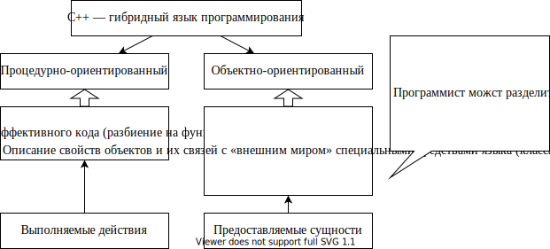

Понятия, связанные с ООП
------------------------

.. image:: media/image2.svg

Отличия процедурного и объектно-ориентированного подходов
---------------------------------------------------------

На примере одной и той же задачи попробую показать разные способы ее
решения и отметить разницу в реализации при переходе от процедурного

Объектно-ориентированное программирование (C++) решения к
объектно-ориентированному. Исходными данными являются: день месяца,
месяц, год. Требуется вычислить порядковый день в году. Например,
первому марта 2006 года соответствует 60-ый порядковый день года.

При описании каждого способа будем исходить из того, что задачу можно
разделить на две части: есть сервер, который предоставляет требуемый
сервис, а также существуют клиенты, которые хотят использовать
предоставляемый сервис. Посмотрим, как меняются взаимоотношения между
клиентом и сервером при переходе от процедурного к
объектно-ориентированному способу.

Решение в стиле Си (процедурный подход)
~~~~~~~~~~~~~~~~~~~~~~~~~~~~~~~~~~~~~~~

Замечание: процедурное решение этой задачи было приведено в качестве
примера еще создателями языка Си (Керниган и Ричи).

.. code:: cpp

   #include <iostream>
   //сервер:
   int DayOfYear(int day, int month, int year)
   {
       //Вспомогательный массив, содержащий количество дней в
       //каждом месяце
       int ar[][12] = { {31, 28, 31, 30, ...},   //не високосный год
                        {31, 29, 31, 30, ...} }; //високосный год
       //Определяю — по какой строчке суммировать
       int I = (year % 4 == 0) &&
               ((year % 100 != 0) || (year % 400 == 0));
       for (int i = 0; i < (month - 1); i++)
           day += ar[I][i];  //копим порядковый день года
       return day;
   }
   //клиент
   int main()
   {
       int d1 = 1, m1 = 3, y1 = 2006;
       std::cout << DayOfYear(d1, m1, y1) << std::endl;  //вызов
       int d100 = 3, m100 = 10, y100 = 2004;
       std::cout << DayOfYear(d100, m100, y100) << std::endl;  //вызов
       //Неудобства: — оперирую с разными датами, их много -> все время
       //придется помнить, какая тройка переменных к какой дате
       //относится
   }

Графически вызов функции можно представить:

.. image:: media/image3.svg

Важно:

-  данные для совершения сервером действия предоставляет клиент!

-  данных много!

-  о том, что несколько элементов данных относятся к одной сущности
   (дате), знает только программист!

-  «накладные расходы» компилятора на вызов такой функции достаточно
   высоки, так как каждое данное передается отдельно (память для
   формирования параметров в стеке + время).

Использование структур Си (укрупнение данных)
~~~~~~~~~~~~~~~~~~~~~~~~~~~~~~~~~~~~~~~~~~~~~

Это развитие процедурной подхода. Такой способ просто позволяет
сгруппировать данные, относящиеся к одной сущности, посредством
структуры.

.. code:: cpp

   #include <iostream>
   struct Date
   {
       int year;
       int month;
       int day;
   };
   //сервер:
   int DayOfYear(const /*struct*/ Date* date)
   {
       int ar[2][12] = { { 31, 28, 31, 30, ... },  //не високосный год
                         {31, 29, 31, 30, ... } }; //високосный год
       int I = (date->year % 4 == 0) &&
           ((date->year % 100 != 0) || (date->year % 400 == 0));
       int YearDay = date->day;//здесь будем копить порядковый день
                               //года, так как нелогично «портить»
                               //содержимое по адресу date
       for (int i = 0; i < date->month - 1; i++)
           YearDay += ar[I][i];
       return YearDay;
   }
   //клиент:
   int main() //
   {
       Date d1 = { 1, 9, 2006 }; //создание и инициализация переменной
                                 //типа Date
       std::cout << DayOfYear(&d1) << std::endl; //передача параметра
                                                 //по указателю
       Date d100 = { 31, 12, 2006 };
       std::cout << DayOfYear(&d100) << std::endl;
   }

.. image:: media/image4.svg

Важно:

-  данные сгруппированы посредством структуры

-  данные все еще на стороне клиента!

-  зато за счет укрупнения данных программисту нужно запоминать гораздо
   меньше

-  и объем передаваемой информации тоже сократился (передается только
   адрес структурной переменной)! Замечание: если передавать объект по
   значению, то экономии памяти не будет.

1.1.1. Использование классов C++
^^^^^^^^^^^^^^^^^^^^^^^^^^^^^^^^

Объектно-ориентированный подход позволяет в одном типе совместить как
данные, описывающие этот объект, так и операции над этими данными.

.. code:: cpp

   #include <iostream>
   //сервер:
   class Date
   {
       int year;
       int month;
       int day;
       bool IsLeapYear()//аргументы не передаются!!! — метод выполняет
                        //действия над данными объекта! ! !
       {
           return (year % 4 == 0) &&
               ((year % 100 != 0) || (year % 400 == 0));
       }
   public: //спецификатор доступа понятие будет введено позже
       int DayOfYear()//параметры не передаются!!! Это не обычная
                      //Функция, а метод класса, который обращается к
                      //данным того объекта, для которого он был
                      //вызван!!!
       {
           int ar[2][12] = { { 31, 28, 31, 30, ... },//не високосный год
                             { 31, 29, 31, 30, ... } }; //високосный год
           int I = IsLeapYear();
           int YearDay = day;//здесь будем копить порядковый день года
           for (int i = 0; i < month - 1; i++)
           {
               YearDay += ar[I][i];
           }
           return YearDay;
       }
   };
   //клиент:
   int main()
   {
       Date my; //создание объекта типа Date
       ... //Инициализация членов данных объекта — пока не привожу код
       std::cout << my.DayOfYear(); //вызов метода класса. Эта функция
                                    //не принимает параметров.Она
                                    //высчитывает порядковый день года,
                                    //исходя из данных объекта my
   }

.. image:: media/image5.svg

*Важно: данные на стороне сервера!*

Главный принцип ООП — не получайте посредством объекта данные,
необходимые для совершения Вашей операции — вместо этого «попросите»
объект, содержащий данные, сделать эту операцию с его (объекта) данными
для Вас. Этот принцип называется **делегированием** (delegation).

Объявление класса
-----------------

Класс — это определяемый пользователем тип данных. Если класс хорошо
сконструирован, использование экземпляров такого пользовательского типа
ничем не отличается от использования переменных базовых типов: они могут
передаваться в функцию в качестве параметра, могут быть скомпонованы в
массив и т.д. Отличие — базовые типы для компилятора — «родные»
(встроенные), а о Вашем пользовательском типе компилятор ничего не
знает, поэтому использованию класса должно предшествовать его объявление
(описан. для компилятора свойств объектов пользовательского типа).
Объявлен класса — это заготовка для компилятора, по которой он будет
строить реальный экземпляр *(объект)* данного типа.

Принципиальным отличием классов от старых структур Си является
объединение (инкапсуляция) в одной программной единице, как данных, так
и методов для работы с этими данными. Определяя термин «инкапсуляция»,
говорят также, что переменные класса (member variables) инкапсулированы
вместе с набором функций (member functions) для работы с этими
переменными. Полученный в результате класс — это программный модуль,
который можно использовать как строительный блок при разработке
приложения (приложений).

   3амечание: объявление класса рекомендуется помещать в заголовочный
   файл.

.. image:: media/image6.svg

Формально простейшее объявление класса выглядит так:

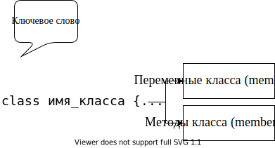

``список_членов_класса`` — включает описание как типов и имен переменных
(member variables), так и прототипы функций класса (member functions),
которые принято в русскоязычной литературе называть методами.

Замечание: ``;`` после закрывающей фигурной скобки обязательна!

Какую информацию получает компилятор, встречая объявления класса:

-  объявлен новый пользовательский (агрегатный) тип данных;

-  имена и типы членов класса: типы переменных (эту информацию
   компилятор использует прежде всего для вычисления количества памяти,
   необходимой для хранения экземпляра данного класса) и прототипы
   функций;

-  ограничения по использованию функций и переменных класса (эту
   информацию компилятор извлекает из указанных программистом
   спецификаторов доступа).

Основное назначение классов — описывать объекты реального мира. В
некотором смысле проектирование класса — это моделирование. Удобно
начинать строить модель с очень грубого приближения, учитывая только
некоторые (важные на взгляд программиста) свойства и наращивать
функциональность по мере разработки. В качестве примера начинаем
разрабатывал класс, абстрагирующий животное. Конечно, можно придумать
много свойств, присущих любому животному, но я для начала выбираю лишь
несколько (преследуя учебные цели). Например:

Файл ``Animal.h``

.. code:: cpp

   enum SEX
   {
       MALE, FEMALE
   }; //для тех, кто не очень дружен с английским языком: SEX — это
      //пол, который за редким исключением может быть только мужским
      //или женским
   class Animal
   {
       unsigned int m_age; //возраст (не может быть отрицательным, не
                           //должен уменьшаться, есть естественные
                           //ограничения)
       bool m_bHasMaster;//ecть/нeт хозяина (хозяева появляются и, к
                         //сожалению, пропадают)
       SEX m_sex; //пол (может измениться только в случае
                  //хирургического вмешательства, обычно не изменяется
                  //на протяжении жизни)
   };

Замечание 1: большинство разработчиков Microsoft использует для имен
переменных класса префикс ``m_`` (от слова member). По моему мнению, это
удобно, так как позволяет в тексте программы легко отличать переменные
класса от обычных переменных.

Замечание 2: в объявлении класса за очень немногими исключениями
(например, ``static const int n=1;``) могут быть только объявления
переменных, прототипы методов и тела inline-методов!

.. code:: cpp

   class Animal
   {
       unsigned int m_age = 0; //в этой строке компилятор выдаст ошибку
   };

Спецификаторы (привилегии) доступа
----------------------------------

При объявлении класса программист с помощью спецификаторов доступа
(ключевых слов C++) формирует компилятору правила ограничения области
видимости для разных членов класса (переменных или методов). Другими
словами, привилегии доступа это способ указать компилятору, где в тексте
программы можно обращаться к члену класса: в любом произвольном месте
программы (в частности извне класса) или только в методах класса.
Посредством указанного при объявлении члена класса спецификатора
компилятор в дальнейшем будет производить контроль: есть ли право
использовать указанное имя в данном контексте (и «обмануть» компилятор
достаточно трудно).

   Замечание: спецификаторы доступа применимы также к вложенным классам
   и перечислениям.

Зачем нужны привилегии доступа
~~~~~~~~~~~~~~~~~~~~~~~~~~~~~~

При проектировании класса разработчик должен исходить из того, что
разработанный и отлаженный класс может пригодиться как ему самому в
будущем при решении другой задачи, так и другому программисту, поэтому
существуют правила, которых рекомендуется придерживаться.

1.1.2. Защита данных от несанкционированного использования
^^^^^^^^^^^^^^^^^^^^^^^^^^^^^^^^^^^^^^^^^^^^^^^^^^^^^^^^^^

Если бы привилегий доступа не было и все члены класса были общедоступны
(как поля Си структур), для разрабатываемого класса Animal были бы
вполне возможны следующие нелогичные с точки зрения моделирования
объектов реального мира действия:

.. code:: cpp

   //animal.h
   struct Animal
   {
       unsigned int m_age; //переменная общедоступна
       ...
   };

.. code:: cpp

   #include "animal.h"
   int main()
   {
       Animal an;
       an.m_age = -100; //компилятор выдаст предупреждение
                        //опреобразовании знакового вбеззнаковое, но
                        //выполнит, и получится животное, которое уже
                        //прожило много веков
       an.m_age = 10000; //не имеет смысла, но будет выполнено!
       an.m_age--; //аналогично
   }

Поэтому одной из парадигм объектно-ориентированного подхода является
«защита» данных от таких несанкционированных разработчиком класса
действий, то есть ограничение доступа к членам класса посредством
привилегий доступа, например:

.. code:: cpp

   class Animal
   {
   private: //спецификатор доступа, который делает переменную m_age
            //"невидимой" или недоступной вне класса
       unsigned int m_age;
   };
   {
       Animal an;
       //an.m_age = -100; //ошибка компилятора — нет прав доступа!
       //an.m_age = 10000; //аналогично
       //an.m_age--; //аналогично
   }

А так как данные теперь извне класса непосредственно недоступны, то
разработчик класса должен предоставить доступные (открытые)
программисту-пользователю методы, которые позволят обращаться к
переменным класса, но только предусмотренным разработчиком способом. В
частности, в таких методах всегда можно ввести контроль, например:

.. code:: cpp

   #include <iostream>
   class Animal
   {
   private: //спецификатор доступа, который делает переменную m_age
            //«невидимой вне класса»
       int m_age;
   public: //спецификатор доступа, который делает метод SetAge
           //общедоступным
       void SetAge(int age)
       {
           if (age >= 0 && age < 30) //или if (age >= m_age && age < 30)
               m_age = age; //переменная класса будет модифицирована
                            //только при допустимом значении параметра
                            //age
           else
               std::cout << "Такого не может быть!";
           //Реализуйте самостоятельно объявленный который должен
           //переменную m_age параметра delta ниже метод, увеличивать
           //на значение
           void Grow(int delta);
       }
   };
   {
       Animal an;
       an.SetAge(-100); //"Такого не может быть!"
       an.SetAge(5); //ОК
   }

..

   Замечание: **в идеальном классе согласно правилам ООП все данные
   должны быть защищены** (хотя далеко не всегда разработчики классов
   даже широко известных библиотек этому правилу следуют).

1.1.3. Защита методов
^^^^^^^^^^^^^^^^^^^^^

Класс может оказаться достаточно сложным с большим количеством методов,
из которых только часть предназначены для «внешнего» использования, а
остальные являются вспомогательными, то есть, предназначены только для
«внутреннего» использования. Первая группа представляет открытый
интерфейс пользователя класса (такие методы должны быть общедоступны) —
это те методы, без которых программист-пользователь не сможет
использовать класс. А методы второй группы лучше делать защищенными, так
как:

-  их «прямое» использование может привести к нежелательным последствиям
   так же, как и модификация переменных «напрямую» (поэтому такие методы
   можно сделать видимыми только для других функций, входящих в состав
   этого класса и недоступными для любого другого кода);

-  знание таких вспомогательных подробностей реализации для исп
   ользования класса просто не нужно, а, делая их общедоступными,
   разработчик просто увеличивает объем информации, который необходимо
   усвоить программисту-пользователю. Поэтому хорошим стилем является
   сокрытие от него несущественных деталей реализации (пусть лучше
   сосредоточится на процессе проектирования).

..

   Таким образом, класс — это замкнутый мир со своими четко
   определенными правилами взаимодействия с «внешним» миром. Можно даже
   сравнить класс с «черным ящиком», который скрывает всю информацию,
   предоставляя для общения с внешним миром только предусмотренный
   разработчиком этого класса интерфейс.

Спецификаторы доступа C++
~~~~~~~~~~~~~~~~~~~~~~~~~

В C++существуют три уровня привилегий доступа к членам класса.
Специфика:

-  Каждый уровень доступа определяется своим ключевым словом
   (спецификатором доступа) ``public``, ``private`` или ``protected``.
   Назначение спецификаторов доступа:

``public`` — общедоступный, то есть к нему имеют доступ не только методы
класса, но и «внешние» по отношению к классу функции. *``public`` члены
класса образуют открытый интерфейс для «общения» с классом извне.*

``private`` — данный член не доступен вне класса; обращаться к нему
могут только методы данного класса.

``protected`` — данный элемент не доступен вне класса, пользоваться им
могут методы данного класса и методы производных классов (`тема
«Наследование» <#тема-ii.-открытое-одиночное-наследование>`__).

-  Необязательно для каждого члена класса указывать спецификатор
   доступа. Пока компилятор не встретит другой спецификатор, он будет
   использовать предыдущий. Таким образом, внутри класса формируются
   секции.

-  Каждое объявление (переменной или метода) внутри класса определяет
   привилегию доступа в зависимости от того, в какой секции оно
   расположено.

-  Секций с одним и тем же ключевым словом может быть сколько угодно и
   располагаться они могут в любом порядке.

-  По умолчанию объявления являются ``private``.

-  Из метода класса «видны» (компилятор разрешает обращаться к)
   ``private`` и ``protected`` члены другого объекта этого же класса
   (пример приведу позже).

Например:

.. code:: cpp

   class Access
   {
       int m_iX; //private no умолчанию
   public:
       int m_iY; //public
   protected:
       int m_iZ; //protected
       char m_cZ; //protected

   public:
       void Increase(int dx, int dy); //public
   protected:
       void WillBeInherited(); //protected
   private:
       int ForInternalUsage(); //private
   };

Использование спецификаторов доступа для идеального класса можно
изобразить графически следующим образом:

.. image:: media/image10.svg

Создание объекта (экземпляра) класса
------------------------------------

В простейшем случае создание объекта класса выглядит также как и
определение переменной базового типа:

+---------------------------------+---------------------------------+
| Определение переменной базового | Один из возможных способов      |
| типа                            | создания объекта типа           |
|                                 | ``Animal``                      |
+=================================+=================================+
| .. image:: media/image11.svg    | .. image:: media/image12.svg    |
|                                 |                                 |
| Компилятор зарезервировал       | Создан объект ``my`` типа       |
| ``sizeof(int)`` памяти и в      | Animal. Компилятор              |
| зависимости от контекста        | зарезервировал                  |
| определения проинициализировал  | ``sizeof(Animal)`` памяти и,    |
| эту область памяти нулями или   | если разработчик класса         |
| оставил без инициализации (то   | предусмотрел специальной        |
| есть глобальные и статические   | функции инициализации,          |
| переменные будут                | проинициализировал (или не      |
| проинициализированы нулем, а    | проинициализировал) его         |
| локальные переменные будут      | согласно общим правилам         |
| содержать случайные значения).  | инициализации переменных.       |
+---------------------------------+---------------------------------+

Оператор ``sizeof`` применительно к классам
-------------------------------------------

При создании экземпляра класса компилятор должен зарезервировать
необходимый объем памяти. Специфика:

-  память резервируется для всех обычных (нестатических — смотри `тему
   «Статические члены класса» <#тема-vii.-статические-члены-класса>`__)
   переменных класса

-  при появлении виртуальных методов в каждом объекте появляются
   дополнительные служебные данные (смотри `тему
   «Полиморфизм» <#полиморфизм.-виртуальные-функции>`__)

-  память резервируется только для данных класса, а код методов (не
   ``inline``) существуют в единственном экземпляре (также как тела
   обычных глобальных функций)

-  компилятор выделяет память для каждого данного в том порядке, в
   котором переменные объявлены в классе

-  оптимизирующий компилятор (например, VC) при выделении памяти под
   каждую переменную объекта может минимизировать время обращения к
   любому данному следующим образом: он располагает данные так, чтобы
   любое из них можно было прочитать из памяти за минимальное количество
   канальных циклов. Это означает, что любой элемент данных (для того,
   чтобы при считывании его не нужно было считывать «по кускам») должен
   быть размещен по адресу, кратному длине элемента. Эти правила следует
   учитывать для более эффективного использования памяти.

Например, для оптимизирующего компилятора:

.. code:: cpp

   class A
   {
       //данные
       int m_a;
   public:
       //методы
       void SetA(int a) { m_a = a; }
       int GetA() { return m_a; }
   };
   size_t n = sizeof(A); //4 байта
   class A
   {
       //данные
       char m_c;
       int m_n;
       bool m_b;
       double m_d;
       //методы
       ...
   };
   size_t n = sizeof(A); //24 байта (см. рис.)

.. image:: media/image13.svg

Замечание 1: зная о правилах, согласно которым оптимизирующий компилятор
для выравнивания полей резервирует дополнительные байты, программист мог
бы гораздо эффективнее использовать память, всего лишь объявляя
переменные класса в другом порядке:

.. code:: cpp

   class A
   {
       //данные
       double m_d;
       int m_n;
       char m_c;
       bool m_b;
       //методы
   };
   size_t n = sizeof(A); //16 байтов (т. к. компилятор может
                         //добавить 2 резервных байта)

.. code:: cpp

   size_t n = sizeof(Animal); //???

Замечание 2: в принципе можно разработать класс, в котором нет
переменных, а есть только методы. В таком случае из вышесказанного
следует, что компилятору вообще памяти выделять не следует, но объект не
может занимать 0 байтов, поэтому согласно стандарту при создании
объектов такого типа компилятор выделяет 1 байт.

.. code:: cpp

   class В
   {
       //данных нет!!!
       //методы есть
   };
   size_t n = sizeof(В); //1

Определение (peaлизация) методов класса
---------------------------------------

Как и обычные функции, методы класса могут быть встроенными (встречая в
тексте программы вызов такого метода, компилятор подставляет в месте
вызова код функции, не тратя ресурсов на вызов) и невстроенными, при
вызове которых компилятор передает управление на точку входа (а тело
такой функции существует в единственном экземпляре).

Встроенные (``inline``) методы
~~~~~~~~~~~~~~~~~~~~~~~~~~~~~~

Встроенными удобно делать очень короткие и часто вызываемые методы. О
том, что Вы хотите сделать метод встроенным, компилятору можно сообщить
двумя способами (при этом в любом случае это будет только Вашей
рекомендацией компилятору, а компилятор сам решит, имеет ли смысл такой
метод встраивать, исходя из соотношения затраты/выигрыш):

1. неявно, совместив объявление и определение метода (при этом ключевое
   слово ``inline`` использовать не обязательно).

.. code:: cpp

   class Animal
   {
       bool m_bHasMaster;
   public:
       void SetMaster() { m_bHasMaster = true; }
       //объявление совмещено с реализацией ⇒ компилятор
       //воспринимает такой метод как встроенный
   };

2. методы, определенные вне класса также можно сделать встраиваемыми,
   используя при объявлении и при определении ключевое слово ``inline``.

Замечание: при этом определение функции должно быть в ``h``-файле, как и
объявление класса, так как компилятор в месте вызова метода должен
подставить его тело, а следовательно, должен это тело «видеть»:

.. code:: cpp

   //Файл Animal.h
   class Animal
   {
   public:
       inline void SetMaster(); //только объявление. Ключевое слово
                                //inline обязательно
   };

Здесь же (или в другом вспомогательном заголовочном файле) тело метода.
Специфика: так как имя класса является областью видимости, а реализация
метода приводится «вне» класса, компилятору нужно указать, что это не
обычная функция, а метод класса Animal посредством имени класса и
спецификатора разрешения области видимости — ``Animal::``

.. code:: cpp

   inline void Animal::SetMaster()
   {
       m_bHasMaster = true;
   }

Невстроенные методы
~~~~~~~~~~~~~~~~~~~

Общепринятая практика — помещать определение (реализацию) невстроенного
метода в соответствующий файл реализации — ``.cpp``-файл.

Например:

.. code:: cpp

   //файл Animal.h:
   class Animal
   {
       ...
   public:
       void SetMaster(); //только объявление
   };

Файл Animal.cpp содержит реализацию метода SetMaster:

.. code:: cpp

   #include "Animal.h" //обязательно, так как компилятор должен знать,
                       //что Animal — это пользовательский тип, а также
                       //видеть свойства пользовательского типа
   void Animal::SetMaster() //префикс Animal:: говорит компилятору о
                           //принадлежности к классу
   {
       m_bHasMaster = true;
   }

Доступ к ``public`` членам класса посредством объекта (или ссылки). Селектор «\ ``.``\ »
----------------------------------------------------------------------------------------

Доступ к ``public`` переменным
~~~~~~~~~~~~~~~~~~~~~~~~~~~~~~

Если в классе есть общедоступные данные (чего по правилам быть не
должно), обращение к таким переменным осуществляется посредством имени
объекта (или ссылки на объект), оператора «\ ``.``\ » (селектора) и
имени переменной класса. Другая возможность (доступ посредством
указателя на объект) будет обсуждаться позже в соответствующем разделе.

Обращение к ``public`` переменным класса практически ничем не отличается
от обращения к полю Си структуры. Пример:

.. code:: cpp

   class А
   {
   public:
       int m_a;
       int m_b;
   };
   {
       А a; //создание экземпляра класса А с именем а
       a.m_a = 10; //присвоили переменной m_a объекта а значение 10.
                   //Что при этом делает компилятор :
                   //а) формирует адрес = &а(база) +
                   //смещение_переменной_m_а_относительно_базы(+0)
                   //б) по вычисленному адресу заносит 10

       а.m_b = 2;  //а) формирует адрес = &a +
                   //смещение_переменной_m_b_относительно базы(+4)
                   //б) по вычисленному адресу заносит 2
   }

Вызов ``public`` метода класса (нестатического). Указатель ``this``
~~~~~~~~~~~~~~~~~~~~~~~~~~~~~~~~~~~~~~~~~~~~~~~~~~~~~~~~~~~~~~~~~~~

Синтаксис вызова метода класса аналогичен обращению к переменной класса.
Но в силу того, что метод класса должен производить действия над данными
того объекта, для которого он был вызван, вызов метода существенно
отличается от вызова обычной (глобальной) функции.

1.1.4. Анатомия вызова нестатического метода класса
^^^^^^^^^^^^^^^^^^^^^^^^^^^^^^^^^^^^^^^^^^^^^^^^^^^

.. code:: cpp

   class A
   {
       int m_a;
   public:
       void Set(int a);
   };
   {
       A ob; //создание объекта
       ob.Set(5); //вызов метода можно рассматривать как вызов
                  //глобальной функции Set(&ob, 5); То есть при вызове
                  //нестатического метода класса компилятор формирует
                  //дополнительный(невидимый для программиста)
                  //параметр, посредством которого передается адрес
                  //того объекта, для которого вызывается метод
   }

А в теле метода при обращении к переменной класса компилятор вычисляет
адрес, по которому нужно прочитать или записать значение, следующим
образом: адрес объекта (полученный в качестве скрытого параметра) +
смещение переменной относительно этой базы:

.. code:: cpp

   void A::Set(int а)
   {
       m_а = а; //присвоить значение а по адресу = адрес объекта
                //+ смещение m_а_относительно базы
   }

Замечание: по умолчанию

-  методы с фиксированным количеством параметров вызываются с
   соглашением ``__stdcall``, но адрес объекта передается в регистре
   ``ECX``;

-  методы с переменным количеством параметров вызываются с соглашением
   ``__cdecl``.

1.1.5. Указатель ``this``
^^^^^^^^^^^^^^^^^^^^^^^^^

В большинстве случаев компилятор использует полученный в качестве
параметра адрес объекта неявно (предыдущий пример), но иногда
программисту хочется или необходимо этим адресом воспользоваться явно. 3
адрес доступен программисту посредством имени «\ ``this``\ ».

Специфика указателя ``this``:

-  указатель ``this`` формируется компилятором только внутри
   нестатических методов класса (а также структуры или объединения C++)
   ⇒ использовать этот указатель вне метода класса невозможно;

-  для класса ``А`` тип указателя ``this`` — ``A* const``. То есть это
   константный (во всяком случае в поздних версиях C++) указатель,
   модифицировать который компилятор не позволит;

Явное использование ``this``:

1. При обращении к членам класса (приведенные три строки эквивалентны)

.. code:: cpp

   void A::Set(int n)
   {
       //здесь компилятор формирует указатель this (как если бы
       //программист определил локальную переменную с именем this: A*
       //const this = адрес_объекта;) и использует это значение в
       //качестве базы при обращении к переменным класса m_a = n;

       m_a = n; //this используется компилятором неявно, то есть эту
                //строчку компилятор интерпретирует как *(this +
                //смещение) = n;

       this->m_a = n; //корректно и эквивалентно предыдущей строчке, но
                      //не обязательно — компилятор сделает это и без
                      //явного указания

       (*this).m_a = n; //тоже корректно и имеет такой же смысл, так
                        //как любой указатель можно разыменовать, а
                        //селектором при обращении посредством объекта
                        //является «.»

       A::m_а = n; //можно обозначить принадлежность классу
                   //посредством А::
   }

2. Использование ``this`` в качестве возвращаемого значения. Выражение
   ``(*this)`` часто используется для возвращения копии текущего объекта
   или ссылки на текущий объект из метода класса.

.. code:: cpp

   A& A::SomeFunc() //или А А::SomeFunc()
   {
       return *this;
   }

3. Использование ``this`` в качестве аргумента функции. Выражения
   ``(*this)`` или ``this`` можно использовать для формирования
   параметра, передаваемого из метода класса другой функции:

.. code:: cpp

   void AnotherFunc1(А*);
   void AnotherFunc2(A&);
   void AnotherFunc3(A);
   void A::SomeFunc()
   {
       ...
       AnotherFunc1(this); //(A*)
       AnotherFunc2(*this); //(A&)
       AnotherFunc3(*this); //(A)
   }

Конструкторы
------------

При создании экземпляра старой структуры Си единственной возможностью
присвоить значения полям при создании структурной переменной было
использование списка инициализаторов, например:

.. code:: cpp

   struct Date
   {
       int year;
       int month;
       int day;
   };
   {
       Date dat1 = { 2006, 9, 1 };
   }

Обычно же при создании экземпляра класса требуется:

-  выделить для него память,

-  проинициализировать его переменные (в разных ситуациях, возможно,
   по-разному),

-  а может быть совершить еще какие-нибудь инициализирующие действия.

Для того чтобы учесть все перечисленные потребности, удобно предоставить
в распоряжение программиста методы, специально предназначенные для
инициализации переменных класса и предписать компилятору вызывать
соответствующий метод при создании экземпляра класса.

У всех классов C++ есть один или несколько таких специальных методов —
конструкторов (constructors), автоматически вызываемых при создании
экземпляра класса компилятором (автоматически означает, что программист
явно такой метод не вызывает, а компилятор «понимает» какой конструктор
следует вызвать или сгенерировать по контексту создания объекта).

Конструктор — это не обычный метод класса. Специфика конструктора
заключается в следующем:

-  конструктор невозможно вызвать явно;

-  конструктор вызывается компилятором автоматически при создании нового
   объекта;

-  имя конструктора предопределено, оно всегда совпадает с именем класса
   (так как компилятор вызывает этот метод неявно, произвольно такой
   метод называться не может);

-  у конструктора отсутствует тип возвращаемого значения (даже если Вы
   укажите ключевое слово ``void``, компилятор выдаст ошибку)!

-  конструктор не может быть объявлен с ключевыми словами ``const`` и
   ``volatile`` (`раздел «Ключевое слово ``const`` и
   классы» <#ключевое-слово-const-и-классы>`__);

-  не может быть виртуальным (`раздел «Полиморфизм. Виртуальные
   функции» <#полиморфизм.-виртуальные-функции>`__);

-  не может быть статическим;

-  соглашение по вызову — ``__thiscall`` (не может быть объявлен с
   ключевым словом ``cdecl``).

В остальном конструктор подобен обычным функциям, в частности, как и
любая функция C++, может иметь любое количество параметров, может быть
многократно перегружен программистом и т. д.

Конструктор по умолчанию (default constructor)
~~~~~~~~~~~~~~~~~~~~~~~~~~~~~~~~~~~~~~~~~~~~~~

Конструктором по умолчанию называется конструктор:

-  у которого нет параметров

-  или все параметры имеют значения по умолчанию.

Если в классе отсутствует явно определенный пользователем конструктор,
то компилятор генерирует собственный автоматический конструктор по
умолчанию. Такой автоматический ``default`` конструктор для такого
простого класса, которым пока является ``Animal``, ничего делать не
будет, но для более сложных классов он выполняет два важных действия:

-  вызывает конструкторы для встроенных объектов класса (`раздел
   «Встроенные
   объекты» <#тема-vi.-встроенные-объекты-composition.-отношение-между-классами-содержит>`__)

-  и конструкторы базовых классов (`раздел
   «Наследование» <#тема-ii.-открытое-одиночное-наследование>`__).

Замечание: компилятор не всегда может создать автоматический конструктор
по умолчанию. Ограничения:

-  в классе объявлены константные члены данных;

в классе объявлены ссылки;

данный класс является производным, а в базовом классе конструктор
объявлен ``private``.

Например, пока мы не ввели в разрабатываемый класс Animal ни одного
своего конструктора:

.. code:: cpp

   int main()
   {
       Animal an; //выделена намять и вызван автоматический конструктор
                  //по умолчании, который ничего существенного делать
                  //не умеет, поэтому данные — члены класса (так как
                  //объект локальный) остались не проинициализированными
   }

Так как небезопасно использовать объект, в котором данные имеют
случайные значения, логично реализовать свой ``default`` конструктор,
который будет присваивать переменным класса предусмотренные
программистом значения. Например;

.. code:: cpp

   class Animal
   {
       unsigned int m_age;
       bool m_bHasMaster;
       SEX m_sex;
   public:
       Animal() //объявление и реализация default конструктора
                //без параметров
       {
           m_age = 0;
           m_sex = MALE;
           m_bHasMaster = false;
       }
   };
   int main()
   {
       Animal an; //выделена память и вызван введенный нами
                  //в класс конструктор по умолчанию
   }

Замечание 1: для создания объекта приведенным способом, конструктор
должен быть общедоступен (``public``) для того, чтобы компилятор имел
право вызывать этот метод

Замечание 2 (существенное!): обратите внимание на следующий фрагмент
кода и запомните разницу:

.. code:: cpp

   int main()
   {
       Animal a1; //вызов конструктора по умолчанию
       Animal а2(); //а эту строчку компилятор трактует как объявление
                    //функции, которая не принимает параметров и
                    //возвращает значение типа Animal!
   }

Конструктор с параметрами
~~~~~~~~~~~~~~~~~~~~~~~~~

Так как основным предназначением конструктора является инициализация
переменных класса, то в основном используются конструкторы с
параметрами. Вот новое объявление класса Animal с явным (``inline``)
конструктором:

.. code:: cpp

   class Animal
   {
       unsigned int m_age;
       bool m_bHasMaster;
       SEX m_sex;
   public:
       Animal(int age, bool master, SEX s)
       { //объявление и реализация конструктора с параметрами
           m_age = age; m_sex = s; m_bHasMaster = master;
       }
   };

Соответственно изменится и код создания объекта типа ``Animal``:

.. code:: cpp

   Animal an(1, true, FEMALE); //компилятор создаст экземпляр класса
                               //Animal и вызовет конструктор с
                               //параметрами

Замечание 1: поскольку мы ввели явный конструктор с параметрами и явно
не переопределили свой конструктор без параметров, компилятор уже не
будет генерировать автоматически конструктор по умолчанию и в ответ на
попытку сконструировать объект ``Animal`` по умолчанию выдаст ошибку:

.. code:: cpp

   Animal an2; //ошибка — в классе не определен конструктор без
               //параметров

Замечание 2: конструктор с параметрами, у которого все параметры имеют
значения по умолчанию (`раздел «Конструктор по
умолчанию» <#конструктор-по-умолчанию-default-constructor>`__),
эквивалентен конструктору по умолчанию.

.. code:: cpp

   class Animal
   {
   public:
       Animal(int age = 1, bool master = false, SEX s = MALE);
           //эквивалентен конструктору пo умолчанию
   };
   {
       Animal a1(5, true, FEMALE);//компилятор передаст в качестве
                                  //параметров указанные значения
       Animal а2; //компилятор вызовет тот же метод, но передаст
                  //значения по умолчанию, указанные в прототипе метода
   }

Замечание 3: можно создать константный объект, предназначенный только
для чтения (для таких объектов впоследствии можно будет вызывать только
константные методы класса — `раздел «Ключевое слово ``const`` и
классы» <#ключевое-слово-const-и-классы>`__):

.. code:: cpp

   const Animal my(1, true, MALE);

Специфика записи при вызове конструктора с одним параметром
~~~~~~~~~~~~~~~~~~~~~~~~~~~~~~~~~~~~~~~~~~~~~~~~~~~~~~~~~~~

Иногда Вы можете встретить несколько странную запись, которая означает
неявный вызов конструктора с одним параметром:

.. code:: cpp

   class A
   {
       int m_a;
   public:
       A(int a)
       {
           m_a = a;
       }
   };
   int main()
   {
       A a = 1; //компилятор вызовет конструктор с одним параметром.
                //Для компилятора такая запись означает то же самое,
                //что
       A а(1);
   }

Такую запись можно интерпретировать следующим образом: компилятор
приводит значение, стоящее справа от знака равенства, к требуемому типу
слева от знака равенства посредством конструктора с одним параметром
(аналогично неявному приведению базовых типов: ``float f = 1;``
эквивалентно ``float а(1);``).

Конструкторы и модификатор ``explicit``
~~~~~~~~~~~~~~~~~~~~~~~~~~~~~~~~~~~~~~~

Для того чтобы запретить неявное преобразование применяется модификатор
``explicit``:

.. code:: cpp

   class A
   {
       int m_а;
   public:
       explicit A(int a) //конструктор объявлен с модификатором
       {                 //explicit.Этот модификатор запрещает
           m_а = a;      //компилятору приводить тип неявно.
       }
   };
   int main()
   {
       A а = 1; //неявное преобразование запрещено ⇒ ошибка
                //компилятора : cannot convert from 'const int' to
                //'class A'
   }

Конструкторы базовых типов
~~~~~~~~~~~~~~~~~~~~~~~~~~

Если класс хорошо спроектирован, использование объектов такого
пользовательского типа не должно отличаться от использования переменных
базового типа. Полезно было бы иметь и «обратную совместимость», то есть
в тех ситуациях, где можно использовать объекты классов, хотелось бы
иметь возможность также использовать и переменные базовых типов
(например, обобщенные алгоритмы стандартной библиотеки умеют работать с
данными любого типа — раздел «Обобщенные алгоритмы STL»). Для поддержки
такой «обратной совместимости», для базовых типов введено понятие
конструктора:

.. code:: cpp

   int i = 1; //это привычная запись для инициализации переменной
              //базового типа

   int i(1); //а это эквивалент предыдущей строки, только в терминах
             //конструирования объектов: компилятор должен выделить
             //память для переменной типа int и проинициализировать
             //указанным в качестве параметра значением

Замечание 1: для базовых типов предусмотрен вызов конструктора по
умолчанию (при этом компилятор инициализирует переменную базового типа
нулем). Синтаксически вызов конструктора по умолчанию для базовых типов
выглядит:

.. code:: cpp

   {
       int i = int(); //по умолчанию инициализируются нулем
       int j; //а здесь никакого конструктора неявно не вызывается,
              //поэтому локальная переменная базового типа остается
              //неинициализированной
   }

Замечание 2: посредством вызова конструктора можно проинициализировать
заданным в качестве параметра значением переменную базового типа,
создаваемую динамически:

.. code:: cpp

   int* р = new int(5); //это указание компилятору выделить память
                        //sizeof(int) в куче и занести по этому адресу
                        //значение 5 (а не динамическое создание
                        //массива из 5 элементов типа int)

   int* p1 = new int[5]; //в отличие от предыдущего примера, эта запись
                         //предписывает компилятору выделить в куче
                         //память пол массив из пяти элементов типа
                         //int. При этом неявно инициализировать
                         //выделенный блок памяти компилятор не будет.

Перегрузка конструкторов
~~~~~~~~~~~~~~~~~~~~~~~~

Объекты одного и того же класса можно инициализировать разными
способами. Для этих целей удобно иметь несколько разных инициализирующих
функций. В C++ могут перегружаться любые функции, в том числе и
конструкторы. Вы можете реализовать любое количество конструкторов,
различающихся количеством и/или типами аргументов. Главное, чтобы
компилятор при создании объекта мог «разобраться» вызов какого именно
метода ему нужно сгенерировать при создании объекта. Например:

.. code:: cpp

   class Animal
   {
   public:
       Animal(); //конструктор по умолчанию
       Animal(int age, bool master, SEX s); //конструктор с параметрами
   };

Теперь экземпляры класса ``Animal`` можно создать следующими способами:

.. code:: cpp

   Animal an1; //компилятор вызовет конструктор по умолчанию

   Animal аn2(1, true, MALE); //компилятор вызовет конструктор с
                              //параметрами

Конструктор с параметрами по умолчанию
~~~~~~~~~~~~~~~~~~~~~~~~~~~~~~~~~~~~~~

Как и все функции, конструктор может иметь аргументы, формируемые
компилятором по умолчанию.

Например:

.. code:: cpp

   class Animal
   {
       ...
   public:
       Animal(unsigned int age = 1, bool master = false, SEX s = MALE);
       ...
   };

Экземпляр класса Animal можно создать:

.. code:: cpp

   Animal an1; //значения всех трех параметров будет сформировано
               //компилятором по умолчанию
   Animal аn2(2); //значение первого параметра задано явно, остальные
                  //по умолчанию
   Animal аn3(3, true);
   Animal an4(5, true, MALE);

..

   Замечание: как и для обычных функций значения по умолчанию должны
   быть указаны только в прототипе метода. Если Вы продублируете эти
   значения при определении метода, компилятор выдаст ошибку.

Возможные конфликты при использовании параметров по умолчанию
~~~~~~~~~~~~~~~~~~~~~~~~~~~~~~~~~~~~~~~~~~~~~~~~~~~~~~~~~~~~~

При наличии нескольких конструкторов и использовании конструктора,
имеющего аргументы по умолчанию, может возникнуть следующая ситуация:

.. code:: cpp

   class Animal
   {
       ...
   public:
       Animal(); //конструктор без параметров
       Animal(unsigned int age = 1, bool master = false, SEX s = MALE);
       //конструктор, у которого все параметры имеют значения по
       //умолчанию
   };

Пока неоднозначности не возникло, но компилятор уже выдает
предупреждение (warning)

.. code:: cpp

   int main()
   {
       Animal an; //а здесь ошибка компилятора, так как нет
                  //однозначности — какой именно конструктор должен
                  //быть вызван
   }

Динамическое создание объектов
~~~~~~~~~~~~~~~~~~~~~~~~~~~~~~

При динамическом создании объектов оператор new не только выделяет
память в куче, но и вызывает для создаваемого таким образом объекта
конструктор. Возвращает оператор new типизированный указатель.

.. code:: cpp

   Animal* р = new Animal; //конструктор по умолчанию
   Animal* р = new Animal(); //тоже конструктор по умолчанию
   Animal* р = new Animal(2, false, MALE); //конструктор с параметрами

Попользовавшись таким динамическим объектом, не забудьте освободить
память!

.. code:: cpp

   delete р; //вызов деструктора и освобождение памяти

Деструкторы
-----------

Деструктор — метод класса. Конструктор + деструктор = функциональное замыкание
~~~~~~~~~~~~~~~~~~~~~~~~~~~~~~~~~~~~~~~~~~~~~~~~~~~~~~~~~~~~~~~~~~~~~~~~~~~~~~

Деструктор — еще один специфический метод класса. Деструктор выполняет
операции, обратные тем, которые выполняют конструкторы: например, если
конструктор выделяет динамическую память, то деструктор, вероятнее
всего, ее освобождает и т. д. (это называется функциональным
замыканием).

Специфика деструктора:

-  в большинстве случаев вызывается компилятором неявно, когда
   заканчивается время жизни объекта (хотя в отличие от конструктора
   деструктор можно вызывать и явно);

-  имя деструктора совпадает с именем класса, но предваряется тильдой
   «\ ``~имя_класса``\ »;

-  не принимает параметров и ничего не возвращает (даже ``void``);

-  деструктор может быть только один (в отличие от конструкторов,
   которых может быть сколько угодно);

-  может (а иногда и должен) быть виртуальным;

-  вызывается компилятором с соглашением по вызову — ``__stdcall``
   (``thiscall``)

Если явно в классе деструктор программистом не определен, то компилятор
генерирует его сам. Такой автоматический деструктор для простых классов
как наш класс ``Animal`` практически ничего не делает, но он умеет
выполнять очень важные действия для чуть более сложных классов:

-  вызывает деструкторы встроенных объектов данного класса (`раздел
   «Встроенные
   объекты» <#тема-vi.-встроенные-объекты-composition.-отношение-между-классами-содержит>`__),

-  вызывает деструкторы базовых классов (`раздел
   «Наследование» <#тема-ii.-открытое-одиночное-наследование>`__).

Замечание 1: при этом следует отдавать себе отчет в том, что некоторые
действия за программиста он автоматически сгенерировать не может
(например, освободить выделенную динамически память).

Замечание 2: если класс простой и при уничтожении объекта никаких
специфических действий выполнять не нужно, то совершенно излишне явно
реализовывать в таком классе деструктор.

Усложним наш класс ``Animal`` таким образом, чтобы возникла
необходимость ввести деструктор. Дадим имя животному. Имя — это строка
(массив символов), но хранить в объекте эту строчку можно по-разному:

1. неэффективный вариант — объявить в классе встроенный массив, например
   ``char m_name[20]``. Неэффективность такого подхода заключается в
   том, что размерность массива должна быть задана константой и
   компилятор в любом объекте будет резервировать 20 байтов, поэтому
   если имя короткое, мы заставим компилятор выделить память под
   неиспользуемый резерв, а если имя «длиннее», чем размер массива, нам
   придется его «программно обрезать»;

2. более эффективный вариант — объявить в классе указатель на строку,
   например ``char* m_pName``. При этом строки могут быть разной длины,
   а в объекте будет храниться только адрес строки.

Рассмотрим второй вариант и способы его реализации:

.. code:: cpp

   class Animal
   {
       char* m_pName; //указатель на строку с именем животного
   public:
       Animal(unsigned int age, bool master, SEX s, const char* pName);
       //так как в классе появилась новая переменная, модифицируем
       //конструктор — он должен формировать в объекте указатель на
       //требуемую строку
   };

При реализации конструктора мы должны учесть, что четвертый параметр
конструктора может быть разной природы ⇒ если в реализации конструктора
мы поступим с указателем так же, как поступали с другими переменными.

.. code:: cpp

   //Плохой способ реализации конструктора:
   Animal::Animal(
       unsigned int age,
       bool master,
       SEX s,
       const char* pName)
   {
       m_age = age;
       m_pName = pName; //запоминаем в переменной класса адрес, но не
                        //знаем, каким образом была выделена память в
                        //вызывающей функции
   }

то это может привести к большой проблеме в нижеприведенном фрагменте

.. code:: cpp

   {
       //Создание объектов. Обратите внимание — строка с именем может
       //быть задана разными способами:
       Animal an1(1, true, MALE, "Bobik"); //в качестве параметра
                                           //используется строковый
                                           //литерал
       char ar[] = "Sharik";
       Animal аn2(2, false, MALE, ar); //в качестве параметра
                                       //используется локальный массив
       char* р new char[5];
       cin >> p;
       Animal an3(3, true, FEMALE, p); //в качестве параметра
                                       //используется указатель на
                                       //динамический массив
       delete[] р; //а теперь освобождаем динамически захваченную
                   //память (при этом в объекте an3 остается
                   //недействительный указатель)
       ... //продолжаем пользоваться объектом an3!!!
   }

Хороший способ реализации конструктора (мы должны обеспечить
существование всех данных объекта, пока существует сам объект, поэтому
формируем динамическую копию строки-параметра!):

.. code:: cpp

   Animal::Animal(..., const char* pName)
   {
       //Динамически выделить достаточное для хранения строки
       //количество памяти.
       m_pName = new char[strlen(pName) + 1]; //+1, так как функция
                                              //strlen «не считает»
                                              //завершающий нулевой байт
       //Скопировать строку-аргумент в динамически выделенную память
       strcpy(m_pName, pName);
   }

Теперь класс Animal стал «нетривиальным», так как в конструкторе
происходит динамическое выделение памяти. Созданный динамически массив
будет существовать, пока программист явно не вызовет оператор
``delete[] m_pName``. Очевидно, что это стоит сделать тогда, когда
объект прекращает свое существование. Как раз тогда компилятор неявно
вызовет деструктор (который для такого класса программист должен явно
реализовать).

.. code:: cpp

   class Animal
   {
       ...
       ~Animal()
       { //объявление деструктора, совмещенное с определением
           delete[] m_pName; //освобождение памяти, занятой в
                             //конструкторе
       }
       ...
   };

Замечание: модифицируйте самостоятельно конструктор по умолчанию (он
тоже должен предусматривать инициализацию указателя m_pName!).
Подумайте: почему вариант а) плохой и чем грозит Вам вариант б) ?

.. code:: cpp

   Animal::Animal()//а)
   {
       m_pName = "Default";
   }
   Animal::Animal()//б)
   {
       m_pName = 0;
   }

Когда вызываются конструкторы и деструкторы
-------------------------------------------

Конструкторы вызываются компилятором при создании объекта, а деструкторы
при уничтожении. Но если вызов конструктора достаточно очевиден, вызов
деструктора определяется временем существования объекта:

1. именованный автоматический объект — конструируется каждый раз, когда
   компилятор встречает его объявление и уничтожается при выходе из
   блока, в котором он объявлен (в частности таким блоком является тело
   функции)

.. code:: cpp

   {
       Animal аn; //конструктор (в данном случае по умолчанию)
   }//деструктор

2. встроенные массивы объектов — аналогично

3. динамический объект существует пока программист не уничтожит его
   явно:

.. code:: cpp

   Animal* р = new Animal(...); //конструктор
   ...
   delete р; //деструктор

4. глобальный, в пространстве имен — конструктор вызывается в прологе
   функции ``main()``, деструктор — при завершении программы.

5. статический локальный — конструктор вызывается при первом выполнении
   данного кода, а деструктор — при завершении программы.

6. временный (автоматический) неименованный объект, который создается
   как часть вычисления выражения и уничтожается по завершении
   вычисления всего выражения.

   а) ``...А(1) + А(2)...``

   б) ``func(А(1))``

7. передача параметров по значению (`раздел «Передача объектов по
   значению» <#передача-объекта-в-качестве-параметра-по-значению>`__)

8. возвращение объекта по значению (`раздел «Возвращение объектов по
   значению» <#возвращение-объекта-по-значению>`__).

Конструктор копирования
-----------------------

Конструктор копирования — особый вид конструктора. Как и конструктор по
умолчанию, конструктор копий (copy constructor) — это метод класса,
который может сгенерировать компилятор автоматически.

Автоматический конструктор копирования подходит только для простых
классов и умеет делать следующие действия:

-  почленно копировать простые данные класса (переменные базовых типов,
   указатели, массивы с элементами базового типа);

-  вызывать конструктор копирования базового класса;

-  вызывать конструкторы копирования для встроенных объектов.

..

   Следствие: для простых классов совершенно незачем явно вводить в
   класс конструктор копирования.

Замечание: компилятор не всегда может создать автоматический конструктор
копирования. Ограничения:

-  в классе объявлены константные члены данных

-  в классе объявлены ссылки

-  данный класс является производным, а в базовом классе конструктор
   объявлен private.

Создание копий объектов
~~~~~~~~~~~~~~~~~~~~~~~

Основное назначение конструктора копий — создавать новый экземпляр (того
же класса) таким образом, чтобы он стал копией существующего объекта.
Если класс простой, например:

.. code:: cpp

   class А
   {
       char name[10];
       //конструктор копирования явно программистом в классе не
       //предусмотрен
   };

то нас устроит автоматический конструктор копирования, генерируемый
компилятором, который просто перепишет из существующего объекта данные в
новый создаваемый объект:

.. code:: cpp

   {
       A al; //создание объекта посредством default-конструктора
       А а2 = а1; //создание объекта посредством автоматического
                  //конструктора копирования (нормальная форма записи)
       А аЗ(а1); //то же самое (функциональная форма записи)
   }

Но. если для нашего нетривиального класса Animal не реализован
корректный конструктор копирования, то при использовании автоматического
конструктора копирования вместо двух отдельных одинаковых животных,
появляются «сиамские близнецы»:

.. code:: cpp

   {
       Animal al(1, true, MALE, "Bobik");
       Animal a2 = a1; //создаем клон объекта al. Здесь компилятор
                       //вызовет автоматический конструктор
                       //копирования.Это нормальная форма записи.
       Animal a3(al); //то же самое. Это функциональная форма вызова
                      //конструктора копирования.
   } //а здесь компилятор вызовет деструкторы для локальных объектов
     //a1, а2, а3!!!Вызов первого деструктора освободит динамически
     //захваченную память, а вызов следующего попытается освободить уже
     //«недействительный» блок.При этом, скорее всего Вы получите
     //ошибку времени выполнения!!!

Почему возникнет ошибка времени выполнения? Автоматический конструктор
копирования умеет только копировать простые данные из одного объекта в
другой. Это устраивает нас для значений переменных ``m_age``,
``m_bHasMaster``, ``m_sex``. Но для указателя ``m_pName`` это является
катастрофой, так как компилятор переписывает адрес одного и того же
динамически выделенного блока памяти в другой объект (это еще не
катастрофа). А потом по закрывающей фигурной скобке компилятор вызывает
деструкторы для локальных объектов. Вызов деструктора для первого
объекта освобождает память, при этом данный блок становится
недействительным. А во втором объекте указатель продолжает содержать
адрес уже недействительно блока памяти. При попытке вторично освободить
этот блок возникает ошибка времени выполнения! А вот это уже катастрофа!

«Сиамские близнецы»

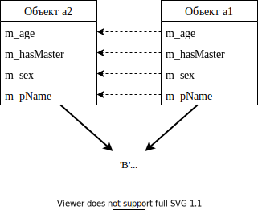

Поэтому автоматический конструктор копирования в данном случае не
годится, а следовательно, для такого класса программист должен явно
реализовать корректный конструктор копирования:

.. code:: cpp

   //Animal.h
   class Animal
   {
       ...
   public:
       Animal(const Animal& other);
   };

Замечание 1: модификатор ``const`` не обязателен, но его использование
является хорошим стилем, так как предписывает компилятору не спускать
модификации параметра

Замечание 2: существенным является передача именно ссылки в качестве
источника копирования для того, чтобы избежать бесконечной рекурсии
(смотри `раздел «Передача объекта в качестве
параметра» <#передача-объекта-в-качестве-параметра-по-значению>`__). К
счастью, компилятор отслеживает тип аргумента конструктора копирования,
и если Вы попробуете задать в качестве типа параметра не ссылку, а
значение, выдаст ошибку.

.. code:: cpp

   //Animal.срр
   Animal::Animal(const Animal& other)
   {
       //Простые данные теперь никто за нас копировать не будет,
       //поэтому копируем сами:
       m_age = other.m_age;
       m_sex = other.m_sex;
       m_bHasMaster = other.m_bHasMaster;
       //А для имени создаем свою динамическую копию:
       m_pName = new char[strlen(other.m_pName) + 1];
                 //выделяем память для копии строки. Длину строки
                 //узнаем, извлекая нужный указатель из параметра
       strcpy(m_pName, other.m_pName);//копируем
   }

Замечание 1: автоматический конструктор копирования подходит только для
простых классов. Для более сложных классов, требующих динамического
выделения памяти или иной специализированной инициализации,
автоматический конструктор копирования не годится.

Замечание 2: инициализация и присваивание являются различными
операциями! Копирование для уже существующих объектов осуществляется не
с помощью копирующего конструктора, а посредством оператора присваивания
(`раздел «Перегрузка операторов» <#тема-iv.-перегрузка-операторов>`__):

.. code:: cpp

   {
       Animal an1(1, MALE, true), an3;
       Animal an2 = an1; //создается новый объект an2 посредством
                         //конструктора копирования

       //Когда конструктор копирования не вызывается!
       an3 = an1; //Оба объекта уже существуют. Объект an3 принимает
                  //значение объекта an1 посредством оператора «=»(это
                  //совершенно другой метод класса)
   }

Передача объекта в качестве параметра по значению
~~~~~~~~~~~~~~~~~~~~~~~~~~~~~~~~~~~~~~~~~~~~~~~~~

Менее очевиден вызов конструктора копирования при передаче по значению в
качестве параметра функции. Например:

.. code:: cpp

   void FVal(A a); //прототип функции, которая принимает параметр
                   //типа А по значению
   int main()
   {
       A x;
       FVal(x); //*вызывается конструктор копирования*, чтобы создать в
                //стеке копию объекта x для передачи параметра по
                //значению
   }
   void FVal(A а) //реализация функции
   {
       //работа с копией
   }//вызывается деструктор для копии (то есть для параметра а)

Замечание 1: не рекомендуется принимать «большие» объекты по значению —
эффективнее передавать адрес объекта (ссылку или указатель на объект).
Если при этом требуется запретить модификацию самого объекта —
передавайте константную ссылку или указатель на константный объект!!!

.. code:: cpp

   void FRef(A& а); //прототип функции, которая принимает ссылку на А.
                    //При вызове компилятор положит в стек адрес
                    //объекта!!!

Замечание 2: при формировании параметра Вы можете создавать анонимный
неименованный объект в обоих случаях — при передаче по ссылке и по
значению:

.. code:: cpp

   FVal(А(<параметры>));//компилятор понимает, что создается временный
                        //объект, поэтому: 1) сразу выделяет память в
                        //стеке для передаваемого параметра и вызывает
                        //конструктор
                        //2) по завершающей скобке функции FVal
                        //вызывает деструктор для параметра
   FRef(А(<параметры>));//компилятор:
                        //1) вызывает конструктор для инициализации
                        //автоматического неименованного объекта
                        //2) в качестве параметра передает в функцию
                        //адрес автоматического неименованного объекта
                        //3) после вычисления выражения (то есть после
                        //вызова функции и приема возвращаемого
                        //значения) деструктор для автоматического
                        //объекта

Возвращение объекта по значению
~~~~~~~~~~~~~~~~~~~~~~~~~~~~~~~

Возвращение объекта по значению происходит тоже с помощью конструктора
копирования:

.. code:: cpp

   int main()
   {
       А а;
       а = Get(); //1) компилятор резервирует в стеке память для
                  //возвращаемого значения и генерирует вызов функции
                  //Get с невидимым дополнительным параметром —
                  //Get(адрес_для_возвращаемого_значения)
                  //2)operator= для приема возвращаемого значения,
                  //3) деструктор для возвращаемого значения
       Get(); //возвращаемое значение формируется, но ничему не
              //присваивается! -> деструктор для возвращаемого значения
       A al = Get(); //а в этом случае хороший компилятор будет
                     //оптимизировать вызов:
                     //1) так как слева создается новый объект,
                     //компилятор формирует вызов Get(&al)
                     //2) operator= не вызывается, так как возвращаемое
                     //значение уже сформировано по нужному адресу
                     //3) деструктор для возвращаемого значения не
                     //вызывается
   }

В функции:

.. code:: cpp

   A Get()

   {

       A tmp; //этот объект создается в стековом кадре данной функции.
              //*После возврата управления из функции компилятор может
              //использовать эту область стека для других целей!*

       return tmp; //компилятор, формируя возвращаемое значение, с
                   //помощью конструктора копий копирует объект из
                   //стекового кадра данной функции в ту область стека,
                   //которую «зарезервировала» вызывающая функция

   } //уничтожаются локальные объекты (вызывается деструктор для tmp)

Замечание: нельзя возвращать адрес локального объекта (ссылку или
указатель) так же, как это было с базовыми типами. В случае объектов
ситуация усугубляется тем. что по закрывающей фигурной скобке вызываются
деструкторы локальных объектов.

Стандарт С++11 — move конструктор копирования
~~~~~~~~~~~~~~~~~~~~~~~~~~~~~~~~~~~~~~~~~~~~~

Без использования семантики перемещения:

.. code:: cpp

   class A
   {
       int* m_р;
       size_t m_n;
   public:
       ...
       A(const A&);//обычный (классический) конструктор копирования
   };

*Реализация классического конструктора копирования???*

*Накладные расходы при создании полноценной (глубокой) копии???*

.. code:: cpp

   A f()
   {
       A tmp;
       ...
       return tmp; //для формирования возвращаемого значения компилятор
                   //вызывает классический конструктор копирования со
                   //всеми «накладными расходами» для создания
                   //полноценной копии (глубокое копирование)
   }

Согласно стандарту С++11 для временных объектов можно использовать такое
понятие как rvalue reference (ссылка на ссылку)

.. code:: cpp

   class A
   {
       int* m_р;
       size_t m_n;
   public:
       ...
       A(const A&);//обычный (классический) конструктор копирования
       A(A&&);//move конструктор копирования
   };
   A f()
   {
       A tmp;
       ...
       return tmp; //move конструктор копирования — компилятор сам
                   //«догадается», что объект временный
       //или программист ему «подскажет»:
       //return std::move(tmp); //move конструктор копирования
   }

Реализация move конструктора копирования:

.. code:: cpp

   A::A(A&& tmp)
   {
       m_n = tmp.m_n;
       m_p = tmp.m_p;
       tmp.m_p = nullptr;
   }

Ключевое слово ``const`` и классы
---------------------------------

Применительно к классам ключевое слово ``const`` может быть
использовано:

.. image:: media/image15.svg

``const`` и возвращаемое значение
~~~~~~~~~~~~~~~~~~~~~~~~~~~~~~~~~

Правила одинаковы как для возвращения константных базовых типов, так и
пользовательских. Если ключевое слово ``const`` относится к
возвращаемому значению, то компилятор гарантирует, что возвращаемое
значение может быть использовано только для чтения.

Например:

а) без ключевого слова ``const``:

.. code:: cpp

   class A
   {
       int m_a;

   public:

       A(int a = 0)
       {
           m_a = a;
       }
       int& GetA() { return m_a; }
   };
   int main()
   {
       A a(5);
       int tmp = a.GetA(); //ОК — прочитали значение защищенной
                           //переменной класса
       a.GetA() = 2; //не очень корректно, так как позволили
                     //посредством возвращаемого методом GetA() адреса
                     //защищенной переменной произвольным образом
                     //изменять ее значение
   }

б) с помощью ключевого слова const запрещаем модифицировать значение
переменной класса посредством возвращаемого адреса:

.. code:: cpp

   class A
   {
       ...
   public:
       const int& GetA()
       {
           return m_a;
       }
   };
   int main()
   {
       A a(5);
       //a.GetA()=2; //ошибка компилятора
       std::cout << a.GetA(); //возвращаемое значение теперь можно
                              //использовать только для чтения
   }

Константные методы класса. Константные объекты
~~~~~~~~~~~~~~~~~~~~~~~~~~~~~~~~~~~~~~~~~~~~~~

Если метод предназначен только для «чтения» (то есть не должен
модифицировать данные объекта), рекомендуется объявить его как
константный метод. В константном методе компилятор не позволит
модифицировать любые переменные класса или вызывать любые другие не
константные методы класса.

Например:

.. code:: cpp

   class А
   {
       int m_a;
       void Increase() { m_a++; } //вспомогательный метод, 
                                  //модифицирующий переменную класса
   public:
       int get() const    //«read-only» метод класса
       {
           //m_а++;       //ошибка компилятора — попытка модифицировать
                          //переменную класса
           //Increase(); //ошибка компилятора — попытка вызвать не
                          //константный метод класса
           return m_a;
       }
       void set(int a) { m_a = a; } //метод, изменяющий данные
                                    //объекта. Не может быть
                                    //константным!
   };

Замечание 1: если объявление и реализация метода разнесены, ключевое
слово ``const`` требуется как при объявлении, так и при определении
метода:

.. code:: cpp

   //A.h
   class A
   {
       int get() const; //объявление
   };

   //А.срр
   int A::get() const { return m_a; } //определение

Замечание 2: методы, отличающиеся только ключевым словом ``const``,
могут быть **перегружены**. Какой метод вызывать компилятор определяет
исходя из константности объекта, посредством которого вызывается метод.
Например:

.. code:: cpp

   class A
   {
       ...
   public:
       void fA(); //не константный метод
       void fA() const; //константный метод
   };
   int main()
   {
       A a1;
       a1.fA(); //компилятор вызовет не константный метод
       const A a2; //константный объект
       a2.fA(); //компилятор вызовет константный метод
   }

Константные методы класса и ключевое слово ``mutable``
~~~~~~~~~~~~~~~~~~~~~~~~~~~~~~~~~~~~~~~~~~~~~~~~~~~~~~

В константном методе не разрешено модифицировать переменные класса, но
бывают ситуации, когда все-таки необходимо в таком методе изменить
значение какой-нибудь переменной. Для «снятия константности» с
**переменных**, требующих изменения, введено ключевое слово ``mutable``.
Такую переменную компилятор позволит модифицировать даже в константном
методе класса. Например:

.. code:: cpp

   class A
   {
       int m_a;
       mutable int m_count; //счетчик — сколько раз посредством метода
                            //get() обращались к данному объекту
   public:
       A(int а = 0) { m_a = а; m_count = 0; }
       int get() const
       {
           m_count++; //если бы переменная m_count была объявлена без
                      //ключевого слова mutable, компилятоp Вы выдал 
                      //ошибку!
           return m_a;
       }
   };

Замечание 1: ключевое слово ``mutable`` не может быть применено к
статическим и ``const``-переменным класса.

Замечание 2: методы с ключевым словом ``mutable`` объявлять нельзя.

Константные объекты
~~~~~~~~~~~~~~~~~~~

Если в распоряжении программиста предоставлен константный объект,
константная ссылка или указатель на константный объект (например, в
качестве параметра функции), то компилятор позволит использовать такой
объект только для чтения, то есть:

-  читать доступные переменные,

-  вызывать доступные константные методы класса. Например:

.. code:: cpp

   class A
   {
   public:
       int m_a;
       void f1();
       void f2() const;
   };
   void F(const A& a)
   {
       //a.m_a++; //ошибка компилятора
       int tmp = a.m_a;
       //a.f1(); //ошибка компилятора
       a.f2(); //ОК!
   }

Тип указателя ``this``
~~~~~~~~~~~~~~~~~~~~~~

В обычном методе класса ``А`` указатель ``this`` ведет себя как
константный указатель типа ``A* const``, то есть любые попытки
модифицировать ``this`` вызовут ошибку компилятора.

.. code:: cpp

   void A::f1()
   {
       this++; //ошибка компилятора
       m_a++; //ОК
   }

В константном методе класса this ведет себя как указатель типа
``const A* const``, го есть посредством такого указателя можно только
читать данные и модифицировать его запрещено.

.. code:: cpp

   void A::f1() const
   {
       this++; //ошибка компилятора
       m_a++; //ошибка компилятора
   }

Указатель на класс. Доступ к членам класса посредством указателя. Селектор «\ ``->``\ »
---------------------------------------------------------------------------------------

Так как понятие класс определяет тип данных, то в соответствии с логикой
языка C++ ничто не мешает (а иногда без этого не получить преимуществ
ООП) объявить переменную — «указатель на класс». Как и обычный
указатель, он хранит адрес объекта и может использоваться не только не
только для получения адреса «самого объекта», но и для доступа к
``public`` членам класса (как к членам-данным, так и для вызова
методов).

Пример:

.. code:: cpp

   class A
   {
       int m_a;
   public:
       void Set(int x) { m_a = x; }
   };
   int main()
   {
       A* pA = new A(); //а) компилятор динамически выделит память —
                        //sizeof(A)
                        //б) вызовет default конструктор в)
                        //в) проинициализирует указатель рА адресом
                        //объекта
   //  int nX = рА->m_а;//доступ к private-элементам данных класса
                        //посредством указателя тоже запрещен ⇒ ошибка
       pA->Set(5); //вызов public-метода посредством указателя
       delete pA; //динамически созданный объект необходимо уничтожить
                  //(перед освобождением памяти будет вызван деструктор)
   }

Использование указателя
~~~~~~~~~~~~~~~~~~~~~~~

Если в нашем распоряжении есть указатель, а функция принимает объект по
значению или по ссылке:

.. code:: cpp

   void F1(A);
   void F2(A&);

Вызов:

.. code:: cpp

       F1(*рА);
       F2(*рА);

И наоборот, если в нашем распоряжении есть объект, а функция принимает
указатель:

.. code:: cpp

   void F3(A*);

Вызов:

.. code:: cpp

       A a;
       F3(&a);

Замечание: в качестве параметра можно сформировать адрес неименованного
автоматического объекта, так как он будет существовать до конца
вычисления выражения:

.. code:: cpp

       F3(&A(33));//1) — конструктор для автоматического
                  //неименованного объекта,
                  //2) его адрес в стек
                  //3) после возврата из функции — деструктор

Массивы и классы
----------------

Массив объектов класса
~~~~~~~~~~~~~~~~~~~~~~

Пример:

.. code:: cpp

   class A
   {
       int m_а;
   public:
       A(int х = 0) { m_а = х; }
   };
   int main()
   {
       {
           A ar1[5]; //массив из пяти объектов A. При создании каждого
                     //элемента массива вызывается конструктор по
                     //умолчанию
           A ar2[2] = { A(1), A(2) }; //массив из двух объектов A. При
                                      //создании каждого элемента
                                      //массива вызывается конструктор
                                      //с аргументами. Оптимизация
                                      //компилятора: каждый элемент
                                      //массива конструируется прямо
                                      //«на месте» — автоматических
                                      //неименованных объектов
                                      //компилятор не создает.

           A ar3[3] = { A(1), A(2) }; //массив из трех объектов A. При
                                      //создании первых двух элементов
                                      //массива вызывается конструктор
                                      //с аргументами, при создании
                                      //третьего — конструктор по
                                      //умолчанию

           A ar4[] = { 1, 2, 3 }; //а здесь (если неявные
                                  //преобразования не запрещены —
                                  //explicit) компилятор вызовет для
                                  //каждого элемента массива
                                  //конструктор с одним параметром

       }//вызываются деструкторы для всех элементов всех массивов

       //но!

       A* р = new A[10]; //динамическое выделение памяти под 10
                         //элементов типа A и вызов для каждого
                         //конструктора по умолчанию

       //*Вызовите для каждого элемента массива public метод*

       delete[] р; //вызов деструктора для каждого элемента
                   //динамического массива и освобождение памяти
   }

1.1.6. Массив указателей на объекты класса
^^^^^^^^^^^^^^^^^^^^^^^^^^^^^^^^^^^^^^^^^^

Пример:

.. code:: cpp

   int main()
   {
       A* par1[5]; //неинициализированный массив из пяти указателей на
                   //объекты А

   //Замечание: если разные элементы массива будут содержать разные по
   //своей природе адреса (например, и стековых объектов, и
   //динамических) — с таким массивом работать очень трудно ⇒

       A a1(1), a2(2);
       A* par2[2] = { &a1, &a2 };
   //или
       A* рar3[3] = { new A(1), new A(2) };
                   //массив из трех указателей на объекты А. Два первых
                   //элемента массива проинициализированы, третий
                   //инициализируется нулем по правилам неполной
                   //инициализации массивов с элементами базового типа

       //Вызовите для каждого элемента массива public метод

       for (int i = 0; i < 3; i++) { delete рar3[i]; }
                   //delete корректно работает с нулевым указателем
       A* par2[3] = { &A(1,1), &A(2,2) };
                   //можно ли проинициализировать массив таким
                   //образом???
   }

Поля битов (bit fields)
-----------------------

Если мы заведомо знаем, что наши целочисленные данные очень короткие, то
есть диапазон изменения значений мал, то логично отвести под такие
данные ровно столько памяти, сколько может занимать максимально
(минимально) возможное значение в нашем диапазоне.

Рассмотрим способы минимизации использования памяти:

*Способ №1*: для хранения значения каждого данного объявляем в классе
целочисленную переменную. При выборе типа переменной стараемся экономить
память:

.. code:: cpp

   class Date
   {
       unsigned char month;//а на самом деле диапазон изменения
                           //значений 0-12 ⇒ достаточно 4 бита
       unsigned short year;//а на самом деле диапазон изменения
                           //значений 0-3000 0хbb8⇒ достаточно 12 битов
       unsigned char day;//а на самом деле диапазон изменения значений
                         //0-31 0x1f-> достаточно 5 битов
       ...
   };

При таком подходе все равно образуется неиспользуемый резерв —
«избыточные» неиспользуемые разряды, а с учетом выравнивания полей
компилятором и дополнительные неиспользуемые байты.

*Способ №2*: зная, что все наши данные «помещаются» в 32 разряда,
объявляем в классе одну переменную типа ``int`` или ``unsigned int`` и
сами «распределяем» в ней разряды следующим образом:

.. image:: media/image16.svg

.. code:: cpp

   class Date { unsigned int date; };

При таком подходе:

а) приходилось бы все время помнить: какие биты для чего нами отведены,
б) приходилось бы все время самим применять побитовые операции для
извпечения/запаковки значений.

*Способ №3*: альтернативой приведенным вариантам является использование
битовых полей (при этом программист избегает неэффективности первого
варианта и неудобств при использовании второго варианта). Язык C++
допускает использование в структурах и классах (только!!!) особого типа
полей — битовых полей. Использование таких полей делает возможным
простой доступ к совокупностям битов, при этом экономится память, так
как мы отводим под данные ровно столько разрядов, сколько требуется. Для
битовых полей компилятор за программиста а) выделяет биты и б)
осуществляет побитовые операции и сдвиги, извлекая или запаковывая
значения.

Объявление битового поля:

.. code:: cpp

   целый_тип [идентификатор] : размер_поля_в_битах;

1) целый тип может быть ``signed`` и ``unsigned`` (таким образом Вы
   сообщаете компилятору — как интерпретировать этот диапазон, в
   частности как «распаковывать» значения)
2) в качестве целого типа могут быть использованы ``char``, ``short``
   или ``int``
3) в качестве типа целого может быть использован enum (интерпретируется
   компилятором как ``signed int``)
4) если идентификатор опущен, анонимное битовое поле, которое
   используется для выравнивания (padding). Замечание: анонимное битовое
   поле с нулевым размером указывает компилятору разместить следующее
   ноле, начиная с границы типа

Пример:

.. code:: cpp

   enum DAY { MONDAY, TUESDAY, ... };
   class Date
   {
       unsigned int month : 4;//4 бита
       DAY nWeekDay : 4; //0..7 (4 bits). Так как enum это эквивалент
                         //signed int ⇒ следует зарезервировать один
                         //один дополнительный бит под знак или
                         //сопоставить именованным константам другие
                         //значения???
       unsigned int year : 12;//12 битов
       unsigned int day : 5;//5 битов
   public:
       //Во всех приведенных ниже методах мы пользуемся битовыми полями
       //как обычными переменными класса, а компилятор сам осуществляет
       //запаковку/распаковку значений с помощью побитовых операторов и
       //операторов сдвига
       Date(unsigned int m, unsigned int year,
           unsigned int day, DAY wd)
       { month = m; ... }
       unsigned int GetMonth() { return month; }
           //«вручную» нам бы пришлось: return date & 0xf;
       void SetMonth(unsigned int m) { month = m; }
           //date = (m & 0xf) | (date & 0xff...f0);
       ...
   };
   int main()
   {
       Date d(1, 2006, 1, SUNDAY);
       unsigned month = d.GetMonth();
       ...
   }

Замечание 1: специфика Microsoft — порядок выделения битов в порядке
объявления, начиная с младшего. В других компиляторах правила могут быть
другими.

.. image:: media/image17.svg

Замечание 2: иногда для каких-либо специфических целей требуется указать
компилятору, что одну группу битовых полей я хочу запаковать в один
``unsigned int``, а следующую в другой — для этих целей используется
неименованное битовое поле нулевой длины

.. code:: cpp

   class Date
   {
       unsigned int month : 4;
       DAY nWeekDay : 4;
       unsigned int : 0; //Следующее поле будет расположено в
                         //зависимости от типа поля(и от компилятора)
       unsigned int year : 12;
       unsigned int day : 5;
   };

.. image:: media/image18.svg

Для поля битов нельзя:

-  получить адрес: ``int* р = &m_х; //ошибка``

-  ``int& r = m_x; //объявить ссылку и проинициализировать ее битовым полем``

-  оператор ``sizeof`` с ними тоже не работает — illegal sizeof operand

а в остальном можно пользоваться как любой другой переменной класса.

Список инициализаторов
----------------------

Замечание: согласно новому стандарту С++11 перечисленные ниже
ограничения компилятор игнорирует, поэтому список инициализаторов может
быть использован в тех случаях, когда нужно только проинициализировать
переменные объекта и не требуется производить какие-нибудь
дополнительные действия.

Объект класса (или структуры C++) можно проинициализировать также как
структуру только в том случае, если класс не содержат:

-  конструкторов,

-  ``private`` или ``protected`` членов

-  базовых классов,

-  виртуальных функций

Например:

.. code:: cpp

   class A
   {
   public: //так как защищенные переменные компилятор не позволит
           //инициализировать посредством списка инициализаторов
       int i;
       char ar[10];
       void Func();
   };
   int main()
   {
       A a = { 5, "ABC" };
   }

Тема II. Открытое одиночное наследование
========================================

Взаимоотношения между классами
------------------------------

*Правило 1: различайте понятия: «является» (is-а), «содержит» (has-а) и
«подобен» (as-а)!*

Отношения между классами могут быть трех видов:

.. image:: media/image19.svg

Замечание: для корректного построения иерархии классов программист
должен четко представлять различия этих трех видов взаимоотношений и
применять их исключительно по назначению.

Одиночное (или простое) наследование
------------------------------------

*Правило 2: не перегружайте базовый класс понятиями. Обычно для задания
общих для всех потомков свойств достаточно в базовый класс ввести 7-8
понятий.*

Классы чаще всего строятся постепенно, начиная от простых базовых
классов с общими для некоторого множества объектов свойствами и
заканчивая «навороченными» специализированными классами-монстрами.
Каждый раз, когда от предыдущего класса производится последующий,
производный класс наследует какие-то или все родительские качества,
добавляя к ним новые свойства (или, наоборот, убирая лишние). На
свойстве наследования основана популярность библиотек классов (таких как
MFC, OWL и Qt). При этом ощутимым преимуществом для программиста
является использование разработанных и отлаженных профессионалами
классов в качестве базовых для своих более специализированных целей.

Наследование может быть одиночным или множественным. Отличия:

+---------------------------------+---------------------------------+
| одиночное                       | множественное                   |
+=================================+=================================+
| Каждый производный класс имеет  | Производный класс наследует     |
| только одного непосредственного | свойства двух и более           |
| предка (хотя иерархия может     | «родителей»                     |
| быть достаточно сложной)        |                                 |
+---------------------------------+---------------------------------+
| |image1|                        | |image2|                        |
+---------------------------------+---------------------------------+

Замечание: множественное наследование сложнее в реализации и будет
рассмотрено позже (`раздел «Множественное
наследование» <#тема-x.-множественное-наследование>`__).

Объявление производного класса при одиночном наследовании
~~~~~~~~~~~~~~~~~~~~~~~~~~~~~~~~~~~~~~~~~~~~~~~~~~~~~~~~~

.. code:: cpp

   class имя_производного_класса : [спецификатор_наследования]
   имя_базового_класса {
       список_членов_производного_класса
   };

Например:

.. code:: cpp

   class А { список членов класса А }; //базовый класс
   class В : public А { список членов класса В}; //производный класс

Такое объявление говорит компилятору о том, что:

-  класс ``B`` включает в себя, как составляющую весь класс ``A``,

-  в зависимости от спецификатора наследования и спецификаторов доступа
   методы класса ``B`` имеют право обращаться к членам класса ``A`` или
   нет.

Замечание: конструкторы, деструкторы и оператор присваивания не
наследуются! Наследуются данные и остальные методы класса.

Спецификатор ``protected`` в базовом классе
~~~~~~~~~~~~~~~~~~~~~~~~~~~~~~~~~~~~~~~~~~~

Спецификатор ``protected`` используется при наследовании и действует
только в методах класса. Означает:

+---------------------+----------------------+----------------------+
| Спецификатор        | Доступ извне         | Доступ из методов    |
| доступа в базовом   | посредством объекта  | производного класса  |
| классе              | производного класса  | к элементам базового |
|                     |                      | класса               |
+=====================+======================+======================+
| ``public:``         | доступен             | доступен             |
+---------------------+----------------------+----------------------+
| ``protected:``      | не доступен          | доступен             |
+---------------------+----------------------+----------------------+
| ``private:``        | не доступен          | не доступен          |
+---------------------+----------------------+----------------------+

Пример:

.. code:: cpp

   class A
   {
       int m_a1;
       void FA1();
   protected:
       int m_a2;
       void FA2();
   public:
       void FA3();
   };
   class B : public A
   {
       int m_b1;
       void FB1();
   protected:
       int m_b2;
       void FB2();
   public:
       void FB3();
   };

Внутри метода производного класса:

.. code:: cpp

   void В::FB3()
   {
       m_b1 = 1; //ОК
       ...
       FA3();    //ОК
       m_a2 = 2; //ОК
       FA2();    //ОК
   //  m_a1 = 2; //ошибка — нет прав доступа
   //  FA1();    //ошибка — нет прав доступа
   }

«Извне» класса:

.. code:: cpp

   int main()
   {
       А а; //вызывается конструктор А

.. figure:: media/image20.svg
   :alt: Объект a

   Объект a

.. code:: cpp

       B b; //конструктор А, потом В

.. figure:: media/image21.svg
   :alt: Объект b

   Объект b

.. code:: cpp

       //доступ к членам посредством объекта базового типа
       а.FA3(); //ОК
       //доступ к членам посредством объекта производного типа
       b.FB3(); //ОК
       b.FA3(); //ОК
   }

Спецификаторы наследования при объявлении производного класса
~~~~~~~~~~~~~~~~~~~~~~~~~~~~~~~~~~~~~~~~~~~~~~~~~~~~~~~~~~~~~

.. code:: cpp

   class A {
       ...
   };
   class B: <спецификатор наследования> A {
       ...
   };

.. image:: media/image22.svg

Замечание: если спецификатор наследования опущен, то компилятор по
умолчанию считает, что он ``private``!

Закрытое наследование специфично и будет рассмотрено позже (раздел
«Закрытое наследование»).

Порядок вызовов конструкторов при создании экземпляра производного класса
~~~~~~~~~~~~~~~~~~~~~~~~~~~~~~~~~~~~~~~~~~~~~~~~~~~~~~~~~~~~~~~~~~~~~~~~~

При создании экземпляра любого класса любым способом вызывается его
конструктор. Если класс является производным, кроме конструктора данного
класса должен быть также вызван конструктор базового класса. Создание
объекта начинается с базовой части, поэтому порядок вызовов
конструкторов в C++ фиксирован: прежде всего вызывается конструктор
базового класса, затем вызываются конструкторы всех промежуточных
классов согласно иерархии наследования, и наконец, вызывается
конструктор целевого класса. Приведенный порядок имеет смысл, поскольку
производные классы имеют более специализированный характер, чем базовый,
поэтому специализированная часть «накладывается» поверх общей.

Пример:

.. code:: cpp

   class A { ... };
   class B : public A { ... };
   class C : public B { ... };

При создании экземпляра класса C конструкторы вызываются в следующем
порядке:

::

   A::A() -> B::B() -> C::C()

Осуществляется вызов конструктора базового класса в том коде, который
компилятор генерирует по открывающей фигурной скобке конструктора:

.. code:: cpp

   C::C(параметры)
   {//вызов конструктора базового класса B
       //тело конструктора класса C
   }
   B::B(параметры)
   {//вызов конструктора базового класса A
       //тело конструктора класса B
   }
   A::A(параметры)
   {
       //тело конструктора класса A
   }

Порядок вызовов деструкторов при разрушении экземпляра производного класса
~~~~~~~~~~~~~~~~~~~~~~~~~~~~~~~~~~~~~~~~~~~~~~~~~~~~~~~~~~~~~~~~~~~~~~~~~~

Деструкторы при разрушении объекта производного класса вызываются в
порядке, обратном вызову конструкторов Причина та же: сначала
разрушаются специализированные части, затем общие. Например, при
разрушении экземпляра класса ``C`` порядок вызовов деструкторов будет
следующим:

::

   C::~C() -> B::~B() -> A::~A()

Осуществляется вызов деструкторов базового класса в том коде, который
компилятор генерирует по закрывающей фигурной скобке деструктора:

.. code:: cpp

   C::~C()
   {
       //тело деструктора класса C
   }//вызов деструктора базового класса B
   B::~B()
   {
       //тело деструктора класса B
   }//вызов деструктора базового класса A
   A::~A()
   {
   //тело деструктора класса A
   }

Замечание: если объект был создан динамически, то при выполнении
оператора ``delete`` сначала вызываются деструкторы, а потом только
освобождается память (то есть на время выполнения деструктора сам объект
еще гарантированно существует).

Аргументы конструктора, передаваемые в базовый класс
~~~~~~~~~~~~~~~~~~~~~~~~~~~~~~~~~~~~~~~~~~~~~~~~~~~~

Так как производный класс содержит в себе базовую часть, при создании
экземпляра производного класса обычно возникает необходимость передать
какие-то параметры конструктору базового класса. Так как конструктор
базового класса выполняется раньше, чем конструктор производного, то
конструктору базового класса нужно **явно** передать предназначенные ему
параметры. Поэтому для передачи параметров конструктору базового класса
используется специальная запись.

Модифицируем класс ``Animal``. До сих пор мы абстрагировали какое-то
обобщенное животное. Теперь вынесем общие для любого животного свойства
в базовый класс, а от него наследуем более специализированный класс,
абстрагирующий собаку.

.. code:: cpp

   //Animal.h
   enum SEX { MALE, FEMALE };
   class Animal
   {
   protected://изменяем спецификатор доступа таким образом, чтобы эти
             //понятия были доступны методам производного класса
       int m_age; //у любого животного должен быть возраст
       SEX m_sex; //у любого животного должен быть пол
       char* m_pName; //у любого животного может быть имя
   public:
       Animal(int age, SEX s, const char* pName = "");
   };

.. code:: cpp

   //Dog.h
   #include "Animal.h" //компилятор должен знать свойства базового
                       //класса
   class Dog : public Animal
   {
       bool m_bHasMaster; //есть дикие и домашние собаки -> может быть
                          //хозяин
       char* m_pMasterName; //а если есть хозяин, то у него должно быть
                            //имя
   public:
       Dog(int age, SEX s, bool master, const char* pName,
           const char* pMaster); //параметры age, s, pName предназначены
                     //конструктору базового класса, а параметры master
                     //и pMaster предназначены производному классу
   };

.. code:: cpp

   //Dog.cpp
   Dog::Dog(int age, SEX s, bool master, const char* pName,
       const char* pMaster
       ) : Animal(age, s, pName) //передача параметров конструктору
                                 //базового класса
   {//здесь будет вызван конструктор базового класса с указанными
    //параметрами, который проинициализирует базовую часть объекта
       //работа с производной частью объекта
       m_bHasMaster = master;
       m_pMasterName = new char[strlen(pMaster) + 1];
       strcpy(m_pMasterName, pMaster);
   }

1.1.7. Специфика передачи параметров конструктору копирования базового класса
^^^^^^^^^^^^^^^^^^^^^^^^^^^^^^^^^^^^^^^^^^^^^^^^^^^^^^^^^^^^^^^^^^^^^^^^^^^^^

Если Вы явно не определяете в производном классе конструктор
копирования, то автоматический конструктор копирования (сгенерированный
компилятором) будет вызывать конструктор копирования базового класса
(определенный программистом или тоже автоматический). Но, если Вы
определяете в производном классе конструктор копирования, но не
вызываете явно конструктор копирования базового класса, компилятор
вызывать сам конструктор копирования базового класса не будет, а базовая
часть нового объекта будет сконструирована с помощью
default-конструктора.

.. code:: cpp

   Dog::Dog(const Dog& ref)
       : Animal(ref) //указываем компилятору, каким конструктором
       //базового класса следует инициализировать базовую часть (в
       //нашем случае логично вызывать конструктор копирования базового
       //класса)

       //Замечание: компилятор сам неявно приведет тип
       //параметра const Dog& ref к константной ссылке базового типа
       //const Animals
   {
       m_pMasterName = new char[strlen(ref.m_pMasterName) + 1];
       strcpy(m_pMasterName, ref.m_pMasterName);
       m_bHasMaster = ref.m_bHasMaster;
   }

..

   Дана иерархия классов:

   .. code:: cpp

      class A { ... };
      class B : public A { ... };

   Подумайте, для каких классов в приведенных ниже примерах программист
   должен явно реализовать конструктор копирования:

   -  A — простой класс. B — простой класс

   -  A — простой класс, B — сложный класс

   -  A — сложный класс, B — простой класс

   -  A — сложный класс, B — сложный класс

Открытое (``public``) наследование
~~~~~~~~~~~~~~~~~~~~~~~~~~~~~~~~~~

Иерархия классов работает эффективно только в том случае, если она
корректно спроектирована.

1.1.8. Правило №3
^^^^^^^^^^^^^^^^^

   Правило 3: открытое наследование в C++ моделирует следующее
   утверждение — «производный класс есть разновидность базового класса»
   ⇒ все. что применимо к базовому классу, должно быть также применимо к
   производному ⇒ везде, где может быть использован объект ``A``, может
   быть использован и объект ``В``, поскольку объект ``В`` содержит
   базовую часть ``A``.

Пример:

.. code:: cpp

   class Rect
   { //базовый класс абстрагирует обобщенный прямоугольник
       int m_left, m_right, m_top, m_bottom;
           //у любого прямоугольника должны быть координаты
   public:
       Rect(int l, int t, int r, int b);
       //другие методы
   };
   class ColoredRect : public Rect //производный класс добавляет к
                                   //координатам цвет
   {
   public:
       enum eColor { RED = 1, GREEN = 2, BLUE = 4 };
   private:
       eColor m_color; //у цветного прямоугольника есть цвет
   public:
       ColoredRect(int l, int t, int r, int b, eColor c);
       void SetColor(eColor c) { m_color = c; }
       //другие методы
   };
   int main()
   {
       Rect r(1, 1, 5, 5);
       ColoredRect cr(2, 2, 10, 10, ColoredRect::RED);
       //очевидно:
       r.SetColor(ColoredRect::RED); //ошибка, так как в базовом классе
                                     //такого метода нет
       cr.SetColor(ColoredRect::RED); //OK
   }

Глобальные функции, принимающие в качестве параметров адреса (ссылки или
указатели) или значения объектов пользовательского типа:

.. code:: cpp

   Rect UnionRects(const Rect& ref1, const Rect& ref2)
       //все прямоугольники можно «объединить»
   {
       int l, r, t, b;
       //Вычисление координат «описанного» прямоугольника
       Rect res(l, r, t, b);
       return res;
   }
   ColoredRect UnionColoredRects(const ColoredRect& ref1, const
       ColoredRect& ref2) //только у цветных прямоугольников можно
                          //«смешать» цвет
   {
       int l, r, t, b;
       //Вычисление координат «описанного» прямоугольника
       unsigned int res_color = ref1.GetColor() | ref2.GetColor();
       ColoredRect res(l, r, t, b, static_cast<ColoredRect::
           eColor>(res_color));
       return res;
   }
   int main()
   {
       Rect r; //объект базового типа
       ColoredRect сr; //объект производного типа
       Rect resR = UnionRects(r, сr); //OK — все прямоугольники можно
                                      //«объединить»
       //unsigned int col = UnionColoredRects(r,сr);
           //ошибка — только у цветных прямоугольников можно «смешать»
           //цвет
   }

1.1.9. Пример ошибочного построения иерархии классов при открытом наследовании
^^^^^^^^^^^^^^^^^^^^^^^^^^^^^^^^^^^^^^^^^^^^^^^^^^^^^^^^^^^^^^^^^^^^^^^^^^^^^^

При открытом наследовании программист должен соблюдать правило: **все,
что справедливо для базового класса, должно также выполняться для
производного класса**. Следующий пример демонстрирует нарушение этого
правила. Следствием является нерабочая иерархия классов:

В школе нас всех учили, что «квадрат — это прямоугольник, у которого все
стороны равны». Попробуем реализовать это утверждение посредством
иерархии классов.

.. code:: cpp

   class Rect
   {
       int left, top, right, bottom;
   public:
       Rect(int l, int t, int r, int b)
       {
           left = l; top = t;
           right = r; bottom = b;
       }
       void InflateRect(int dleft, int dtop, int dright, int dbottom);
       //этот метод «раздвигает» стороны прямоугольника (каждую на свою
       //дельту)
   };
   class Square :public Rect //наследует метод InflateRect
   {
   //координаты квадрата хранятся в базовой части
   public:
       Square(int l, int t, int dx) :
           Rect(l, t, l + dx, t + dx)
       {} //конструктор принимает в качестве параметров координаты
          //центра и длину стороны -> создается всегда квадрат!!!
   };
   int main()
   {
       Rect r(1, 2, 10, 20); //прямоугольник (стороны не равны)
       Square sq(2, 2, 5); //квадрат (все стороны равны)
       r.InflateRect(5, 6, 7, 8); //ОК — раздвинули стороны
                                  //прямоугольника на разные дельты
       sq.InflateRect(5, 6, 7, 8); //наш квадрат «вырождается» в
                                   //прямоугольник
   }

То есть некоторые утверждения, справедливые для прямоугольников, не
выполняются для квадратов. А открытое наследование предполагает, что
**ВСЕ,** что применимо к базовому классу, также применимо и к объектам
производного класса!

Вариант правильного с точки зрения C++ построения иерархии: любой
четырехугольник всегда может изменять все свои координаты на одно и то
же приращение. К функциональности базового класса прямоугольник
добавляет специфические для прямоугольников методы: все четыре
координаты можно изменить каждую на свою дельту или прямоугольника можно
«растянуть» по координате ``x`` на одну дельту (влево и вправо), а по
координате ``y`` на другую дельту (вверх и вниз).

.. image:: media/image23.svg

   Замечание: при таком построении иерархии методы производного класса

   .. code:: cpp

      void Rect::Inflate(int dleft, int dtop, 
          int dright, int dbottom);
      void Rect::Inflate(int dx, int dy);

   перекрывают область видимости метода базового класса
   ``void Quadro::lnflate(int d);`` поэтому в следующем фрагменте
   компилятор выдаст ошибку:

   .. code:: cpp

      {
          Rect r(1, 2, 3, 4);
          //r.Inflate(5); //компилятор выдает диагностику о том, что
                          //подходящего метода в классе Rect нет
      }

   Но! Всегда существует возможность вызвать любой ``public`` метод
   базового класса при открытом наследовании (`раздел «Спецификатор
   разрешения области видимости при
   наследовании» <#спецификатор-разрешения-области-видимости-при-наследовании>`__).

Полиморфизм. Виртуальные функции
--------------------------------

Для пояснения понятия полиморфизма в языках программирования рассмотрим
аналог для разговорных языков (в частности русский язык является
исключительно полиморфным языком):

   **переводить** (книгу, бабушку через дорогу, деньги, стрелку…)

Приведенный глагол можно связать с конкретным набором действий только
тогда, когда известен сам объект воздействия.

Полиморфизм в C++ является одним из наиболее туманных понятий с точки
зрения начинающего программиста. Полиморфизм — это свойство одного и
того же кода C++ вести себя по-разному в зависимости от текущих условий
выполнения программы. То есть во время выполнения программы в том месте,
где программист вызывает метод класса, компилятор закладывает
возможность вызова методов разных классов, связанных между собой
наследованием (не путайте с перегрузкой имен функций — какая из
одноименных функций будет вызвана, решает компилятор на этапе
компиляции!).

Специфика:

-  свойством полиморфизма могут обладать только методы класса (а обычные
   функции — не могут!),

-  механизм полиморфизма задействуется компилятором только в тех
   случаях, когда вызов метода осуществляется посредством адреса
   объекта, то есть посредством указателя или ссылки (в тех случаях,
   когда вызов метода осуществляется посредством объекта, компилятор
   генерирует обычный вызов метода класса — `раздел «Вызов
   нестатического метода
   класса» <#вызов-public-метода-класса-нестатического.-указатель-this>`__)

-  при использовании виртуальных методов,

с одной стороны, программист получает несомненное преимущество -
возможность объединения и манипуляции объектами производного типа
посредством указателей или ссылок базового типа (при этом текст
программы становится более компактным).

с другой стороны, (так как чудес не бывает) увеличивается объем
используемой памяти и в некоторых случаях время выполнения.

Раннее и позднее связывание
~~~~~~~~~~~~~~~~~~~~~~~~~~~

C++ — гибридный язык. Он совмещает как процедурные, так и объектно-
ориентированные возможности. Поэтому C++ использует и раннее, и позднее
связывание и предоставляет программисту преимущества (и недостатки!) и
одного, и другого.

Замечание: следует понимать, что при использовании раннего связывания
программисту приходится реализовывать сложную логику работы программы
«руками», например, используя громоздкие конструкции типа
``switch-case``, в то время как при позднем связывании платой за
облегчение жизни программиста является «более тяжелый» исполняемый код,
занимающий больше памяти и/или дольше работающий.

Для того, чтобы продемонстрировать удобство использования полиморфизма,
решим одну и ту же задачу с помощью раннего и позднего связывания.

1.1.10. Раннее связывание
^^^^^^^^^^^^^^^^^^^^^^^^^

Раннее связывание — это просто перегрузка имен функций. Этот механизм
работает на этапе компиляции, то есть при наличии нескольких функций с
одинаковым именем компилятор генерирует вызов конкретного тела функции.
В случае перегрузки имен глобальных функций компилятор определяет,
которую из функций следует вызвать в зависимости от количества и/или
типа параметров. Это также справедливо при перегрузке имен методов
одного и того же класса. Но при наследовании добавляется еще одна
возможность — перегрузка методов, которые выглядят абсолютно одинаково
(но действия совершают разные), например:

.. raw:: html

   <!-- TODO -->

.. code:: cpp

   enum ANIMAL_TYPE { ANY, DOG, CAT };
   class Animal //базовый класс, описывающий любое обобщенное животное
   {
       ...
   public:
       ...
       void Voice() const { cout << "???"; }
           //заглушка, так как не очень понятно: что может «говорить»
           //такое обобщенное животное
   };
   class Dog : public Animal //производный класс, абстрагирующий собаку
   {
       ...
   public:
       ...
       void Voice() const { cout << "Гав !"; }
           //реализации данного метода для класса Dog предполагает одну
           //функциональность
   };
   class Cat : public Animal //производный класс, абстрагирующий кошку
   {
       ...
   public:
       ...
       void Voice() const { cout << "Мяу!"; }
           //а от кошки в точно такой же ситуации ожидается другая
           //функциональность
   };
   int main()
   {
       Animal a;
       Dog d;
       Cat c;
       F1(&a); //будет выведено: "???"
       F1(&d); //"???"
       F1(&c); //"???"
       F2(&a, ANY); //"???"
       F2(&d, DOG); //"Гав!"
       F2(&c, CAT); //"Мяу!"
   }
   void F1(const Animal* p)//глобальная функция, которая принимает в
                           //качестве параметра указатель базового типа
                           //Animal*, а сам объект, адрес которого
                           //получает функция, может быть как базового
                           //типа Animal, так и любого производного
                           //типа — Dog или Cat
   {
       p->Voice(); //так как указатель базового типа (не имеет
                   //значения, какого типа объект!!!), во всех случаях
                   //будет вызван метод базового класса Animal
   }
   void F2(const Animal* p, ANIMAL_TYPE type)
       //глобальная функция, которая принимает в качестве параметра
       //указатель базового типа Animal*, а сам объект, адрес которого
       //получает функция, может быть как базового типа Animal, так и
       //любого производного типа — Dog или Cat ⇒ так как нам нужна
       //разная функциональность для разных производных классов, а в
       //нашем распоряжении только указатель базового типа, приходится
       //вводить дополнительный признак: с каким именно объектом мы
       //имеем дело
   {
       switch (type) //признак — какое животное
       {
       case DOG:
       {
           const Dog* pd = static_cast<const Dog*>(p);
               //так как p содержит адрес «собаки», приводим указатель
               //базового типа к Dog*
           pd->Voice();//вызывается метол класса Dog
           break;
       }
       case CAT:
       {
           const Cat* pc = static_cast<const Cat*>(p);
               //так как p содержит адрес «кошки», приводим указатель
               //базового типа к Cat*
           pc->Voice();//вызывается метод класса Cat
           break;
       }
       default:
           p->Voice(); //вызывается метод базового класса Animal
       }
   }

Замечание: следует учитывать правила, которые действуют в случае
наследования при перегрузке имен функций. Метод производного класса
замещает для компилятора одноименный метод базового класса:

.. code:: cpp

   class A
   {
   public:
       void f(int);
   };
   class B : public A
   {
   public:
       void f(const char*);
   };
   int main()
   {
       B b;
       b.f(3); //ошибка: невозможно сконвертировать int в const char*
               //(то есть посредством объекта производного типа
               //компилятор «не видит» одноименный метод базового
               //класса)
   }

1.1.11. Позднее связывание. Виртуальные функции
^^^^^^^^^^^^^^^^^^^^^^^^^^^^^^^^^^^^^^^^^^^^^^^

Позднее связывание имеет смысл только для классов, связанных
наследованием. Для того чтобы метод класса C++ стал полиморфным, при его
объявлении нужно указать ключевое слово ``virtual``. Если реализация
функции отделена от объявления, то при определении ключевое слово
``virtual`` нe должно фигурировать, иначе компилятор выдаст ошибку.
Полиморфные методы должны не только называться одинаково, но у них также
должны совпадать количество и типы параметров, а также тип возвращаемого
значения, а вот реализации у таких функций разные. Позднее связывание —
это механизм этапа выполнения, то есть, какая из функций будет вызвана,
определяется только во время выполнения программы.

Модифицируем предыдущий пример:

.. code:: cpp

   class Animal
   {//базовый класс, описывающий любое обобщенное животное
   public:
       virtual void Voice() const { cout << "???"; }
           //метод базового класса стал виртуальным
   };
   class Dog : public Animal
   {
   public:
       virtual void Voice() const { cout << "Гав!"; }
           //в производном классе ключевое слово virtual не обязательно
           //(если Вы его не напишите, метод не перестанет быть
           //виртуальным), главное, чтобы в базовом классе метод был
           //объявлен виртуальным. С точки зрения документирования
           //Вашего кода рекомендуется этим ключевым словом напоминать
           //программисту о том, что метод виртуальный
   };
   class Cat : public Animal
   {
   public:
       virtual void Voice() const { cout << "Mяу!"; }
   };
   int main()
   {
       Animal a;
       Dog d;
       Cat c;
       F(&a); //???
       F(&d); //Гав!
       F(&c); //Мяу!
   }
   void F(const Animal* p)//глобальная функция, которая принимает а
                          //качестве параметра указатель базового типа
                          //Animal*, а сам объект, адрес которого
                          //получает функция, может быть как базового
                          //типа Animal, так и любого производного типа
                          //— Dog или Cat
   {
       p->Voice();//так как метод виртуальный, посредством указателя
                  //базового типа во время выполнения будет вызываться
                  //метод «целевого» класса (то есть того класса,
                  //какого типа на самом деле объект)
   }

..

   Замечание очевидное (на всякий случай): сигнатуры перегружаемых
   виртуальных функций должны быть одинаковыми! То есть функции должны
   иметь одинаковое количество параметров, одинаковые типы параметров и
   возвращаемого значения ⇒

   ``Animal::f()`` и ``Dog::f(int)`` никаким полиморфизмом не связаны!!!
   Это просто перегрузка имен функций.

1.1.12. Механизм вызова виртуальной функции
^^^^^^^^^^^^^^^^^^^^^^^^^^^^^^^^^^^^^^^^^^^

Чудес не бывает, поэтому за короткий и удобный код. написанный
программистом, кто-то должен «расплачиваться». Очевидно, что нагрузка
при реализации полиморфизма ложится на компилятора. Рассмотрим, как
реализован механизм «позднего связывания» в случае простого (не
множественного) наследования:

.. code:: cpp

   class A
   {
       int a;
   public:
       virtual void VF1() { ... };
       virtual void VF2() { ... };
   };
   class B : public A
   {
       int b;
   public:
       virtual void VF1() { ... };
       virtual void VF2() { ... };
   };
   class C : public B
   {
       int c;
   public:
       virtual void VF1() { ... };
       virtual void VF2() { ... };
   };

Механизм вызова виртуальной функции:

-  как только в объявлении класса появляется виртуальная функция,
   компилятор для данного класса (а также для каждого производного) в
   единственном экземпляре формирует таблицу виртуальных функций
   ``vtab``, в которую с известным ему смещением заносит адреса всех
   виртуальных методов класса. Перегруженные виртуальные функции имеют
   одинаковые смещения в таблицах виртуальных функций для разных
   классов, связанных наследованием.

-  при создании каждого экземпляра такого класса компилятор
   расплачивается выделением дополнительной памяти. Теперь каждый
   экземпляр класса содержит не только поля, предназначенные для
   хранения данных, но и служебное поле для хранения указателя на
   таблицу виртуальных функций данного класса — ``vptr``. Так как
   программист всегда явно указывает, объект какого класса он хочет
   создать, в самом объекте ``vptr`` всегда содержит адрес «своей»
   таблицы виртуальных функций.

-  вызов виртуальной функции посредством адреса объекта в отличие от
   обычного метода класса происходит поэтапно:

   а) зная адрес объекта и местоположение в объекте ``vptr`` ( указателя
   на таблицу виртуальных функций) и смещение адреса требуемой функции в
   таблице vtab, компилятор вычисляет адрес виртуальной функции в
   таблице виртуальных функций очевидным образом: ``vрtr[смещение]``.

   б) по вычисленному адресу передает управление (таким образом
   осуществляет вызов виртуальной функции целевого класса во время
   выполнения), передавая в качестве дополнительного параметра, как и в
   случае обычных методов класса, адрес того объекта, для которого
   вызывается виртуальная функция:

   Замечание: при вызове виртуальной функции компилятор не знает, какого
   типа объект (ему эта информация не нужна). Для вызова компилятору
   достаточно располагать следующей информацией: адрес объекта,
   расположение в объекте указателя ``vptr`` и смещение адреса
   требуемого метода в таблице ``vtab``.

.. code:: cpp

   int main()
   {
       A a(1);

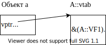

.. code:: cpp

       B b(2, 3);
       B b1(4, 5);

.. image:: media/image25.svg

.. code:: cpp

       C с(6,7,8);

.. image:: media/image26.svg

.. code:: cpp

       GF1(&a); //в функции посредством указателя базового типа будет
                //косвенно посредством таблицы виртуальных функций
                //вызван метод A::VF1(), так как объект типа A
       GF1(&b); //в функции посредством указателя базового типа будет
                //косвенно посредством таблицы виртуальных функций
                //вызван метод B::VF1(), так как объект типа В
       GF1(&c); //C::VF1(), так как объект типа C
       GF2(a); //в функции посредством ссылки базового типа будет
               //косвенно посредством таблицы виртуальных функций
               //вызван метод A::VF1() , так как объект типа A
       GF2(b); //B::VF1()
       GF2(c); //C::VF1()

   //но!
       a.VF1(); //а при вызове виртуального метода посредством объекта
                //вызов формируется на этапе компиляции (как и для
                //обычного метода класса), то есть а данном случае
                //таблица виртуальных функций не задействуется,
                //косвенный вызов не генерируется. Вызывается метод
                //A::VF1()
       b.VF1(); //В::VF1()
       c.VF1(); //C::VF1()
   }
   void GF1(A* p) //функция принимает указатель базового типа, а сам
                  //объект может быть как базового, так и любого
                  //производного типа
   {
       p->VF1();//вызов метода генерируется «косвенно» посредством
                //таблицы виртуальных функций целевого класса
                //компилятор сгенерирует код (*p->vptr[i])(р);, где р
                //будет в методе VF1 фигурировать как this
   }
   void GF2(A& r) //функция принимает ссылку базового типа, а сам
                  //объект может быть как базового, так и любого
                  //производного типа
   {
       r.VF1();//вызов метода генерируется «косвенно» посредством
               //таблицы виртуальных функций целевого класса
   }

..

   Замечание: так как при появлении виртуальных функций компилятор
   отводит дополнительную память для хранения указателя ``vptr``.
   соответственно формируются результаты оператора ``sizeof``:

   .. code:: cpp

      size_t n = sizeof(A); //???

   Вопрос:

   1. можно ли вызывать виртуальные методы в конструкторах?
   2. в деструкторах?

1.1.13. Виртуальные деструкторы
^^^^^^^^^^^^^^^^^^^^^^^^^^^^^^^

Большинство методов класса (кроме конструкторов) могут быть, а иногда и
должны быть виртуальными, в том числе и деструктор (несмотря на то, что
в разных классах имена этих методов разные!!!, но смысл одинаковый).

Например: сначала рассмотрим случай, когда деструкторы не виртуальные:

.. code:: cpp

   class Animal
   {
   public:
       ~Animal();
   };
   class Dog : public Animal
   {
   public:
       ~Dog();
   };
   int main()
   {
       //Объединим всех животных в зоопарк: это возможно сделать только
       //посредством указателей базового типа:
       Animal* zoo[] = { new Animal(параметры), new Cat(...),
           new Dog(...) };
       //Подумайте, почему нельзя определить массив
       //Animal zoo[] = { Animal (...), Cat (...), Dog (...) }; ???

       for (int i = 0; i < sizeof(zoo) / sizeof(Animal*); i++)
       {
           zoo[i]->Voice();//вызов виртуального метода целевого класса
           delete zoo[i]; //при i=0 вызовется деструктор Animal, при
                          //i=1 вызовется _только деструктор базового
                          //класса_, так как указатель типа Animal* ⇒
                          //производная часть CaL не будет корректно
                          //освобождена при i-2 вызовется тоже _только
                          //деструктор базового класса_, ⇒ производная
                          //часть Dog не будет корректно освобождена
       }
   }

Объявляем деструкторы виртуальными:

.. code:: cpp

   class Animal
   {
   public:
       virtual ~Animal();
   };
   class Dog : public Animal
   {
   public:
       virtual ~Dog(); //ключевое слово virtual в производном классе
                       //необязательно.
   };
   int main()
   {
       Animal* zoo[] = { new Animal(параметры), new Cat(...),
           new Dog(...) };
       for (int i = 0; i < sizeof(zoo) / sizeof(Animal*); i++)
       {
           zoo[i]->Voice();//вызов виртуального метода целевого класса
           delete zoo(i); //при i=0 вызовется деструктор Animal, при
                          //i=1 вызовется сначала деструктор Cat, а
                          //потом деструктор базового класса Animal,
                          //при i=2 вызовется сначала деструктор Dog, а
                          //потом деструктор базового класса Animal
       }
   }

..

   Замечание: объявлять деструктор вообще незачем, тем более делать его
   виртуальным, если он (или деструктор класса-потомка) не делает
   каких-нибудь существенных действий — например, освобождает
   динамически захваченную память.

1.1.14. Спецификатор разрешения области видимости при наследовании
^^^^^^^^^^^^^^^^^^^^^^^^^^^^^^^^^^^^^^^^^^^^^^^^^^^^^^^^^^^^^^^^^^

Если в базовом и производном от него классах объявлены переменные или
методы с одинаковыми именами, то «увидеть» соответствующие ``public``
элементы базового класса посредством объекта производного класса или
``protected`` члены базового класса из методов производного можно с
помощью оператора разрешения области видимости «\ ``имя_класса::``\ »
Например:

.. code:: cpp

   class A
   {
       ...
   public:
       virtual void VF();
   };
   class B : public A
   {
       ...
   public:
       virtual void VF();
   };
   int main()
   {
       A* p = new B();
   //посредством указатели (или ссылки)
       p->VF(); //генерируется косвенный вызов посредством таблицы
                //виртуальных функций — будет вызвана B::VF()
       p->A::VF(); //компилятору явно дано указание ⇒ вызов
                   //генерируется на этапе компиляции — будет вызвана
                   //A::VF()
   //посредством объекта
       B b;
       b.A::VF();
   }

или внутри метода класса (это прием, который используется, например, в
библиотеке классов MFC):

.. code:: cpp

   void B::VF()
   {
       A::VF(); //вызов метода базового класса для выполнения работы с
                //базовой частью объекта
       ... //работа со своей производной частью
   }

Замечание: в случае виртуальных функций явное указание области видимости
предписывает компилятору *на этапе компиляции* сгенерировать вызов
метода *указанного класса*, тем самым, отменяя в данном конкретном
случае позднее связывание.

1.1.15. Прием проектирования
^^^^^^^^^^^^^^^^^^^^^^^^^^^^

.. code:: cpp

   class A
   {
       int m_a;
   public:
       void fGeneral()
       {
           fPrivate(); //базовая часть работы всегда!
           fVirtual(); //а здесь посредством указателя this вызывается
                       //метод целевого класса в зависимости от типа
                       //объекта!
       }
   private:
       void fPrivate() { ... }
       virtual void fVirtual() { ... }
   };
   class B : public A
   {
       virtual void fVirtual() { ... }
   };

       A* pA = new A();
       A* pB = new B();
       pA->fGeneral(); //A::fGeneral(), A::fVirtual
       pB->fGeneral(); //A::fGeneral(), B::fVirtual

1.1.16. Изменение спецификатора доступа в производном классе
^^^^^^^^^^^^^^^^^^^^^^^^^^^^^^^^^^^^^^^^^^^^^^^^^^^^^^^^^^^^

Замечание: вряд ли стоит изменять спецификатор доступа виртуального
метода в производных классах, поэтому можно рассматривать приведенный
ниже пример в качестве трюка:

.. code:: cpp

   class A
   {
   public:
       virtual void F();
   };
   class B : public A
   {
   private:
       virtual void F(); //перегруженный метод находится в защищенной
                         //секции
   };
   void F(A* р)
   {
       p->F();//если объект В, то будет вызвана private метод класса
              //В!!!
   }

1.1.17. Конструктор копирования и виртуальные функции
^^^^^^^^^^^^^^^^^^^^^^^^^^^^^^^^^^^^^^^^^^^^^^^^^^^^^

.. code:: cpp

   class A
   {
       virtual void f();
   };
   class B : public A
   {
       virtual void f();
   };
   int main()
   {
       B b; //таблица виртуальных функций класса В
       A а = b; //а создается объект класса A, поэтому сначала
                //конструктор формирует A::vptr=&A::vtab, а потом
                //переписывает базовую часть объекта b в а посредством
                //конструктора копирования класса A
   }

1.1.18. Чисто виртуальные (pure virtual) функции и абстрактные классы
^^^^^^^^^^^^^^^^^^^^^^^^^^^^^^^^^^^^^^^^^^^^^^^^^^^^^^^^^^^^^^^^^^^^^

Иногда при построении иерархии классов базовый класс является настолько
обобщенным, что объектов такого типа просто не существует. Например, до
сих пор мы создавали экземпляры класса ``Animal``, но на самом деле
такого «обобщенного» животного в природе нет, зато есть кошки, собаки…
Такой базовый класс хранит общие для всех животных данные (пол.
возраст…) и посредством методов базового класса реализуется общее для
всех животных поведение. Но реализацию некоторых методов (``Voice``)
можно написать только для конкретного животного, а в базовом классе
вложить какой-то смысл в такой метод невозможно (что может «сказать»
какое-то обобщенное животное?). Поэтому до сих пор метод базового класса
``Voice`` был просто заглушкой (пустое тело функции или ``"???"``).
Посредством использования чисто виртуальных функций программист может
сообщить компилятору, что данный класс является абстракцией, поэтому
реализацию такого метода компилятор должен искать в производных классах.

Чисто виртуальная функция объявляется в базовом классе следующим
образом:

.. code:: cpp

   class A
   {
       virtual void VirtFunc() = 0;
           //=0 делает функцию чисто виртуальной.Чисто виртуальный
           //метод может, но не обязан иметь тело
   };

Класс, содержащий хотя бы одну pure virtual-функцию, называется
**абстрактным**. Следствия:

-  компилятор не позволит создавать объекты такого класса:

-  абстрактный класс может использоваться только в качестве базового для
   других классов;

-  реализация чисто виртуальной функции не обязательна;

-  компилятор будет следить за тем, чтобы в производных классах такой
   метод был реализован;

-  можно пользоваться указателем или ссылкой базового типа (на
   абстрактный класс).

Пример:

.. code:: cpp

   class Animal
   {
       ...
   public:
       virtual void Voice() const = 0;
           //Обратите внимание: не требуется определение чистой
           //виртуальной функции! (реализация может быть, но она
           //необязательна!! !)
   };
   class Dog : public Animal
   {
       ...
   public:
       virtual void Voice() const { cout << "Гав!"; }
           //реализация чисто виртуальной функции в производном классе
           //Dog
   };
   class Cat :public Animal
   {
       ...
   public:
       virtual void Voice() const { cout << "Mяy!"; }
           //реализация чисто виртуальной функции в производном классе
           //Cat
   };
   void F(const Animal* p)
   {
       p->Voice(); //вызов метода целевого класса
   }
   int main()
   {
   //  Animal an; //ошибка компилятора — нельзя создать экземпляр
                  //абстрактного класса
       Dog dog;
       F(&dog); //корректно — функция принимает указатель базового типа
                //⇒ компилятор неявно преобразует указатель Dog* в
                //указатель Animal*
       Animal* zoo[] = { new Dog, new Cat, ... };
           //корректно — массив указателей базового типа, а сами
           //объекты производных типов
       for (int i = 0; i < sizeof(zoo) / sizeof(Animal*); i++)
       {
           zoo[i]->Voice(); //вызов виртуального метода целевого класса
           //Если массив больше не нужен, не забудьте освободить память
           delete zoo[i];
       }
   }

..

   Замечание: класс, содержащий только чисто виртуальные функции,
   называется классом-протоколом (задает для производных классов только
   интерфейс без какой-либо реализации и заставляет каждый производный
   класс иметь собственную реализацию заданного интерфейса).

Наследование интерфейса и наследование реализации при открытом наследовании
~~~~~~~~~~~~~~~~~~~~~~~~~~~~~~~~~~~~~~~~~~~~~~~~~~~~~~~~~~~~~~~~~~~~~~~~~~~

При открытом наследовании базовый класс может предоставлять производным:

-  **реализацию** — некоторую общую для всех потомков функциональность
   (то есть не предполагается, что в производном классе в указанное
   базовым классом действие можно вложить другой смысл). Например: метод
   базового класса void ``Animal::IncYear(){ m_age++; }`` не может вести
   себя по-другому в производных классах:

-  **интерфейс** — только обозначение действия, так как базовый класс в
   этом случае «знает», что такое действие должно иметь место в
   производных классах, но «не знает» как такое действие реализовать в
   базовом.

   Например: ``virtual void Animal::Voice() = 0;``

-  **реализацию «по умолчанию» + интерфейс** (то есть производный класс
   может пользоваться функциональностью базового или вложить свой
   собственный смысл в указанное действие). Например:
   ``virtual void Animal::WhenDoISleep() { cout << "At night"; }`` —
   поведение по умолчанию

   ``virtual void Dog::WhenDoISleep() { cout << "20 hours a day"; }`` —
   производный класс может вложить новый смысл в данное действие,
   перегрузив виртуальный метод, или пользоваться базовой версией по
   умолчанию. То есть, если в производном классе не определен метод
   ``WhenDolSleep()``, то животное будет спать по умолчанию по ночам.

.. code:: cpp

   class Animal
   {
   public:
       virtual void Voice() = 0;
           //объявление pure virtual функции эта абстракция должна быть
           //определена в производных классах, так как каждое животное
           //«говорит» по-своему и нельзя придумать что- либо общее.
       virtual void WhenDoISleep() { std::cout << "At night" << endl; }
           //может быть переопределена в производных классах или нет,
           //тогда такие производные классы пользуются базовой версией,
           //которая делает что-то по умолчанию: Animal::WhenDoISleep()
       void IncYear();
           //не предполагает, что она будет вести себя иначе в
           //производных классах
   };
   class Dog : public Animal
   {
   public:
       virtual void Voice() { std::cout << "Gav" << endl; }
       virtual void WhenDoISleep()
       {
           std::cout << "20 hours a day" << endl;
       } //а можно и не переопределять, и пусть спит по умолчанию ночью
   };

..

   Правило №4: различайте наследование интерфейса и реализации!

.. image:: media/image27.svg

.. code:: cpp

   int main()
   {
       Animal* zoo[] = { new Dog(), new Cat() };
       for (int i = 0; i < sizeof(zoo) / sizeof(zoo[0]); i++)
       {
           zoo[i]->IncYear(); //вызывается метод базового класса
           zoo(i]->Voice(); //вызывается метод «целевого» класса
           zoo[i]->WhenDoISleep(); //если в производном классе такой
                                   //метод не определен, то вызывается
                                   //метод базового класса, иначе метод
                                   //«целевого» класса
       }
   }

Механизм наследования интерфейса и реализации посредством таблиц виртуальных функций
~~~~~~~~~~~~~~~~~~~~~~~~~~~~~~~~~~~~~~~~~~~~~~~~~~~~~~~~~~~~~~~~~~~~~~~~~~~~~~~~~~~~

Примеры формирования таблиц виртуальных функций:

1. Использование производным классом функциональности базового класса

.. code:: cpp

   class A
   {
       ...
   public:
       virtual void f();
       //так как появился виртуальный метод, компилятор создаст для
       //класса A таблицу виртуальных функций и занесет в нее адрес
       //метода класса A
       //+-------+
       //|A::vtab|
       //+=======+
       //|&(A::f)|
       //+-------+
   };
   class В : public A
   {
       ...
       //виртуальный метод f() _не перегружен!!!_ ⇒ класс В будет
       //пользоваться базовой реализацией

       //Так как в базовом классе есть виртуальный метод, для
       //производного класса В компилятор создаст свою таблицу
       //виртуальных функций, но так как в классе В виртуальный метод
       //отсутствует, то в таблицу будет занесен адрес метода базового
       //класса
       //+-------+
       //|В::vtab|
       //+=======+
       //|&(A::f)|
       //+-------+
   };
   class С : public В
   {
       ...
   public:
       virtual void f();
       //виртуальный метод перегружен, поэтому в таблицу виртуальных
       //функций компилятор занесет адрес метода класса C
       //+-------+
       //|C::vtab|
       //+=======+
       //|&(C::f)|
       //+-------+
   };
   int main()
   {
       A* pA = new A;
       A* pB = new В;
       A* pC = new С;
       pA->f(); //A::f();
       pB->f(); //A::f();
       pC->f(); //C::f();
   }

2. Более сложные случаи:

.. code:: cpp

   class A
   {
       int m_а;
       ...
   public:
       void f();//метод не виртуальный, поэтому в таблицу виртуальных
                //функций адрес не заносится. Более того, если в классе
                //виртуальных методов нет, то таблицу виртуальных
                //функций компилятор для класса A создавать не будет!
   };
   class В : public A
   {
       int m_b;
       ...
   public:
       virtual void f(); //метод объявлен как виртуальный, поэтому
                         //компилятор создает таблицу виртуальных
                         //функций и заносит в нее адрес метода класса В
                         //+-------+
                         //|В::vtab|
                         //+=======+
                         //|&(В::f)|
                         //+-------+
   };
   class С : public В
   {
       int m_c;
       ...
   public:
       virtual void f(); //виртуальный метод перегружен (ключевое слово
                         //virtual необязательно), поэтому в таблицу
                         //виртуальных функций компилятор занесет адрес
                         //метода класса С
                         //+-------+
                         //|C::vtab|
                         //+=======+
                         //|&(C::f)|
                         //+-------+
   };
   int main()
   {
       A* pA = new A;

.. image:: media/image28.svg

.. code:: cpp

       pA->f(); //так как в классе A нет виртуальных функций,
                //компилятор генерирует обычный вызов не виртуального
                //метода A::f() (таблиц виртуальных функций не
                //используется, так как для класса A компилятор ее не
                //создает !!!)
       В* рВ1 = new В;
       A* рA1 = рВ1;

.. image:: media/image29.svg

.. code:: cpp

       рA1->f(); //обычный вызов не виртуального метода A::f()
       рВ1->f(); //косвенный вызов B::f() посредством таблицы
                 //виртуальных функций
       С* рС = new С;
       A* рA2 = рС;
       В* рВ2 = рС;

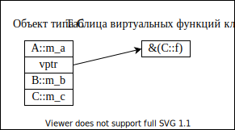

.. code:: cpp

       рA2->f(); //обычный вызов не виртуального метола A::f()
       рВ2->f(); //косвенный вызов С::f() посредством таблицы
                 //виртуальных функций
       рС->f(); //косвенный вызов С::f() посредством таблицы
                //виртуальных функций
   }

Тема III. Понятие ``friend``
============================

``friend`` (привилегированные) функции и классы
-----------------------------------------------

Одним из достоинств классов считается «сокрытие» данных, но,
общеизвестно, что как только возникает какое-либо правило, так сразу же
возникает и необходимость в исключениях из этого правила. Поэтому, как
только появились спецификаторы доступа private и protected, так сразу же
возникла необходимость иметь средство непосредственного доступа к таким
элементам класса, которое и было реализовано посредством
``friend``-функций или классов.

*Замечание:* существует мнение (и я с ним полностью согласна), что
введение понятия ``friend`` — это в большинстве случаев предоставление
программисту средства исправить плохо продуманную иерархию классов, и,
если возникает необходимость в таких функциях или классах, то зачастую
это признак того, что иерархия классов нуждается в исправлении. Но! В
некоторых случаях, а именно когда речь идет:

-  о перегруженных глобальными функциями операторах

-  или о вспомогательных классах

ключевое слово ``friend`` оказывается очень даже полезным.

Внешняя (глобальная) ``friend``-функция
~~~~~~~~~~~~~~~~~~~~~~~~~~~~~~~~~~~~~~~

Внешняя ``friend``-функция это обычная глобальная функция, которой
просто предоставлены специальные привилегии доступа к защищенным
элементам того класса, в котором она объявлена как ``friend``.

Пример (в приведенном примере с точки зрения проектирования корректнее
было бы пользоваться ``public`` методами для получения защищенных
данных):

.. code:: cpp

   class Rect
   {
       int m_left, m_top, m_right, m_bottom;
   public:
       ...
   };
   Rect BoundingRect(const Rect& r1, const Rect& r2)
   { //это не метод класса, а обычная глобальная функция ⇒ любая
     //попытка обращения к защищенным членам класса Rect вызывает 
     //ошибку компилятора
       int l = (r1.m_left < r2.m_left) ? r1.m_left : r2.m_left;
           //ошибка — нарушение прав доступа
       ...
   }

Для того, чтобы в глобальной функции Вы могли обращаться к защищенным
переменным класса, эта функция должна быть объявлена в классе с ключевым
словом ``friend``:

.. code:: cpp

   class Rect
   {
       ...
       friend Rect BoundingRect(const Rect&, const Rect&);
       //объявление глобальной friend-функции

..

   Замечание: не имеет значения, в какой секции (``private``,
   ``protected`` или ``public``) объявлена ``friend`` функция, так как
   она не является членом класса.

.. code:: cpp

   };
   Rect BoundingRect(const Rect& r1, const Rect& r2)
   { //так как эта глобальная функция «стала другом» класса Rect, в
     //теле этой функции компилятор позволит обращаться к защищенным 
     //членам этого класса
       int l = (rl.m_left < r2.m_left) ? rl.m_left : r2.m_left; //ОК
   }

..

   Замечание: для всех остальных функций правила доступа остаются
   прежними, то есть компилятор выдаст ошибку при попытке обращения к
   защищенному члену класса.

.. code:: cpp

   int main()
   {
       Rect r = BoundingRect(Rect(1,2,3,4), Rect(5,6,7,8));
   //  r.l = 1; //ошибка доступа
   }

Замечание 1: дружба с функцией автоматически не передается по наследству

.. code:: cpp

   class B;
   class A
   {
       friend void F(B& b);
       int m_a;
   };
   class B : public A
   {
       int m_b;
   };
   void F(B& b)
   {
       std::cout << b.m_a; //OK, так как функция является другом
                           //класса А
   //std::cout << b.m_b; //ошибка — нет доступа к В::m_b. Для того,
                         //чтобы иметь доступ к защищенным переменным 
                         //производного класса, функция должна быть 
                         //другом этого производного класса
   }

Замечание 2: с другой стороны, дружественная производному классу функция
имеет право обращаться к ``protected`` (не ``private``!) членам базового
класса:

.. code:: cpp

   class A
   {
       int m_a1;
   protected:
       int m_a2;
   };
   class B : public A
   {
       int m_b;
       friend void F(B& b);
   };
   void F(B& b)
   {
   //  std::cout<<b.m_al; //ошибка — нет доступа
       std::cout << b.m_a2; //OK
       std::cout << b.m_b; //OK
   }

``friend``-класс
~~~~~~~~~~~~~~~~

Можно сделать все методы одного класса «Дружественными» другому классу,
то есть позволить компилятору в любом методе ``friend``-класса
обращаться к защищенным членам данного класса, например:

.. code:: cpp

   //Circle.h
   class Circle
   {
       int x, y, r;
   public:
       Circle(const Rect& r); //объявление конструктора, который
                              //«вписывает» создаваемый кружок в 
                              //заданный в качестве параметра 
                              //прямоугольник
   };
   //Circle.срр
   Circle::Circle(const Rect& r)//реализация конструктора
   {
       int w = r.m_right - r.m_left; //ошибка доступа
       int h = r.m_bottom - r.m_top; //ошибка доступа
       x = r.m_left + w / 2;
       y = r.m_top + h / 2;
       r = (w > h) ? h / 2 : w / 2;
   }

Объявим класс ``Circle`` другом класса ``Rect``:

.. code:: cpp

   class Rect
   {
       friend class Circle; //все методы класса Circle имеют право
                            //обращаться к защищенным членам класса Rect
   };
   //Circle.срр
   Circle::Circle(const Rect& r)//теперь методы класса Circle имеют
                                //право обращаться к защищенным членам 
                                //класса Rect
   {
       int w = r.m_right - r.m_left; //ОК
       int h = r.m_bottom - r.m_Lop; //ОК
       ...
   }

Замечание: «дружба» классов:

1. не наследуется

   .. code:: cpp

      class Z { friend class X; };
      class X { ... };
      class Y : public X { ... };

   Методы производного класса ``Y`` не имеют права обращаться к
   защищенным членам класса ``Z``

   .. code:: cpp

      class Z { int m_z; friend class X; };
      class X
      {
          void fX(Z& z) { std::cout << z.m_z; } //OK
      };
      class Y : public X
      {
          void fY(Z& z)
          {
              //std::cout<<z.m_z; //ошибка доступа
          }
      };

2. не является транзитивной (если класс ``X`` объявлен
   ``friend``-классом в классе ``Y``, а класс ``Z`` объявлен
   ``friend``-классом в классе ``X``, то класс ``Z`` не является
   ``friend``-классом ``X``).

   .. code:: cpp

      class X { friend class Y; };
      class Y { friend class Z; };

   Методы класса ``Z`` не имеют права обращаться к защищенным членам
   класса ``X``.

friend-метод другого класса
~~~~~~~~~~~~~~~~~~~~~~~~~~~

Можно дать права не всем, а выборочно некоторым методам другого класса
обращаться к защищенным переменным данного класса, например:

.. code:: cpp

   class Rect
   {
       friend Circle::Circle(const Rect&);
           //только данный метод класса Circle имеет право обращаться к
           //защищенным членам класса Rect -> в любом другом методе при 
           //аналогичной попытке компилятор выдаст ошибку
   };

Тема IV. Перегрузка операторов
==============================

Предоставление возможности обращаться с объектами пользовательского типа
также как с переменными базового типа.

Перегрузка операторов для базовых и пользовательских типов
----------------------------------------------------------

Компилятор генерирует разные низкоуровневые инструкции, встречая одно и
то же действие, но над разными типами.

Для базовых типов также существует перегрузка операторов, которую
осуществляет компилятор самостоятельно (_встроенные *операторы*):

.. code:: cpp

       int x, y, z;
       z = x + y; //add
       double x, y, z;
       z = x + y; //fadd

Язык C++ допускает перегрузку операторов (overloading), то есть
способность переопределения привычных операторов типа ``+``, ``*``,
``>``, ``<``, ``=``, ``>>``, ``<<``, ``[]``, ``()``, … но только для
Ваших пользовательских типов данных (полный список операторов, которые
можно перегружать, приведен в **MSDN Library — «Redefinable
Operators»**. Там же перечислены операторы, которые перегружать нельзя).

Но. в отличие от базовых типов, компилятор «не знает» как
интерпретировать следующую запись и выдаст ошибку: «в классе не
определен оператор ``+``\ »

.. code:: cpp

       Point pt1, pt2, pt3;
       pt3 = pt1 + pt2; //ошибка

Только Вы можете определить, каким образом следует поступать
компилятору, когда он встречает в тексте программы оператор, который
должен воздействовать на Ваш тип. Целью перегрузки операторов является
простота и интуитивная интерпретация операторов.

Специфика перегружаемых операторов
----------------------------------

Перегрузка операторов — один из видов перегрузки имен функций. Просто у
такой функции несколько необычное имя. Если Вы перегружаете оператор ♥,
то должны создать в Вашем классе функцию с именем ``operator♥``, которую
компилятор будет вызывать всякий раз, когда по отношению к объекту
данного класса применяется указанный оператор ♥

Но так как функция эта все же специфичная, вводятся некоторые
дополнительные правила:

-  нельзя создавать собственные операторы, а можно только перегружать
   существующие (и то не все):

-  перегруженный оператор действует только по отношению к объектам того
   класса, для которого он переопределен (например, ``operator+`` класса
   ``A`` не имеет никакого отношения к ``operator+`` класса ``B``);

-  нельзя менять число операндов оператора (например, нельзя перегрузить
   оператор ``*`` (умножения) таким образом, чтобы в нем использовался
   один операнд);

-  перегруженные операторы наследуют приоритеты и ассоциативность от
   встроенных операторов;

-  оператор перегружается только относительно пользовательского типа
   данных (обычно класса) ⇒ нельзя перегружать встроенные операторы
   (например, оператор целочисленного сложения). Чтобы обеспечить
   выполнение этого условия, компилятор требует, чтобы хотя бы один
   аргумент каждого перегруженного оператора относился к
   пользовательскому типу;

-  нельзя перегружать операторы ``.`` ``::`` ``.*`` ``?:``

-  нет правил, которые предписывали бы сохранение смысла оператора, но
   по возможности рекомендуется это делать (никто не запрещает вложить в
   реализацию оператор сложения смысл оператора вычитания, но вряд ли
   это улучшит «читабельность» Вашего кода):

-  как и любая другая функция, перегруженный оператор может иметь
   сколько угодно реализаций, «различимых» по типу параметров
   компилятором;

-  оператор, перегруженный с помощью метода класса, может быть
   виртуальным и даже чисто виртуальным;

-  оператор, перегруженный с помощью метода класса, не может быть
   статическим:

-  не существует ограничений на тип возвращаемого значения, но следует
   учитывать «преемственность» использования перегружаемого оператора
   применительно к базовым типам и эффективность реализации.

Способы перегрузки операторов
-----------------------------

Для того, чтобы перегрузить оператор ♥, необходимо объявить и определить
функцию с именем ``operator♥``. Эта функция может быть глобальной или
методом класса (но не обоими вариантами сразу).

Все переопределяемые операторы делятся на унарные (действие производится
над одним объектом) и бинарные (действие производится над двумя
объектами). Тернарный оператор перегружать запрещено.

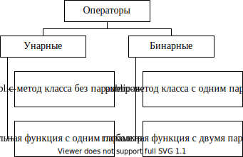

Пример:

.. code:: cpp

   class А{ ... };
   A x, y, z;
   z = х + у; //нормальная синтаксическая форма записи. Компилятор
              //сгенерирует или вызов public метода operator+ класса А,
              //или вызов глобальной функции (в зависимости от
              //реализации)
   z = operator+(х, у); //функциональная форма вызова глобальной функции
   z = x.operator+(у); //функциональная форма вызова метода класса

**Рекомендация**: если оператор может быть перегружен как глобальной
функцией, так и методом класса — предпочитайте перегрузку в форме метода
класса!

**Исключения** (когда перегрузка методом класса невозможна):

-  первый операнд относится к базовому типу, например ``z = 1 + x``;

-  тип первого операнда библиотечный

В таких ситуациях перегрузка возможна только посредством глобальных
функций.

Порядок поиска компилятором перегруженного оператора
----------------------------------------------------

Если компилятор встречает оператор, он должен решить, как его
компилировать. Например, для бинарного оператора:

-  если оба аргумента относятся к базовым типам, используется встроенный
   оператор:

-  если слева — операнд пользовательского типа, компилятор ищет оператор
   в форме метода класса. Если находит, генерирует вызов метода класса:

-  если перегрузки в форме метода не найдено или слева операнд базового
   типа, компилятор ищет перегрузку в форме глобальной функции Если
   такая форма существует, использует ее при компиляции:

-  если все перечисленные варианты испробованы, а перегрузки не найдено,
   выдает ошибку.

Замечание: если оператор перегружен и методом, и глобальной функцией, то
при нормальной форме вызова компилятор не может различить какую именно
форму перегрузки требуется вызвать. В такой ситуации некоторые
компиляторы:

а) выдают ошибку двойственность ⇒ ошибка компилятора

б) другие компиляторы могут предпочесть метод ⇒ глобальная функция будет
проигнорирована.

Перегрузка операторов методом класса
------------------------------------

   *Замечание:* операторы ``=``, ``()``, ``[]``, ``->`` могут быть
   перегружены только с помощью метода класса.

``operator=`` (memberwise assignment)
~~~~~~~~~~~~~~~~~~~~~~~~~~~~~~~~~~~~~

В качестве примера рассмотрим перегрузку оператора «\ ``=``\ »
(присваивания). Оператор присваивания — наиболее часто встречаемый
оператор класса. Он настолько тесно связан с понятием класса (так же,
как конструктор копирования), что если Вы явно не реализуете такой
оператор в классе, то компилятор сгенерирует автоматический оператор
присваивания сам. Такой автоматический оператор присваивания «умеет»:

-  поэлементно копировать данные базового типа из одного объекта в
   другой;

-  вызывать оператор присваивания базового класса (явно определенный
   программистом или автоматический)

-  вызывать оператор присваивания для встроенных объектов.

Компилятор не может сгенерировать автоматический оператор присваивания в
следующих случаях:

-  в классе объявлен константный объект;

-  в классе объявлена ссылка:

-  в базовом классе оператор присваивания объявлен private;

-  во встроенном объекте оператор присваивания объявлен private.

..

   Следствие: для сложных классов пишите свои операторы присваивания.

Замечание: оператор присваивания не наследуется! Это означает: если в
производном классе оператор присваивания явно программистом не
определен, то компилятор генерирует автоматический оператор
присваивания, а не использует метод базового класса.

Замечание: оператор присваивания (также называемый оператором
копирующего присваивания — memberwise assignment) очень похож на
конструктор копирования, но существует принципиальная разница:

.. code:: cpp

   Point pt1, pt2;
   Point pt3 = pt1; //объявление с инициализацией создается новый
                    //объект *вызывается конструктор копирования*
   pt2 = pt1; //одному существующему объекту присваивается значение
              //другого существующего объекта *вызывается оператор
              //присваивания*

В качестве примера перегрузим оператор присваивания для класса Point,
хотя для такого простого класса компилятор прекрасно бы сгенерировал
автоматический оператор присваивания (и, возможно, эффективнее, чем
сделаем это мы):

.. code:: cpp

   int main()
   {
       Point pt1(1, 1), pt2(2, 2);
       pt2 = pt1; //нормальная форма вызова. Если в классе Point не
                  //перегружен оператор присваивания, то компилятор
                  //вызовет автоматический (при этом содержимое pt1
                  //копируется в pt2, затирая прежние значения pt2), а
                  //если Вы перегрузили оператор присваивания, то
                  //компилятор вызовет Ваш метод класса и будут выполнены
                  //действия, предусмотренные программистом
       pt2.operator=(pt1); //функциональная форма вызова
   }

..

   Замечание: для компилятора обе формы эквивалентны. Программисту
   привычнее писать выражения в нормальной форме, но в большинстве
   случаев для того, чтобы понять, какого типа параметры должна
   принимать перегруженная функция и каков тип возвращаемого значения,
   стоит написать функциональную форму вызова.

.. code:: cpp

   class Point
   {
       int m_x, m_y;
   public:
       Point(int x, int y) { m_x = x; m_y = y; }
       Point& operator= (const Point& refPt);
       //объявление оператора присваивания.Ключевое слово const
       //необязательно, но говорит о хорошем стиле
       //программирования.В этом случае компилятор не позволит
       //модифицировать параметр(то есть значение справа от знака
       //равенства)
   };
   //Реализация оператора присваивания
   Point& Point::operator= (const Point& refPt)
   {
       m_x = refPt.m_x;
       m_y = refPt.m_y;
       return *this;
   }

1.1.19. Тип возвращаемого оператором присваивания значения
^^^^^^^^^^^^^^^^^^^^^^^^^^^^^^^^^^^^^^^^^^^^^^^^^^^^^^^^^^

Нет ограничений на тип возвращаемого любым перегруженным оператором
значения, поэтому, пожалуй, в большинстве случаев следует учитывать
следующие соображения:

-  использование перегруженного оператора ничем не должно отличаться от
   использования этого оператора для базовых типов;

-  предпочитать эффективный вариант.

Рассмотрим три варианта:

1. 

.. code:: cpp

   class Point
   {
       ...
       void operator= (const Point& refPt)
       {
           m_x = refPt.m_x; m_y = refPt.m_y;
       }
   };
   int main()
   {
       Point pt1(1, 1), pt2(2, 2), pt3(3, 3);
       pt2 = pt1; //в данном примере возвращаемое значение не
                  //требуется, так как в результате вызова метода будет
                  //требуемым образом модифицирован объект слева от
                  //знака равенства
       pt3 = pt2 = pt1; //а в этом случае компилятор выдаст ошибку,
                        //которая станет очевидна, если написать такое
                        //цепочечное присваивание в функциональной
                        //форме:
       pt3.operator=(pt2.operator=(pt1));
           //скобки не обязательны и расставлены только для того, чтобы
           //подчеркнуть право ассоциативность оператора присваивания.
           //Проблема заключается в том, что аргументом для вызова
           //pt3.operator= является значение, возвращаемое
           //pt2.operator=, а в данном варианте реализации наш
           //перегруженный оператор ничего не возвращает!
   }

2. Для обеспечения цепочечного присваивания ``operator=`` должен
   возвращать уже модифицированное значение левого операнда, например:

.. code:: cpp

   class Point
   {
       ...
       Point operator= (const Point& refPt)
       {
           m_x = refPt.m_x; m_y = refPt.m_y;
           return *this; //при возвращении по значению для формирования
                         //возвращаемого значения компилятор создает
                         //копию того объекта, для которого был вызван
                         //метод посредством конструктора копирования
                         //-> дополнительная память для возвращаемого
                         //значения и дополнительное время на
                         //выполнение конструктора копирования
       }
   };
   int main()
   {
       Point pt1(1, 1), pt2(2, 2), pt3(3, 3);
       pt3 = pt2 = pt1; //теперь цепочечное присваивание выполняется
                        //корректно, но не Эффективно
   }

3. Эффективнее не заставлять компилятор делать копию того объекта, для
   которого вызывается ``operator=`` а просто вернуть адрес этого
   объекта. Если возвращать адрес посредством указателя, цепочечное
   присваивание имело бы довольно непривычную форму, поэтому адрес
   логичнее возвращать по ссылке.

Замечание: мы имеем право возвращать адрес, так как сам объект
гарантированно существует в вызывающей функции

.. code:: cpp

   class Point
   {
       Point& operator= (const Point& refPt)
       {
           m_x = refPt.m_x; m_y = refPt.m_y; return *this;
       } //в качестве возвращаемого значения компилятор формирует адрес
         //объекта слева от знака равенства (адрес того объекта, для
         //которого вызывается метод)
   };
   int main()
   {
       Point pt1(1, 1), pt2(2, 2), pt3(3, 3);
       pt3 = pt2 = pt1; //теперь цепочечное присваивание выполняется
                        //корректно и эффективно
   }

1.1.20. Оператор присваивания и нетривиальные классы
^^^^^^^^^^^^^^^^^^^^^^^^^^^^^^^^^^^^^^^^^^^^^^^^^^^^

Для простых классов (таких как класс ``Point``) не стоит явно
реализовывать оператор присваивания, так как для них прекрасно подходит
оператор присваивания, который автоматически умеет генерировать
компилятор. Но для чуть более сложных классов (таких как ``Animal``)
программист обязан реализовать корректный оператор присваивания, так как
использование автоматического приведет к ошибкам времени исполнения:

.. code:: cpp

   {
       Animal an1(1, MALE, false, "Bobik"),
              an2(5, MALE, true, "Lord"); //создание локальных объектов
       an2 = an1; //вызов автоматического оператора присваивания
   } //вызов деструкторов локальных объектов

Ситуация напоминает проблему, которая возникала при использовании
автоматического конструктора копирования, но усугубляется тем. что оба
объекта на момент вызова оператора присваивания существуют, поэтому для
каждого объекта была динамически выделена память.

.. image:: media/image32.svg

Так как в данном случае нас не устраивает автоматический оператор
присваивания, реализуем собственный.

.. code:: cpp

   Animal& Animal::operator=(const Animal& r)
   {
       //Простые данные просто копируем (то же самое сделал бы
       //автоматический оператор присваивания)
       m_nAge = r.m_nAge;
       m_Sex = r.m_Sex;
       m_bMaster = r.m_bMaster;
       //А для указателя создаем свою динамическую копию
       delete[] m_pName; //сначала освобождаем предыдущий блок памяти
       m_pName = new char[strlen(r.m_pName) + 1]; //а потом выделяем
                                                  //новый для копии
                                                  //строки
       strcpy(m_pName, r.m_pName); //и копируем содержимое
       return *this; //для обеспечения цепочечного присваивания
                     //возвращаем по ссылке адрес данного объекта
   }

Теперь в нижеприведенном фрагменте кода все будет корректно:

.. code:: cpp

   {
       Animal an1(1, MALE, false, "Bobik"),
              an2(5, MALE, true, "Lord");
       an2 = an1; //вызов перегруженного оператора присваивания
   }//вызов деструкторов локальных объектов (для каждого объекта
    //деструктор освобождает свой динамически выделенный блок памяти)

А в следующем примере опять возникнет ошибка времени исполнения, так как
мы не предусмотрели защиту от ситуации, когда слева и справа от знака
равенства находится один и тот же объект:

.. code:: cpp

   {
       Animal an1(1, MALE, false, "Bobik");
       an1 = an1; //при освобождении блока памяти «приемника» мы
                  //одновременно сделаем недействительным блок памяти
                  //«источника», так как это один и тот же объект
   }

Модифицируем оператор присваивания: если адрес объекта, для которого
вызывается метод, совпадает с адресом объекта, полученного в качестве
параметра, происходит «присваивание самому себе», поэтому ничего
копировать не нужно, а только следует для обеспечения цепочечного
присваивания вернуть ``*this``.

.. code:: cpp

   Animal& Animal::operator=(const Animal& r)
   {
       if (this != &r) //а) более общий случай, чем
                       //(m pName!= r.m_pName)
                       //б) проверка (*this!=r) требует перегрузки
                       //оператора ==
       {
           m_nAge = r.m_nAge;
           m_Sex = r.m_Sex;
           m_bMaster = r.m_bMaster;
           delete[] m_pName;
           m_pName = new char[strlen(r.m_pName) + 1];
           strcpy(m_pName, r.m_pName);
           return *this;
       }
   }

Правило:

-  убедитесь, что не происходит присваивания вида ``х=х``

-  удалите предыдущие данные

-  скопируйте новые (все!) данные

-  возвратите ``*this``

1.1.21. Оператор присваивания и наследование
^^^^^^^^^^^^^^^^^^^^^^^^^^^^^^^^^^^^^^^^^^^^

Ситуация с нетривиальными классами усугубляется при наследовании. Если в
производном классе оператор присваивания не реализован, то в
автоматическом операторе присваивания производного класса компилятор сам
вызовет оператор присваивания базового класса. Но. если Вы взяли
реализацию оператора присваивания на себя, то компилятор ничего
автоматически делать за Вас не будет, то есть:

-  (как и в случае конструктора копирования) перегруженный оператор
   присваивания производного класса работает только со своей
   (производной) частью объекта;

-  если нет явного вызова оператора присваивания базового класса,
   базовая часть остается прежней!

Поэтому программист должен предусмотреть явный вызов оператора
присваивания базового класса:

.. code:: cpp

   Dog& Dog::operator= (const Dog& r)
   {
       if (this != &r)
       {
           //Способы вызова оператора присваивания базового класса
           Animal::operator=(r); //функциональный вызов метода
                                 //operator= базового класса Animal
           static_cast<Animal*>(this) = r;
               //или нормальная форма вызова (посредством явного
               //приведения типа заставляем компилятор интерпретировать
               //указатель производного типа как указатель базового
               //типа)
           static_cast<Animal&>(*this) = r; //аналогично

           //копирование производной части
           ...
       }
       return *this;
   }

1.1.22. Оператор присваивания и перегрузка
^^^^^^^^^^^^^^^^^^^^^^^^^^^^^^^^^^^^^^^^^^

Если конструктор копирования может быть только один и тип его параметра
предопределен, то оператор присваивания может быть перегружен сколько
угодно раз.

Замечание: автоматически компилятор генерирует только оператор
присваивания вида: ``А& operator=(const А&)``.

.. code:: cpp

   {
       Point pt1(1, 1), pt2(2, 2);
       pt1 = pt2; //для такого случая (и если класс простой) компилятор
                  //сгенерирует автоматический оператор присваивания сам
       int z = 55;
       pt1 = z; //или pt1.operator=(z); — а здесь выдаст ошибку, если
                //Вы не перегрузите оператор присваивания таким
                //образом, чтобы он принимал параметр требуемого типа
   }

Для того, чтобы компилятор «знал», что ему следует делать, встречая
такое выражение, введем в класс ``Point`` оператор присваивания, который
принимает параметр нужного типа:

.. code:: cpp

   class Point
   {
       int m_x, m_у;
   public:
       Point& operator=(int n) { m_x = n; m_у = n; return *this; }
   };

1.1.23. Оптимизация оператора присваивания
^^^^^^^^^^^^^^^^^^^^^^^^^^^^^^^^^^^^^^^^^^

Если речь идет о динамическом выделении памяти, то по возможности
следует избегать фрагментации heap-a. В частности такую возможность
можно (и нужно) предусмотреть при реализации оператора присваивания. В
качестве примера рассмотрим класс, инкапсулирующий одномерный
динамический массив:

.. code:: cpp

   class Array
   {
       int m_size; //количество элементов в массиве
       int m_capacity; //количество элементов, для которых динамически
                       //выделена память (емкость) >= m_size
       double* m_p; //указатель на динамический массив
   public:
       Array(int n) //конструктор, в котором динамически выделяется
       {            //память
           m_size = 0;
           m_capacity = n;
           m_p = new double[n];
       }
       ~Array() { delete[] m_p; } //деструктор, в котором динамически
                                  //выделенная память освобождается
       Array(const Array& other); //конструктор копирования обязательно
                                  //должен быть явно ( и корректно)
                                  //реализован для такого класса
                                  //программистом
       Array& operator= (const Array& other); //оператор присваивания
   };

Реализация оператора присваивания.

.. code:: cpp

   Array& Array::operator-(const Array& other)
   {
       if (this != &other)
       {
           if (m_capacity < other.m_size)//если выделенной памяти не
                                         //хватает
           {
               delete[] m_p;//старый блок освобождаем
               m_p = new double[other.m_size];//выделяем новый
               m_capacity = other.m_size;
           }
           m_size = other.m_size;//формируем новый размер
           memcpy(m_p, other.m_p, m_size * sizeof(double)); //копируем
       }
       return *this;
   }

1.1.24. Интересные приемы программирования
^^^^^^^^^^^^^^^^^^^^^^^^^^^^^^^^^^^^^^^^^^

Если посмотреть на реализации конструктора копирования и оператора
присваивания для нетривиальных классов, то можно увидеть много общего,
поэтому некоторые программисты предпочитают реализовывать конструктор
копирования посредством оператора присваивания:

.. code:: cpp

   Array::Array(const Array& other)
   {
       m_capacity = 0; //для того, чтобы в операторе присваивания была
                       //выделена новая память
       m_p = 0; //для того, чтобы оператор delete, который будет вызван
                //в операторе присваивания сработал корректно (с
                //нулевым указателем оператор delete ничего делать не
                //будет, а если оставить случайное значение, то скорее
                //всего произойдет ошибка времени выполнения)
       *this = other; //нормальная форма вызова оператора присваивания
   }

Следующий прием позволяет:

-  явно не освобождать предыдущий блок захваченной динамически памяти

-  не писать проверки на присваивание вида ``х=х``:

Вводим в класс Array вспомогательный метод:

.. code:: cpp

   void Array::Swap(Array& r)
   {
       //обмениваем значения простых данных посредством
       //вспомогательного временного объекта
       int size = m_size;
       m_size = r.m_size;
       r.m_size = size;
       int capacity = m_capacity;
       m_capacity = r.m_capacity;
       r.m_capacity = capacity;
       //обмениваем значения адресов динамических массивов
       double* р = m_p;
       m_p = r.m_р;
       r.m_p = p;
   }
   Array& Array::oporator = (const Array & r)
   {
       Array tmp = r;//копия параметра
       Swap(tmp); //обмен данными текущего объекта с копией.
       return *this;
   }//для копии будет вызван деструктор, но к этому моменту в копии
    //будут «старые» данные, которые как раз и нужно уничтожить

Это красивый прием, но он не позволяет сделать никаких оптимизаций,
поэтому лично я им не пользуюсь.

Стандарт С++11 move ``operator=``
~~~~~~~~~~~~~~~~~~~~~~~~~~~~~~~~~

(текст отсутствует!)

Перегрузка оператора ``[]``
~~~~~~~~~~~~~~~~~~~~~~~~~~~

Рассмотренный в предыдущем разделе класс ``Array`` является оберткой для
одномерного динамического массива, поэтому логично предоставить
пользователю такого класса возможность обращаться к элементам массива
посредством привычного для программиста оператора индексирования:

.. code:: cpp

   {
       Array a(10);
       for (int i = 0; i < 10; i++)
       {
           a[i] = i; //нормальная форма вызова оператора индексирования
           a.operator = i; //функциональная форма вызова оператора
                                //индексирования
       }
   }

Для этого в классе Array должен быть перегружен ``operator[]``:

.. code:: cpp

   double& Array::operator //возвращать следует по ссылке для
                                    //того, чтобы можно было
                                    //использовать возвращаемое
                                    //значение как справа, так и слева
   {                                //от знака= (запись/чтение)
       if (n >= 0 && n < m_size) return m_p[n];
       else
       {
           //генерация исключения
       }
   }

Замечания:

-  перегруженный оператор индексирования должен возвращать не значение
   требуемого элемента массива, а его адрес, для того чтобы вызов этого
   метода можно было использовать слева от знака равенства (то есть по
   возвращенному адресу присвоить новое значение). Указатель в качестве
   возвращаемого значения использовать неудобно, поэтому принято
   возвращать ссылку;

-  для обычных массивов для повышения эффективности вычислений
   компилятор не проверяет «выход» значения индекса за пределы массива,
   но в своем классе в перегруженном операторе индексирования мы можем
   обезопасить себя от такой ситуации (`тема «Обработка
   исключений» <#тема-xii.-исключительные-ситуации-exceptions>`__);

-  для обычных массивов индекс может быть только целым. Тип параметра
   перегруженного оператора индексирования может быть любым (пример — в
   `разделе «Встроенные
   объекты» <#тема-vi.-встроенные-объекты-composition.-отношение-между-классами-содержит>`__);

-  так как для константных объектов компилятор данный метод вызвать не
   позволит, обычно в класс вводят еще один перегруженный константный
   оператор индексирования, а компилятор вызывает тот или иной метод,
   исходя из константности объекта:

.. code:: cpp

   double Array::operator const //метод предназначен только
                                         //для чтения, поэтому не имеет
   {                                     //смысл возвращать адрес
       if (i > 0 && i < m_size) return m_p[i];
       else ...
   }
   int main()
   {
       Array a(10);
       int tmp = a[5]; //вызов неконстантного метода
       a[1] = 2; //вызов неконстантного метода
       const Array a1(20);
       int tmp1 = a1[5]; //константная версия
   //  a1[1] = 2; //ошибка
   }

Перегрузка оператора ``++`` (``--``)
~~~~~~~~~~~~~~~~~~~~~~~~~~~~~~~~~~~~

Специфика операторов инкремента и декремента заключается в том, что этот
оператор может быть как постфиксным, так и префиксным, а имя у функции
одно и то же — ``operator++``. В ранних версиях C++ не было возможности
различить две эти формы, а в современных спецификациях языка
разработчики ввели несколько искусственный способ, по которому
компилятор может различить префиксную и постфиксную формы, поэтому для
каждой формы определяют свою версию перегруженного оператора:

.. code:: cpp

   class Point
   {
       int m_x, m_y;
   public:
       Point(int x, int y);
       Point& operator++(); //префиксный инкремент (подчиняется
                            //правилам: унарный оператор, перегруженный
                            //метолом класса, не принимает параметров)
       Point operator++(int unused); //постфиксный принимает фиктивный
                                     //параметр (компилятор в качестве
                                     //передаваемого значения формирует
   };                                //0)

Реализация префиксного инкремента:

.. code:: cpp

   Point& Point::operalor++() //возвращается адрес модифицированного объекта
   {
       m_iх++;
       m iy++;
       return *this;
   }

Реализация постфиксного инкремента:

.. code:: cpp

   Point Point::operator++(int) //не имеем права возвращать адрес
                                //локального объекта, поэтому
   {                            //возвращать нужно только по значению
       return Point(m_x++, m_y++);
   }
   int main()
   {
       Point pt1(1, 1), pt2(3, 3), pt3;
       pt3 = pt1++; //встречая такую запись, компилятор генерирует
                    //вызов функции с фиктивным параметром —
                    //эквивалентно pt1.operator++(0);
       pt1.operator++(0); //функциональная форма вызова постфиксного
                          //инкремента
       pt3 = ++pt2; //pt2.operator++();
   }

Перегрузка оператора приведения типа
~~~~~~~~~~~~~~~~~~~~~~~~~~~~~~~~~~~~

Специфика: нельзя задать тип возвращаемого значения, потому что данный
тип представляет собой имя функции

.. code:: cpp

   class A
   {
       char ar[10];
       char с;
       int n;
   public:
       A(char* р, char cc, int nn);
       operator char* () { return ar; }
       operator char() { return с; }
       operator int() { return n; }
   };
   int main()
   {
       // Прим. редактора: не компилируется
       A а("QWERTYqq", 'W', 33);
       cout << static_cast<char*>(a) << endl;//operator char*()
       cout << static_cast<char>(a) << endl;//operator char()
       cout << static_cast<int> (a) << endl;//operator int()
       //Если по контексту использования компилятор может «догадаться»
       //какую из форм перегрузки он должен использовать:
       char x1 = a;//operator char
       char* х2 = a;//operator char*
       х2 = a.operator char* ();//функциональная форма
       int х3 = а;//operator int
   //  double res = 3*a + а;//ошибка — ambiguous operator* компилятор
                            //не знает к какому типу преобразовать а
   }

Замечание: главная проблема таких функций заключается в том. что они
могут неявно вызываться компилятором, когда Вы этого не ожидаете. В
таких случаях поведение программы не подчиняется интуитивному анализу,
поэтому ее очень трудно отлаживать.

Перегрузка оператора ``->``. Умные указатели
~~~~~~~~~~~~~~~~~~~~~~~~~~~~~~~~~~~~~~~~~~~~

Если Вы динамически выделили память, то всегда есть вероятность того,
что Вы забудете ее освободить:

.. code:: cpp

   {
       А* р = new А; //динамический объект
       А а; //локальный стековый
       //работа с обоими
       //забыли освободись память
   }//для локального объекта компилятор вызовет деструктор

А динамический объект программист забыл уничтожить, поэтому:

-  память «потекла», так как видимость и существование локальной
   переменной р закончилась, поэтому память будет освобождена ОС только
   при завершении приложения

-  деструктор тоже вызван не будет

Чтобы обезопасить себя от такой ситуации, неплохо было бы «завернуть»
такой потенциально опасный указатель в оболочку, которая с гарантией
память освободит. Джефф Элджер называет такие классы-обертки «умными
указателями».

Например, есть некоторый класс ``A``, а мне для решения моей задачи
нужны объекты такого типа:

.. code:: cpp

   class A
   {
       int m_a;
   public:
       A(int a) { m_a = a; }
       void func() { ... }
   };

Вводим вспомогательный класс ``ptr`` и «заворачиваем» потенциально
опасный указатель ``A*`` в этот класс-обертку. Специфика:

.. code:: cpp

   class ptr
   {
       A* m_p;
   public:
       ptr(int а = 0) { m_p = new A(а); } //конструктор класса-обертки
                                          //принимает параметр для
                                          //целевого класса
       ~ptr() { delete m_p; } //в деструкторе память освобождаем
       A* operator->() { return m_p; }
           //объектом класса-обертки позволяем пользоваться таким же
           //образом, как целевым указателем A* посредством перегрузки
           //operator->
       operator A* () { return m_p; }
           //перегрузка оператора приведения типа таким
           //образом, чтобы везде, где нужен указатель A*,
           //можно было использовать объект типа ptr
   };

Модифицируем целевой класс ``A`` таким образом, чтобы пользователю было
запрещено самому создавать объекты типа ``A``. а пользоваться этим
классом разрешаем только посредством обертки:

.. code:: cpp

   class A
   {
       int m_a;
   protected://делаем конструктор защищенным, теперь создавать объекты
             //класса А может только метод класса ptr!!!
       A(int a) { m_a = a; }
   public:
       void func() { ... }
       friend class ptr; //а классу-обертке предоставляются все права
   };                    //для обращения к защищенным членам класса A
   void f(A*); //для примера введем еще глобальную функцию, которая
               //принимает указатель А*
   int main()
   {
       {
           //A a(1); //ошибка доступа (конструктор защищен)
           ptr my(1); //в конструкторе ptr динамически создается объект
                      //целевого типа
           f(my);//оператор преобразования типа -> на самом деле —
                 //f(my->m_p)
           my->func();//operator-> => на самом деле
                      //my.operator->()->func();
       }//деструктор ~my, в котором намять будет освобождена
   }

Проблема: пока нет никаких препятствий при использовании класса ``ptr``
сделать:

.. code:: cpp

   {
       ptr my(1);
       А* рА = my; //будет вызван оператор приведения типа
       delete рА;
   }//а в деструкторе my будет тоже вызван оператор delete, что скорее
    //всего приведет к ошибке времени выполнения

Для предотвращения таких ситуаций можно запретить пользователю вызывать
деструктор класса ``A``, сделав его защищенным:

.. code:: cpp

   class A
   {
       ...
   protected:
       ~A() { } //пусть деструктор ничего не делает, но таким образом мы
                //запретим даже посредством оператора delete вызывать
   };           //его извне
   {
       ptr my(1);
       A* рA = my; //будет вызван оператор приведения типа
       //delete рА; //ошибка нет доступа
   }

Проблема: так как в классе ``ptr`` в качестве члена данных содержится
указатель на динамически создаваемый объект, то при использовании
автоматического конструктора копирования и оператора присваивания класса
``ptr`` в следующем фрагменте ожидаются большие неприятности времени
выполнения:

.. code:: cpp

   {
       ptr my1(1);
       ptr my2 = myl; //конструктор копирования
       myl = my2; //оператор присваивания
   }//~my1, ~my2 — ошибка времени выполнения!!!

Решения:

a) просто запретить и то. и другое, объявив их защищенными (private или
   protected) в классе ptr

b) реализовать их корректно!

   .. code:: cpp

      ptr(const ptr& r)
      {
          m_p = new А(*(r.m_p));//присваивает указателю адрес своей
                                //копии, созданной с помощью
      }                         //конструктора копирования
      ptr& operator=(const ptr& r)
      {
          *m_p = *(r.m_p);
          return *this;
      }

c) альтернативой является прием, который используется при реализации
   класса auto_ptr стандартной библиотеки: у объекта всегда один
   владелец, а при копировании или присваивании объект просто меняет
   владельца (то есть объект передается от одного объекта к другому как
   эстафетная палочка)!!!

   .. code:: cpp

      ptr(ptr& r)
      {
          m_p = r.m_p;
          r.m_p = 0;
      }
      ptr& operator=(ptr& r)
      {
          if (this != &r)
          {
              delete m_p;
              m_p = r.m_p;
              r.m_p = 0;
          }
          return *this;
      }

Перегрузка оператора ``()``. Функциональные объекты
~~~~~~~~~~~~~~~~~~~~~~~~~~~~~~~~~~~~~~~~~~~~~~~~~~~

Функциональный объект — это класс, в котором перегружен оператор вызов
функции — ``()``. Объекты-функции работают почти так же как указатели на
функции, но обладают большими возможностями (могут содержать
дополнительные данные в своих переменных класса).

Замечание: преимущества использования функциональных объектов начинают
проявляться при задании предикатов в обобщенных алгоритмах стандартной
библиотеки (везде, где обобщенный алгоритм требует в качестве параметра
указатель на функцию, можно использовать функциональный объект).

.. code:: cpp

   class Point
   {
       int m_nX, m_nY;
   public:
       void operator()(int dx, int dy) { m_nX += dx; m_nY += dy; }
       void operator() (const Point& r)
       {
           m_nX += r.m_nX;
           m_nY += r.m_nY;
       }
   };
   int main()
   {
       Point ar[]{ Point(1,2), Point(3,3), Point(4,4) };
       for (int i = 0; i < 3; i++)
       {
           ar[i](5, 6);
           ar[i](Point(2, 3));//создается временный объект и для ar[i]
                              //вызывается operator()(const Point & r)
       }
   }

Специфика при использовании перегруженных операторов в классах с конструктором, принимающим один параметр
~~~~~~~~~~~~~~~~~~~~~~~~~~~~~~~~~~~~~~~~~~~~~~~~~~~~~~~~~~~~~~~~~~~~~~~~~~~~~~~~~~~~~~~~~~~~~~~~~~~~~~~~~

.. code:: cpp

   class A
   {
       int m_a;
   public:
       A(int a = 0) { m_a = a; }
       A operator+(const A& r) { return A(m_a + r.m_a); }
   };
   {
       A al(1), a2;
       a2 = a1 + 3; //в данном выражении компилятор для второго
                    //операнда с помощью конструктора с одним
                    //параметром неявно приводит операнд типа int к
                    //типу A, создавая временный объект, и вызывает
                    //перегруженный operator+, как если бы Вы написали
                    //а2 = а1 + A(3);
   }

Замечание: неявное преобразование можно запретить, объявив конструктор с
ключевым словом ``explicit``.

Перегрузка оператора с помощью глобальной функции
-------------------------------------------------

Если Вы хотите, чтобы компилятор вызывал перегруженный Вами оператор для
класса ``A``. глобальная функция должна иметь по крайней мере один
параметр типа ``A``. Для удобства (чтобы можно было в такой глобальной
функции обращаться к защищенным переменным класса ``A``) такую функцию
можно объявить ``friend``-функцией класса ``A``. Но это необязательно!

Перегрузка оператора «\ ``==``\ » (проверка на равенство)
~~~~~~~~~~~~~~~~~~~~~~~~~~~~~~~~~~~~~~~~~~~~~~~~~~~~~~~~~

Согласно рекомендациям такой оператор предпочтительнее перегружать
методом класса, но для примера реализуем перегрузку глобальной функцией.

.. code:: cpp

   class Animal
   {
       friend bool operator==(const Animal&, const Animal&);
           //объявление глобальной friend-функиии перегруженного
           //оператора ==
   };
   //Реализация глобальной friend-функции перегрузки оператора ==
   bool operator==(const Animal& ref1, const Animal& ref2)
   {
       return (ref1.m_age == ref2.m_age
           && ref1.m_sex == ref2.m_sex
           && (strcmp(ref1.m_pName, ref2.m_pName) == 0));
   }
   int main()
   {
       Animal an1(...), an2(...);
       if (an2 == an1) //нормальная форма вызова. Исходя из тина
                       //объектов an1 и ап2 компилятор генерирует вывоз
                       //глобальной функции operator == с параметрами —
                       //ссылками на an1 и ап2
           cout << "an1 == an2" << endl;
       else cout << "an1 != an2" << endl;
       if (operator==(an1, an2) == true) //то же самое — функциональная
           ...                           //форма вызова
   }

Для производных классов:

.. code:: cpp

   bool operator==(const Dog& refl, const Dog& ref2)
   {
       //Сравниваем базовые части посредством уже реализованного
       //оператора== для класса Animal
       if (operator==(static_cast<const Animal&>(ref1),
                      static_cast<const Animal&>(ref2)) == false)
           //приводить явно второй параметр в VC необязательно, но
           //может зависеть от реализации
           return false;
       //Если базовые части совпадают, сравниваем производные
       return (ref1.m_bHasMaster == ref2.m_bHasMaster
           && (strcmp(ref1.m_pMasterName, ref2.m_pMaslexName) == 0));
   }
   int main()
   {
       Dog dogl(...), dog2(...);
       if (dog1 == dog2)
           ...
   }

Перегрузка оператора ``<<`` (вывод в библиотечный ``ostream``)
~~~~~~~~~~~~~~~~~~~~~~~~~~~~~~~~~~~~~~~~~~~~~~~~~~~~~~~~~~~~~~

Хотелось бы выводить содержимое объектов пользовательского типа на
консоль (или в файл) также просто и элегантно, как мы до сих пор
выводили значения переменных базового типа:

.. code:: cpp

   {
       Animal а(5, MALE, "Bobik");
       std::cout << a << std::endl; //при этом хотелось бы увидеть на
                                    //экране что-нибудь типа: animal:
   }                                //age=5 sex=male name=Bobik

Если в предыдущем примере оператор ``==`` можно было перегрузить как
методом класса (предпочтительнее), так и глобальной функцией, то
перегрузка оператора ``<<`` для вывода в поток это исключение, когда
перегрузка возможна только глобальной функцией, так как операнд слева
(``std::cout``) библиотечного типа ``ostream``.

Замечание: в классе ``ostream`` стандартной библиотеки перегружен
методами класса ``operator<<``, который «умеет» выводить значения
базовых типов, а про Ваш пользовательский тип компилятор ничего не
знает, и вряд ли стоит модифицировать код стандартной библиотеки,
поэтому перегрузка возможна только глобальной функцией.

.. code:: cpp

   class Animal
   {
       ...
       friend ostream& operator<<(ostream& os, const Animal& an);
           //для того, чтобы иметь возможность в этой глобальной
           //функции обращаться к защищенным переменным класса Animal,
   };      //объявляем ее friend
   ostream& operator<<(ostream& os, const Animal& an)
   {
       os << "animal: age=" << an.m_age
          << " sex=" << (an.m_sex == MALE ? "male" : "female")
          << " name=" << an.m_pName;
       return os;
   }

Замечание: если хочется выводить в файл информацию в таком же виде, как
на экран, то можно использовать один и тот же перегруженный оператор,
так как классы ``ostream`` и ``ofstream`` (для файлового вывода) связаны
наследованием:

.. code:: cpp

   {
       Animal а(5, МАLЕ, "Bobik");
       std::ofstream file("dat.txt");
       file << a << std::endl;
   }

Попробуйте перегрузить оператор для вывода объекта типа ``Dog``.

Перегрузка перегруженных глобальными функциями операторов
~~~~~~~~~~~~~~~~~~~~~~~~~~~~~~~~~~~~~~~~~~~~~~~~~~~~~~~~~

Как и обычную глобальную функцию, перегруженный оператор можно в свою
очередь перегрузить сколько угодно раз. Главное, чтобы компилятор при
вызове функции смог различить по типу параметров, какую из перегруженных
версий вызывать. Замечание: так как количество параметров в данном
случае предопределено, то перегрузка возможна только по типу параметров.

.. code:: cpp

   int main()
   {
       A a1(1), a2(2), a3;
       //в двух следующих выражениях предпочтительнее было бы
       //перегрузить оператор методом класса
       a3 = a1 + a2; //или а3 = operator+(al, а2);
       a3 = a1 + 1; //или а3 = operator+(a1, 1);
       //а здесь перегрузка возможна только глобальной функцией, так
       //как левый операнд базового типа
       a3 = 2 + a2; //или а3 = operator+(2, а2);
   }
   class A
   {
       int m_a;
   public:
       A(int n);
       //перегрузка оператора + глобальной функцией
       friend A operator+(const A& r1, const A& r2)
       {
           return
               A(r1.m_a + r2.m_a);
       }
       friend A operator+(const A& r1, int n)
       {
           return
               A(r1.m_a + n);
       }
       friend A operator+(int n, const A& r2)
       {
           return
               A(n + r2.m_a);
       }
   };

Правила выбора формы перегрузки операторов
------------------------------------------

-  виртуальные функции должны быть членами класса

-  при использовании библиотечных классов операторы всегда перегружаются
   глобальными функциями. Если такая функция должна иметь доступ к
   защищенным данным, объявляйте ее в классе ``friend``

-  если аргумент слева базового типа, объявляйте перегруженный оператор
   глобальной функцией. Если такая функция должна иметь доступ к
   защищенным данным, объявляйте ее в классе ``friend``

-  в остальных случаях рекомендуется перегружать оператор методом класса

Тема V. Сложные указатели. Указатели на члены класса
====================================================

В некоторых случаях нужно уметь объявлять и использовать указатели на
члены класса (реже на переменные, чаще на методы).

Для демонстрации создадим простенькую иерархию классов:

.. code:: cpp

   class A
   {
       int m_Private_a;
   public:
       int m_Public_a; //для примера в нарушение правил ООП
                       //объявим общедоступную переменную
       A(int a1 = 0, int a2 = 0) { m_Private_a = a1; m_Public_a = a2; }
       void f();
       virtual void vf();
   };
   class B : public A
   {
       ...
   public:
       virtual void vf();
   };
   int main()
   {
       //указатели на переменные класса
       A a(1, 2);

       //а)
       //int* р = &А::m_Private_a;//ошибка доступа — cannot access
                                  //private member
       int* р = &a.m_Public_a;//р - обычный указатель, содержит адрес 
                              //переменной m_Public_a объекта а

       //использование такого указателя ничем не отличается от 
       //использования указателя на обычную переменную
       int t = *р;

       //б)
       //int А::*рА1 = &A::m_Private_a;//cannot access private member
       int A::*pA = &A::m_Public_a;
           //a такая переменная pA содержит не адрес, а смещение 
           //переменной m_Public_a относительно начала объекта
       
       //использование такого «указателя» специфично
       int tmp = a.*pA;//а пользоваться этим смещением синтаксически
                       //можно как указателем (но только посредством 
                       //объекта или указателя на объект)

       //Указатели на невиртуальные и нестатические методы класса
       //void (*pf) () =А::f;//ошибка компилятора
       void (A::*pf)() = A::f;//такой указатель рf содержит просто 
                              //адрес функции, но при вызове такой 
                              //функции компилятор должен сформировать 
                              //дополнительный параметр - адрес того 
                              //объекта, для которого вызывается метод
                              //(this)
       (a.*pf)();//поэтому вызывать нужно посредством объекта или
                 //указателя на объект

       //Указатели на виртуальные методы класса
       A* p1 = new A;
       void (A::*pvf1)() = &A::vf;
           //такой указатель содержит не адрес 
           //функции, а адрес «заглушки», в которой
           //а) по полученному адресу из объекта извлекается адрес
           //б) по индексу, составленному с vf, извлекается из vtab 
           //   адрес метода
           //в) косвенно вызывается метод
       p1->vf();
       (p1->*pvf1)();

       A* p2 = new B;
       void (B::*pvf2)() = B::vf;//то же самое значение, что и в pvf1
       p2->vf();
       (p2->*pvf1)();
   }

Замечание: так как статический метод класса по сути является глобальной
функцией (`раздел «Статические методы класса» <#статические-методы>`__),
указатель на статический метод ничем не отличается от указателя на
обычную глобальную функцию.

Пример использования:

.. code:: cpp

   class A
   {
       int m_a;
   public:
       //оба метода имеют одинаковый вид:
       void fl();
       void f2();
       ...
   };
   int main()
   {
       A ar[] = { A(1), A(5), A(2), A(-1), ... };
       void (A::*pSample)() = 0; //указатель на метод класса А, который
                                 //не принимает параметров и ничего не 
                                 //возвращает
       //Какой из метод требуется вызвать для каждого элемента массива, 
       //определяю случайным образом во время выполнения:
       switch (rand() % 2)
       {
       case 0:
           pSample = A::f1;
           break;
       case 1:
           pSample = A::f2;
           break;
       }
       for (int i = 0; i < sizeof(ar) / sizeof(A); i++)
           (ar[i].*pSample)(); //вызов метода для каждого элемента
                               //массива посредством сформированного 
   }                           //указателя

Тема VI. Встроенные объекты (composition). Отношение между классами «содержит»
==============================================================================

Понятие встроенного объекта
---------------------------

В качестве переменной класса ``А`` может фигурировать объект другого
класса. ``B`` этом случае говорят, что объект класса ``А`` **содержит**
объект класса ``B``. Или объект класса ``B`` **встроен** или **внедрен**
в объект класса ``А`` Например:

.. code:: cpp

   class Point
   {
       int m_x, m_y;
   public:
       Point(int x, int y) { m_x = x; m_y = y; }
       ...
   };
   class Rect
   {
       Point m_LeftTop; //встроенный объект
       Point m_RightBottom; //встроенный объект
   public:
       ...
   };

Конструирование и уничтожение встроенных объектов
-------------------------------------------------

.. code:: cpp

   int main()
   {
       Rect r; //создание объекта типа Rect
   }

Последовательность создания объекта типа выглядит следующим образом:

-  компилятор, заранее зная, сколько памяти потребуется для объекта
   ``Rect`` (вместе с внедренными объектами ``Point``), сразу же
   выделяет соответствующий объем памяти;

-  если бы класс Rect был производным, компилятор сначала вызвал бы
   конструктор базового класса;

-  вызываются конструкторы (в нашем случае **по умолчанию)** внедряемых
   объектов ``Point``. *Замечание:* члены класса инициализируются в
   порядке их объявления в классе;

-  вызывается конструктор ``Rect`` (в нашем случае по **умолчанию).**

*Замечание:* порядок разрушения объекта прямо противоположен порядку его
создания. То есть в деструкторе ``Rect`` встроенные объекты ``Point``
гарантированно еще существуют!

Передача параметров конструктора встроенным объектам. Список инициализации конструктора
---------------------------------------------------------------------------------------

Так как сначала вызываются конструкторы встроенных объектов, возникает
та же проблема, что и при передаче параметров базовому классу.
Существуют два способа передать параметры конструктора встроенным
объектам:

-  присваивание в теле конструктора;

-  список инициализации конструктора.

Отличие:

+---------------------------------+---------------------------------+
| Присваивание в теле             | Список инициализации            |
| конструктора                    |                                 |
+=================================+=================================+
| 1. Компилятор, заранее зная,    | ⇒                               |
|    сколько памяти потребуется   |                                 |
|    объекта ``Rect`` (вместе с   |                                 |
|    внедренными объектами        |                                 |
|    ``Point``), сразу же         |                                 |
|    выделяет соответствующий     |                                 |
|    объем памяти.                |                                 |
+---------------------------------+---------------------------------+
| 2. Вызываются конструкторы **по | 2. Вызываются конструкторы      |
|    умолчанию** внедряемых       |    внедряемых объектов          |
|    объектов ``Point``.          |    ``Point`` сразу с            |
|                                 |    **указанными параметрами**.  |
+---------------------------------+---------------------------------+
| 3. Вызывается конструктор Rect. | 3. Вызывается конструктор       |
|    В теле конструктора **уже    |    ``Rect``                     |
|    проинициализированные**      |                                 |
|    внедренные объекты принимают |                                 |
|    новые значения               |                                 |
+---------------------------------+---------------------------------+

Чтобы при конструировании объекта типа ``Rect`` компилятор вызывал
конструкторы встроенных объектов сразу с **требуемыми значениями**,
нужно использовать специальную запись, аналогичную записи для передачи
параметров конструктору базового класса:

.. code:: cpp

   class Rect
   {
       Point m_LeftTop, m_RightBottom;
   public:

+---------------------------------+---------------------------------+
| Присваивание в теле             | Список инициализации            |
| конструктора                    |                                 |
+=================================+=================================+
| .. code:: cpp                   | .. code:: cpp                   |
|                                 |                                 |
|    Rect(const Point& pt1,       |    Rect(const Point& pt1,       |
|         const Point& pt2) {     |         const Point& pt2)       |
|                                 |        : m_LeftTop(pt1)         |
|   //компилятор вызывает default |        , m_RightBottom(pt2)     |
|                                 |    { //компилятор вызывает для  |
|   //конструкторы для встроенных |      //встроенных объектов      |
|    //объектов                   |                                 |
|        m_LeftTop = pt1;         |    //конструкторы копирования и |
|        m_RightBottom = pt2;     |      //сразу же создает их с    |
|                                 |      //требуемыми значениями    |
|  //уже проинициализированным пo |    }                            |
|    //умолчанию объектам         |                                 |
|                                 |                                 |
|  //присваиваются новые значения |                                 |
|    //с помощью оператора        |                                 |
|    //присваивания               |                                 |
|    }                            |                                 |
+---------------------------------+---------------------------------+
| .. code:: cpp                   | .. code:: cpp                   |
|                                 |                                 |
|    Rect(int left, int top,      |    Rect(int left, int top,      |
|         int right, int bottom)  |         int right, int bottom)  |
|                                 |    : m_LeftTop(left, top)       |
| { //компилятор вызывает default |                                 |
|                                 |  , m_RightBottom(right, bottom) |
|   //конструкторы для встроенных |    { //компилятор вызывает для  |
|      //объектов                 |      //встроенных объектов      |
|                                 |                                 |
|   m_LeftTop = Point(left, top); |     //конструкторы с требуемыми |
|    m_RightBottom =              |      //значениями               |
|        Point(right, bottom);    |    }                            |
|    //создаются автоматические   |                                 |
|                                 |                                 |
|   //неименованные объекты и уже |                                 |
|    //проинициализированным по   |                                 |
|                                 |                                 |
| //умолчанию встроенным объектам |                                 |
|                                 |                                 |
|  //присваиваются новые значения |                                 |
|    //с помощью оператора        |                                 |
|    //присваивания               |                                 |
|    }                            |                                 |
+---------------------------------+---------------------------------+

.. code:: cpp

       ...
   };

..

   Рекомендация: предпочитайте инициализацию присваиванию в
   конструкторах. Это уменьшает накладные расходы на лишний вызов
   функции.

Замечания:

1. В приведенном примере реализация метода совмещена с объявлением. Если
   объявление и реализация метода разнесены, то (как и в случае передачи
   параметров конструктору базового класса) синтаксическая конструкция
   «\ ``:``\ » может быть указана только при определении метода:

.. code:: cpp

   //Файл rect.h
   class Rect
   {
       ...
       Rect(int left, int top, int right, int bottom);
           //объявление конструктора
   };

   //Файл rect.cpp
   //Реализация конструктора:
   Rect::Rect(int left, int top, int right, int bottom)
       : m_LeftTop(left, top), m_RightBottom(right, bottom)
   {
       ...
   }

2. Если программист явно с помощью списка инициализации не указал
   компилятору как следует создавать встроенные объекты, то они будут
   проинициализированы с помощью конструктора по умолчанию.

3. Переменные базовых типов можно также инициализировать с помощью
   списка (они тоже являются встроенными низкоуровневыми «объектами»,
   только базового типа):

.. code:: cpp

   Point::Point() { m_х = m_y = 0; } //так мы поступали с переменными 
                                     //класса базового типа до сих пор
                                     //(присваивание в теле 
                                     //конструктора)
   Point::Point(int х, int у) : m_x(x), m_у(у) //а можно и так (список
   { ... }                                     //инициализации)

Если для встроенных объектов пользовательского типа использование списка
инициализации дает несомненные преимущества, то для базовых типов
особого выигрыша не получается, так как в обоих случаях низкоуровневый
код генерируется одинаковый.

4. Если Вы реализовали конструктор по умолчанию класса ``Rect``
   следующим образом:

.. code:: cpp

   Rect::Rect()
   {
       //пустое тело
   }

это означает, что Вас устраивает конструирование встроенных объектов с
помощью ``default`` конструктора класса ``Point``. Но, если Вы хотите
создавать объекты класса ``Rect`` по умолчанию с другими значениями, то
можно использовать список инициализации, например:

.. code:: cpp

   Rect::Rect() : m_LeftTop(l, 1), m_RightBottom(100,100)
   {
       ...
   }

5. Если класс, с одной стороны, является производным, а, с другой
   стороны, содержит встроенные объекты, то требуется передать параметры
   как конструктору базового класса, так и конструкторам встроенных
   объектов. Для этого все вызовы указываются в одном списке через
   запятую в любом порядке (а выполняться будут в строго определенном -
   сначала конструктор базового класса, а потом конструкторы встроенных
   объектов в порядке следования их в объявлении класса):

.. code:: cpp

   class ColoredRect : public Rect
   {
       int m_color;
   public:
       ColoredRect(int left, int top, int right, int bottom, int color)
           : Rect(left, top, right, bottom), m_color(color)
       {
           ...
       }
   };

Когда без списка инициализации не обойтись
------------------------------------------

Для рассмотренных примеров можно было использовать список инициализации
конструктора или присваивание в теле конструктора. Выбор влиял только на
эффективность. Встречаются случаи, когда программист просто обязан
использовать список инициализации. Если членами класса являются:

-  константные встроенные объекты,

-  ссылки.

И то, и другое должно быть проинициализировано при создании объекта!

Например:

.. code:: cpp

   class A
   {
       const int m_n;
       int& m_ref;
   public:
       A(int n, int& r) : m_n(n), m_ref(r) { }
           //подумайте: можно ли параметр r передавать по значению???
   //  А(): m_n(0), m_ref(???) { }; //для default конструктора 
                                    //непонятно, как сформировать 
                                    //адрес, которым должна быть 
   };                               //проинициализирована ссылка
   int main()
   {
       int n = 5;
       A f(5, n);
   //  A f1; //ошибка компилятора — все константы и ссылки должны быть
             //проинициализированы при создании!!!
   }

Порядок инициализации членов класса
-----------------------------------

Члены класса инициализируются в том порядке, в котором они указаны в
классе, поэтому порядок их следования в списке инициализации не имеет ни
малейшего значения! Если программист не знает этого правила, могут
возникать нетривиальные ошибки, например:

.. code:: cpp

   class A
   {
       int* m_p;
       int m_n;
   public:
       A(int a) : m_n(a), m_p(new int[m_n]) { }
           //сначала компилятором будет вызван operator new будет 
           //вызван со случайным значением m_n, а потом 
           //проинициализирована переменная m_n значением параметра п
   };

Пример использования встроенных объектов для построения квадратов посредством прямоугольников
---------------------------------------------------------------------------------------------

Замечание: этот прием используется в обобщенных классах стандартной
библиотеки при создании классов-адаптеров. Идея заключается в том, что
класс-адаптер содержит защищенный объект подходящего типа. Так как
объект защищен, весь его public интерфейс извне недоступен. Поэтому
пользоваться функциональностью такого встроенного объекта можно только
из методов класса-владельца. А владелец реализует свои методы, пользуясь
только теми возможностями встроенного объекта и только таким образом,
как ему удобно. Например, реализуем класс, абстрагирующий квадрат,
посредством встроенного объекта класса прямоугольник:

.. code:: cpp

   class Rect
   {
   protected:
       int l, r, t, b;
   public:
       Rect(int xl, int y1, int x2, int y2)
       {
           l = xl; r = x2; t = y1; b = y2;
       }
       void Inflate(int dl, int dr, int dt, int db)
       {
           l -= dl; r += dr; t -= dt; b += db;
       }
   };
   class Square
   {
   protected:
       Rect m_r;
   public:
       void Inflate(int d) { m_r.Inflate(d, d, d, d); }
       Square(int x, int y, int d) : m_r(x, y, x + d, y + d) { }
   };
   int main()
   {
       Square s(1, 1, 10);
       s.Inflate(2);
   //  s.m_r.Inflate(1, 2, 3,4); //ошибка доступа
   }

Пример использования встроенных объектов «ассоциативный массив»
---------------------------------------------------------------

Ассоциативным массивом называется массив, в котором хранятся пары
ключ/значение. Поиск значения происходит по ключу. В приведенном примере
рассматривается не полноценный ассоциативный массив, а, пожалуй, первое
приближение к его настоящей реализации. Реализуем «записную книжку», в
которой будут храниться пары имя/телефон.

В реализуемом ассоциативном массиве введем ограничение — ключ должен
быть уникальным, то есть двух одинаковых имен быть не может.

Замечание: так как речь пойдет о массиве (не имеет значения его
внутренняя реализация), то очевидно потребуется перегрузка оператора
``[]``. Если для обычных массивов индекс может быть только целым
значением, то перегруженный оператор ``[]`` может принимать параметр
любого типа.

Пусть ассоциативный массив содержит пары: имя, номер телефона

.. code:: cpp

   const size_t KEY = 20;
   class Pair
   { //вспомогательный класс для хранения пар ключ/значение
       char name[KEY]; //имя
       int phone; //номер телефона
       Pair()
       {
           name[0] = 0; //пустая строка
           phone = 911;
       }
       Pair(const char* key, int data)
       {
           strncpy(name, key, KEY - 1);
           name[KEY - 1] = 0; //если в строке key символов больше,
                              //чем KEY
           phone = data;
       }
       bool operator==(const char* k)
       {
           return strncmp(name, k, KEY) == 0;
       }
       friend class book;
   };
   const int NUM = 10;//пусть в записной книжке не может быть
                      //больше NUM записей

//основной класс, абстрагирующий записную книжку. Это не совсем обычный
массив, для которого справедлив произвольный доступ. Специфика такого
«массива» заключается в том, что чтение и запись в массив осуществляются
по-разному, поэтому реализуются эти две операции посредством двух разных
методов. Добавляются элементы в такой массив «на свободное место», а при
считывании из массива по указанному ключу ищется значение

.. code:: cpp

   class Book
   {
       Pair ar[NUM]; //для упрощения введем встроенный массив
       int m_n;//индекс первого свободного в массиве
               //(или количество записей)
   public:
       Book() { m_n = 0; }
       ...
       int& operator
       {
           for (int i = 0; i < m_n; i++)
           {
               if (ar[i] == key) //???
                   return ar[i].phone;
           }
           if (m_n < NUM)
           {
               strncpy(ar[m_n].name, key, KEY - 1);
               ar[m_n].name[KEY - 1] = 0;
               return ar[m_n++].phone;
           } else { std::cout << "full!"; }
       }
       ...
   };
   int main()
   {
       Book b; //создаем пустую записную книжку
       b["Marina"] = 1111111;
       b["Аlех"] = 2222222;
       cout << b["Marina"]; //будет выведено 1111111
       cout << b["Boris"]; //будет выведено Not Found
   }

Указатели на объекты в качестве членов данных класса
----------------------------------------------------

В качестве переменной класса может фигурировать указатель на объект
другого класса.

.. code:: cpp

   class Y
   {
       X* m_pX; //переменная класса Y, которая является указателем на 
                //объект типа X или массив объектов типа X. При 
                //создании экземпляра класса X компилятор выделяет 
                //память под указатель m_рХ, который будет 
                //инициализирован (или не инициализирован) по общим 
                //правилам.
   }

Замечание 1: как только в классе появляется указатель — скорее всего,
будет динамически выделяться память, поэтому Ваша задача заключается в
**обеспечении корректного значения этого указателя!!!** ⇒ в таком классе
должны быть предусмотрены корректно peaлизованные:

-  default constructor — ``Y(){ m_pX = 0; }`` — вовремя обнуленный
   указатель избавит Вас от мучительных поисков ошибок, возникающих при
   случайном использовании неинициализированного указателя!

-  деструктор — ``~Y(){ delete [] m_pX; }`` и при необходимости он
   должен быть объявлен ``virtual``. (С нулевым указателем ``delete``
   будет работать корректно, но трудно сказать, какие неприятности Вас
   ожидают в случае «случайного» значения ``m_pХ``)

-  конструктор копирования

-  оператор присваивания

Замечание 2: часто в качестве члена данных класса ``X`` фигурирует
указатель типа ``X*`` (на объект того же типа). Это позволяет создавать
сложные структуры данных типа списков и деревьев

Ссылки на указатели
-------------------

Это прием часто используется для того, чтобы вместо пары функций -
``Set``/``Get`` для получения и присваивания нового значения члену
класса — указателю. Особенно этот прием удобен при работе со списками:

.. code:: cpp

   class A
   {
       A* pPrevious; //указатель на предыдущий элемент
       A* pNext; //указатель на следующий элемент
   public:
       A*& Next() { return pNext; }
           //возвращаемая ссылка на указатель фактически является 
           //замаскированным двойным указателем => эту функцию можно 
           //использовать как справа, так и слева от «=» (читать/писать)
       A*& Previous() { return pPrevious; }
   };
   int main()
   {
       A a, a1;
       A* p = a.Next(); //в правой части присвоения
       a.Previous() = &a1; //в левой части присваивания иначе ошибка
                           //компилятора «left operand = must be lvalue»
       A a2 = *(a.Next()); //в правой части присваивания
   }

Иногда объявлению вида ``А*& Next();`` соответствует объявление —
``А* Next() const``. Второй вариант позволяет использовать функцию
``Next()`` (в правой части оператора присвоения) с ``const``-указателями
на объекты ``А``.

Например:

.. code:: cpp

   const А а2;
   А* рА = a2.Next(); //если бы не было второго объявления, здесь
                      //компилятор выдал бы ошибку!

Объектно-ориентированный двухсвязный список (однородный). Вложенные объявления классов
--------------------------------------------------------------------------------------

Обычно список реализуется посредством вспомогательного класса-обертки.
Каждый объект такого класса-обертки содержит собственно данное и
дополнительную служебную информацию (связи с соседними элементами).

Замечание: если хранящиеся данные одного и того же типа (список
однородный), то эффективнее хранить эти данные как встроенные объекты.
Если же требуется объединить объекты разных производных классов (с общим
базовым классом), то единственной возможностью является хранение в
«обертке» указателя базового типа (а сами объекты должны быть созданы
динамически).

.. image:: media/image33.svg

.. code:: cpp

   //list.h
   class List
   {
       class Node //вложенное объявление вспомогательного класса. Так 
                  //как класс Node вспомогательный, то все его члены 
       {          //защищены — private
           friend class List; //даю права всем методам класса List 
                              //пользоваться любыми членами класса Node
           Node* pPrev; //указатель на предыдущий элемент
           Node* pNext; //указатель на следующий элемент
           Point m_data; //данные
           ~Node();
           Node(Node* р, Node* n, const Point*); //конструктор
       };
       //Данные класса List. Замечание: списки реализуют по-разному. В 
       //качестве данных можно хранить количество элементов, указатель 
       //на последний элемент в списке...
       Node* pHead; //для примера мы ограничимся одним- единственным 
                    //данным — указателем на начало списка
   public:
       List() { pHead = 0; };
       ~List();
       int Size();
       void AddToHead(const Point&); //добавить в начало списка
       bool Remove(const Point&); //исключить из списка первый элемент,
                                  //значение которого совпадает с 
   };                             //параметром

.. code:: cpp

   #include "list.h"
   List::Node::~Node()//класс тоже является областью видимости
   { //Наш деструктор умеет исключать удаляемый элемент из списка
       //Коррекция следующего
       if (pNext != 0) pNext->pPrev = pPrev;
       //Коррекция предыдущего
       if (pPrev != 0) pPrev->pNext = pNext;
   }
   List::Node::Node(Node* p, Node* n, const Point* d) :
       m_data(*d)//встроенный объект будет копией параметра
   { //Наш конструктор умеет создавать очередной узел и подкачать его в
     //список, а так как создавать объекты сможет только класс List, то 
     //есть гарантия, что указатели р и n указывают на два соседних 
     //узла списка.
       //В текущем элементе установили указатели на его соседей
       pPrev = p;
       pNext = n;
       //Если существует следующий — скорректировали у него
       //указатель на предыдущий
       if (n != 0) n->pPrev = this;
       //Если существует предыдущий — скорректировали у него указатель
       //на следующий
       if (p != 0) p->pNext = this;
   }
   List::~List() //деструктор списка должен обеспечить освобождение
   {             //динамически захваченной памяти
       while (pHead != 0)
       {
           Node* р = pHead; //указатель на уничтожаемый Node
           pHead = pHead->pNext;//устанавливаем на следующий
           delete р; //удаляем предыдущий
       }
   }
   int List::Size()
   {
       Node* p = pHead;
       int n = 0;
       while (p != 0)
       {
           p = p->pNext;
           n++;
       } return n;
   }
   void List::AddToHead(const Point& o) //добавить в начало списка
   {
       pHead = new Node(0, pHead, &o);
   }
   bool List::Remove(const Point& ref)//если такой был найден и удален
                                      //— true, если такого в списке не 
   {                                  //было — false
       Node* р = pHead;
       for (int i = 0; i < Size(); i++)
       {
           if (ref == p->m_data) //в классе Point должен быть
           {                     //перегружен operator==
               if (p == pHead) pHead = pHead->pNext;
               delete p;
               return true;
           }
           p = p->pNext;
       }
       return false;
   }

Замечание 1: мы реализовали далеко не все операции для работы со
списком. Подумайте, что еще обязательно требуется реализовать для такого
сложного класса.

Замечание 2: реализаций двухсвязных списков много. Полезным приемом
является реализация списка с помощью фиктивных элементов (``Node``) —
«стражей». Именно такую реализацию требуется разработать в лабораторной
работе.

Специфика использования безразмерных массивов
---------------------------------------------

Безразмерные массивы (unsized arrays) — это специфическая особенность
компилятора Microsoft. Используются только как члены данных классов и
структур при соблюдении следующих ограничений:

-  безразмерный массив может быть только последним членом данных.

-  такой класс не может быть базовым для другого класса

-  если объект такого класса встраивается в другой класс, он тоже должен
   быть последним

-  не может иметь виртуального базового класса

-  оператор ``sizeof``, примененный к такому классу, возвращает
   количество байт без учета безразмерного массива

-  нельзя создавать массивы объектов такого класса

Например:

.. code:: cpp

   class A
   {
       unsigned m_n; //количество элементов в массиве
       char m_ar[]; //безразмерный массив
   public:
       void set(int n, const char* p)
       {
           m_n = n; strcpy(m_ar, p);
       }
   };

Замечание: при создании объектов такого типа тоже следует помнить, что
компилятор не знает, сколько памяти требуется выделить для такого
массива, поэтому по умолчанию сам ничего не выделяет.

.. code:: cpp

   int main()
   {
       //так нельзя!
       A а; //для массива память не выделена
       int n = sizeof(а); //4
       //по списку инициализаторов компилятор может посчитать, сколько
       //требуется выделить памяти, но для того, чтобы использовать 
       //список инициализаторов, все данные должны быть public
   //  A al= { sizeof("ABC"), ABC" }; //ошибка компилятора, так как 
                                      //данные защищены
       //можно явно выделить требуемый объем памяти динамически:
       char ar[80];
       cin >> ar;
       A* pa = reinterpret_cast<A*> (
           new char[sizeof(int) + strlen(ar) + 1]
       );
       pa->set(strlen(ar), ar);
   }

Предварительное неполное объявление класса (forward declaration)
----------------------------------------------------------------

На момент использования любого идентификатора компилятор должен знать
его свойства, то есть в том месте текста Вашей программы, где компилятор
встречает Ваш пользовательский тип, он уже должен «видеть» его
объявление. Но иногда встречаются такие ситуации, когда классы
«ссылаются» друг на друга:

.. code:: cpp

   class A
   { //объявление класса A
       B* рВ; //на этот момент времени компилятор должен знать
              //свойства B
       ...
       B Func(B&); //аналогично
   };
   class B
   {//объявление класса B
       A а; //а на этот момент времени компилятор должен знать
            //свойства A
       ...
   };

В такой ситуации как бы Вы не переставляли местами объявления,
компилятор будет выдавать ошибки. Для разрешения таких взаимных
зависимостей можно (а иногда и необходимо) указать компилятору, что
используемый идентификатор является именем класса, а его объявление
компилятор встретит чуть позже. Этот прием называется предварительным
неполным объявлением класса. Выручает он не во всех случаях, а только
тогда, когда компилятору достаточно знать, что используемое имя — это
имя класса:

.. code:: cpp

   class В; //предварительное неполное объявление
   class А
   {
       В* pB; //ОК — компилятор знает, сколько отвести памяти под 
              //указатель, а все остальное можно отложить до 
              //конкретного обращения к этому указателю
       В Func(B); //ОК
       //В b; //ошибка, так как компилятор должен знать сколько 
              //зарезервировать памяти
   };
   class В { ... А а; };

Тема VII. Статические члены класса
==================================

Статические данные
------------------

Часто возникает следующая ситуация: все объекты класса оперируют с одним
и тем же, единственным для всех экземпляров, глобальным данным
(**данные, которые характеризуют количество или взаимосвязь всех
существующих на данный момент объектов данного типа**). То есть
появляются переменные, которые имеют отношение к классу в целом, но не
входят (не являются частью) в каждый объект данного класса. Для таких
данных вводится понятие и ключевое слово ``static``.

Специфика:

-  статические переменные класса

   a) **размещаются в статической области памяти** на стадии компоновки
      (когда еще не создано ни одного экземпляра класса!) независимо от
      того, где создается сам объект.
   b) **существуют в единственном экземпляре** (то есть компоновщик
      выделяет под нее память только один раз!) независимо от того,
      сколько создано экземпляров данного класса. Это означает, что для
      переменных класса с ключевым словом static при создании экземпляра
      класса компилятор место не резервирует!

   .. code:: cpp

      class Х
      {
          int m_х; //обычная переменная класса (в каждом объекте
                   //типа X компилятор отводит под такую переменную 
                   //память в объекте)
          static size_t count; //статическая переменная (в объекте
                               //память под такую переменную не 
                               //резервируется!)
      public:
          ...
      };

-  Статическую переменную класса необходимо определить следующим образом
   (вне функций и тем более вне объявления класса — как глобальные
   переменные) для того, чтобы компилятор отвел под эту переменную место
   в статической памяти:

   .. code:: cpp

      //Х.срр
      size_t X::nCount; //объявление и инициализация статической
                        //переменной nCount класса X нулем по 
                        //умолчанию.

-  Определяется и инициализируется статическая переменная одинаково —
   независимо от спецификатора доступа:

   .. code:: cpp

      size_t X::nCount = 1;

-  Обращение «извне». Статическая переменная класса по сути является
   глобальной, заключенной в пространство имен (имя класса), поэтому к
   public статической переменной можно обращаться посредством
   ``cout << X::nCount``.

   С другой стороны, формально статическая переменная является членом
   класса поэтому ничто не мешает обращаться к ней посредством объекта:
   ``cout << x.nCount << pX->nCount;``.

-  Обращение к статической переменной внутри методов класса для
   программиста — ничем не отличается от обращения к обычной переменной
   класса, для компилятора — подставляет адрес статической переменной, а
   не вычисляет база + смещение

-  Следствие: статические члены класса никогда не должны
   инициализироваться в конструкторе!

Для примера рассмотрим класс, который автоматически «контролирует»
количество объектов данного типа, существующих на данный момент
выполнения программы. Для решения этой задачи заведем статическую
переменную-счетчик и предусмотрим модификацию этой переменной при
создании нового объекта и при удалении существующего:

.. code:: cpp

   class X
   {
       int m_х;
   public:
       static int nCount; //счетчик объектов типа X.
       X() { m_х = 0; nCount++; }
       ... //подумайте: какие еще методы требуется реализовать?
       ~X() { nCount--; }
   };
   int main()
   {
       cout << X::nCount; //???
       X x1;
       size_t n = sizeof(x1); //???
       cout << x1.nCount; //???
       {
           X x2 = x1;
           cout << x2.nCount; //???
       }
       cout << X::nCount; //???
   }

Замечание 1: в отличие от нестатических переменных:

.. code:: cpp

   class A
   {
       A a; //ошибка — использование неопределенного класса A
   };

В объявлении класса можно использовать встроенные статические данные
того же типа. Например, таким образом можно задать ``default`` значение
(одинаковое для всех экземпляров класса):

.. code:: cpp

   class A
   {
       static A default; //ОК
   };

``.срр``:

.. code:: cpp

   A A::default(1);

Такое ``default`` значение можно изменить в процессе выполнения, а
значения параметров по умолчанию — нет!

Замечание 2: статические константы целого типа можно проинициализировать
непосредственно в объявлении класса:

.. code:: cpp

   class A
   {
   public:
       const static int n = 1; //это простая константа, вместо которой 
                               //компилятор будет просто подставлять 
                               //значение. Область видимости такой 
                               //константы ограничена классом
       static int count;//=1; — ошибка
   };
   int A::count; //обязательно!
   //const int A::n; //необязательно — если хотим зарезервировать память
   int main()
   {
       int tmp = A::n;//компилятор подставит 1
   }

Пример использования статических переменных. Определение имени класса объекта во время выполнения
~~~~~~~~~~~~~~~~~~~~~~~~~~~~~~~~~~~~~~~~~~~~~~~~~~~~~~~~~~~~~~~~~~~~~~~~~~~~~~~~~~~~~~~~~~~~~~~~~

Замечание: приведенный ниже механизм определения класса объекта в период
выполнения применяется в библиотеке MFC и появился задолго до того, как
определение типа в период выполнения (runtime type information — RTTI)
ввели в спецификацию языка C++. И хотя компилятор Visual C++, начиная с
версии 4.0 поддерживает синтаксис RTTI, в библиотеке используется
прежний механизм. Пример является упрощением.

Все классы MFC (кроме вспомогательных) наследуются от ``CObject``. Если
бы мы только хотели узнать имя класса объекта, достаточно было бы
определить в классе ``CObject`` виртуальную функцию:

.. code:: cpp

   class CObject
   {
   public:
       virtual const char* GetClassName() const = 0;
   };
   class MyObject : public CObject
   {
       static char m_name[]; //это только Объявление, поэтому могу
                             //размер не указывать (эквивалентно 
                             //объявлению extern сhar m_name[];)
   public:
       virtual const char* GetClassName() const
       {
           return m_name;
       }
   };

``.cpp``:

.. code:: cpp

       char MyObject::m_name[] = "MyObject";
           //а это определение, совмещенное с инициализацией 
           //(компилятор резервирует память)

То есть смысл в том, что каждый производный класс хранит в статической
переменной m_name имя своего класса и переопределяет виртуальную функцию
``GetClassName()``, которая возвращает это имя, тогда

.. code:: cpp

   void F(CObject* p)
   {
       std::cout << p->GetClassName() << std::endl;
           //посредством таблиц виртуальных функций выводит имя класса 
           //«целевого» объекта
   }

Статические методы
------------------

Статический метод — это по сути глобальная функция, область видимости
которой ограничена именем класса, поэтому (если она ``public``)
фактически вызывать ее можно, указывая имя класса и спецификатор
разрешения области видимости, но формально она является членом класса,
поэтому вызывать ее можно также посредством объекта или указателя на
объект.

Самое главное отличие статического метода класса от обычного заключается
в том, что компилятор при вызове статической функции не формирует
«невидимый» параметр, содержащий адрес объекта, поэтому:

-  следствие 1 — в таких функциях указатель ``this`` не существует!!!

-  следствие 2 — обратиться к нестатическим данным класса в такой
   функции не возможно

-  следствие 3 — статическая функция не может быть virtual

Использование статических методов для доступа извне к ``private`` или ``protected`` ``static``-данным класса
~~~~~~~~~~~~~~~~~~~~~~~~~~~~~~~~~~~~~~~~~~~~~~~~~~~~~~~~~~~~~~~~~~~~~~~~~~~~~~~~~~~~~~~~~~~~~~~~~~~~~~~~~~~~

Если бы статическая переменная nCount класса X была защищенной, для
доступа к ней извне класса потребовался бы ``public`` статический метод
класса. Например:

.. code:: cpp

   class X
   {
   protected:
       static int nCount;
   public:
       X() { nCount++; }
       ~X() { nCount--; }
       ...
       static int GetCount() { return nCount; }
   };

Объявляется и инициализируется статическая переменная одинаково —
независимо от спецификатора доступа:

.. code:: cpp

   int X::nCount = 0;

Использование статических методов:

.. code:: cpp

   int main()
   {
       cout << X::GetCount(); //???
       X x1(10);
       cout << x1::GetCount();//???
   }

Производящие функции классов («виртуальный конструктор»)
~~~~~~~~~~~~~~~~~~~~~~~~~~~~~~~~~~~~~~~~~~~~~~~~~~~~~~~~

Производящей функцией называется функция, которая инкапсулирует вызов
оператора ``new`` для динамического создания экземпляра класса.

Если конструктор класса защищен, то компилятор «не позволит» создать
объект такого класса традиционным способом:

.. code:: cpp

   class A
   {
       int m_a;
       A(int a) { m_a = а; } //private конструктор
   };
   int main()
   {
       //A a (1);//ошибка доступа (для того, чтобы компилятор имел
                 //право вызвать конструктор, он должен быть public)
   }

Закрытые конструкторы (объявленные со спецификатором ``private`` или
``protected``) не допускают создания объектов класса обычными
пользователями, поэтому для создания объекта требуется выполнение одного
из следующих условий:

-  конструктор вызывается ``public`` статическим методом класса;

-  конструктор вызывается методом ``friend``-класса.

Когда это нужно? — если разработчик класса делает конструктор
защищенным, он тем самым заставляет пользователя класса создавать
объекты только предусмотренным разработчиком способом. Например:

.. code:: cpp

   const int MAX = 100; //максимально возможное количество объектов в
                        //системе
   class A //базовый класс, который будет контролировать в программе 
           //как все объекты класса А, так и все объекты производных 
           //классов посредством статического счетчика и статического 
   {       //массива, в котором будут храниться указатели базового типа
       int m_a;
   protected:
       A(int a = 0)
       {
           m_a = a;
           if (m_count < MAX)
               m_ar[m_count++] = this;
       }
       virtual ~A()
       {
           m_count--;
           //изъять указатель из массива!!
       }
       static unsigned int m_count; //счетчик объектов как типа А, так
                                    //и любого производного от А типа
       static A* m_ar[MAX]; //для упрощения считаем, что объектов не
                            //может быть больше МАХ
   public:
       static A* Create(int a)
       {
           return new A(a);
       } //производящая функция
       void Destroy() { delete this; }
   };
   class B : public A
   {
       int m_b;
   protected:
       B(int a, int b) : A(a) { m_b = b; }
   public:
       static A* Create(int a, int b) { return new B(a, b); }
           //статическая функция не может быть виртуальной, так как она 
           //не принимает в качестве «невидимого» параметра адрес 
           //объекта!!!
       unsigned int A::m_count;
       A* A::m_ar[MAX];
   };
   int main()
   {
       //В b(1,2); //ошибка — конструктор защищен
       A* p = B::Create(1, 2); //объект будет создан только таким
                               //образом, как предусмотрел разработчик
       //... вызов посредством указателя на базовый класс виртуальных 
       //методов производного класса
       p->Destroy(); //вызывается метод базового класса. При выполнении 
                     //оператора delete сначала вызывается виртуальный 
                     //деструктор класса В, потом деструктор класса А, 
   }                 //потом освобождается динамический блок памяти

Тема VIII. Структуры и объединения C++
======================================

В C++ структуры и объединения имеют существенные отличия от структур и
объединений С.

Структура C++
-------------

Структуры С могли содержать только данные. Они предоставляли
программисту удобную возможность укрупнения данных. Структура C++ - это
почти что полноценный класс. Это понятие остались в C++ для
совместимости с С.

У классов и структур C++ много общего:

-  в структурах C++ (в отличие от структур С) могут быть функции-члены,
-  в них можно объявлять секции ``public``, ``protected``, ``private``,
-  структуры C++ могут иметь конструкторы, деструкторы,
-  участвовать в наследовании,
-  иметь виртуальные функции
-  …

Отличие структур C++ от классов формально одно-единственное:
спецификатор доступа по умолчанию - ``public`` (для совместимости со
структурами С).

На практике (по договоренности между программистами) структуры
используются вместо классов лишь при соблюдении следующих условий:

-  структура не содержит виртуальных функций
-  если участвует в наследовании, то не является производной от
   чего-либо, кроме разве что другой структуры, и не является базой для
   чего-либо, кроме разве что другой структуры (то есть не стоит
   наследовать структуру от класса…)
-  нормальные программисты C++ используют обычно структуры для маленьких
   удобных наборов данных с тривиальными функциями.

.. code:: cpp

   struct Rect
   {
       int left, top, right, bottom; //по умолчанию public
   };

Объединения C++
---------------

Объединения C++, кроме того что позволяют интерпретировать одну и ту же
область памяти (то есть ее содержимое) по-разному, могут содержать также
методы (в отличие от объединений С). По умолчанию - спецификатор доступа
``public``.

.. code:: cpp

   union U
   {
       int m_i;
       char m_ch[4];
       U(int n) { m_i = n; }
   };
   int main()
   {
       U ob(0x11223344);
       char ch = ob.m_ch[0];
       int n = ob.m_i;
   }

Специфика:

-  само объединение может иметь конструктор и деструктор, а его
   встроенные члены не могут.
-  объединение не может быть производным от чего-либо
-  не участвует в наследовании ⇒ в объединениях не используется
   спецификатор ``protected``
-  не может иметь статических членов
-  размер ``union`` определяется его наибольшим данным:

.. code:: cpp

   union U
   {
   private:
       int m_i;
       char m_ch[4];
       double m_d;
   public:
       U(int х) { m_i = х; }
       int GetInt() { return m_i; }
       int GetChar(int i) { if (...) return m_ch[i]; }
       ...
   };
   int main()
   {
       U ob(0x11223344);
       //ob.m_i = 5; //ошибка
       int tmp = ob.GetChar(1);
       size_t n = sizeof(ob); //8
   }

Анонимные объединения (классы, структуры)
~~~~~~~~~~~~~~~~~~~~~~~~~~~~~~~~~~~~~~~~~

Иногда просто требуется сообщить компилятору, что требуется разместить
несколько переменных по одному и тому же адресу ⇒ нельзя создать
экземпляр анонимного объединения ⇒ обращение к членам объединения не
посредством объекта, а просто по имени переменной. Для локального
использования.

.. code:: cpp

   int main()
   {
       {
           union
           {
               int i;
               char ch[4];
           };
           i = 10;
           ch[3] = 0xff;
       } //до конца блока можно пользоваться
   }

Тема IX. Защищенное наследование. Отношение между классами — «подобен»
======================================================================

Цель
----

Если спецификатор наследования производного класса ``private`` или
``protected``, ``public`` интерфейс базового класса извне (посредством
объекта или указателя на объект) становится недоступен:

.. code:: cpp

   class A
   {
   public:
       void fA();
   };
   class B : private/*protected*/ A { };
   int main()
   {
       A a;
       a.fA(); //ОК
       B b;
       //b.fA(); //ошибка компилятора метод недоступен
       //А* рА = new В; //ошибка — преобразование существует, но 
                        //недоступно!
   }

При защищенном наследовании доступ к ``public`` членам базового класса
возможен только из методов производного класса. Пользователи
производного класса не имеют доступа к базовой части, что позволяет
разработчику производного класса приспособить базовую часть для своих
целей, то есть:

-  использовать те методы базового класса, которые удобно использовать
   производному классу только определенным образом,

-  а те понятия базового класса, которые «не справедливы» для
   производного, запретить.

Например, таким образом можно построить иерархию классов:

.. code:: cpp

   class Rect
   {
   protected:
       int l, r, t, b;
   public:
       Rect(int x1, int y1, int x2, int y2)
       {
           l = x1; r = x2; t = y1; b = y2;
       }
       void Inflate(int dl, int dr, int dt, int db)
       {
           l -= dl; r += dr; t -= dt; b += db;
       }
   };
   class Square : protected Rect
   {
   public:
       void Inflate(int d)
       {
           Rect::Inflate(d, d, d, d);
       } //метод базового класса вызывается таким образом,
         //чтобы квадрат не превратился в прямоугольник
       Square(int x, int y, int d)
           : Rect(x, y, x + d, y + d) { }
   };
   int main()
   {
       Square s(1, 1, 10);
       s.Inflate(2); //квадрат остался квадратом
       //s.Inflate(1, 2, 3, 4); //ошибка компилятора
       
       //Компилятор обмануть трудно:
       //s.Rect::Inflate(1, 2, 3, 4); //ошибка компилятора
       //Rect r = s; //ошибка компилятора
       //Rect* pr = new Square (10, 10, 100); //ошибка компилятора
   }

Замечание: при защищенном наследовании внутренние взаимоотношения между
двумя классами не меняются, то есть в методах производного класса
доступны ``protected`` понятия базового класса.

``friend``
----------

Все друзья ``Square`` имеют также доступ к защищенным членам ``Rect``,
наследники — нет

.. code:: cpp

   class Rect
   {
   protected:
       int l, r, t, b;
   public:
       Rect(int x1, int yl, int x2, int y2)
       {
           l = x1; r = x2; t = yl; b = y2;
       }
       void Inflate(int dl, int dr, int dt, int db)
       {
           l -= dl; r += dr; t -= dt; b += db;
       }
       void f() { }
   };
   class Square : protected Rect
   {
   public:
       void inflate(int d) { Rect::Inflate(d, d, d, d); };
       Square(int x, int y, int d) : Rect(x, y, x + d, y + d) { }
       friend void GF(Square& s);
   };
   void GF(Square& s)
   {
       s.f(); //ОК
   }

Защищенное наследование при построении иерархий классов
-------------------------------------------------------

В предыдущем примере взаимоотношения внутри классов сохранялись, но если
мы продолжим строить иерархию классов, то защищенная базовая часть
должна

Объектно-ориентированное программирование (C++) быть изолирована от всех
остальных не непосредственных наследников, поэтому для таких наследников
появляются дополнительные ограничения области видимости:

.. code:: cpp

   class A
   {
       int m_a;
   protected:
       int m_a1;
       void fA1();
   public:
       void fA2();
   };
   class B :private/*protected*/ A
   {
       int m_b;
   protected:
       int m_B1;
       void fB1()
       { //разрешено обращаться к public и protected членам A
           fA1();
           m_a1++;
           fA2();
       }
   public:
       void fB2();
   };

Разница в спецификаторах ``private`` и ``protected`` проявляется для
наследников класса B:

.. code:: cpp

   class C :public B
   {
   public:
       void fC()
       {
           fB1();
           m_a1++;//protected — OK, private — inaccessible member
           fA1();//protected — OK, private — inaccessible member
           fA2();//protected — OK, private — not accessible because
                 //'B' uses 'private' to inherit from 'A'
       }
   };
   int main()
   {
       A a;
       C c;
       //c.fA2();//private — inaccessible member ,
                 //protected — not accessible
       c.fB2();
       //A* pA = new С; //ошибка
       B* pA = new C; //OK
   }

Изменение вида доступа к элементу базового класса из производного класса
в зависимости от спецификатора доступа, указываемого при объявлении
производного класса

+----------------+--------------------------------------------------+
| Спецификатор   | Изменение вида                                   |
| доступа,       | доступа к                                        |
| указываемый    | элементу                                         |
| при объявлении | базового                                         |
| производного   | класса                                           |
| класса         | посредством                                      |
|                | производного                                     |
|                | класса                                           |
|                +----------------+----------------+----------------+
|                | в базовом      | в базовом      | в базовом      |
|                | public         | protected      | private        |
+----------------+----------------+----------------+----------------+
| class В :      | в производном  | в производном  | в производном  |
| public А{…};   | public         | protected      | недоступен     |
| (открытое      |                |                |                |
| наследование)  |                |                |                |
|                |                |                |                |
| class С :      |                |                |                |
| public В{…};   |                |                |                |
+----------------+----------------+----------------+----------------+
| class В :      | в производном  | в производном  | в производном  |
| protected A    | protected      | protected      | недоступен     |
| {…};           |                |                |                |
|                |                |                |                |
| class С :      |                |                |                |
| public B {…};  |                |                |                |
+----------------+----------------+----------------+----------------+
| class В :      | в производном  | в производном  | в производном  |
| private А {…}; | private        | private        | недоступен     |
|                |                |                |                |
| class С :      |                |                |                |
| public В {…};  |                |                |                |
+----------------+----------------+----------------+----------------+

Тема X. Множественное наследование
==================================

Одиночное наследование (каким бы на самом деле сложным оно не было)
предполагает наследование свойств от одного непосредственного предка.
Множественное наследование позволяет производному классу наследовать
свойства не только предков «по одной линии», но и свойства двух (трех,
…) родителей. Иерархия классов при этом становится сложнее и вырождается
в граф классов.

Отношение к множественному наследованию неоднозначно:

-  с одной стороны, заманчиво, так как позволяет наследовать свойства
   нескольких предков (то есть зачастую моделирует реальные жизненные
   ситуации);

-  с другой стороны, работает медленнее, дополнительный расход памяти,
   труднее в реализации (так как подкидывает программисту массу
   «подводных» камней). Поэтому множественное наследование часто
   сравнивают с «ящиком Пандоры», то есть с источником бед, которые не
   актуальны при одиночном наследовании.

Замечание: далеко не все объектно-ориентированные языки поддерживают
множественное наследование.

Простой пример (без полиморфизма)
---------------------------------

Построим простую иерархию классов. Хотим, чтобы производный класс ``C``
наСледовал свойства обоих предков — классов ``A`` и ``B``:

.. image:: media/image35.svg

.. code:: cpp

   class A
   {
       int m_a;
   public:
       A(int а) { m_a = а; }
       void FA() { }
   };
   class B
   {
       int m_b;
   public:
       B(int b) { m_b = b; }
       void FB() { };
   };
   class C : public A, public B //Замечание: если мы хотим открыто
                                //наследовать от обоих предков, public 
                                //В обязательно, так как иначе по 
                                //умолчании компилятор будет считать, 
   {                            //что спецификатор наследования private
       int m_c;
   public:
       C(int a, int b, int c) : A(a), B(b) { m_c = c; }
           //Замечание: независимо от того порядка, в котором в списке 
           //инициализации программист указывает вызов конструкторов 
           //базовых классов, компилятор их вызывает в том порядке, в 
           //котором они следуют в списке наследования
       void FC() { };
   };

Специфика:

-  Порядок вызова конструкторов: ``А() -> В() -> С()``. Конструкторы
   вызываются в том порядке, в котором они указаны в списке
   наследования!!!

-  Деструкторы — в обратном порядке

-  Компилятор строит объект в порядке объявления базовых классов. При
   этом экземпляр класса С будет в памяти выглядеть: (память отводится в
   порядке указания родительских классов)

   .. image:: media/image36.svg

-  Вызов методов в таком простом случае ничем не отличается от простого
   наследования.

   .. code:: cpp

      int main()
      {
          С с(1, 2, 3);
          c.FA();
      }

-  При одиночном наследовании преобразование от ``derived*`` к ``base*``
   происходит следующим образом: адрес остается тем же самым, а тип
   объекта, на который указывает указатель, изменяется. При
   множественном:

   .. code:: cpp

      A* a = &c;

   преобразование от производного к первому базовому классу — адрес не
   меняется. Здесь та же ситуация, что и при простом наследовании
   потому, что адрес подобъекта ``A`` совпадает с адресом объекта ``C``.

   .. code:: cpp

      В* b = &с;

   тоже получаем правильный результат, но затраты компилятора гораздо
   больше — адрес преобразуется к подобъекту «\ ``B``\ » — **адрес
   изменяется**!

Множественное наследование и полиморфизм
----------------------------------------

При наличии виртуальных функций ситуация усугубляется:

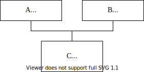

.. code:: cpp

   class A
   {
       int m_a;
   public:
       virtual void f1() { }
   };

   class B
   {
       int mb;
   public:
       virtual void f2() { }
   };

   class C : public A, public B
   {
       int m_c;
   public:
       virtual void f1() { } //перегруженный виртуальный метод для A
       virtual void f2() { } //для B
   };

   int main()
   {
       C с(4, 5, 6);
       A* pA = &с; //адрес объекта C совпадает с адресом его базовой
                   //части A ⇒ указатель на vftab — первое данное с 
                   //нулевым смещением
       B* рВ = &с;//адрес объекта C не совпадает с адресом его базовой 
                  //части B ⇒ но указатель на vftab — это снова первое 
                  //данное с нулевым смещением
       pA->f1(); //посредством C(для A)::vftab
       рВ->f2(); //посредством C(для B)::vftab
       ...
   }

.. image:: media/image38.svg

.. image:: media/image39.svg

.. image:: media/image40.svg

Таблиц виртуальных функций две. Обе содержат адреса виртуальных функций
производного класса. Поэтому при обращении и по ``A*`` компилятор
«видит» часть подобъекта ``A`` и таблицу виртуальных функций ``C`` (для
``A``), а при обращении по ``B``\ \* часть подобъекта ``B``, но таблицу
виртуальных функций ``C`` (для ``B``).

Проблемы, возникающие при множественном наследовании
----------------------------------------------------

Множественное наследование предоставляет ряд очевидных преимуществ +
большое количество «подводных камней», поэтому такие библиотеки как MFC
(и такие языки как С#) множественное наследование практически (во всяком
случае явно) не используют. Проблемы: (Прим. редактора: какие
проблемы???)

Замечание: в случае множественного наследования базовый класс нельзя
указывать при объявлении производного более одного раза:

.. code:: cpp

   class А { ... };
   class В : public A, public А { ... }; //ошибка

Но тем не менее, базовый класс может косвенно передаваться производному
более одного раза, например:

.. code:: cpp

   class Rect
   {
       ...
   protected:
       int left, right, top, bottom;
   };
   class ColoredRect : public Rect { ... };
   class RoundRect : public Rect { ... };
   class ColoredRoundRect : public ColoredRect, public RoundRect
   {
       int GetLeft();
   };

При такой иерархии классов базовая часть Rect будет входить в объект
производного типа ``ColoredRoundRect`` дважды:

.. image:: media/image41.svg

.. code:: cpp

   int ColoredRoundRect::GetLeft()
   {
       //return left; //ошибка. Так как объект класса ColoredRoundRect
                      //содержит два подобъекта класса Rect, доступ к 
                      //члену данных left неоднозначен!

       return ColoredRect::value; //для устранения неоднозначности 
                                  //следует уточнить с помощью 
                                  //оператора разрешения области 
   }                              //видимости «путь наследования»

Наличие в дереве наследования нескольких экземпляров одного и того же
базового класса вредно (не только вносит путаницу, но и приводит к
излишним затратам памяти). Объявление базового класса в списке
наследования виртуальным решает эту проблему. Подобное объявление
предписывает компилятору создавать единственный подобъект базового
класса. При этом виртуальные базовые классы реализуются посредством
указателей ⇒ объект типа ``ColoredRoundRect`` компилятор формирует
ссовсем уж причудливым образом:

.. image:: media/image42.svg

.. image:: media/image43.svg

.. code:: cpp

   class Rect { ... };
   class ColoredRect : virtual public Rect { ... };
   class RoundRect : virtual public Rect { ... };
   class ColoredRoundRect : public ColoredRect, public RoundRect
   {
       int GetLeft();
   };

Тема XI. Механизм RTTI (run-time type identification)
=====================================================

Оператор ``static_cast`` и указатели на классы связанные наследованием
----------------------------------------------------------------------

Неявное приведение указателя на объект производного типа к указателю на
объект базового типа компилятор прекрасно выполняет сам, так как
производный класс содержит полные определения своих базовых классов.
Такое **повышающее (upcast)** приведение типа всегда безопасно!

.. code:: cpp

   B b;
   A* pA = &b;

Верно и следующее утверждение: если объект на самом деле является
объектом производного типа, а в нашем распоряжении имеется указатель на
базовый класс, то корректным должно являться и преобразование указателя
«вниз» по иерархии классов вплоть до преобразования такого указателя к
указателю на фактический (целевой) тип — **понижающее приведение
(downcast)**.

Для приведения указателя на базовый тип к указателю производного типа
можно использовать оператор явного приведения типа ``static_cast`` — это
механизм времени компиляции!

Пример:

.. raw:: html

   <!-- Что за класс D? -->

.. code:: cpp

   //классы A и В связаны наследованием
   class A
   {
       ...
   };
   class B : public A
   {
       ...
   };
   //C — «автономный» класс
   class C
   {
       ...
   };
   //Глобальная функция, принимающая указатель базового типа
   void F(A* рА) //посредством такого указателя можно: — вызвать 
                 //virtual-функцию целевого класса — вызвать обычный 
                 //метод базового класса оперировать данными базового 
                 //класса
   { //но если нужно вызвать обычный метод производного класса или 
     //обратиться к данным производного класса, то нужен указатель В*:
       B* pB = static_cast<B*>(рА);//с точки зрения компилятора все 
                                   //корректно, так как классы связаны 
                                   //наследованием!
       pB->fB();
   }
   int main()
   {
       B b;
       F(&b);//компилятор преобразует адрес В* к A* — это всегда 
             //корректно
   //Классы A и C не связаны наследованием, поэтому компилятор не 
   //допустит такой ситуации
       C c;
       //F(&c); //ошибка компилятора — такого преобразования нет!
       //Но!
       A а;
       F(&а); //ошибки компилятора нет, но результат некорректный, так 
              //как на самом деле объект A, а не В!
   }

Замечание: компилятор проверяет только тот факт, что

-  оба класса связаны наследованием;
-  наследование открытое (``public``).

Поэтому компилятор считает такое приведение корректным. А на самом деле
такое преобразование небезопасно! Поэтому возникла необходимость в
способе проверки возможности такого преобразования.

   Замечание: static_cast обычно используется для неполиморфных типов (в
   классах нет виртуальных функций).

Динамическая идентификация типа
-------------------------------

.. image:: media/image44.svg

RTTI характеризуется тремя понятиями:

-  оператор ``dynamic_cast`` — для преобразования указателей или ссылок
   полиморфных типов

-  оператор ``typeid`` — для определения точного (exact) типа объекта во
   время выполнения

-  класс ``type_info`` — (это то, что возвращает оператор ``typeid``)

Подключение RTTI
~~~~~~~~~~~~~~~~

Для подключения RTTI (так как механизм дорогой и просто так работать не
будет!):

-  в опциях проекта ``Project > Properties > C/C++ > Language`` — должен
   быть включен флаг ``Enable Run-Time Type info`` (тогда в опциях
   командной строки компилятору будет указан ключ ``/GR``).

-  ``#include <type_info>`` — объявлен класс ``type_info``

-  механизм работает только для полиморфных классов.

Оператор ``typeid`` и класс ``type_info``
~~~~~~~~~~~~~~~~~~~~~~~~~~~~~~~~~~~~~~~~~

Идентификация типов позволяет получить информацию об объектах во время
выполнения. Это означает, что кто-то и где-то должен эту информацию
сформировать, а именно

1. отвести память (где?)

2. сформировать данные (какие?)

3. обеспечить механизм использования этой информации (как?).

Логично:

1. сколько бы объектов класса X мы не создавали, достаточно хранить
   информацию собственно о типе X в единственном экземпляре в каждом
   классе ⇒ для каждого класса компилятор создает объект типа
   ``type_info``

2. должен существовать способ получения этой информации для каждого
   объекта ⇒

   1. явно доступ к объекту ``type_info`` можно получить при помощи
      оператора ``typeid``

   2. неявно — посредством оператора ``dynamic_cast``.

3. Что существует в единственном экземпляре для всех объектов? —
   статические переменные или таблица виртуальных функций. В
   спецификации языка сказано, что получение этой информации
   гарантируется только для полиморфных типов (то есть если есть хотя бы
   одна виртуальная функция). Данные RTTI выполняют примерно ту же
   задачу, что и таблица виртуальных функций ⇒ для поддержки RTTI была
   использована именно таблицы виртуальных функций класса. Например
   индекс 0 в таблице может содержать указатель на объект ``type_info``:

.. image:: media/image45.svg

При такой реализации память будет тратиться только на добавление еще
одной ячейки в каждую таблицу виртуальных функций + выделение памяти для
хранения объекта ``type_info`` для каждого класса.

1.1.25. Формат ``type_info``
^^^^^^^^^^^^^^^^^^^^^^^^^^^^

Заголовочный файл ``type_info``:

.. code:: cpp

   class type_info
   {
   public:
       virtual ~type_info();
       int operator==(const type_info& rhs) const;
       int operator!=(const type_info& rhs) const;
       int before(const type_info& rhs) const; //не только
           //непосредственного предка, но и любого в иерархии!
       const char* name() const; //имя, которое дал программист
                                 //(human-readable)
       const char* raw_name() const; //декорированное имя
   private:
       type_info(const type_info&);
       type_info& operator=(const type_info&);
       ...
   };

Основные возможности:

-  перегружены операторы ``==`` и ``!=``.

-  методы для получения имени класса.

-  программисту запрещено самому создавать, копировать и присваивать
   объекты такого класса, так как все соответствующие методы являются
   защищенными

..

   Замечание: единственной возможностью получить доступ к информации
   явно (и только для чтения) — является оператор typeid.

Оператор присваивания тоже защищен ⇒ присваивать объекты типа type info
компилятор Вам тоже не позволит!

1.1.26. Формы оператора ``typeid``
^^^^^^^^^^^^^^^^^^^^^^^^^^^^^^^^^^

.. code:: cpp

   const type_info& typeid(тип)
   const type_info& typeid(выражение)

Так как определение типа имеет смысл только при наследовании, примеры
привожу на простенькой иерархии:

.. code:: cpp

   class A
   {
   public:
       virtual void f() { }
   };
   class B : public A { };

В качестве выражения может использоваться:

1. ссылка на класс

   .. code:: cpp

      B b;
      A& ra = b;
      cout << typeid(ra).name(); //"class B"

   При этом даже если в качестве выражения фигурирует ссылка на базовый
   класс, результат ``typeid``-оператора — ``const type_info&`` целевого
   класса.

2. Использовать в качестве выражения непосредственно объект можно, но
   смысла не имеет

3. разыменованный указатель (при этом, если значение указателя ``==0``,
   вырабатывается исключение ``bad_typeid_exception``)

   .. code:: cpp

      A* рA = new B;

      cout << typeid(*pA).name();//"class B"

4. Не имеет смысла в качестве выражения использовать указатель, так как
   оператором ``typeid`` будет возвращено ``type_info`` типа указателя

   .. code:: cpp

      cout << typeid(pA).name();//"class A*"

      cout << typeid(pB).name();//"class B*"

Замечания:

1. 

   -  если используется недействительный указатель

   -  или код не был скомпилирован с ключом ``/GR`` вырабатывается
      исключение типа ``non_rtti_object``

2. для совместимости с базовыми типами компилятор для каждого базового
   типа создает объект ``type_info``, поэтому для базовых типов тоже
   можно использовать оператор ``typeid``:

   .. code:: cpp

      if (typeid(n) == typeid (int)) ...

3. оператор ``typeid`` может быть использован для получения объекта
   ``type_info`` для параметра шаблона (глава «Обобщенное
   программирование»)

Пример использования оператора ``typeid``
~~~~~~~~~~~~~~~~~~~~~~~~~~~~~~~~~~~~~~~~~

Дана иерархия классов:

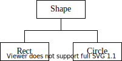

.. code:: cpp

   class Shape
   {
   public:
       virtual void F() = 0;
   };
   class Rect : public Shape
   {
   public:
       virtual void F() { cout << "I'm Rect" << endl; })
   };
   class Circle : public Shape
   {
   public:
       virtual void F() { cout << "l'm Circle" << endl; }
   };

Функция — фабрика фигур, которая случайным образом генерирует
динамический объект одного из производных типов и возвращает указатель
базового типа:

.. code:: cpp

   Shape* Make()
   {
       switch (rand() % 2)
       {
       case 0: return new Rect; 
       case 1: return new Circle;
       }
   }

Требуется посчитать, сколько прямоугольников и сколько кружков создала
функция и при создании любого объекта вывести тип созданной фигуры.

.. code:: cpp

   int main()
   {
       const int n = 10;
       Shape* ar[n];
       int nRects = 0, nCircles = 0; //здесь подсчитаем — сколько чего
                                     //«насоздавалось»
       for (int i = 0; i < n; i++)
       {
           ar[i] = Make(); //создание очередного объекта 
           cout << typeid(*ar[i]).name() << endl; //диагностика что
                                                  //создали
           if (typeid(*ar[1]) == typeid(Rect)) nRects++; //подсчет
           else nCircles++;
       }
       for (int i = 0; i < n; i++)
       {
           delete ar[i];
       }
   }

**Использование других возможностей класса ``type_info``** — определение
порядка следования классов в иерархии наследования. Задана иерархия
классов:

.. code:: cpp

   class A { ... virtual ... };
   class B : public A { ... };
   class C : public B { ... };
   int main()
   {
       B* рВ = new C;
       A* рА = рВ;
       if (typeid(A).before(typeid(*рА))) ... //???
       if (typeid(B).before(typeid(*pA))) ... //???
       if (typeid(C).before(typeid(*pA))) ... //???
       if (typeid(B).before(typeid(*pB))) ... //???
       ...
   }

Оператор ``dynamic_cast``
~~~~~~~~~~~~~~~~~~~~~~~~~

Необходимость RTTI обусловлена тем, что при компиляции не всегда есть
возможность выяснить: на какой целевой объект указывает указатель
базового типа (или ссылается ссылка базового типа).

Восстановление «потерянного» типа объекта требует, чтобы была
возможность «спросить» объект о его типе, а также должна быть операция
преобразования типа, которая возвращала бы корректный указатель, если
объект действительно имеет целевой тип, или «сообщала» о невозможности
преобразования.

Формат:

.. code:: cpp

   dynamic_cast<T*>(pointer) //возвращает указатель типа Т*, если
                             //преобразование корректно, или 0
   dynamic_cast<T&>(reference) //возвращает ссылку типа Т& если
                               //преобразование корректно, или 
                               //вырабатывает исключение std::bad_cast

Модифицируем предыдущий пример:

.. code:: cpp

   int main()
   {
       const int n = 10;
       Shape* ar[n];
       int nRects = 0, nCircles = 0; //здесь подсчитаем — сколько чего 
                                     //«насоздавалось»
       for (int i = 0; i < n; i++)
       {
           ar[i] = Make(); //создание очередного объекта
           cout << typeid(*ar[1]).name() << endl;//диагностика — что
                                                 //создали
           if (dynamic_cast<Rect*>(ar[i])) nRects++;//подсчет
           else nCircles++;
       }
       for (int i = 0; i < n; i++)
       {
           delete ar[i];
       }
   }

Оператор ``dynamic_cast`` используется для проверки возможности
приведения, поэтому:

.. code:: cpp

   class А { ... virtual ... };
   class B : public А { ... };
   class C : public B { ... };
   int main()
   {
       А* pA = new C;
       B* pB = dynamic_cast<B*>(pA); //!=0
       C* pC = dynamic_cast<C*>(pA); //!=0
       delete pA;
   }

..

   Замечание: ``dynamic_cast`` не работает с ``void*``-указателями

Операторы typeid и ``dynamic_cast`` и наследование
~~~~~~~~~~~~~~~~~~~~~~~~~~~~~~~~~~~~~~~~~~~~~~~~~~

Продемонстрируем разницу в использовании операторов ``typeid`` и
``dynamic_cast``. Напоминаю: оператор ``typeid`` используется для
определения точного типа, а ``dynamic_cast`` для проверки возможности
приведения.

Задана иерархия классов:

.. code:: cpp

   class A { ... virtual ... };
   class B : public A { ... };
   class C : public B { ... };
   int main()
   {
       A* pA = new C;
       C* pC = dynamic_cast<C*>(pA);//!=0
       B* pC = dynamic_cast<B*>(pA); //!=0
       //Но!!!
       bool b = typeid(*pA) == typeid(C);//true
       b = typeid(*pA) == typeid(B);//false
   }

При множественном наследовании механизм RTTI тоже работает, так как в
объекте ``type_info`` есть вся информация как о производном типе, так и
обо всех предках:

Задана иерархия классов:

.. code:: cpp

   class A { ... virtual ... };
   class B { ... virtual ... }
   class C : public A, public B { ... };
   int main ()
   {
       A* pA = new C;
       C* pC = dynamic_cast<C*>(pA);//!=0
       B* pB = dynamic_cast<B*>(pA); //!=0
   }

Когда возникает необходимость RTTI
----------------------------------

Например, при использовании сторонней библиотеки классов Вы наследуете
свои специализированные производные классы от классов, предоставляемых
библиотекой. Работа с библиотечными классами поддерживается каркасом
приложения, НО! Библиотека ничего не знает о Вашей специализированной
производной части. Поэтому может возникнуть следующая ситуация: Вы
создали объект своего (производного) типа, «передали» его для выполнения
базовой работы каркасу приложения (при этом информация о производной
части потеряна), а потом каркас приложения может вызвать виртуальный
метод другого Вашего производного класса, передавая в качестве параметра
ссыпку или указатель базового типа на Ваш объект. Обратите внимание! —
при этом естественным образом теряется информация о пользовательском
специализированном типе ⇒ возникает необходимость восстановить целевой
тип, чтобы пользоваться спецификой производной части объекта.

.. image:: media/image47.svg

Тема XII. Исключительные ситуации (exceptions)
==============================================

Что такое исключительные ситуации
---------------------------------

При написании сколько-нибудь серьезных приложений большую роль играет
обработка всевозможных ошибочных ситуаций, которые могут возникнуть во
время работы приложения. Ошибочные ситуации можно разделить на две
большие категории:

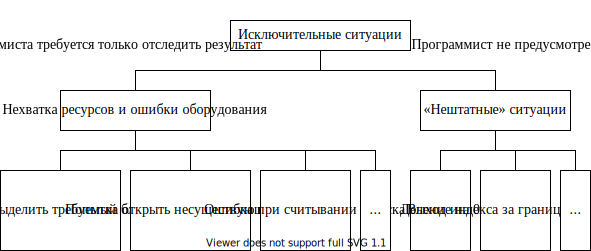

Если Ваше приложение не отреагирует на такую ситуацию, то, скорее всего
Вы увидите сообщение **«Unhandled exception»**, Ваше приложение будет
аварийно завершено,… а Вашу программу вряд ли кто-нибудь купит.

.. image:: media/image49.svg

**Проблема** возникает тогда, когда **в месте возникновения ошибочной
ситуации у Вас «нет контекста» для ее разрешения**. Обычно ситуация
«нелокальных» проблем появляется в случае разработки большого проекта
несколькими программистами или использования независимо разработанных
библиотек. При этом может возникнуть следующая ситуация:

.. image:: media/image50.svg

То есть автор вызываемого модуля может обнаружить «неприятности» во
время выполнения, но, как правило, не имеет представления о том. что
делать в этом случае. Автор вызывающего модуля может знать, как
поступить в случае возникновения ошибок, но не в состоянии их
обнаружить.

Если же «вложенность» вызовов функций значительна, то возникновение
исключительной ситуации может возникнуть на нижнем уровне, а обработка
ошибки должна быть произведена на самом верхнем уровне:

.. image:: media/image51.svg

Замечание 1: Но! Механизм обработки исключений дорогой ⇒ Следует
отметить, что целью обработки исключений является решение
**«нелокальных»** по своей природе проблем. Поэтому, если проблема может
быть решена локально, почти всегда так ее и следует решать.

Обработку исключений имеет смысл использовать тогда, когда можно
восстановить (починить) программу для продолжения работы.

Замечание 2: существуют два уровня обработки исключений:

-  структурная обработка исключений (SEH) — используется в основном для
   обработки hardware-ных исключительных ситуаций (деление на 0,
   обращение по недействительному адресу…);

-  обработка исключений C++

Способы отслеживания «аварийных» ситуаций
-----------------------------------------

Прекращение выполнения программы
~~~~~~~~~~~~~~~~~~~~~~~~~~~~~~~~

Прекращение выполнения всей программы при возникновении нештатной
ситуации — это крайняя мера. Поэтому еще в древние времена (до развития
формальной модели обработки исключений) программисты боролись с
непредвиденными ситуациями множеством неструктурированных способов,
пытаясь, во что бы то ни стало продолжить выполнение своей программы.

Возвращение функцией значения статуса (кода завершения)
~~~~~~~~~~~~~~~~~~~~~~~~~~~~~~~~~~~~~~~~~~~~~~~~~~~~~~~

Замечание: этот подход прост и достаточно эффективен ⇒ никто его не
отменяет для решения локальных нештатных ситуаций.

Функция может возвращать некоторое значение в случае успешного
завершения (например, ненулевое значение) и определенное (нулевое)
значение в случае ошибки. При таком подходе вызываемая функция
обнаруживает ошибку, а вызывающая эту ошибку должна обрабатывать. Это
означает, что программист каждый раз после вызова функции должен
осуществлять проверку кода завершения, анализировать тип ошибки,
обрабатывать данный тип ошибки. Если представить себе пример с
N-вложенным вызовом функций, то становится очевидным, что
**программист-зануда** погрязнет в скрупулёзной обработке всех возможных
ошибок (а его программа разрастется так, что большая часть кода окажется
посвященной обработке неожиданных ситуаций, а не ожидаемых). В той же
ситуации **среднеответственный программист** пренебрежет обработкой
большей части ошибок, рассчитывая только на штатные ситуации…

Кроме того если для обработки ошибки не обойтись одним возвращаемым
значением (то есть важен не только сам факт возникновения ошибки, но и
ее тип)? Для запоминания типа ошибки обычно использовалась глобальная
переменная (например, errno содержит код ошибки).

Статус завершения системных вызовов
~~~~~~~~~~~~~~~~~~~~~~~~~~~~~~~~~~~

В стандартной библиотеке есть глобальная переменная errno, которая
предназначена для формирования кода системных ошибок. В принципе, любой
системный вызов это значение формирует, но так как переменная
глобальная, код ошибки можно получить только непосредственно после
вызова системной функции.

Выявление ошибок в Debug-версии
~~~~~~~~~~~~~~~~~~~~~~~~~~~~~~~

Диагностический макрос ``assert`` — хорош для выявления тех ошибок,
которые зависят от программиста, но не спасает от ошибок времени
выполнения.

Обработка ошибок с помощью функций обратного вызова
~~~~~~~~~~~~~~~~~~~~~~~~~~~~~~~~~~~~~~~~~~~~~~~~~~~

Вызывающая функция (клиент) передает вызываемой (серверу) указатель на
другую клиентскую функцию, которую сервер должен вызвать в случае
возникновения ошибки.

Замечание: этот прием часто используется при использовании системных
сервисов — смысл в том то в качестве одного из параметров функции или
каким-нибудь еще способом (в качестве поля структуры) передается адрес
пользовательской функции — функции обратного вызова (callback).

В C++ эта технология, например, используется для обработки отказов при
динамическом распределении памяти. Функция ``set_new_handler()``
позволяет Вашей программе установить Ваш специализированный обработчик
ситуации, который будет вызываться системой в случае нехватки памяти
вместо стандартного. Причем, «подменять» стандартный обработчик своим
можно только на некоторое (потенциально опасное) время. Например:

.. code:: cpp

   #include <new>
   size_t BIG_NUMBER = 0xfffffff;
   int* p;
   void my_handler(void)
   {
       //Ваш обработчик
       BIG_NUMBER /= 2;
   }
   int main()
   {
       void (*old_handler)(void) = std::set_new_handler(my_handler);
           //установили свой обработчик
       p = new int[BIG_NUMBER]; //если памяти не хватает, будет вызван 
                                //Ваш обработчик, где Вы постараетесь 
                                //справиться с ситуацией
       std::set_new_handler(old_handler); //восстановили прежний 
                                          //обработчик
   }

Замечание: по умолчанию указатель, возвращаемый ``set_new_handler``,
равен нулю.

Выполнение глобального перехода при возникновении ошибки
~~~~~~~~~~~~~~~~~~~~~~~~~~~~~~~~~~~~~~~~~~~~~~~~~~~~~~~~

Функция ``setjmp()`` позволяет программисту запомнить точку возврата и
состояние программы на момент выполнения ``setjmp()`` в структуре
предопределенного вида. Функция ``longjmp()`` позволяет вернуть
управление посредством сохраненных данных в структуре ``jmp_buf``.

.. code:: cpp

   //client.срр
   #include <csetjmp>
   jmp_buf buf;
   int main()
   {
       int ret = setjmp(buf);
   }

*При этом она корректно восстанавливает стек*. Неудобство — буферов
может быть много…

Будучи перенесена в C++, функция ``longjmp()`` приобрела один
существенный недостаток — она не вызывает деструкторы локальных
объектов.

Малоизвестная и малоиспользуемая часть старой стандартной библиотеки С
~~~~~~~~~~~~~~~~~~~~~~~~~~~~~~~~~~~~~~~~~~~~~~~~~~~~~~~~~~~~~~~~~~~~~~

Функции

``signal()`` — для определения — что произошло

``raise()`` — для генерации события

Поведение по умолчанию ``signal`` означает аварийное завершение
программы с кодом 3. Проблема — та же самая + номера ошибок должны быть
уникальными.

Встроенные средства C++ для обработки исключений (C++ exception handling)
-------------------------------------------------------------------------

Все перечисленные выше способы обработки представляют собой набор
разнородных средств, предназначенных для решения разных аварийных
ситуаций.

Встроенная поддержка обработки исключений в С++ появилась сравнительно
недавно. Достоинствами механизма обработки исключительных ситуаций
являются:

-  обработку нештатных ситуаций все равно предусмотреть нужно, ситуации
   разные, а способ борьбы с ними **унифицирован**.

-  **структура** текста программы улучшается. Программист может отделить
   написание рабочего кода (основная работа) от написания обработки
   нештатных ситуаций (и отложить это рутинное удовольствие «на потом»,
   то есть предполагается, что к этому можно вернуться и позже)

Идея — нужно передать управление и информацию об ошибке из того места,
где она возникла, туда, где она может быть обработана (минуя все
промежуточные инстанции)! — Похоже на посылку сообщения

Если обработка исключений не предусмотрена, при возникновении любого
исключения программа будет завершена аварийно!!!

.. image:: media/image52.svg

Язык C++ включает встроенные средства для обработки аномальных ситуаций
(exceptions), возникающих во время выполнения программы - операторы
``throw``, ``catch``, ``try``. Оператор try открывает блок кода, в
котором может произойти ошибка. Если ошибка произошла, то оператор
``throw`` вызывает исключение. Обработчик исключения представляет собой
блок кода, который начинается оператором ``catch``.

Если предусмотреть обработку исключений:

.. image:: media/image53.svg

Оператор ``throw`` — сравнение с ``return``
~~~~~~~~~~~~~~~~~~~~~~~~~~~~~~~~~~~~~~~~~~~

Оператор ``throw`` очень похож на инструкцию ``return``, но главные
отличия:

-  **куда** происходит передача управления!!!

-  **где** вызываются деструкторы для всех промежуточных стековых
   объектов, которые были созданы на момент генерации исключения (в
   частности локальных объектов вызываемой функции)

-  **как** передается объект-исключение и где вызывается для
   объекта-исключения деструктор

.. image:: media/image54.svg

Способы передачи объекта-исключения:

-  по значению:

   1) — неэффективно, так как в месте генерации исключения вызывается
      конструктор копирования

   2) если генерируем объект В, а принимаем А, то конструктор
      копирования только базовой части ⇒ в обработчике можем
      пользоваться только базовой частью объекта-исключения

   3) внутри обработчика работа с копией

-  по указателю (объект-исключение автоматически при выполнении throw не
   копируется):

   1) адрес локального объекта — плохо, так как для него будет вызван
      деструктор до выполнения тела обработчика

   2) адрес динамического объекта плохо, так как нет уверенности, что в
      обработчике программист — delete

   3) стандартные исключения можно принять только по значению или по
      ссылке

-  по ссылке — в месте генерации исключения передается адрес
   объекта-исключения, но деструктор для него будет вызван только по
   закрывающей скобке обработчика

**в обработчике получаем адрес объекта целевого типа, даже если
принимаем ссылку на базовый тип ⇒ всегда возможен вызов виртуальных
методов!**

Операторы ``try`` и ``catch``
~~~~~~~~~~~~~~~~~~~~~~~~~~~~~

Функция, которая собирается обрабатывать ошибку, должна:

1. объявить блок, в котором эта ошибка может возникнуть — блок ``try``.

   .. code:: cpp

      try
      {
          ...
      }

2. сообщить компилятору какие ошибки ожидаются и как она собирается
   обрабатывать — обработчики исключений (``catch``).

Замечание: непосредственно за try должен следовать хотя бы один
обработчик — ``catch``

Конструкция

.. code:: cpp

   catch(тип переменной исключения [имя формального параметра])
   {
       ...
   }

называется обработчиком исключения. Она может и должна использоваться
только сразу после блока ``try`` или после другого обработчика
``catch``.

Пэ синтаксису объявление оператора ``catch`` похоже на определение
функции, в котором обязательными являются типы аргументов, а имена
аргументов должны присутствовать только если данный аргумент
«задействован» в коде функции.

Пример
~~~~~~

.. code:: cpp

   class Array
   {
       int m_ar[10];
   public:
       int& operator
       {
           if (i >= 0 && i < 10) return m_ar[i];
           else throw "Index out of range";
               //Синтаксически оператор throw похож на оператор return.
       } 
   };
   int main()
   {
       Array ar;
       try
       {
           ar[10] = 1;
       } catch (const char* error)
       {
           cout << error << endl; //программисту предупреждение
       }
       //выполнение программы продолжается
   }

Основная идея состоит в том, что ``Array::operator[]``, обнаружившая
проблему, которую она не в состоянии решить, генерирует (``throw``)
исключение, чтобы вызывающая функция «не затерла» что-нибудь за
пределами выделенной памяти.

Обычно одной диагностики о произошедшей ситуации недостаточно Например,
в нашем случае неплохо:

-  сообщить в вызывающую функцию значение «некорректного» индекса -
   ``throw i``;

-  вырабатывать исключение более сложного типа, чтобы в объекте такого
   типа можно передать гораздо больше информации

.. code:: cpp

   struct MyArrayError
   {
       int m_wrongIndex;
       int m_High;
       MyArrayError(int n, int c) { m_wrongIndex = n; m_High = c; }
   };
   class Array
   {
       int m_ar[10];
   public:
       int& operator
       {
           if (i >= 0 && i < 10) return m_ar[i];
           else throw MyArrayError(i, 10);
       }
   };
   int main()
   {
       Array ar;
       try
       {
           ar[10] = 1;
       } catch (MyArrayError& error)
       {
           cout << "index out of range" << error.m_wrongIndex
                << "index must be >= 0 or < " << error.m_High << endl;
       }//вызывается деструктор для объекта-исключения
   }

Обработка нескольких типов исключений
~~~~~~~~~~~~~~~~~~~~~~~~~~~~~~~~~~~~~

Обычно в программе в процессе выполнения может возникнуть не одна, а
несколько ошибочных ситуаций разного типа. Хорошей практикой является
для каждой такой ситуации определить свой тип исключения. В общем случае
структура блока программы, в котором могут возникнуть исключения,
выглядит следующим образом:

.. code:: cpp

   struct Above
   {
       int m_wrongIndex;
       int m_High;
       Above(int n, int c) { m_wrongIndex = n; m_High = c; }
   };
   struct Below
   {
       int m_wrongIndex;
       Below(int n) { m_wrongIndex = n; }
   };

   int& Array::operator
   {
       if (i <= 0) throw Below(i);
       if (i > 10) throw Above(i, 10);
       return m_ar[i];
   }
   try
   {
       ...
   } catch (Above& er)
   {
       cout << ...;
   } catch (Below& er)
   {
       cout << ...;
   }

Замечания:

-  каждый обработчик соответствует своему конкретному типу ошибки ( то
   есть при возникновении ошибки данного типа, управление будет передано
   именно сюда).

-  В скобках любого оператора ``catch`` указывается тип объекта, который
   может быть перехвачен данным обработчиком.

-  Если нет соответствующего обработчика, вызывается ``unexpected``

-  Обработчики «просматриваются» в том порядке, в котором их привел
   программист, поэтому в том случае, когда типы исключений связаны
   наследованием, обработчик с объектом исключения производного типа
   должен предшествовать обработчику с исключением базового типа.

-  Можно предусмотреть обработку всех явно не указанных в обработчиках
   ``catch`` типов исключений посредством:

   .. code:: cpp

      catch (...)
      {
          cout << "Something is wrong!";
      }

Замечание: если существует такой обработчик «по умолчанию», он должен
быть последним в списке обработчиков

Обработчики исключений могут
~~~~~~~~~~~~~~~~~~~~~~~~~~~~

1. вызвать ``abort()``, если ситуацию поправить невозможно

2. повторно сгенерировать то же самое исключение — то есть передать его
   выше

   .. code:: cpp

      catch (...) { throw; } //rethrow

3. обработать на своем уровне текущее исключение, а для уровня «выше»
   сгенерировать другое исключение (запаковать другую информацию)

   .. code:: cpp

      catch (My1& х) { ... throw Му2(); ... }

4. выполнить любое восстановительное действие и продолжить работу
   программы

   .. code:: cpp

      int I = 0;
      int BIG = 0x7fffffff;
      double** p = 0;
      try
      {
          p = new double* [BIG];
          for (; I < BIG; I++) p[I] = new double[BIG];
      } catch (bad_ailoc& er)
      {
          //Можно использовать только то, для чего удалось выделить
          //память!!!
          BIG = I;
      }

5. удалить причину ошибки и повторить вызов функции, вызвавшей ошибку

6. освободить ресурсы (например, память) и продолжить выполнение

   .. code:: cpp

      int I = 0;
      int BIG = 0x7fffffff;
      double** p = 0;
      try
      {
          p = new double* [BIG]; for (; I < BIG; I++) p[I] = new
              double[BIG];
      } catch (bad allocs er)
      {
          //Все, что удалось захватить, нужно освободить!!!
          if (р)
              for (int i = 0; i < I; i++)
                  delete[] p[i];
          delete[] p;
      }

Function-level ``try``-блок
~~~~~~~~~~~~~~~~~~~~~~~~~~~

Можно все тело функции заключить в блок ``try``. При этом
последовательность выполнения кода отмечена цифрами 1-2-3

.. code:: cpp

   void MyEr(void) try
   {
       throw "error"; //1
   } catch (const char* p)
   {
       std::cout << p; //2
   }
   int main()
   {
       MyEr();
       //3
   }

Последовательность выполнения кода и выбор исключений
-----------------------------------------------------

-  Если код в ``try``-блоке (или код функции, вызываемой из этого блока)
   генерирует исключение, будут проверяться обработчики данного блока
   ``try``. Остаток блока ``try`` игнорируется!!!

-  Если сгенерированное исключение имеет тип. указанный в одном из
   обработчиков, будет выполнен этот обработчик.

-  Если исключение не генерируется, то все обработчики игнорируются.

-  Если исключение сгенерировано, и ни один обработчик не перехватил
   его, выполнение программы прекращается специальной функцией
   стандартной библиотеки — ``unexpected``

.. code:: cpp

   try
   {
       func();
       //мы попадем сюда только в том случае, если func() не возбудит
       //исключения
       ...
   } catch (TYPE1& er)
   {
       //обработка исключения типа TYPE1
   } catch (TYPE2& er)
   {
       //обработка исключения типа TYPE2
   }
   //сюда мы попадем, если a) func() не сгенерировала исключения,
                          //б) сгенерированы исключения типа TYPE1 или 
                          //TYPE2, а обработчики этих исключений в свою 
                          //очередь не сгенерировали исключения или 
                          //некоторым другим способом не изменили 
                          //последовательность исполняемого кода
   //unexpected!!!

Обработка непредусмотренных исключений
~~~~~~~~~~~~~~~~~~~~~~~~~~~~~~~~~~~~~~

1. Программист может предусмотреть обработчик «по умолчанию»

   .. code:: cpp

      catch (...)
      {
          //здесь можно обработать все остальные исключения
      }

   При этом такой обработчик должен быть последним!!!

2. Что происходит, если обработка предусмотрена на другом уровне

   Если самый внутренний ``catch`` исключение не обработал, оно
   «передается» выше на следующий уровень. **Поиск продолжается до
   самого внешнего блока ``try``**

3. Что происходит, **если программист нигде не предусмотрел обработку**
   какого-то конкретного или всех исключений.

Замечание: если возникает неперехваченное исключение, никакого clean_up
не происходит (деструкторы не вызываются)

.. image:: media/image56.svg

Обработка неперехваченных исключений
~~~~~~~~~~~~~~~~~~~~~~~~~~~~~~~~~~~~

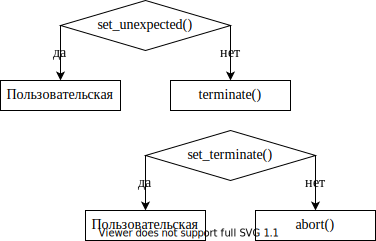

Пример:

.. code:: cpp

   #include <stdexcept>
   void my_unexpected()
   {
       cout << "I'll be back!!!" << endl;
       exit(1);
   }
   int main()
   {
       void (*рf)() = set_unexpected(my_unexpected);
       //f2();
       for (int i = 1; i <= 3; i++)
       {
           try
           {
               f1(i);
           }
           catch (A) { cout << "A" << endl; }
           catch (B) { cout << "B" << endl; }
           catch (C) { cout << "C" << endl; }
       }
       set_unexpected(pf);
   }

Спецификация исключений
~~~~~~~~~~~~~~~~~~~~~~~

Если Вы предполагаете, что Вашей функцией (вырабатывающей исключение)
может пользоваться другой программист, то

-  Вы не обязаны указывать, какого типа исключения функция вырабатывает,

-  но цивилизованный подход заключается в спецификации этих исключений.

Объявление функций с появлением механизма исключений тоже изменилось ⇒
появилось новое понятие — спецификация исключений. Пока можно
рассматривать спецификацию исключений в качестве одной из возможностей
документирования текста программы.

Замечание 1: спецификация исключений должна быть указана как при
объявлении, так и при определении функции!

Замечание 2: спецификация исключений функцию на самом деле программиста
ни к чему не обязывает, то есть, несмотря на «обещания» функция может
выработать исключение любого вида, а компилятор выдаст только
предупреждение. Исключение будет сгенерировано и по общим правилам
обработано или не обработано!!!

1. Если спецификация исключений отсутствует, функция может инициировать
   любые исключения

   .. code:: cpp

      void F(); //что угодно
      void F() throw(...); //гораздо «читабельнее» Microsoft specific

2. если Вы уверены, что Ваша функция никогда не будет инициировать
   исключения, то лучше сообщить об этом компилятору и
   пользователю-программисту

   .. code:: cpp

      void F() throw(); //не должна инициировать исключений
      void __declspec(nothrow) F(); //Microsoft specific

Тогда при попытке выработать в функции исключение компилятор выдаст
*предупреждение*:

::

   warning С4297: 'f' : function assumed not to throw an exception but does
       __declspec(nothrow) or throw() was specified on the function

Но! исключение будет все равно выработано!!!

Замечание: такая функция сама не генерирует исключения, но может
передавать дальше исключения, получаемые ею от вызываемых функций

3. функция инициирует исключения нескольких типов

   ::

      void F() throw(int, Error&, char*);

Замечание: если функция вырабатывает исключения других видов, то они все
равно будут сгенерированы, но компилятор выдаст предупреждение, а Вы
получите **«Unhandled exception»**

Замечание: если Вы объявили две функции, отличающиеся только
спецификацией исключений, то компилятор их различить не сможет:

.. code:: cpp

   void F() throw();
   void F() throw(int); //redefinition

Специфика оператора ``new``
---------------------------

В старых версиях C++ требовалось, чтобы оператор ``new`` в случае
нехватки памяти возвращал 0. Сейчас ``new`` должен генерировать
исключение ``std::bad_alloc``, но существует огромное количество кода,
написанного до изменения спецификации ⇒ поэтому на самом деле существуют
**несколько форм оператора ``new``.**

1) ``cpp     void* operator new(size_t n); //если памяти не хватает,                                    //вырабатывается исключение     void operator delete(void*);//соответствующий delete``

2) array ``new`` and ``delete``

Пример:

.. code:: cpp

   #include <new>

   {
       A* p;
       try
       {
           p = new A; //компилятор интерпретирует как
                      //p = new (sizeof(A)); генерирует std::bad_alloc
           if (p == 0) ... //Это условие не выполнится никогда!!!
       } catch (bad_alloc& a)
       {
           cout << a.what() << endl; //выведет диагностику
           p = 0;//обезопасили себя от использования недействительного 
                 //указателя
       }
       delete р;
   }

3) .. code:: cpp

      void *operator new(size_t n, const notrow t&); //если памяти не
          //хватает, возвращается нулевой указатель, а исключение не 
          //вырабатывается

4) .. code:: cpp

      void operator delete(notrow_t&, void*); //соответствующий delete

3 и 4 продолжают существовать для совместимости с предыдущими версиями
для одиночного объекта и для массива — возвращает нулевой указатель

.. code:: cpp

   {
       A* p = new(nothrow) A[2];//nothrow — это глобальный объект типа 
                                //nothrow_t
       if (p == 0) ...
       delete(nothrow, p);
   }

Исключения в конструкторах и деструкторах
-----------------------------------------

Объект не считается созданным, пока не завершится выполнение его
конструктора ⇒ для «недоделанных» объектов деструкторы не вызываются!!!

Проблема: другими способами ситуацию разрешить сложно, так как
конструкторам и деструкторам в C++ не позволено возвращать значений ⇒
если ошибка все-таки возникает именно в конструкторе, то (чтобы не
пользоваться «недоделанным» объектом) нужно как-то об этом сообщить:

-  посредством глобальных переменных

-  с помощью механизма исключений (основное преимущество — будут вызваны
   деструкторы для всех объектов, созданных в конструкторе на момент
   выработки исключения, например, если создавался массив объектов, то
   будут вызваны деструкторы только для тех элементов массива, которые
   уже удалось создать)

1) встроенные объекты (все корректно, так как для всех промежуточных
   стековых объектов будут вызваны деструкторы)

   .. code:: cpp

      class A
      {
          int m_a;
      public:
          A(int a = 0) { m_a = a; }
          ~A() { std::cout << "~A"; }
      };
      class B
      {
          int m_b;
      public:
          B(int b = 0) { m_b = b; throw 1; }
          ~B() { std::cout << "~B "; }
      };
      class C
      {
          A m_A;
          B m_B;
      public:
          C(int a, int b) :m_A(a), m_B(b) { }
          ~C() { std::cout << "~C "; }
      };
      int main()
      {
          try
          {
              C c(1, 2);
          } catch (int)
          {
              //на момент вызова обработчика гарантировано будут вызваны 
              //деструкторы для всех сконструированных на момент 
              //возникновения исключения стековых объектов. В нашем случае 
              //— только ~A
              ...
          }
      }

2) Модифицируем предыдущий пример: «голые» указатели (утечка памяти!!!)

   .. code:: cpp

      class C
      {
          A* m_pA;
          B* m_pB;
      public:
          C(int a, int b) : m_pA(new A(a)), m_pB(new B(b)) { }
          ~C()
          {
              delete[] m_pA;
              delete[] m_pB;
              std::cout << "~C ";
          }
      };
      int main()
      {
          try
          {
              C c(1, 2);
          } catch (int)
          {
              //на момент вызова обработчика гарантировано будут
              //вызваны деструкторы для всех сконструированных на
              //момент возникновения исключения стековых объектов.
              //Деструктор для C вызван не будет ⇒ память потекла!!!
          }
      }

3) Решение проблемы — все опасное заворачивать в объекты!!!

   .. code:: cpp

      class WrapA
      {
          A* m_pA;
      public:
          WrapA(int n) { m_pA = new A[n]; }
          ~WrapA() { delete[] m_pA; }
      };
      class C
      {
          WrapA wa;//вместо A* m_pA;
          B* m_pB;
      public:
          C(int a, int b) :wa(a), m_pB(new B(b)) { ... }
          ~C() { delete m_pB; std::cout << "~C "; }
      };
      int main()
      {
          try
          {
              C c(3, 2);
          } catch (int)
          {
              //на момент вызова обработчика гарантировано будут 
              //вызваны деструкторы для всех сконструированных на 
              //момент возникновения исключения стековых объектов. В 
              //нашем случае — только для WrapA ⇒ все динамически 
              //созданные А будут уничтожены!
          }
      }

..

   Рекомендация — не стоит возбуждать исключения в деструкторе, разве
   что тут же их и обработать.

Исключения и наследование
-------------------------

.. code:: cpp

   class A { ... virtual void f(); ... };
   class B : public A { ...virtual void f(); ... };

   void f()
   {
       throw B();//производного типа!!!
   }
   int main()
   {
       //Тип исключения и наследование
       try
       {
           f();
       } catch (A& a)//Выработано исключение производного типа B, а 
                     //принимается базового типа А, а управление все 
                     //рано будет передано сюда
       {
           a.f();//посредством ссылки на базовый класс вызывается 
                 //виртуальный метод целевого класса
       }
   }

Замечание 1: существенно в случае наследования принимать ссылку, так как
по значению Вы получите только копию базовой части объекта ⇒ ``a.f();``
— вызов виртуальной функции базового класса.

Замечание 2: обработчики исключений просматриваются в том порядке, в
котором их указал программист ⇒ обработчики производного типа должны
предшествовать обработчикам базового типа, иначе последние никогда не
будут выполняться!

Замечание 3: Это справедливо и для указателей!

Стандартные исключения
----------------------

На самом деле для того, чтобы придать типам исключений некоторую
структурность, в стандартной библиотеке определена иерархия классов с
базовым классом ``exception``, (все в пространстве имен ``std``). В
стандартной библиотеке определены три группы исключений:

.. image:: media/image58.svg

.. code:: cpp

   void F()
   {
       try
       {
           throw exception();//будет выведено Unknown exception
   //      throw exception("MyException");//будет выведено MyException
       } catch (exception& e)//сюда будет передано управление при 
                             //возникновении любого исключения, 
                             //производного от except
       {
           cout << e.what() << endl;
       } catch (...)//сюда все остальные — пользовательского типа, не 
                    //производные
       {
           ...
       }
   }

Вы можете:

-  использовать непосредственно эти классы исключений стандартной
   библиотеки

-  наследовать от них свои классы

-  игнорировать классы стандартной библиотеки и создавать свои

+---------------------+-------------------+---------------+
| Имя                 | Чем генерируется  | ``.h``        |
+=====================+===================+===============+
| ``bad_alloc``       | ``new``           | ``<new>``     |
+---------------------+-------------------+---------------+
| bad_cast            | ``dynamic_cast``  | ``            |
|                     |                   | <type_info>`` |
+---------------------+-------------------+---------------+
| ``bad_typeid``      | ``typeid``        | ``            |
|                     |                   | <type_info>`` |
+---------------------+-------------------+---------------+
| ``                  | функциями потоков | ``<ios>``     |
| ios_base::failure`` | ввода/вывода      |               |
+---------------------+-------------------+---------------+
| ``out_of_range``    | ``at()``          | ``            |
|                     |                   | <stdexcept>`` |
+---------------------+-------------------+---------------+
| все остальные       |                   | ``            |
|                     |                   | <stdexcept>`` |
+---------------------+-------------------+---------------+

оператор ``new``

.. code:: cpp

   void main()
   {
       int N = 0x7fffffff; //Пробуем исчерпать память
       double** p = new double* [N];
       try
       {
           int i = 0;
           for (; i < N; i++)
           {
               p[i] = new double[N];
           }
       } catch (bad_alloc&)
       {
           //i — итерация цикла, на которой память закончилась
           //освобождаем
       }
   }

``bad_cast``

.. code:: cpp

   void f(const Shape& s)//нужно проверить — на какой действительно 
                         //объект ссылается s
   {
       try
       {
           const Rect& r = dynamic_cast<const Rect&>(s);
       } catch (std::bad_cast b)
       {
           //не Rect
           ...
       }
       //Rect:
       const Rect& rRect = static_cast<const Rect&>(s);
   }

Тема XIII. Обобщенное программирование
======================================

Идеи обобщенного программирования. Зачем нужны шаблоны. Понятия, связанные с шаблонами
--------------------------------------------------------------------------------------

При создании программ довольно часто приходится писать множество
одинаковых фрагментов для обработки разных типов данных. Например:

Функция выполняет одни и те же действия, текст на языке высокого уровня
будет одинаковым, но низкоуровневый код будет зависеть от типов
параметров.

.. code:: cpp

   Т min(T х, Т у); //под Т можно подразумевать int, double, Point... -
                    //в зависимости от типа параметров компилятор 
                    //сгенерирует разные низкоуровневые команды!!!

Данные класса отличаются только типом, а реализация методов на языке
высоко уровня выглядит одинаково:

.. code:: cpp

   class Point
   {
       T х, у; //int, double, MyComplex... в зависимости от типа 
               //параметров компилятор будет резервировать разное 
               //количество памяти при создании объекта типа Point и 
               //генерировать разные тела методов класса
   };

С помощью ключевого слова ``template`` на C++ можно задать компилятору
образец кода для некоторого обобщенного типа данных — шаблон. Используя
«скелет» кода, компилятор сам сгенерирует конечный код для конкретного
типа данных.

.. image:: media/image59.svg

Объявление шаблона (общее)
~~~~~~~~~~~~~~~~~~~~~~~~~~

   .. code:: cpp

      template <список_параметров_шаблона>
          объявление_функции_или_класса,

где ``список_параметров_шаблона`` — это разделенные запятой параметры
шаблона (где фигурирует один или несколько параметров обобщенного типа).
Параметры шаблона обозначают в общем случае **«отличающиеся»** части
того кода, который будет сгенерирован компилятором по данному шаблону
(это могут быть обобщенные типы данных, константы, а также «вложенные»
шаблоны). **Могут иметь значения по умолчанию!**

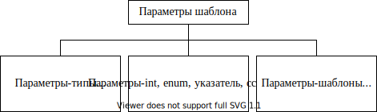

Замечания:

1) без явного (``explicit``) указания при объявлении шаблона компилятор
   не создает никакого кода, шаблон является просто заготовкой для
   компилятора. Только встретив обращение к данному шаблону (вызов
   функции или создание экземпляра класса и вызов его методов) в тексте
   программы, компилятор сгенерирует соответствующий код.

2) ключевого слово typename рекомендуется использовать вместо старого
   ``class`` (в ранних версиях ключевого слова typename просто не было).
   Пока нет причин, почему бы следовало использовать ``typename``, но
   оно выглядит понятнее (не ассоциируются только с понятием ``class``).

3) в качестве обобщенного типа можно задать как имя сложного
   пользовательского типа данных (класс), так и простой (базовый) тип

4) можно задать параметры шаблона по умолчанию. Например:

   .. code:: cpp

      template<typename A, typename В = А> ...

Термины, связанные с шаблонами
~~~~~~~~~~~~~~~~~~~~~~~~~~~~~~

Процесс генерации компилятором как функции (тела), так и объявления
класса по шаблону и списку параметров шаблона называется
инстанцированием. Например, когда компилятор в первый раз встречает
вызов функции-шаблона, он создает соответствующий код (именно для
указанных в качестве параметров шаблона типов данных) — это неявное
инстанцирование. Далее, если компилятор встречает вызов функции с теми
же типами параметров, он просто генерирует вызов к уже созданному телу
функции Более того, если даже такие вызовы находятся в разных единицах
компиляции, только одна копия тела функции будет включена в исполняемый
файл.

Версия шаблона для конкретного набора аргументов называется
специализацией.

Шаблоны функций
---------------

Способы обобщения функций, выполняющих одинаковые действия, но оперирующих данными разных типов
~~~~~~~~~~~~~~~~~~~~~~~~~~~~~~~~~~~~~~~~~~~~~~~~~~~~~~~~~~~~~~~~~~~~~~~~~~~~~~~~~~~~~~~~~~~~~~~

Если функция, оперируя данными разного типа, выполняет одинаковые по
смыслу действия, удобно и логично для такой функции иметь одно и то же
имя. Такую возможность можно реализовать двумя способами (рассмотрим на
примере функции, возвращающей минимальное из двух заданных значений):

1) с помощью «перегрузки» функций. При этом программист должен объявить
   и определить нужное количество функций с одним и тем же именем,
   которые в нашем примере отличаются только типом параметров:

   .. code:: cpp

      //min for ints
      int min(int a, int b) { return (a < b) ? a : b; }
      //min for doubles
      double min(double a, double b) { return (a < b) ? a : b; }
      //etc...

   При этом компилятор сгенерирует в точке вызова функции min() вызов
   одной из определенных функций в зависимости от типа параметров:

   .. code:: cpp

      {
          int iX = 1000, iY = 500;
          int iResult = min(iX, iY); //вызов min(int, int)
          double dX = 1.0, dY = 3;
          double dResult = min(dX, dY); //вызов min (double, double)
      }

2) с помощью макроподстановки

   .. code:: cpp

      #define min(a,b) (a < b) ? a : b

   Что гораздо «опаснее», так как макроподстановка — это всего лишь
   подстановка текста препроцессором

   a) типы параметров ``a`` и ``b`` макроса могут быть разными, ⇒
      компилятор может неявно привести типы так, как посчитает нужным,
      или не сможет привести и выдаст ошибку, но покажет на ошибку в
      теле макроса (и разобраться в чем дело будет достаточно трудно)

   b) некоторых «неожиданностей» при использовании макросов можно
      избежать с помощью скобок ``(a) < (Ь) ? (a) : (Ь)`` — например:
      без скобок вызов макро ``min(x & y, z)`` препроцессор превратит в
      ``х & (у < b)``. а задумано было ``(х & у) < Ь``

   c) некоторых побочных эффектов даже при использовании скобок избежать
      не удастся:

      .. code:: cpp

         int r = min(a++, b++); //превратится в
                                //(a++) < (Ь++) ? (a++) : (b++)

3) с помощью шаблона функции можно

   a) уменьшить количество «дублируемого» кода, определив только один
      шаблон, оперирующий с некоторым обобщенным типом данных — ``Т``,

   b) шаблон лишен недостатков макроподстановок, так как тело функции по
      шаблону реализуется компилятором, который прекрасно знает
      семантику C++ (например, параметр шаблона гарантированно
      вычисляется только один раз).

3.1. Объявление шаблона функции:
^^^^^^^^^^^^^^^^^^^^^^^^^^^^^^^^

.. image:: media/image61.svg

Замечания:

1) как и обычную функцию, шаблон такой короткой функции Вы можете
   объявить встраиваемым:

   .. code:: cpp

      template <class T>
      inline T min(T a, T b) { return (a < Ь) ? а : b; }

2) параметры шаблона (также как и параметры функции) могут иметь
   значения по умолчанию: ``func(T а = Т())``

3) так как тело шаблона — это только заготовка компилятору (шаблон), по
   которой он будет генерировать код для конкретной типа данных, всю
   заготовку целиком компилятор должен видеть в месте вызова функции ⇒
   ее тело также должно быть в заголовочном файле. Обычно объявление
   совмещают с определением.

4) функция-шаблон в свою очередь может быть перегружена и в частности
   наряду с параметрами обобщенного типа может принимать параметры
   любого типа

   .. code:: cpp

      template <class Т> Т min(Т* р, int num) { ... }
      // пример — поиск минимального элемента в массиве

3.2. Создание и вызов функции по заданному шаблону:
^^^^^^^^^^^^^^^^^^^^^^^^^^^^^^^^^^^^^^^^^^^^^^^^^^^

Вызов функции-шаблона ничем не отличается от вызова обычной функции.
Когда компилятор в тексте программы встретит вызов функции, он создаст
конкретную реализацию функции (**специализацию шаблона**), исходя из
заданного шаблона и конкретных типов параметров, использованных при
вызове функции:

.. code:: cpp

   {
       int iX = 1000, iY = 500;
       int iResult = min(iX, iY); //компилятор создаст и вызовет
                                  //min(int, int)
       double dX = 1.0, dY = 3;
       double dResult = min(dX, dY); //компилятор создаст и вызовет
                                     //min(double, double)
       //Ho!!!
       iResult = min(iX, dX); //ошибка компилятора! — параметры paзного
                              //типа -> нужно явно указать компилятору 
                              //какую специализацию нужно вызывать(или 
                              //генерировать)
       iResult = min<int>(iX, dX);//компилятор преобразует «double dX»
                                  //в «int dX», и вызовет min(int, int)
   }

Таким образом, один раз определив в приведенном примере шаблон функции
``min()``, можно вызывать ее для любых сколь угодно сложных типов данных
(для которых определена операция сравнения — «\ ``<``\ » ). Это
существенно снижает объем Вами написанного кода и в то же время повышает
его «гибкость» без уменьшения надежности.

Шаблоны функций и объекты пользовательского типа
~~~~~~~~~~~~~~~~~~~~~~~~~~~~~~~~~~~~~~~~~~~~~~~~

Рассмотрим шаблон функции ``min()`` и наш класс ``Rect``:

.. code:: cpp

   template <class T> const T& min(const T& a, const T& b)
   { return (a < b) ? a : b; }

Замечание:

1) **Модификация шаблона**: так как мы распространили использование
   шаблона на пользовательские типы, эффективнее передавать **ссылки** в
   качестве параметров (**+\ ``const``** — необходимо, иначе этот шаблон
   не сможет работать с ``min(1,5)`` — а) запретить модифицировать
   параметры, б) возвращаемое значение — позволить использовать только
   справа от ``=``)

2) Модификация пользовательского типа данных: в тепе функции
   присутствует оператор ``<``, который должен быть перегружен для
   пользовательского типа, если мы хотим использовать объекты ``Rect`` в
   качестве параметров. Так как мы будем вызывать эту функцию в
   константной функции и для константного параметра — она сама должна
   быть ``const``.

.. code:: cpp

   class Rect
   {
       int m_l, m_t, m_r, m_b;
   public:
       Rect(int l, int t, int r, int b)
       {
           m_l = 1; m_t = t; m_r = r; m_b = b;
       }
       bool operator<(const Rect& r) const
       { return Square() < r.Square(); }
       double Square() const
       { return (m_r - m_l) * (m_b - m_t); }
   };
   int main()
   {
       Rect rl(1, 1, 3, 3), r2(0, 0, 10, 10);
       Rect res = min(rl, r2);
   }

Шаблоны классов
~~~~~~~~~~~~~~~

Шаблоны классов называют также «обобщенными классами» (generic classes).
Шаблон класса описывает, как компилятору сгенерировать класс (то есть
**выделить память под данные и сгенерировать код методов класса**) по
соответствующему набору аргументов шаблона и «скелету» класса.
(Объявление шаблона является заготовкой класса, по которой компилятор
создаст конкретные классы, основываясь на конкретных типах используемых
данных).

Специфика:

1) шаблоны могут участвовать в наследовании

2) шаблоны методов могут быть виртуальными

   .. code:: cpp

      template <typename Т> class A
      {
          Т m_а;
      public:
          A(const Т& a) { m_a = а; }
          virtual void f() { m_a++; }
      };
      template <typename T> class B : public A<T>
      {
          T m_b;
      public:
          B(const T& a, const T& b) :A<T>(а) { m_b = b; }
          virtual void f() { m_b++; }
      };
      void main()
      {
          B<int>* pB = new B<int>(1, 5);
          A<int>* pA = new B<int>(1, 5);
          pA->f();
          pB->f();
      }

3) шаблоны классов могут содержать статические члены

   .. code:: cpp

      //MyVector.h
      template <typename T> class MyVector
      {
      public:
          static int m_count;
      };
      //main.cpp
      int MyVector<int>::m_count = 0;
      int main()
      {
          int n = MyVector<int>::m_count;
      }

4) у шаблонов могут быть ``friend``-функции и классы

5) классы могут содержать встроенные шаблоны, при этом действуют
   некоторые ограничения, которые перечислим по мере использования

Для примера рассмотрим шаблон класса, с помощью которого можно
реализовать «массив» заданного размера (``size``) для элементов любого
типа (обобщенный тип ``T``):

Методы шаблона класса вне объявления класса определяются следующим
образом:

.. code:: cpp

   template <class T, int size> T& MyArray<T, size>::operator
   {
       if (i >= 0 && i < size) return m_ar[i];
       //исключение — out_of_range
   }

Создание объектов конкретного типа на базе шаблона:

.. code:: cpp

   int main()
   {
       MyArray<int, 5> ar1; //создает массив для 5 элементов int
       ar1[1] = 1;
       int iTmp = ar1[1];
       MyArray<char, 6> ar2; //создает массив для 6 элементов char
       MyArray<Rect, 7> arЗ; //создает массив для 7 элементов типа Rect
       ...
   }

*Замечания:*

1) так как шаблоны являются механизмом времени компиляции, все параметры
   списка параметров базовых типов шаблона (такие как ``int i``) должны
   быть константами:

   .. code:: cpp

      int N = 5;
      MyArray<MyClass, N> ar4; //ошибка компилятора
                               //(N не является константой!)

2) методы класса являются шаблонами функций ⇒ должны быть реализованы
   тоже в заголовочном файле

3) параметры шаблона базового типа могут иметь значения по умолчанию:

   .. code:: cpp

      template<typename Т, int size=10> class MyArray { ... };
      MyArray<int> ar5;//размер массива по умолчанию ==10

      template<typename T=int, int size=10> class MyArray { ... };
      MyArray<> ar5;//тип элементов по умолчанию ==int, размер 
                    //массива по умолчанию ==10

4) шаблон класса может содержать метод класса, который в свою очередь
   является шаблоном, базирующимся на другом типе. При этом такой
   метод-шаблон должен быть встроенным — то есть должен быть «определен»
   внутри класса:

   .. code:: cpp

      template<typename Т> class X
      {
      public:
          template<typename U> void f(const U& u) { ... } //OK
      };

   Некорректно:

   .. code:: cpp

      template<typename Т> class X
      {
      public:
          template<typename U> void f(const U& u);
      };
      template<typename T> template <typename U>
      void X<T>::f(const U& u) { ... }

.. |image1| image:: media/одиночное.svg
.. |image2| image:: media/множеств.svg
