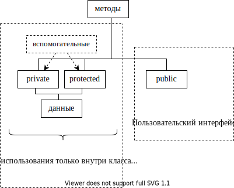
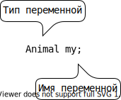
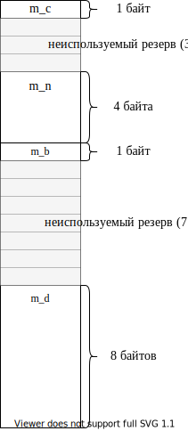

*На Си Вы можете просто делать ошибки.*

*на C++ Вы сможете их также наследовать!*

# Тема I. Базовые понятия объектно-ориентированного программирования (ООП) и их реализация средствами C++

## Введение

C++ является гибридным языком программирования. Это означает, что он
совмещает как процедурные возможности (заимствованные из Си), так и
объектно-ориентированные средства, позволяющие разработчику:

-   создавать собственные пользовательские типы данных (классы) для
    описания объектов реального мира

-   и манипулировать объектами такого пользовательского типа также
    просто, как переменными базового типа.

Одну и ту же задачу можно решить как в процедурном стиле, так и в
объектно-ориентированном. Следует помнить, что в зависимости от
выбранного способа реализации задачи, программист по-разному строит
свою программу (это справедливо для всех этапов разработки) и должен
учитывать следующее:

-   при процедурном подходе акцент делается в основном на реализацию
    программы посредством эффективных функций. Такой подход хорош для
    небольших программ, в которых требуется оптимизировать время
    выполнения и/или объем занимаемой памяти;

-   при объектно-ориентированном подходе время выполнения, да и объем
    памяти неизбежно увеличиваются, но при создании больших программных
    продуктов программист все равно получает выигрыш, выражаемый в
    конечном итоге в уменьшении трудоемкости.


## Понятия, связанные с ООП


## Отличия процедурного и объектно-ориентированного подходов

На примере одной и той же задачи попробую показать разные способы ее
решения и отметить разницу в реализации при переходе от процедурного

Объектно-ориентированное программирование (C++) решения к
объектно-ориентированному. Исходными данными являются: день месяца,
месяц, год. Требуется вычислить порядковый день в году. Например,
первому марта 2006 года соответствует 60-ый порядковый день года.

При описании каждого способа будем исходить из того, что задачу можно
разделить на две части: есть сервер, который предоставляет требуемый
сервис, а также существуют клиенты, которые хотят использовать
предоставляемый сервис. Посмотрим, как меняются взаимоотношения между
клиентом и сервером при переходе от процедурного к
объектно-ориентированному способу.

### Решение в стиле Си (процедурный подход)

Замечание: процедурное решение этой задачи было приведено в качестве
примера еще создателями языка Си (Керниган и Ричи).

```cpp
#include <iostream>
//сервер:
int DayOfYear(int day, int month, int year)
{
    //Вспомогательный массив, содержащий количество дней в
    //каждом месяце
    int ar[][12] = { {31, 28, 31, 30, ...},   //не високосный год
                     {31, 29, 31, 30, ...} }; //високосный год
    //Определяю — по какой строчке суммировать
    int I = (year % 4 == 0) &&
            ((year % 100 != 0) || (year % 400 == 0));
    for (int i = 0; i < (month - 1); i++)
        day += ar[I][i];  //копим порядковый день года
    return day;
}
//клиент
int main()
{
    int d1 = 1, m1 = 3, y1 = 2006;
    std::cout << DayOfYear(d1, m1, y1) << std::endl;  //вызов
    int d100 = 3, m100 = 10, y100 = 2004;
    std::cout << DayOfYear(d100, m100, y100) << std::endl;  //вызов
    //Неудобства: — оперирую с разными датами, их много -> все время
    //придется помнить, какая тройка переменных к какой дате
    //относится
}
```

Графически вызов функции можно представить:


Важно:

-   данные для совершения сервером действия предоставляет клиент!

-   данных много!

-   о том, что несколько элементов данных относятся к одной сущности
    (дате), знает только программист!

-   «накладные расходы» компилятора на вызов такой функции достаточно
    высоки, так как каждое данное передается отдельно (память для
    формирования параметров в стеке + время).

### Использование структур Си (укрупнение данных)

Это развитие процедурной подхода. Такой способ просто позволяет
сгруппировать данные, относящиеся к одной сущности, посредством
структуры.

```cpp
#include <iostream>
struct Date
{
    int year;
    int month;
    int day;
};
//сервер:
int DayOfYear(const /*struct*/ Date* date)
{
    int ar[2][12] = { { 31, 28, 31, 30, ... },  //не високосный год
                      {31, 29, 31, 30, ... } }; //високосный год
    int I = (date->year % 4 == 0) &&
        ((date->year % 100 != 0) || (date->year % 400 == 0));
    int YearDay = date->day;//здесь будем копить порядковый день
                            //года, так как нелогично «портить»
                            //содержимое по адресу date
    for (int i = 0; i < date->month - 1; i++)
        YearDay += ar[I][i];
    return YearDay;
}
//клиент:
int main() //
{
    Date d1 = { 1, 9, 2006 }; //создание и инициализация переменной
                              //типа Date
    std::cout << DayOfYear(&d1) << std::endl; //передача параметра
                                              //по указателю
    Date d100 = { 31, 12, 2006 };
    std::cout << DayOfYear(&d100) << std::endl;
}
```


Важно:

-   данные сгруппированы посредством структуры

-   данные все еще на стороне клиента!

-   зато за счет укрупнения данных программисту нужно запоминать гораздо меньше

-   и объем передаваемой информации тоже сократился (передается только
    адрес структурной переменной)! Замечание: если передавать объект по
    значению, то экономии памяти не будет.

#### 1.1.1. Использование классов C++

Объектно-ориентированный подход позволяет в одном типе совместить как
данные, описывающие этот объект, так и операции над этими данными.

```cpp
#include <iostream>
//сервер:
class Date
{
    int year;
    int month;
    int day;
    bool IsLeapYear()//аргументы не передаются!!! — метод выполняет
                     //действия над данными объекта! ! !
    {
        return (year % 4 == 0) &&
            ((year % 100 != 0) || (year % 400 == 0));
    }
public: //спецификатор доступа понятие будет введено позже
    int DayOfYear()//параметры не передаются!!! Это не обычная
                   //Функция, а метод класса, который обращается к
                   //данным того объекта, для которого он был
                   //вызван!!!
    {
        int ar[2][12] = { { 31, 28, 31, 30, ... },//не високосный год
                          { 31, 29, 31, 30, ... } }; //високосный год
        int I = IsLeapYear();
        int YearDay = day;//здесь будем копить порядковый день года
        for (int i = 0; i < month - 1; i++)
        {
            YearDay += ar[I][i];
        }
        return YearDay;
    }
};
//клиент:
int main()
{
    Date my; //создание объекта типа Date
    ... //Инициализация членов данных объекта — пока не привожу код
    std::cout << my.DayOfYear(); //вызов метода класса. Эта функция
                                 //не принимает параметров.Она
                                 //высчитывает порядковый день года,
                                 //исходя из данных объекта my
}
```


_Важно: данные на стороне сервера!_

Главный принцип ООП — не получайте посредством объекта данные,
необходимые для совершения Вашей операции — вместо этого «попросите»
объект, содержащий данные, сделать эту операцию с его (объекта) данными
для Вас. Этот принцип называется __делегированием__ (delegation).

## Объявление класса

Класс — это определяемый пользователем тип данных. Если класс хорошо
сконструирован, использование экземпляров такого пользовательского типа
ничем не отличается от использования переменных базовых типов: они могут
передаваться в функцию в качестве параметра, могут быть скомпонованы в
массив и т.д. Отличие — базовые типы для компилятора — «родные»
(встроенные), а о Вашем пользовательском типе компилятор ничего не
знает, поэтому использованию класса должно предшествовать его объявление
(описан. для компилятора свойств объектов пользовательского типа).
Объявлен класса — это заготовка для компилятора, по которой он будет
строить реальный экземпляр *(объект)* данного типа.

Принципиальным отличием классов от старых структур Си является
объединение (инкапсуляция) в одной программной единице, как данных, так
и методов для работы с этими данными. Определяя термин «инкапсуляция»,
говорят также, что переменные класса (member variables) инкапсулированы
вместе с набором функций (member functions) для работы с этими
переменными. Полученный в результате класс — это программный модуль,
который можно использовать как строительный блок при разработке
приложения (приложений).

> 3амечание: объявление класса рекомендуется помещать в заголовочный файл.


Формально простейшее объявление класса выглядит так:


`список_членов_класса` — включает описание как типов и имен переменных
(member variables), так и прототипы функций класса (member functions),
которые принято в русскоязычной литературе называть методами.

Замечание: `;` после закрывающей фигурной скобки обязательна!

Какую информацию получает компилятор, встречая объявления класса:

-   объявлен новый пользовательский (агрегатный) тип данных;

-   имена и типы членов класса: типы переменных (эту информацию
    компилятор использует прежде всего для вычисления количества памяти,
    необходимой для хранения экземпляра данного класса) и прототипы
    функций;

-   ограничения по использованию функций и переменных класса (эту
    информацию компилятор извлекает из указанных программистом
    спецификаторов доступа).

Основное назначение классов — описывать объекты реального мира. В
некотором смысле проектирование класса — это моделирование. Удобно
начинать строить модель с очень грубого приближения, учитывая только
некоторые (важные на взгляд программиста) свойства и наращивать
функциональность по мере разработки. В качестве примера начинаем
разрабатывал класс, абстрагирующий животное. Конечно, можно придумать
много свойств, присущих любому животному, но я для начала выбираю лишь
несколько (преследуя учебные цели). Например:

Файл `Animal.h`

```cpp
enum SEX
{
    MALE, FEMALE
}; //для тех, кто не очень дружен с английским языком: SEX — это
   //пол, который за редким исключением может быть только мужским
   //или женским
class Animal
{
    unsigned int m_age; //возраст (не может быть отрицательным, не
                        //должен уменьшаться, есть естественные
                        //ограничения)
    bool m_bHasMaster;//ecть/нeт хозяина (хозяева появляются и, к
                      //сожалению, пропадают)
    SEX m_sex; //пол (может измениться только в случае
               //хирургического вмешательства, обычно не изменяется
               //на протяжении жизни)
};
```

Замечание 1: большинство разработчиков Microsoft использует для имен
переменных класса префикс `m_` (от слова member). По моему мнению, это
удобно, так как позволяет в тексте программы легко отличать переменные
класса от обычных переменных.

Замечание 2: в объявлении класса за очень немногими исключениями
(например, `static const int n=1;`{.cpp}) могут быть только объявления
переменных, прототипы методов и тела inline-методов!

```cpp
class Animal
{
    unsigned int m_age = 0; //в этой строке компилятор выдаст ошибку
};
```

## Спецификаторы (привилегии) доступа

При объявлении класса программист с помощью спецификаторов доступа
(ключевых слов C++) формирует компилятору правила ограничения области
видимости для разных членов класса (переменных или методов). Другими
словами, привилегии доступа это способ указать компилятору, где в тексте
программы можно обращаться к члену класса: в любом произвольном месте
программы (в частности извне класса) или только в методах класса.
Посредством указанного при объявлении члена класса спецификатора
компилятор в дальнейшем будет производить контроль: есть ли право
использовать указанное имя в данном контексте (и «обмануть» компилятор
достаточно трудно).

> Замечание: спецификаторы доступа применимы также к вложенным классам и перечислениям.

### Зачем нужны привилегии доступа

При проектировании класса разработчик должен исходить из того, что
разработанный и отлаженный класс может пригодиться как ему самому в
будущем при решении другой задачи, так и другому программисту, поэтому
существуют правила, которых рекомендуется придерживаться.

#### 1.1.2. Защита данных от несанкционированного использования

Если бы привилегий доступа не было и все члены класса были общедоступны
(как поля Си структур), для разрабатываемого класса Animal были бы
вполне возможны следующие нелогичные с точки зрения моделирования
объектов реального мира действия:

```cpp
//animal.h
struct Animal
{
    unsigned int m_age; //переменная общедоступна
    ...
};
```

```cpp
#include "animal.h"
int main()
{
    Animal an;
    an.m_age = -100; //компилятор выдаст предупреждение
                     //опреобразовании знакового вбеззнаковое, но
                     //выполнит, и получится животное, которое уже
                     //прожило много веков
    an.m_age = 10000; //не имеет смысла, но будет выполнено!
    an.m_age--; //аналогично
}
```

Поэтому одной из парадигм объектно-ориентированного подхода является
«защита» данных от таких несанкционированных разработчиком класса
действий, то есть ограничение доступа к членам класса посредством
привилегий доступа, например:

```cpp
class Animal
{
private: //спецификатор доступа, который делает переменную m_age
         //"невидимой" или недоступной вне класса
    unsigned int m_age;
};
{
    Animal an;
    //an.m_age = -100; //ошибка компилятора — нет прав доступа!
    //an.m_age = 10000; //аналогично
    //an.m_age--; //аналогично
}
```

А так как данные теперь извне класса непосредственно недоступны, то
разработчик класса должен предоставить доступные (открытые)
программисту-пользователю методы, которые позволят обращаться к
переменным класса, но только предусмотренным разработчиком способом. В
частности, в таких методах всегда можно ввести контроль, например:

```cpp
#include <iostream>
class Animal
{
private: //спецификатор доступа, который делает переменную m_age
         //«невидимой вне класса»
    int m_age;
public: //спецификатор доступа, который делает метод SetAge
        //общедоступным
    void SetAge(int age)
    {
        if (age >= 0 && age < 30) //или if (age >= m_age && age < 30)
            m_age = age; //переменная класса будет модифицирована
                         //только при допустимом значении параметра
                         //age
        else
            std::cout << "Такого не может быть!";
        //Реализуйте самостоятельно объявленный который должен
        //переменную m_age параметра delta ниже метод, увеличивать
        //на значение
        void Grow(int delta);
    }
};
{
    Animal an;
    an.SetAge(-100); //"Такого не может быть!"
    an.SetAge(5); //ОК
}
```

> Замечание: __в идеальном классе согласно правилам ООП все данные должны быть защищены__ (хотя далеко не всегда разработчики классов даже широко известных библиотек этому правилу следуют).

#### 1.1.3. Защита методов

Класс может оказаться достаточно сложным с большим количеством методов,
из которых только часть предназначены для «внешнего» использования, а
остальные являются вспомогательными, то есть, предназначены только для
«внутреннего» использования. Первая группа представляет открытый
интерфейс пользователя класса (такие методы должны быть общедоступны) —
это те методы, без которых программист-пользователь не сможет
использовать класс. А методы второй группы лучше делать защищенными, так
как:

-   их «прямое» использование может привести к нежелательным последствиям
    так же, как и модификация переменных «напрямую» (поэтому такие методы
    можно сделать видимыми только для других функций, входящих в состав
    этого класса и недоступными для любого другого кода);

-   знание таких вспомогательных подробностей реализации для исп ользования
    класса просто не нужно, а, делая их общедоступными, разработчик просто
    увеличивает объем информации, который необходимо усвоить
    программисту-пользователю. Поэтому хорошим стилем является сокрытие от
    него несущественных деталей реализации (пусть лучше сосредоточится на
    процессе проектирования).

> Таким образом, класс — это замкнутый мир со своими четко определенными правилами взаимодействия с «внешним» миром. Можно даже сравнить класс с «черным ящиком», который скрывает всю информацию, предоставляя для общения с внешним миром только предусмотренный разработчиком этого класса интерфейс.

### Спецификаторы доступа C++

В C++существуют три уровня привилегий доступа к членам класса.
Специфика:

-   Каждый уровень доступа определяется своим ключевым словом
    (спецификатором доступа) `public`, `private` или `protected`. Назначение
    спецификаторов доступа:

`public` — общедоступный, то есть к нему имеют доступ не только методы
класса, но и «внешние» по отношению к классу функции. _`public` члены класса образуют открытый интерфейс для «общения» с классом извне._

`private` — данный член не доступен вне класса; обращаться к нему могут
только методы данного класса.

`protected` — данный элемент не доступен вне класса, пользоваться им могут
методы данного класса и методы производных классов ([тема «Наследование»](#тема-ii.-открытое-одиночное-наследование)).

-   Необязательно для каждого члена класса указывать спецификатор
    доступа. Пока компилятор не встретит другой спецификатор, он будет
    использовать предыдущий. Таким образом, внутри класса формируются
    секции.

-   Каждое объявление (переменной или метода) внутри класса определяет
    привилегию доступа в зависимости от того, в какой секции оно
    расположено.

-   Секций с одним и тем же ключевым словом может быть сколько угодно и
    располагаться они могут в любом порядке.

-   По умолчанию объявления являются `private`.

-   Из метода класса «видны» (компилятор разрешает обращаться к) `private`
    и `protected` члены другого объекта этого же класса (пример приведу
    позже).

Например:

```cpp
class Access
{
    int m_iX; //private no умолчанию
public:
    int m_iY; //public
protected:
    int m_iZ; //protected
    char m_cZ; //protected

public:
    void Increase(int dx, int dy); //public
protected:
    void WillBeInherited(); //protected
private:
    int ForInternalUsage(); //private
};
```

Использование спецификаторов доступа для идеального класса можно
изобразить графически следующим образом:



## Создание объекта (экземпляра) класса

В простейшем случае создание объекта класса выглядит также как и
определение переменной базового типа:

+---------------------------------+---------------------------------+
| Определение переменной          | Один из возможных способов      |
| базового типа                   | создания объекта типа `Animal`  |
+=================================+=================================+
|           |           |
|                                 |                                 |
| Компилятор зарезервировал       |Создан объект `my` типа Animal.  |
| `sizeof(int)`{.cpp} памяти и в  |Компилятор зарезервировал        |
| зависимости от контекста        |`sizeof(Animal)`{.cpp} памяти и, |
| определения проинициализировал  | если разработчик класса         |
| эту область памяти нулями или   |предусмотрел специальной         |
| оставил без инициализации (то   |функции инициализации,           |
| есть глобальные и статические   |проинициализировал (или не       |
| переменные будут                |проинициализировал) его          |
| проинициализированы нулем, а    |согласно общим правилам          |
| локальные переменные будут      |инициализации переменных.        |
| содержать случайные значения).  |                                 |
+---------------------------------+---------------------------------+

## Оператор `sizeof` применительно к классам

При создании экземпляра класса компилятор должен зарезервировать
необходимый объем памяти. Специфика:

-   память резервируется для всех обычных (нестатических — смотри [тему «Статические члены класса»](#тема-vii.-статические-члены-класса)) переменных класса

-   при появлении виртуальных методов в каждом объекте появляются
    дополнительные служебные данные (смотри [тему «Полиморфизм»](#полиморфизм.-виртуальные-функции))

-   память резервируется только для данных класса, а код методов (не
    `inline`) существуют в единственном экземпляре (также как тела обычных
    глобальных функций)

-   компилятор выделяет память для каждого данного в том порядке, в
    котором переменные объявлены в классе

-   оптимизирующий компилятор (например, VC) при выделении памяти под
    каждую переменную объекта может минимизировать время обращения к
    любому данному следующим образом: он располагает данные так, чтобы
    любое из них можно было прочитать из памяти за минимальное
    количество канальных циклов. Это означает, что любой элемент данных
    (для того, чтобы при считывании его не нужно было считывать «по кускам») должен быть размещен по адресу, кратному длине
    элемента. Эти правила следует учитывать для более эффективного
    использования памяти.

Например, для оптимизирующего компилятора:

```cpp
class A
{
    //данные
    int m_a;
public:
    //методы
    void SetA(int a) { m_a = a; }
    int GetA() { return m_a; }
};
size_t n = sizeof(A); //4 байта
class A
{
    //данные
    char m_c;
    int m_n;
    bool m_b;
    double m_d;
    //методы
    ...
};
size_t n = sizeof(A); //24 байта (см. рис.)
```



Замечание 1: зная о правилах, согласно которым оптимизирующий компилятор
для выравнивания полей резервирует дополнительные байты, программист мог бы гораздо эффективнее использовать память, всего лишь объявляя
переменные класса в другом порядке:

```cpp
class A
{
    //данные
    double m_d;
    int m_n;
    char m_c;
    bool m_b;
    //методы
};
size_t n = sizeof(A); //16 байтов (т. к. компилятор может
                      //добавить 2 резервных байта)
```

```cpp
size_t n = sizeof(Animal); //???
```

Замечание 2: в принципе можно разработать класс, в котором нет
переменных, а есть только методы. В таком случае из вышесказанного
следует, что компилятору вообще памяти выделять не следует, но объект не
может занимать 0 байтов, поэтому согласно стандарту при создании
объектов такого типа компилятор выделяет 1 байт.

```cpp
class В
{
    //данных нет!!!
    //методы есть
};
size_t n = sizeof(В); //1
```

## Определение (peaлизация) методов класса

Как и обычные функции, методы класса могут быть встроенными (встречая в
тексте программы вызов такого метода, компилятор подставляет в месте
вызова код функции, не тратя ресурсов на вызов) и невстроенными, при
вызове которых компилятор передает управление на точку входа (а тело
такой функции существует в единственном экземпляре).

### Встроенные (`inline`) методы

Встроенными удобно делать очень короткие и часто вызываемые методы. О
том, что Вы хотите сделать метод встроенным, компилятору можно сообщить
двумя способами (при этом в любом случае это будет только Вашей
рекомендацией компилятору, а компилятор сам решит, имеет ли смысл такой
метод встраивать, исходя из соотношения затраты/выигрыш):

1. неявно, совместив объявление и определение метода (при этом ключевое
слово `inline` использовать не обязательно).

```cpp
class Animal
{
    bool m_bHasMaster;
public:
    void SetMaster() { m_bHasMaster = true; }
    //объявление совмещено с реализацией ⇒ компилятор
    //воспринимает такой метод как встроенный
};
```

2. методы, определенные вне класса также можно сделать встраиваемыми,
используя при объявлении и при определении ключевое слово `inline`.

Замечание: при этом определение функции должно быть в `h`-файле, как и
объявление класса, так как компилятор в месте вызова метода должен
подставить его тело, а следовательно, должен это тело «видеть»:

```cpp
//Файл Animal.h
class Animal
{
public:
    inline void SetMaster(); //только объявление. Ключевое слово
                             //inline обязательно
};
```

Здесь же (или в другом вспомогательном заголовочном файле) тело
метода. Специфика: так как имя класса является областью видимости, а
реализация метода приводится «вне» класса, компилятору нужно указать,
что это не обычная функция, а метод класса Animal посредством имени
класса и спецификатора разрешения области видимости — `Animal::`

```cpp
inline void Animal::SetMaster()
{
    m_bHasMaster = true;
}
```

### Невстроенные методы

Общепринятая практика — помещать определение (реализацию) невстроенного
метода в соответствующий файл реализации — `.cpp`-файл.

Например:

```cpp
//файл Animal.h:
class Animal
{
    ...
public:
    void SetMaster(); //только объявление
};
```

Файл Animal.cpp содержит реализацию метода SetMaster:

```cpp
#include "Animal.h" //обязательно, так как компилятор должен знать,
                    //что Animal — это пользовательский тип, а также
                    //видеть свойства пользовательского типа
void Animal::SetMaster() //префикс Animal:: говорит компилятору о
                        //принадлежности к классу
{
    m_bHasMaster = true;
}
```

## Доступ к `public` членам класса посредством объекта (или ссылки). Селектор «`.`»

### Доступ к `public` переменным

Если в классе есть общедоступные данные (чего по правилам быть не
должно), обращение к таким переменным осуществляется посредством имени
объекта (или ссылки на объект), оператора «`.`» (селектора) и имени
переменной класса. Другая возможность (доступ посредством указателя на
объект) будет обсуждаться позже в соответствующем разделе.

Обращение к `public` переменным класса практически ничем не отличается от
обращения к полю Си структуры. Пример:

```cpp
class А
{
public:
    int m_a;
    int m_b;
};
{
    А a; //создание экземпляра класса А с именем а
    a.m_a = 10; //присвоили переменной m_a объекта а значение 10.
                //Что при этом делает компилятор :
                //а) формирует адрес = &а(база) +
                //смещение_переменной_m_а_относительно_базы(+0)
                //б) по вычисленному адресу заносит 10

    а.m_b = 2;  //а) формирует адрес = &a +
                //смещение_переменной_m_b_относительно базы(+4)
                //б) по вычисленному адресу заносит 2
}
```

### Вызов `public` метода класса (нестатического). Указатель `this`

Синтаксис вызова метода класса аналогичен обращению к переменной класса.
Но в силу того, что метод класса должен производить действия над данными
того объекта, для которого он был вызван, вызов метода существенно
отличается от вызова обычной (глобальной) функции.

#### 1.1.4. Анатомия вызова нестатического метода класса

```cpp
class A
{
    int m_a;
public:
    void Set(int a);
};
{
    A ob; //создание объекта
    ob.Set(5); //вызов метода можно рассматривать как вызов
               //глобальной функции Set(&ob, 5); То есть при вызове
               //нестатического метода класса компилятор формирует
               //дополнительный(невидимый для программиста)
               //параметр, посредством которого передается адрес
               //того объекта, для которого вызывается метод
}
```

А в теле метода при обращении к переменной класса компилятор вычисляет
адрес, по которому нужно прочитать или записать значение, следующим
образом: адрес объекта (полученный в качестве скрытого параметра) +
смещение переменной относительно этой базы:

```cpp
void A::Set(int а)
{
    m_а = а; //присвоить значение а по адресу = адрес объекта
             //+ смещение m_а_относительно базы
}
```

Замечание: по умолчанию

-   методы с фиксированным количеством параметров вызываются с
    соглашением `__stdcall`, но адрес объекта передается в регистре `ECX`;

-   методы с переменным количеством параметров вызываются с соглашением `__cdecl`.

#### 1.1.5. Указатель `this`

В большинстве случаев компилятор использует полученный в качестве
параметра адрес объекта неявно (предыдущий пример), но иногда
программисту хочется или необходимо этим адресом воспользоваться явно. 3
адрес доступен программисту посредством имени «`this`».

Специфика указателя `this`:

-   указатель `this` формируется компилятором только внутри нестатических
    методов класса (а также структуры или объединения C++) ⇒ использовать
    этот указатель вне метода класса невозможно;

-   для класса `А` тип указателя `this` — `A* const`. То есть это константный (во
    всяком случае в поздних версиях C++) указатель, модифицировать который
    компилятор не позволит;

Явное использование `this`:

1. При обращении к членам класса (приведенные
три строки эквивалентны)

```cpp
void A::Set(int n)
{
    //здесь компилятор формирует указатель this (как если бы
    //программист определил локальную переменную с именем this: A*
    //const this = адрес_объекта;) и использует это значение в
    //качестве базы при обращении к переменным класса m_a = n;

    m_a = n; //this используется компилятором неявно, то есть эту
             //строчку компилятор интерпретирует как *(this +
             //смещение) = n;

    this->m_a = n; //корректно и эквивалентно предыдущей строчке, но
                   //не обязательно — компилятор сделает это и без
                   //явного указания

    (*this).m_a = n; //тоже корректно и имеет такой же смысл, так
                     //как любой указатель можно разыменовать, а
                     //селектором при обращении посредством объекта
                     //является «.»

    A::m_а = n; //можно обозначить принадлежность классу
                //посредством А::
}
```

2. Использование `this` в качестве возвращаемого значения. Выражение
`(*this)` часто используется для возвращения копии текущего объекта или
ссылки на текущий объект из метода класса.

```cpp
A& A::SomeFunc() //или А А::SomeFunc()
{
    return *this;
}
```

3. Использование `this` в качестве аргумента функции. Выражения `(*this)`
или `this` можно использовать для формирования параметра, передаваемого из
метода класса другой функции:

```cpp
void AnotherFunc1(А*);
void AnotherFunc2(A&);
void AnotherFunc3(A);
void A::SomeFunc()
{
    ...
    AnotherFunc1(this); //(A*)
    AnotherFunc2(*this); //(A&)
    AnotherFunc3(*this); //(A)
}
```

## Конструкторы

При создании экземпляра старой структуры Си единственной возможностью
присвоить значения полям при создании структурной переменной было
использование списка инициализаторов, например:

```cpp
struct Date
{
    int year;
    int month;
    int day;
};
{
    Date dat1 = { 2006, 9, 1 };
}
```

Обычно же при создании экземпляра класса требуется:

-   выделить для него память,

-   проинициализировать его переменные (в разных ситуациях, возможно,
    по-разному),

-   а может быть совершить еще какие-нибудь инициализирующие действия.

Для того чтобы учесть все перечисленные потребности, удобно предоставить
в распоряжение программиста методы, специально предназначенные для
инициализации переменных класса и предписать компилятору вызывать
соответствующий метод при создании экземпляра класса.

У всех классов C++ есть один или несколько таких специальных методов — конструкторов (constructors), автоматически вызываемых при создании
экземпляра класса компилятором (автоматически означает, что программист
явно такой метод не вызывает, а компилятор «понимает» какой конструктор
следует вызвать или сгенерировать по контексту создания объекта).

Конструктор — это не обычный метод класса. Специфика конструктора
заключается в следующем:

-   конструктор невозможно вызвать явно;

-   конструктор вызывается компилятором автоматически при создании
    нового объекта;

-   имя конструктора предопределено, оно всегда совпадает с именем
    класса (так как компилятор вызывает этот метод неявно, произвольно
    такой метод называться не может);

-   у конструктора отсутствует тип возвращаемого значения (даже если Вы
    укажите ключевое слово `void`, компилятор выдаст ошибку)!

-   конструктор не может быть объявлен с ключевыми словами `const` и
    `volatile` ([раздел «Ключевое слово `const` и классы»](#ключевое-слово-const-и-классы));

-   не может быть виртуальным ([раздел «Полиморфизм. Виртуальные функции»](#полиморфизм.-виртуальные-функции));

-   не может быть статическим;

-   соглашение по вызову — `__thiscall` (не может быть объявлен с
    ключевым словом `cdecl`).

В остальном конструктор подобен обычным функциям, в частности, как и
любая функция C++, может иметь любое количество параметров, может быть
многократно перегружен программистом и т. д.

### Конструктор по умолчанию (default constructor)

Конструктором по умолчанию называется конструктор:

-   у которого нет параметров

-   или все параметры имеют значения по умолчанию.

Если в классе отсутствует явно определенный пользователем конструктор,
то компилятор генерирует собственный автоматический конструктор по
умолчанию. Такой автоматический `default` конструктор для такого простого
класса, которым пока является `Animal`, ничего делать не будет, но для
более сложных классов он выполняет два важных действия:

-   вызывает конструкторы для встроенных объектов класса
    ([раздел «Встроенные объекты»](#тема-vi.-встроенные-объекты-composition.-отношение-между-классами-содержит))

-   и конструкторы базовых классов ([раздел «Наследование»](#тема-ii.-открытое-одиночное-наследование)).

Замечание: компилятор не всегда может создать автоматический конструктор
по умолчанию. Ограничения:

-   в классе объявлены константные члены данных;

в классе объявлены ссылки;

данный класс является производным, а в базовом классе конструктор
объявлен `private`.

Например, пока мы не ввели в разрабатываемый класс Animal ни одного
своего конструктора:

```cpp
int main()
{
    Animal an; //выделена намять и вызван автоматический конструктор
               //по умолчании, который ничего существенного делать
               //не умеет, поэтому данные — члены класса (так как
               //объект локальный) остались не проинициализированными
}
```

Так как небезопасно использовать объект, в котором данные имеют
случайные значения, логично реализовать свой `default` конструктор,
который будет присваивать переменным класса предусмотренные
программистом значения. Например;

```cpp
class Animal
{
    unsigned int m_age;
    bool m_bHasMaster;
    SEX m_sex;
public:
    Animal() //объявление и реализация default конструктора
             //без параметров
    {
        m_age = 0;
        m_sex = MALE;
        m_bHasMaster = false;
    }
};
int main()
{
    Animal an; //выделена память и вызван введенный нами
               //в класс конструктор по умолчанию
}
```

Замечание 1: для создания объекта приведенным способом, конструктор
должен быть общедоступен (`public`) для того, чтобы компилятор имел право
вызывать этот метод

Замечание 2 (существенное!): обратите внимание на следующий фрагмент
кода и запомните разницу:

```cpp
int main()
{
    Animal a1; //вызов конструктора по умолчанию
    Animal а2(); //а эту строчку компилятор трактует как объявление
                 //функции, которая не принимает параметров и
                 //возвращает значение типа Animal!
}
```

### Конструктор с параметрами

Так как основным предназначением конструктора является инициализация
переменных класса, то в основном используются конструкторы с
параметрами. Вот новое объявление класса Animal с явным (`inline`)
конструктором:

```cpp
class Animal
{
    unsigned int m_age;
    bool m_bHasMaster;
    SEX m_sex;
public:
    Animal(int age, bool master, SEX s)
    { //объявление и реализация конструктора с параметрами
        m_age = age; m_sex = s; m_bHasMaster = master;
    }
};
```

Соответственно изменится и код создания объекта типа `Animal`:

```cpp
Animal an(1, true, FEMALE); //компилятор создаст экземпляр класса
                            //Animal и вызовет конструктор с
                            //параметрами
```

Замечание 1: поскольку мы ввели явный конструктор с параметрами и явно
не переопределили свой конструктор без параметров, компилятор уже не
будет генерировать автоматически конструктор по умолчанию и в ответ на
попытку сконструировать объект `Animal` по умолчанию выдаст ошибку:

```cpp
Animal an2; //ошибка — в классе не определен конструктор без
            //параметров
```

Замечание 2: конструктор с параметрами, у которого все параметры имеют
значения по умолчанию ([раздел «Конструктор по умолчанию»](#конструктор-по-умолчанию-default-constructor)), эквивалентен
конструктору по умолчанию.

```cpp
class Animal
{
public:
    Animal(int age = 1, bool master = false, SEX s = MALE);
        //эквивалентен конструктору пo умолчанию
};
{
    Animal a1(5, true, FEMALE);//компилятор передаст в качестве
                               //параметров указанные значения
    Animal а2; //компилятор вызовет тот же метод, но передаст
               //значения по умолчанию, указанные в прототипе метода
}
```

Замечание 3: можно создать константный объект, предназначенный только
для чтения (для таких объектов впоследствии можно будет вызывать только
константные методы класса — [раздел «Ключевое слово `const` и классы»](#ключевое-слово-const-и-классы)):

```cpp
const Animal my(1, true, MALE);
```

### Специфика записи при вызове конструктора с одним параметром

Иногда Вы можете встретить несколько странную запись, которая означает
неявный вызов конструктора с одним параметром:

```cpp
class A
{
    int m_a;
public:
    A(int a)
    {
        m_a = a;
    }
};
int main()
{
    A a = 1; //компилятор вызовет конструктор с одним параметром.
             //Для компилятора такая запись означает то же самое,
             //что
    A а(1);
}
```

Такую запись можно интерпретировать следующим образом: компилятор
приводит значение, стоящее справа от знака равенства, к требуемому типу
слева от знака равенства посредством конструктора с одним параметром
(аналогично неявному приведению базовых типов: `float f = 1;` эквивалентно
`float а(1);`).

### Конструкторы и модификатор `explicit`

Для того чтобы запретить неявное преобразование применяется модификатор
`explicit`:

```cpp
class A
{
    int m_а;
public:
    explicit A(int a) //конструктор объявлен с модификатором
    {                 //explicit.Этот модификатор запрещает
        m_а = a;      //компилятору приводить тип неявно.
    }
};
int main()
{
    A а = 1; //неявное преобразование запрещено ⇒ ошибка
             //компилятора : cannot convert from 'const int' to
             //'class A'
}
```

### Конструкторы базовых типов

Если класс хорошо спроектирован, использование объектов такого
пользовательского типа не должно отличаться от использования переменных
базового типа. Полезно было бы иметь и «обратную совместимость», то
есть в тех ситуациях, где можно использовать объекты классов, хотелось
бы иметь возможность также использовать и переменные базовых типов
(например, обобщенные алгоритмы стандартной библиотеки умеют работать с
данными любого типа — раздел «Обобщенные алгоритмы STL»<!-- такого раздела нет! -->). Для
поддержки такой «обратной совместимости», для базовых типов введено
понятие конструктора:

```cpp
int i = 1; //это привычная запись для инициализации переменной
           //базового типа

int i(1); //а это эквивалент предыдущей строки, только в терминах
          //конструирования объектов: компилятор должен выделить
          //память для переменной типа int и проинициализировать
          //указанным в качестве параметра значением
```

Замечание 1: для базовых типов предусмотрен вызов конструктора по
умолчанию (при этом компилятор инициализирует переменную базового типа
нулем). Синтаксически вызов конструктора по умолчанию для базовых типов
выглядит:

```cpp
{
    int i = int(); //по умолчанию инициализируются нулем
    int j; //а здесь никакого конструктора неявно не вызывается,
           //поэтому локальная переменная базового типа остается
           //неинициализированной
}
```

Замечание 2: посредством вызова конструктора можно проинициализировать
заданным в качестве параметра значением переменную базового типа,
создаваемую динамически:

```cpp
int* р = new int(5); //это указание компилятору выделить память
                     //sizeof(int) в куче и занести по этому адресу
                     //значение 5 (а не динамическое создание
                     //массива из 5 элементов типа int)

int* p1 = new int[5]; //в отличие от предыдущего примера, эта запись
                      //предписывает компилятору выделить в куче
                      //память пол массив из пяти элементов типа
                      //int. При этом неявно инициализировать
                      //выделенный блок памяти компилятор не будет.
```

### Перегрузка конструкторов

Объекты одного и того же класса можно инициализировать разными
способами. Для этих целей удобно иметь несколько разных инициализирующих
функций. В C++ могут перегружаться любые функции, в том числе и
конструкторы. Вы можете реализовать любое количество конструкторов,
различающихся количеством и/или типами аргументов. Главное, чтобы
компилятор при создании объекта мог «разобраться» вызов какого именно
метода ему нужно сгенерировать при создании объекта. Например:

```cpp
class Animal
{
public:
    Animal(); //конструктор по умолчанию
    Animal(int age, bool master, SEX s); //конструктор с параметрами
};
```

Теперь экземпляры класса `Animal` можно создать следующими способами:

```cpp
Animal an1; //компилятор вызовет конструктор по умолчанию

Animal аn2(1, true, MALE); //компилятор вызовет конструктор с
                           //параметрами
```

### Конструктор с параметрами по умолчанию

Как и все функции, конструктор может иметь аргументы, формируемые
компилятором по умолчанию.

Например:

```cpp
class Animal
{
    ...
public:
    Animal(unsigned int age = 1, bool master = false, SEX s = MALE);
    ...
};
```

Экземпляр класса Animal можно создать:

```cpp
Animal an1; //значения всех трех параметров будет сформировано
            //компилятором по умолчанию
Animal аn2(2); //значение первого параметра задано явно, остальные
               //по умолчанию
Animal аn3(3, true);
Animal an4(5, true, MALE);
```

> Замечание: как и для обычных функций значения по умолчанию должны быть указаны только в прототипе метода. Если Вы продублируете эти значения при определении метода, компилятор выдаст ошибку.

### Возможные конфликты при использовании параметров по умолчанию

При наличии нескольких конструкторов и использовании конструктора,
имеющего аргументы по умолчанию, может возникнуть следующая ситуация:

```cpp
class Animal
{
    ...
public:
    Animal(); //конструктор без параметров
    Animal(unsigned int age = 1, bool master = false, SEX s = MALE);
    //конструктор, у которого все параметры имеют значения по
    //умолчанию
};
```

Пока неоднозначности не возникло, но компилятор уже выдает
предупреждение (warning)

```cpp
int main()
{
    Animal an; //а здесь ошибка компилятора, так как нет
               //однозначности — какой именно конструктор должен
               //быть вызван
}
```

### Динамическое создание объектов

При динамическом создании объектов оператор new не только выделяет
память в куче, но и вызывает для создаваемого таким образом объекта
конструктор. Возвращает оператор new типизированный указатель.

```cpp
Animal* р = new Animal; //конструктор по умолчанию
Animal* р = new Animal(); //тоже конструктор по умолчанию
Animal* р = new Animal(2, false, MALE); //конструктор с параметрами
```

Попользовавшись таким динамическим объектом, не забудьте освободить
память!

```cpp
delete р; //вызов деструктора и освобождение памяти
```

## Деструкторы

### Деструктор — метод класса. Конструктор + деструктор = функциональное замыкание

Деструктор — еще один специфический метод класса. Деструктор выполняет
операции, обратные тем, которые выполняют конструкторы: например, если
конструктор выделяет динамическую память, то деструктор, вероятнее
всего, ее освобождает и т. д. (это называется функциональным
замыканием).

Специфика деструктора:

-   в большинстве случаев вызывается компилятором неявно, когда
    заканчивается время жизни объекта (хотя в отличие от конструктора
    деструктор можно вызывать и явно);

-   имя деструктора совпадает с именем класса, но предваряется тильдой
    «`~имя_класса`»;

-   не принимает параметров и ничего не возвращает (даже `void`);

-   деструктор может быть только один (в отличие от конструкторов,
    которых может быть сколько угодно);

-   может (а иногда и должен) быть виртуальным;

-   вызывается компилятором с соглашением по вызову — `__stdcall` (`thiscall`)

Если явно в классе деструктор программистом не определен, то компилятор
генерирует его сам. Такой автоматический деструктор для простых классов
как наш класс `Animal` практически ничего не делает, но он умеет выполнять
очень важные действия для чуть более сложных классов:

-   вызывает деструкторы встроенных объектов данного класса
    ([раздел «Встроенные объекты»](#тема-vi.-встроенные-объекты-composition.-отношение-между-классами-содержит)),

-   вызывает деструкторы базовых классов ([раздел «Наследование»](#тема-ii.-открытое-одиночное-наследование)).

Замечание 1: при этом следует отдавать себе отчет в том, что некоторые
действия за программиста он автоматически сгенерировать не может
(например, освободить выделенную динамически память).

Замечание 2: если класс простой и при уничтожении объекта никаких
специфических действий выполнять не нужно, то совершенно излишне явно
реализовывать в таком классе деструктор.

Усложним наш класс `Animal` таким образом, чтобы возникла необходимость
ввести деструктор. Дадим имя животному. Имя — это строка (массив
символов), но хранить в объекте эту строчку можно по-разному:

1. неэффективный вариант — объявить в классе встроенный массив,
например `char m_name[20]`. Неэффективность такого подхода заключается в
том, что размерность массива должна быть задана константой и компилятор
в любом объекте будет резервировать 20 байтов, поэтому если имя
короткое, мы заставим компилятор выделить память под неиспользуемый
резерв, а если имя «длиннее», чем размер массива, нам придется его
«программно обрезать»;

2. более эффективный вариант — объявить в классе указатель на строку,
например `char* m_pName`. При этом строки могут быть разной длины, а в
объекте будет храниться только адрес строки.

Рассмотрим второй вариант и способы его реализации:

```cpp
class Animal
{
    char* m_pName; //указатель на строку с именем животного
public:
    Animal(unsigned int age, bool master, SEX s, const char* pName);
    //так как в классе появилась новая переменная, модифицируем
    //конструктор — он должен формировать в объекте указатель на
    //требуемую строку
};
```

При реализации конструктора мы должны учесть, что четвертый параметр
конструктора может быть разной природы ⇒ если в реализации
конструктора мы поступим с указателем так же, как поступали с другими
переменными.

```cpp
//Плохой способ реализации конструктора:
Animal::Animal(
    unsigned int age,
    bool master,
    SEX s,
    const char* pName)
{
    m_age = age;
    m_pName = pName; //запоминаем в переменной класса адрес, но не
                     //знаем, каким образом была выделена память в
                     //вызывающей функции
}
```

то это может привести к большой проблеме в нижеприведенном фрагменте

```cpp
{
    //Создание объектов. Обратите внимание — строка с именем может
    //быть задана разными способами:
    Animal an1(1, true, MALE, "Bobik"); //в качестве параметра
                                        //используется строковый
                                        //литерал
    char ar[] = "Sharik";
    Animal аn2(2, false, MALE, ar); //в качестве параметра
                                    //используется локальный массив
    char* р new char[5];
    cin >> p;
    Animal an3(3, true, FEMALE, p); //в качестве параметра
                                    //используется указатель на
                                    //динамический массив
    delete[] р; //а теперь освобождаем динамически захваченную
                //память (при этом в объекте an3 остается
                //недействительный указатель)
    ... //продолжаем пользоваться объектом an3!!!
}
```

Хороший способ реализации конструктора (мы должны обеспечить
существование всех данных объекта, пока существует сам объект, поэтому
формируем динамическую копию строки-параметра!):

```cpp
Animal::Animal(..., const char* pName)
{
    //Динамически выделить достаточное для хранения строки
    //количество памяти.
    m_pName = new char[strlen(pName) + 1]; //+1, так как функция
                                           //strlen «не считает»
                                           //завершающий нулевой байт
    //Скопировать строку-аргумент в динамически выделенную память
    strcpy(m_pName, pName);
}
```

Теперь класс Animal стал «нетривиальным», так как в конструкторе
происходит динамическое выделение памяти. Созданный динамически массив
будет существовать, пока программист явно не вызовет оператор `delete[] m_pName`. Очевидно, что это стоит сделать тогда, когда объект прекращает
свое существование. Как раз тогда компилятор неявно вызовет деструктор
(который для такого класса программист должен явно реализовать).

```cpp
class Animal
{
    ...
    ~Animal()
    { //объявление деструктора, совмещенное с определением
        delete[] m_pName; //освобождение памяти, занятой в
                          //конструкторе
    }
    ...
};
```

Замечание: модифицируйте самостоятельно конструктор по умолчанию (он
тоже должен предусматривать инициализацию указателя m_pName!).
Подумайте: почему вариант а) плохой и чем грозит Вам вариант б) ?

```cpp
Animal::Animal()//а)
{
    m_pName = "Default";
}
Animal::Animal()//б)
{
    m_pName = 0;
}
```

## Когда вызываются конструкторы и деструкторы

Конструкторы вызываются компилятором при создании объекта, а деструкторы
при уничтожении. Но если вызов конструктора достаточно очевиден, вызов
деструктора определяется временем существования объекта:

1.  именованный автоматический объект — конструируется каждый раз, когда
    компилятор встречает его объявление и уничтожается при выходе из
    блока, в котором он объявлен (в частности таким блоком является тело
    функции)

```cpp
{
    Animal аn; //конструктор (в данном случае по умолчанию)
}//деструктор
```

2.  встроенные массивы объектов — аналогично

3.  динамический объект существует пока программист не уничтожит его
    явно:

```cpp
Animal* р = new Animal(...); //конструктор
...
delete р; //деструктор
```

4.  глобальный, в пространстве имен — конструктор вызывается в прологе
    функции `main()`, деструктор — при завершении программы.

5.  статический локальный — конструктор вызывается при первом выполнении
    данного кода, а деструктор — при завершении программы.

6.  временный (автоматический) неименованный объект, который создается
    как часть вычисления выражения и уничтожается по завершении
    вычисления всего выражения.

    а)  `...А(1) + А(2)...`

    б)  `func(А(1))`

7.  передача параметров по значению
   ([раздел «Передача объектов по значению»](#передача-объекта-в-качестве-параметра-по-значению))

8.  возвращение объекта по значению
   ([раздел «Возвращение объектов по значению»](#возвращение-объекта-по-значению)).

## Конструктор копирования

Конструктор копирования — особый вид конструктора. Как и конструктор по
умолчанию, конструктор копий (copy constructor) — это метод класса,
который может сгенерировать компилятор автоматически.

Автоматический конструктор копирования подходит только для простых
классов и умеет делать следующие действия:

-   почленно копировать простые данные класса (переменные базовых типов,
    указатели, массивы с элементами базового типа);

-   вызывать конструктор копирования базового класса;

-   вызывать конструкторы копирования для встроенных объектов.

> Следствие: для простых классов совершенно незачем явно вводить в класс конструктор копирования.

Замечание: компилятор не всегда может создать автоматический конструктор
копирования. Ограничения:

-   в классе объявлены константные члены данных

-   в классе объявлены ссылки

-   данный класс является производным, а в базовом классе конструктор
    объявлен private.

### Создание копий объектов

Основное назначение конструктора копий — создавать новый экземпляр (того
же класса) таким образом, чтобы он стал копией существующего объекта.
Если класс простой, например:

```cpp
class А
{
    char name[10];
    //конструктор копирования явно программистом в классе не
    //предусмотрен
};
```

то нас устроит
автоматический конструктор копирования, генерируемый компилятором,
который просто перепишет из существующего объекта данные в новый
создаваемый объект:

```cpp
{
    A al; //создание объекта посредством default-конструктора
    А а2 = а1; //создание объекта посредством автоматического
               //конструктора копирования (нормальная форма записи)
    А аЗ(а1); //то же самое (функциональная форма записи)
}
```

Но. если для нашего нетривиального класса Animal не реализован
корректный конструктор копирования, то при использовании автоматического
конструктора копирования вместо двух отдельных одинаковых животных,
появляются «сиамские близнецы»:

```cpp
{
    Animal al(1, true, MALE, "Bobik");
    Animal a2 = a1; //создаем клон объекта al. Здесь компилятор
                    //вызовет автоматический конструктор
                    //копирования.Это нормальная форма записи.
    Animal a3(al); //то же самое. Это функциональная форма вызова
                   //конструктора копирования.
} //а здесь компилятор вызовет деструкторы для локальных объектов
  //a1, а2, а3!!!Вызов первого деструктора освободит динамически
  //захваченную память, а вызов следующего попытается освободить уже
  //«недействительный» блок.При этом, скорее всего Вы получите
  //ошибку времени выполнения!!!
```

Почему возникнет ошибка времени выполнения? Автоматический конструктор
копирования умеет только копировать простые данные из одного объекта в
другой. Это устраивает нас для значений переменных `m_age`, `m_bHasMaster`,
`m_sex`. Но для указателя `m_pName` это является катастрофой, так как
компилятор переписывает адрес одного и того же динамически выделенного
блока памяти в другой объект (это еще не катастрофа). А потом по
закрывающей фигурной скобке компилятор вызывает деструкторы для
локальных объектов. Вызов деструктора для первого объекта освобождает
память, при этом данный блок становится недействительным. А во втором
объекте указатель продолжает содержать адрес уже недействительно блока
памяти. При попытке вторично освободить этот блок возникает ошибка
времени выполнения! А вот это уже катастрофа!

«Сиамские близнецы»


Поэтому автоматический конструктор копирования в данном случае не
годится, а следовательно, для такого класса программист должен явно
реализовать корректный конструктор копирования:

```cpp
//Animal.h
class Animal
{
    ...
public:
    Animal(const Animal& other);
};
```

Замечание 1: модификатор `const` не обязателен, но его использование является хорошим
стилем, так как предписывает компилятору не
спускать модификации параметра

Замечание 2: существенным является
передача именно ссылки в качестве источника копирования для того, чтобы
избежать бесконечной рекурсии (смотри [раздел «Передача объекта в качестве параметра»](#передача-объекта-в-качестве-параметра-по-значению)). К счастью, компилятор отслеживает тип аргумента
конструктора копирования, и если Вы попробуете задать в качестве типа
параметра не ссылку, а значение, выдаст ошибку.

```cpp
//Animal.срр
Animal::Animal(const Animal& other)
{
    //Простые данные теперь никто за нас копировать не будет,
    //поэтому копируем сами:
    m_age = other.m_age;
    m_sex = other.m_sex;
    m_bHasMaster = other.m_bHasMaster;
    //А для имени создаем свою динамическую копию:
    m_pName = new char[strlen(other.m_pName) + 1];
              //выделяем память для копии строки. Длину строки
              //узнаем, извлекая нужный указатель из параметра
    strcpy(m_pName, other.m_pName);//копируем
}
```

Замечание 1: автоматический конструктор копирования подходит только для
простых классов. Для более сложных классов, требующих динамического
выделения памяти или иной специализированной инициализации,
автоматический конструктор копирования не годится.

Замечание 2: инициализация и присваивание являются различными
операциями! Копирование для уже существующих объектов осуществляется не
с помощью копирующего конструктора, а посредством оператора присваивания
([раздел «Перегрузка операторов»](#тема-iv.-перегрузка-операторов)):

```cpp
{
    Animal an1(1, MALE, true), an3;
    Animal an2 = an1; //создается новый объект an2 посредством
                      //конструктора копирования

    //Когда конструктор копирования не вызывается!
    an3 = an1; //Оба объекта уже существуют. Объект an3 принимает
               //значение объекта an1 посредством оператора «=»(это
               //совершенно другой метод класса)
}
```

### Передача объекта в качестве параметра по значению

Менее очевиден вызов конструктора копирования при передаче по значению в
качестве параметра функции. Например:

```cpp
void FVal(A a); //прототип функции, которая принимает параметр
                //типа А по значению
int main()
{
    A x;
    FVal(x); //*вызывается конструктор копирования*, чтобы создать в
             //стеке копию объекта x для передачи параметра по
             //значению
}
void FVal(A а) //реализация функции
{
    //работа с копией
}//вызывается деструктор для копии (то есть для параметра а)
```

Замечание 1: не рекомендуется принимать «большие» объекты по значению —
эффективнее передавать адрес объекта (ссылку или указатель на объект).
Если при этом требуется запретить модификацию самого объекта — передавайте
константную ссылку или указатель на константный объект!!!

```cpp
void FRef(A& а); //прототип функции, которая принимает ссылку на А.
                 //При вызове компилятор положит в стек адрес
                 //объекта!!!
```

Замечание 2: при формировании параметра Вы можете создавать анонимный
неименованный объект в обоих случаях — при передаче по ссылке и по
значению:

```cpp
FVal(А(<параметры>));//компилятор понимает, что создается временный
                     //объект, поэтому: 1) сразу выделяет память в
                     //стеке для передаваемого параметра и вызывает
                     //конструктор
                     //2) по завершающей скобке функции FVal
                     //вызывает деструктор для параметра
FRef(А(<параметры>));//компилятор:
                     //1) вызывает конструктор для инициализации
                     //автоматического неименованного объекта
                     //2) в качестве параметра передает в функцию
                     //адрес автоматического неименованного объекта
                     //3) после вычисления выражения (то есть после
                     //вызова функции и приема возвращаемого
                     //значения) деструктор для автоматического
                     //объекта
```

### Возвращение объекта по значению

Возвращение объекта по значению происходит тоже с помощью конструктора
копирования:

```cpp
int main()
{
    А а;
    а = Get(); //1) компилятор резервирует в стеке память для
               //возвращаемого значения и генерирует вызов функции
               //Get с невидимым дополнительным параметром —
               //Get(адрес_для_возвращаемого_значения)
               //2)operator= для приема возвращаемого значения,
               //3) деструктор для возвращаемого значения
    Get(); //возвращаемое значение формируется, но ничему не
           //присваивается! -> деструктор для возвращаемого значения
    A al = Get(); //а в этом случае хороший компилятор будет
                  //оптимизировать вызов:
                  //1) так как слева создается новый объект,
                  //компилятор формирует вызов Get(&al)
                  //2) operator= не вызывается, так как возвращаемое
                  //значение уже сформировано по нужному адресу
                  //3) деструктор для возвращаемого значения не
                  //вызывается
}
```

В функции:

```cpp
A Get()

{

    A tmp; //этот объект создается в стековом кадре данной функции.
           //*После возврата управления из функции компилятор может
           //использовать эту область стека для других целей!*

    return tmp; //компилятор, формируя возвращаемое значение, с
                //помощью конструктора копий копирует объект из
                //стекового кадра данной функции в ту область стека,
                //которую «зарезервировала» вызывающая функция

} //уничтожаются локальные объекты (вызывается деструктор для tmp)
```

Замечание: нельзя возвращать адрес локального объекта (ссылку или
указатель) так же, как это было с базовыми типами. В случае объектов
ситуация усугубляется тем. что по закрывающей фигурной скобке вызываются
деструкторы локальных объектов.

### Стандарт С++11 — move конструктор копирования

Без использования семантики перемещения:

```cpp
class A
{
    int* m_р;
    size_t m_n;
public:
    ...
    A(const A&);//обычный (классический) конструктор копирования
};
```

_Реализация классического конструктора копирования???_

_Накладные расходы при создании полноценной (глубокой) копии???_

```cpp
A f()
{
    A tmp;
    ...
    return tmp; //для формирования возвращаемого значения компилятор
                //вызывает классический конструктор копирования со
                //всеми «накладными расходами» для создания
                //полноценной копии (глубокое копирование)
}
```

Согласно стандарту С++11 для временных объектов можно использовать такое
понятие как rvalue reference (ссылка на ссылку)

```cpp
class A
{
    int* m_р;
    size_t m_n;
public:
    ...
    A(const A&);//обычный (классический) конструктор копирования
    A(A&&);//move конструктор копирования
};
A f()
{
    A tmp;
    ...
    return tmp; //move конструктор копирования — компилятор сам
                //«догадается», что объект временный
    //или программист ему «подскажет»:
    //return std::move(tmp); //move конструктор копирования
}
```

Реализация move конструктора копирования:

```cpp
A::A(A&& tmp)
{
    m_n = tmp.m_n;
    m_p = tmp.m_p;
    tmp.m_p = nullptr;
}
```

## Ключевое слово `const` и классы

Применительно к классам ключевое слово `const` может быть использовано:


### `const` и возвращаемое значение

Правила одинаковы как для возвращения константных базовых типов, так и
пользовательских. Если ключевое слово `const` относится к возвращаемому
значению, то компилятор гарантирует, что возвращаемое значение может
быть использовано только для чтения.

Например:

а)  без ключевого слова `const`:

```cpp
class A
{
    int m_a;

public:

    A(int a = 0)
    {
        m_a = a;
    }
    int& GetA() { return m_a; }
};
int main()
{
    A a(5);
    int tmp = a.GetA(); //ОК — прочитали значение защищенной
                        //переменной класса
    a.GetA() = 2; //не очень корректно, так как позволили
                  //посредством возвращаемого методом GetA() адреса
                  //защищенной переменной произвольным образом
                  //изменять ее значение
}
```

б)  с помощью ключевого слова const запрещаем модифицировать значение
    переменной класса посредством возвращаемого адреса:

```cpp
class A
{
    ...
public:
    const int& GetA()
    {
        return m_a;
    }
};
int main()
{
    A a(5);
    //a.GetA()=2; //ошибка компилятора
    std::cout << a.GetA(); //возвращаемое значение теперь можно
                           //использовать только для чтения
}
```

### Константные методы класса. Константные объекты

Если метод предназначен только для «чтения» (то есть не должен
модифицировать данные объекта), рекомендуется объявить его как
константный метод. В константном методе компилятор не позволит
модифицировать любые переменные класса или вызывать любые другие не
константные методы класса.

Например:

```cpp
class А
{
    int m_a;
    void Increase() { m_a++; } //вспомогательный метод, 
                               //модифицирующий переменную класса
public:
    int get() const    //«read-only» метод класса
    {
        //m_а++;       //ошибка компилятора — попытка модифицировать
                       //переменную класса
        //Increase(); //ошибка компилятора — попытка вызвать не
                       //константный метод класса
        return m_a;
    }
    void set(int a) { m_a = a; } //метод, изменяющий данные
                                 //объекта. Не может быть
                                 //константным!
};
```

Замечание 1: если объявление и реализация метода разнесены, ключевое
слово `const` требуется как при объявлении, так и при определении метода:

```cpp
//A.h
class A
{
    int get() const; //объявление
};

//А.срр
int A::get() const { return m_a; } //определение
```

Замечание 2: методы, отличающиеся только ключевым словом `const`, могут
быть __перегружены__. Какой метод вызывать компилятор определяет исходя из
константности объекта, посредством которого вызывается метод. Например:

```cpp
class A
{
    ...
public:
    void fA(); //не константный метод
    void fA() const; //константный метод
};
int main()
{
    A a1;
    a1.fA(); //компилятор вызовет не константный метод
    const A a2; //константный объект
    a2.fA(); //компилятор вызовет константный метод
}
```

### Константные методы класса и ключевое слово `mutable`

В константном методе не разрешено модифицировать переменные класса, но
бывают ситуации, когда все-таки необходимо в таком методе изменить
значение какой-нибудь переменной. Для «снятия константности» с
__переменных__, требующих изменения, введено ключевое слово `mutable`. Такую
переменную компилятор позволит модифицировать даже в константном методе
класса. Например:

```cpp
class A
{
    int m_a;
    mutable int m_count; //счетчик — сколько раз посредством метода
                         //get() обращались к данному объекту
public:
    A(int а = 0) { m_a = а; m_count = 0; }
    int get() const
    {
        m_count++; //если бы переменная m_count была объявлена без
                   //ключевого слова mutable, компилятоp Вы выдал 
                   //ошибку!
        return m_a;
    }
};
```

Замечание 1: ключевое слово `mutable` не может быть применено к
статическим и `const`-переменным класса.

Замечание 2: методы с ключевым словом `mutable` объявлять нельзя.

### Константные объекты

Если в распоряжении программиста предоставлен константный объект,
константная ссылка или указатель на константный объект (например, в
качестве параметра функции), то компилятор позволит использовать такой
объект только для чтения, то есть:

-   читать доступные переменные,

-   вызывать доступные константные методы класса. Например:

```cpp
class A
{
public:
    int m_a;
    void f1();
    void f2() const;
};
void F(const A& a)
{
    //a.m_a++; //ошибка компилятора
    int tmp = a.m_a;
    //a.f1(); //ошибка компилятора
    a.f2(); //ОК!
}
```

### Тип указателя `this`

В обычном методе класса `А` указатель `this` ведет себя как константный
указатель типа `A* const`, то есть любые попытки модифицировать `this`
вызовут ошибку компилятора.

```cpp
void A::f1()
{
    this++; //ошибка компилятора
    m_a++; //ОК
}
```

В константном методе класса this ведет себя как указатель типа `const A* const`, го есть посредством такого указателя можно только читать данные и
модифицировать его запрещено.

```cpp
void A::f1() const
{
    this++; //ошибка компилятора
    m_a++; //ошибка компилятора
}
```

## Указатель на класс. Доступ к членам класса посредством указателя. Селектор «`->`»

Так как понятие класс определяет тип данных, то в соответствии с логикой
языка C++ ничто не мешает (а иногда без этого не получить преимуществ
ООП) объявить переменную — «указатель на класс». Как и обычный
указатель, он хранит адрес объекта и может использоваться не только не
только для получения адреса «самого объекта», но и для доступа к `public`
членам класса (как к членам-данным, так и для вызова методов).

Пример:

```cpp
class A
{
    int m_a;
public:
    void Set(int x) { m_a = x; }
};
int main()
{
    A* pA = new A(); //а) компилятор динамически выделит память —
                     //sizeof(A)
                     //б) вызовет default конструктор в)
                     //в) проинициализирует указатель рА адресом
                     //объекта
//  int nX = рА->m_а;//доступ к private-элементам данных класса
                     //посредством указателя тоже запрещен ⇒ ошибка
    pA->Set(5); //вызов public-метода посредством указателя
    delete pA; //динамически созданный объект необходимо уничтожить
               //(перед освобождением памяти будет вызван деструктор)
}
```

### Использование указателя

Если в нашем распоряжении есть указатель, а функция принимает объект по
значению или по ссылке:

```cpp
void F1(A);
void F2(A&);
```

Вызов:

```cpp
    F1(*рА);
    F2(*рА);
```

И наоборот, если в нашем распоряжении есть объект, а функция принимает
указатель:

```cpp
void F3(A*);
```

Вызов:

```cpp
    A a;
    F3(&a);
```

Замечание: в качестве параметра можно сформировать адрес неименованного
автоматического объекта, так как он будет существовать до конца
вычисления выражения:

```cpp
    F3(&A(33));//1) — конструктор для автоматического
               //неименованного объекта,
               //2) его адрес в стек
               //3) после возврата из функции — деструктор
```

## Массивы и классы

### Массив объектов класса

Пример:

```cpp
class A
{
    int m_а;
public:
    A(int х = 0) { m_а = х; }
};
int main()
{
    {
        A ar1[5]; //массив из пяти объектов A. При создании каждого
                  //элемента массива вызывается конструктор по
                  //умолчанию
        A ar2[2] = { A(1), A(2) }; //массив из двух объектов A. При
                                   //создании каждого элемента
                                   //массива вызывается конструктор
                                   //с аргументами. Оптимизация
                                   //компилятора: каждый элемент
                                   //массива конструируется прямо
                                   //«на месте» — автоматических
                                   //неименованных объектов
                                   //компилятор не создает.

        A ar3[3] = { A(1), A(2) }; //массив из трех объектов A. При
                                   //создании первых двух элементов
                                   //массива вызывается конструктор
                                   //с аргументами, при создании
                                   //третьего — конструктор по
                                   //умолчанию

        A ar4[] = { 1, 2, 3 }; //а здесь (если неявные
                               //преобразования не запрещены —
                               //explicit) компилятор вызовет для
                               //каждого элемента массива
                               //конструктор с одним параметром

    }//вызываются деструкторы для всех элементов всех массивов

    //но!

    A* р = new A[10]; //динамическое выделение памяти под 10
                      //элементов типа A и вызов для каждого
                      //конструктора по умолчанию

    //*Вызовите для каждого элемента массива public метод*

    delete[] р; //вызов деструктора для каждого элемента
                //динамического массива и освобождение памяти
}
```

#### 1.1.6. Массив указателей на объекты класса

Пример:

```cpp
int main()
{
    A* par1[5]; //неинициализированный массив из пяти указателей на
                //объекты А

//Замечание: если разные элементы массива будут содержать разные по
//своей природе адреса (например, и стековых объектов, и
//динамических) — с таким массивом работать очень трудно ⇒

    A a1(1), a2(2);
    A* par2[2] = { &a1, &a2 };
//или
    A* рar3[3] = { new A(1), new A(2) };
                //массив из трех указателей на объекты А. Два первых
                //элемента массива проинициализированы, третий
                //инициализируется нулем по правилам неполной
                //инициализации массивов с элементами базового типа

    //Вызовите для каждого элемента массива public метод

    for (int i = 0; i < 3; i++) { delete рar3[i]; }
                //delete корректно работает с нулевым указателем
    A* par2[3] = { &A(1,1), &A(2,2) };
                //можно ли проинициализировать массив таким
                //образом???
}
```

## Поля битов (bit fields)

Если мы заведомо знаем, что наши целочисленные данные очень короткие, то
есть диапазон изменения значений мал, то логично отвести под такие
данные ровно столько памяти, сколько может занимать максимально
(минимально) возможное значение в нашем диапазоне.

Рассмотрим способы минимизации использования памяти:

_Способ №1_: для хранения значения каждого данного объявляем в
классе целочисленную переменную. При выборе типа переменной стараемся
экономить память:

```cpp
class Date
{
    unsigned char month;//а на самом деле диапазон изменения
                        //значений 0-12 ⇒ достаточно 4 бита
    unsigned short year;//а на самом деле диапазон изменения
                        //значений 0-3000 0хbb8⇒ достаточно 12 битов
    unsigned char day;//а на самом деле диапазон изменения значений
                      //0-31 0x1f-> достаточно 5 битов
    ...
};
```

При таком подходе все равно образуется неиспользуемый резерв —
«избыточные» неиспользуемые разряды, а с учетом выравнивания полей
компилятором и дополнительные неиспользуемые байты.

_Способ №2_: зная, что все наши данные «помещаются» в 32 разряда,
объявляем в классе одну переменную типа `int` или `unsigned int` и сами
«распределяем» в ней разряды следующим образом:


```cpp
class Date { unsigned int date; };
```

При таком подходе:

а)  приходилось бы все время помнить: какие биты для чего нами отведены,
б)  приходилось бы все время самим применять побитовые операции для
    извпечения/запаковки значений.

_Способ №3_: альтернативой приведенным вариантам является
использование битовых полей (при этом программист избегает
неэффективности первого варианта и неудобств при использовании второго
варианта). Язык C++ допускает использование в структурах и классах
(только!!!) особого типа полей — битовых полей. Использование таких
полей делает возможным простой доступ к совокупностям битов, при этом
экономится память, так как мы отводим под данные ровно столько разрядов,
сколько требуется. Для битовых полей компилятор за программиста а)
выделяет биты и б) осуществляет побитовые операции и сдвиги, извлекая
или запаковывая значения.

Объявление битового поля:

```cpp
целый_тип [идентификатор] : размер_поля_в_битах;
```

1)  целый тип может быть `signed` и `unsigned` (таким образом Вы
    сообщаете компилятору — как
    интерпретировать этот диапазон, в частности как «распаковывать»
    значения)
2)  в качестве целого типа могут
    быть использованы `char`, `short` или `int`
3)  в качестве типа целого может
    быть использован enum
    (интерпретируется компилятором как `signed int`)
4)  если идентификатор опущен, анонимное битовое поле, которое
    используется для выравнивания (padding). Замечание: анонимное битовое
    поле с нулевым размером указывает компилятору разместить следующее ноле,
    начиная с границы типа

Пример:

```cpp
enum DAY { MONDAY, TUESDAY, ... };
class Date
{
    unsigned int month : 4;//4 бита
    DAY nWeekDay : 4; //0..7 (4 bits). Так как enum это эквивалент
                      //signed int ⇒ следует зарезервировать один
                      //один дополнительный бит под знак или
                      //сопоставить именованным константам другие
                      //значения???
    unsigned int year : 12;//12 битов
    unsigned int day : 5;//5 битов
public:
    //Во всех приведенных ниже методах мы пользуемся битовыми полями
    //как обычными переменными класса, а компилятор сам осуществляет
    //запаковку/распаковку значений с помощью побитовых операторов и
    //операторов сдвига
    Date(unsigned int m, unsigned int year,
        unsigned int day, DAY wd)
    { month = m; ... }
    unsigned int GetMonth() { return month; }
        //«вручную» нам бы пришлось: return date & 0xf;
    void SetMonth(unsigned int m) { month = m; }
        //date = (m & 0xf) | (date & 0xff...f0);
    ...
};
int main()
{
    Date d(1, 2006, 1, SUNDAY);
    unsigned month = d.GetMonth();
    ...
}
```

Замечание 1: специфика Microsoft — порядок выделения битов в порядке
объявления, начиная с младшего. В других компиляторах правила могут
быть другими.


Замечание 2: иногда для каких-либо специфических целей требуется указать
компилятору, что одну группу битовых полей я хочу запаковать в один
`unsigned int`, а следующую в другой — для этих целей используется
неименованное битовое поле нулевой длины

```cpp
class Date
{
    unsigned int month : 4;
    DAY nWeekDay : 4;
    unsigned int : 0; //Следующее поле будет расположено в
                      //зависимости от типа поля(и от компилятора)
    unsigned int year : 12;
    unsigned int day : 5;
};
```


Для поля битов нельзя:

-   получить адрес: `int* р = &m_х; //ошибка`

-   `int& r = m_x; //объявить ссылку и проинициализировать ее битовым полем`

-   оператор `sizeof` с ними тоже не работает — illegal sizeof operand

а в остальном можно пользоваться как любой другой переменной класса.

## Список инициализаторов

Замечание: согласно новому стандарту С++11 перечисленные ниже
ограничения компилятор игнорирует, поэтому список инициализаторов может
быть использован в тех случаях, когда нужно только проинициализировать
переменные объекта и не требуется производить какие-нибудь
дополнительные действия.

Объект класса (или структуры C++) можно проинициализировать также как
структуру только в том случае, если класс не содержат:

-   конструкторов,

-   `private` или `protected` членов

-   базовых классов,

-   виртуальных функций

Например:

```cpp
class A
{
public: //так как защищенные переменные компилятор не позволит
        //инициализировать посредством списка инициализаторов
    int i;
    char ar[10];
    void Func();
};
int main()
{
    A a = { 5, "ABC" };
}
```

