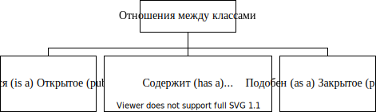
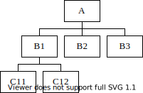
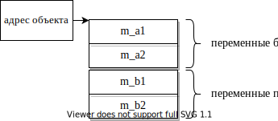
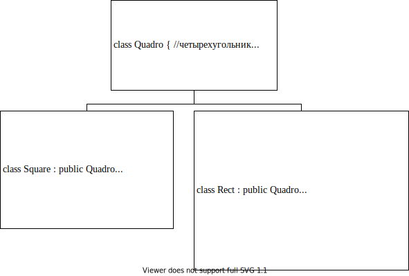
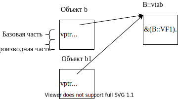
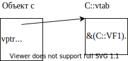
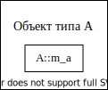

# Тема II. Открытое одиночное наследование

## Взаимоотношения между классами

_Правило 1: различайте понятия: «является» (is-а), «содержит» (has-а) и «подобен» (as-а)!_

Отношения между классами могут быть трех видов:



Замечание: для корректного построения иерархии классов программист
должен четко представлять различия этих трех видов взаимоотношений и
применять их исключительно по назначению.

## Одиночное (или простое) наследование

_Правило 2: не перегружайте базовый класс понятиями. Обычно для задания общих для всех потомков свойств достаточно в базовый класс ввести 7-8 понятий._

Классы чаще всего строятся постепенно, начиная от простых базовых
классов с общими для некоторого множества объектов свойствами и
заканчивая «навороченными» специализированными классами-монстрами.
Каждый раз, когда от предыдущего класса производится последующий,
производный класс наследует какие-то или все родительские качества,
добавляя к ним новые свойства (или, наоборот, убирая лишние). На
свойстве наследования основана популярность библиотек классов (таких
как MFC, OWL и Qt). При этом ощутимым преимуществом для программиста
является использование разработанных и отлаженных профессионалами
классов в качестве базовых для своих более специализированных целей.

Наследование может быть одиночным или множественным. Отличия:

+---------------------------------+---------------------------------+
| одиночное                       | множественное                   |
+=================================+=================================+
| Каждый производный класс имеет  | Производный класс наследует     |
| только одного непосредственного | свойства двух и более           |
| предка (хотя иерархия может     | «родителей»                     |
| быть достаточно сложной)        |                                 |
+---------------------------------+---------------------------------+
|         |          |
+---------------------------------+---------------------------------+

Замечание: множественное наследование сложнее в реализации и будет
рассмотрено позже ([раздел «Множественное наследование»](#тема-x.-множественное-наследование)).

### Объявление производного класса при одиночном наследовании

```cpp
class имя_производного_класса : [спецификатор_наследования]
имя_базового_класса {
    список_членов_производного_класса
};
```

Например:

```cpp
class А { список членов класса А }; //базовый класс
class В : public А { список членов класса В}; //производный класс
```

Такое объявление говорит компилятору о том, что:

-   класс `B` включает в себя, как составляющую весь класс `A`,

-   в зависимости от спецификатора наследования и спецификаторов
    доступа методы класса `B` имеют право обращаться к членам класса
    `A` или нет.

Замечание: конструкторы, деструкторы и оператор присваивания не
наследуются! Наследуются данные и остальные методы класса.

### Спецификатор `protected` в базовом классе

Спецификатор `protected` используется при наследовании и действует
только в методах класса. Означает:

+---------------------+----------------------+----------------------+
| Спецификатор        | Доступ извне         | Доступ из методов    |
| доступа в           | посредством объекта  | производного класса  |
| базовом классе      | производного класса  | к элементам базового |
|                     |                      | класса               |
+=====================+======================+======================+
| `public:`           | доступен             | доступен             |
+---------------------+----------------------+----------------------+
| `protected:`        | не доступен          | доступен             |
+---------------------+----------------------+----------------------+
| `private:`          | не доступен          | не доступен          |
+---------------------+----------------------+----------------------+

Пример:

```cpp
class A
{
    int m_a1;
    void FA1();
protected:
    int m_a2;
    void FA2();
public:
    void FA3();
};
class B : public A
{
    int m_b1;
    void FB1();
protected:
    int m_b2;
    void FB2();
public:
    void FB3();
};
```

Внутри метода производного класса:

```cpp
void В::FB3()
{
    m_b1 = 1; //ОК
    ...
    FA3();    //ОК
    m_a2 = 2; //ОК
    FA2();    //ОК
//  m_a1 = 2; //ошибка — нет прав доступа
//  FA1();    //ошибка — нет прав доступа
}
```

«Извне» класса:

```cpp
int main()
{
    А а; //вызывается конструктор А
```


```cpp
    B b; //конструктор А, потом В
```



```cpp
    //доступ к членам посредством объекта базового типа
    а.FA3(); //ОК
    //доступ к членам посредством объекта производного типа
    b.FB3(); //ОК
    b.FA3(); //ОК
}
```

### Спецификаторы наследования при объявлении производного класса

```cpp
class A {
    ...
};
class B: <спецификатор наследования> A {
    ...
};
```


Замечание: если спецификатор наследования опущен, то компилятор по
умолчанию считает, что он `private`!

Закрытое наследование специфично и будет рассмотрено позже (раздел
«Закрытое наследование»).

### Порядок вызовов конструкторов при создании экземпляра производного класса

При создании экземпляра любого класса любым способом вызывается его
конструктор. Если класс является производным, кроме конструктора
данного класса должен быть также вызван конструктор базового класса.
Создание объекта начинается с базовой части, поэтому порядок вызовов
конструкторов в C++ фиксирован: прежде всего вызывается конструктор
базового класса, затем вызываются конструкторы всех промежуточных
классов согласно иерархии наследования, и наконец, вызывается
конструктор целевого класса. Приведенный порядок имеет смысл,
поскольку производные классы имеют более специализированный характер,
чем базовый, поэтому специализированная часть «накладывается» поверх
общей.

Пример:

```cpp
class A { ... };
class B : public A { ... };
class C : public B { ... };
```

При создании экземпляра класса C конструкторы вызываются в следующем
порядке:

```
A::A() -> B::B() -> C::C()
```

Осуществляется вызов конструктора базового класса в том коде, который
компилятор генерирует по открывающей фигурной скобке конструктора:

```cpp
C::C(параметры)
{//вызов конструктора базового класса B
    //тело конструктора класса C
}
B::B(параметры)
{//вызов конструктора базового класса A
    //тело конструктора класса B
}
A::A(параметры)
{
    //тело конструктора класса A
}
```

### Порядок вызовов деструкторов при разрушении экземпляра производного класса

Деструкторы при разрушении объекта производного класса вызываются в
порядке, обратном вызову конструкторов Причина та же: сначала
разрушаются специализированные части, затем общие. Например, при
разрушении экземпляра класса `C` порядок вызовов деструкторов будет
следующим:

```
C::~C() -> B::~B() -> A::~A()
```

Осуществляется вызов деструкторов базового класса в том коде, который
компилятор генерирует по закрывающей фигурной скобке деструктора:

```cpp
C::~C()
{
    //тело деструктора класса C
}//вызов деструктора базового класса B
B::~B()
{
    //тело деструктора класса B
}//вызов деструктора базового класса A
A::~A()
{
//тело деструктора класса A
}
```

Замечание: если объект был создан динамически, то при выполнении
оператора `delete` сначала вызываются деструкторы, а потом только
освобождается память (то есть на время выполнения деструктора сам
объект еще гарантированно существует).

### Аргументы конструктора, передаваемые в базовый класс

Так как производный класс содержит в себе базовую часть, при создании
экземпляра производного класса обычно возникает необходимость передать
какие-то параметры конструктору базового класса. Так как конструктор
базового класса выполняется раньше, чем конструктор производного, то
конструктору базового класса нужно __явно__ передать предназначенные ему
параметры. Поэтому для передачи параметров конструктору базового
класса используется специальная запись.

Модифицируем класс `Animal`. До сих пор мы абстрагировали какое-то
обобщенное животное. Теперь вынесем общие для любого животного
свойства в базовый класс, а от него наследуем более
специализированный класс, абстрагирующий собаку.

```cpp
//Animal.h
enum SEX { MALE, FEMALE };
class Animal
{
protected://изменяем спецификатор доступа таким образом, чтобы эти
          //понятия были доступны методам производного класса
    int m_age; //у любого животного должен быть возраст
    SEX m_sex; //у любого животного должен быть пол
    char* m_pName; //у любого животного может быть имя
public:
    Animal(int age, SEX s, const char* pName = "");
};
```
```cpp
//Dog.h
#include "Animal.h" //компилятор должен знать свойства базового
                    //класса
class Dog : public Animal
{
    bool m_bHasMaster; //есть дикие и домашние собаки -> может быть
                       //хозяин
    char* m_pMasterName; //а если есть хозяин, то у него должно быть
                         //имя
public:
    Dog(int age, SEX s, bool master, const char* pName,
        const char* pMaster); //параметры age, s, pName предназначены
                  //конструктору базового класса, а параметры master
                  //и pMaster предназначены производному классу
};
```

```cpp
//Dog.cpp
Dog::Dog(int age, SEX s, bool master, const char* pName,
    const char* pMaster
    ) : Animal(age, s, pName) //передача параметров конструктору
                              //базового класса
{//здесь будет вызван конструктор базового класса с указанными
 //параметрами, который проинициализирует базовую часть объекта
    //работа с производной частью объекта
    m_bHasMaster = master;
    m_pMasterName = new char[strlen(pMaster) + 1];
    strcpy(m_pMasterName, pMaster);
}
```

#### 1.1.7. Специфика передачи параметров конструктору копирования базового класса

Если Вы явно не определяете в производном классе конструктор
копирования, то автоматический конструктор копирования
(сгенерированный компилятором) будет вызывать конструктор копирования
базового класса (определенный программистом или тоже автоматический).
Но, если Вы определяете в производном классе конструктор копирования,
но не вызываете явно конструктор копирования базового класса,
компилятор вызывать сам конструктор копирования базового класса не
будет, а базовая часть нового объекта будет сконструирована с помощью
default-конструктора.

```cpp
Dog::Dog(const Dog& ref)
    : Animal(ref) //указываем компилятору, каким конструктором
    //базового класса следует инициализировать базовую часть (в
    //нашем случае логично вызывать конструктор копирования базового
    //класса)

    //Замечание: компилятор сам неявно приведет тип
    //параметра const Dog& ref к константной ссылке базового типа
    //const Animals
{
    m_pMasterName = new char[strlen(ref.m_pMasterName) + 1];
    strcpy(m_pMasterName, ref.m_pMasterName);
    m_bHasMaster = ref.m_bHasMaster;
}
```

> Дана иерархия классов:
> 
> ```cpp
> class A { ... };
> class B : public A { ... };
> ```
> 
> Подумайте, для каких классов в приведенных ниже примерах программист
> должен явно реализовать конструктор копирования:
> 
> -   A — простой класс. B — простой класс
> 
> -   A — простой класс, B — сложный класс
> 
> -   A — сложный класс, B — простой класс
> 
> -   A — сложный класс, B — сложный класс

### Открытое (`public`) наследование

Иерархия классов работает эффективно только в том случае, если она
корректно спроектирована.

#### 1.1.8.  Правило №3

> Правило 3: открытое наследование в C++ моделирует следующее
> утверждение — «производный класс есть разновидность базового класса»
> ⇒ все. что применимо к базовому классу, должно быть также применимо
> к производному ⇒ везде, где может быть использован объект `A`, может
> быть использован и объект `В`, поскольку объект `В` содержит базовую часть `A`.

Пример:

```cpp
class Rect
{ //базовый класс абстрагирует обобщенный прямоугольник
    int m_left, m_right, m_top, m_bottom;
        //у любого прямоугольника должны быть координаты
public:
    Rect(int l, int t, int r, int b);
    //другие методы
};
class ColoredRect : public Rect //производный класс добавляет к
                                //координатам цвет
{
public:
    enum eColor { RED = 1, GREEN = 2, BLUE = 4 };
private:
    eColor m_color; //у цветного прямоугольника есть цвет
public:
    ColoredRect(int l, int t, int r, int b, eColor c);
    void SetColor(eColor c) { m_color = c; }
    //другие методы
};
int main()
{
    Rect r(1, 1, 5, 5);
    ColoredRect cr(2, 2, 10, 10, ColoredRect::RED);
    //очевидно:
    r.SetColor(ColoredRect::RED); //ошибка, так как в базовом классе
                                  //такого метода нет
    cr.SetColor(ColoredRect::RED); //OK
}
```

Глобальные функции, принимающие в качестве параметров адреса (ссылки
или указатели) или значения объектов пользовательского типа:

```cpp
Rect UnionRects(const Rect& ref1, const Rect& ref2)
    //все прямоугольники можно «объединить»
{
    int l, r, t, b;
    //Вычисление координат «описанного» прямоугольника
    Rect res(l, r, t, b);
    return res;
}
ColoredRect UnionColoredRects(const ColoredRect& ref1, const
    ColoredRect& ref2) //только у цветных прямоугольников можно
                       //«смешать» цвет
{
    int l, r, t, b;
    //Вычисление координат «описанного» прямоугольника
    unsigned int res_color = ref1.GetColor() | ref2.GetColor();
    ColoredRect res(l, r, t, b, static_cast<ColoredRect::
        eColor>(res_color));
    return res;
}
int main()
{
    Rect r; //объект базового типа
    ColoredRect сr; //объект производного типа
    Rect resR = UnionRects(r, сr); //OK — все прямоугольники можно
                                   //«объединить»
    //unsigned int col = UnionColoredRects(r,сr);
        //ошибка — только у цветных прямоугольников можно «смешать»
        //цвет
}
```

#### 1.1.9. Пример ошибочного построения иерархии классов при открытом наследовании

При открытом наследовании программист должен соблюдать правило: __все, что справедливо для базового класса, должно также выполняться для производного класса__. Следующий пример демонстрирует нарушение этого правила. Следствием является нерабочая иерархия классов:

В школе нас всех учили, что «квадрат — это прямоугольник, у которого
все стороны равны». Попробуем реализовать это утверждение посредством
иерархии классов.

```cpp
class Rect
{
    int left, top, right, bottom;
public:
    Rect(int l, int t, int r, int b)
    {
        left = l; top = t;
        right = r; bottom = b;
    }
    void InflateRect(int dleft, int dtop, int dright, int dbottom);
    //этот метод «раздвигает» стороны прямоугольника (каждую на свою
    //дельту)
};
class Square :public Rect //наследует метод InflateRect
{
//координаты квадрата хранятся в базовой части
public:
    Square(int l, int t, int dx) :
        Rect(l, t, l + dx, t + dx)
    {} //конструктор принимает в качестве параметров координаты
       //центра и длину стороны -> создается всегда квадрат!!!
};
int main()
{
    Rect r(1, 2, 10, 20); //прямоугольник (стороны не равны)
    Square sq(2, 2, 5); //квадрат (все стороны равны)
    r.InflateRect(5, 6, 7, 8); //ОК — раздвинули стороны
                               //прямоугольника на разные дельты
    sq.InflateRect(5, 6, 7, 8); //наш квадрат «вырождается» в
                                //прямоугольник
}
```

То есть некоторые утверждения, справедливые для прямоугольников, не
выполняются для квадратов. А открытое наследование предполагает, что
**ВСЕ,** что применимо к базовому классу, также применимо и к объектам производного класса!

Вариант правильного с точки зрения C++ построения иерархии: любой
четырехугольник всегда может изменять все свои координаты на одно и то же приращение. К функциональности базового класса прямоугольник
добавляет специфические для прямоугольников методы: все четыре
координаты можно изменить каждую на свою дельту или прямоугольника можно «растянуть» по координате `x` на одну дельту (влево и вправо), а по координате `y` на другую дельту (вверх и вниз).



> Замечание: при таком построении иерархии методы производного класса
> 
> ```cpp
> void Rect::Inflate(int dleft, int dtop, 
>     int dright, int dbottom);
> void Rect::Inflate(int dx, int dy);
> ```
> 
> перекрывают область видимости метода базового класса
> `void Quadro::lnflate(int d);`{.cpp} поэтому в следующем фрагменте компилятор выдаст ошибку:
> 
> ```cpp
> {
>     Rect r(1, 2, 3, 4);
>     //r.Inflate(5); //компилятор выдает диагностику о том, что
>                     //подходящего метода в классе Rect нет
> }
> ```
> 
> Но! Всегда существует возможность вызвать любой `public` метод базового класса при открытом наследовании
> ([раздел «Спецификатор разрешения области видимости при наследовании»](#спецификатор-разрешения-области-видимости-при-наследовании)).

## Полиморфизм. Виртуальные функции

Для пояснения понятия полиморфизма в языках программирования
рассмотрим аналог для разговорных языков (в частности русский язык
является исключительно полиморфным языком):

> __переводить__ (книгу, бабушку через дорогу, деньги, стрелку...)

Приведенный глагол можно связать с конкретным набором действий только
тогда, когда известен сам объект воздействия.

Полиморфизм в C++ является одним из наиболее туманных понятий с точки
зрения начинающего программиста. Полиморфизм — это свойство одного и
того же кода C++ вести себя по-разному в зависимости от текущих
условий выполнения программы. То есть во время выполнения программы в
том месте, где программист вызывает метод класса, компилятор
закладывает возможность вызова методов разных классов, связанных между собой наследованием (не путайте с перегрузкой имен функций — какая из одноименных функций будет вызвана, решает компилятор на этапе компиляции!).

Специфика:

-   свойством полиморфизма могут обладать только методы класса (а
    обычные функции — не могут!),

-   механизм полиморфизма задействуется компилятором только в тех
    случаях, когда вызов метода осуществляется посредством адреса
    объекта, то есть посредством указателя или ссылки (в тех случаях,
    когда вызов метода осуществляется посредством объекта, компилятор
    генерирует обычный вызов метода класса — [раздел «Вызов нестатического метода класса»](#вызов-public-метода-класса-нестатического.-указатель-this))

-   при использовании виртуальных методов,

с одной стороны, программист получает несомненное преимущество -
возможность объединения и манипуляции объектами производного типа
посредством указателей или ссылок базового типа (при этом текст
программы становится более компактным).

с другой стороны, (так как чудес не бывает) увеличивается объем
используемой памяти и в некоторых случаях время выполнения.

### Раннее и позднее связывание

C++ — гибридный язык. Он совмещает как процедурные, так и объектно-
ориентированные возможности. Поэтому C++ использует и раннее, и
позднее связывание и предоставляет программисту преимущества (и
недостатки!) и одного, и другого.

Замечание: следует понимать, что при использовании раннего связывания
программисту приходится реализовывать сложную логику работы программы
«руками», например, используя громоздкие конструкции типа `switch-case`,
в то время как при позднем связывании платой за облегчение жизни
программиста является «более тяжелый» исполняемый код, занимающий
больше памяти и/или дольше работающий.

Для того, чтобы продемонстрировать удобство использования
полиморфизма, решим одну и ту же задачу с помощью раннего и позднего
связывания.

#### 1.1.10. Раннее связывание

Раннее связывание — это просто перегрузка имен функций. Этот механизм
работает на этапе компиляции, то есть при наличии нескольких функций с
одинаковым именем компилятор генерирует вызов конкретного тела
функции. В случае перегрузки имен глобальных функций компилятор
определяет, которую из функций следует вызвать в зависимости от
количества и/или типа параметров. Это также справедливо при перегрузке
имен методов одного и того же класса. Но при наследовании добавляется
еще одна возможность — перегрузка методов, которые выглядят абсолютно
одинаково (но действия совершают разные), например:

<!-- TODO -->

```cpp
enum ANIMAL_TYPE { ANY, DOG, CAT };
class Animal //базовый класс, описывающий любое обобщенное животное
{
    ...
public:
    ...
    void Voice() const { cout << "???"; }
        //заглушка, так как не очень понятно: что может «говорить»
        //такое обобщенное животное
};
class Dog : public Animal //производный класс, абстрагирующий собаку
{
    ...
public:
    ...
    void Voice() const { cout << "Гав !"; }
        //реализации данного метода для класса Dog предполагает одну
        //функциональность
};
class Cat : public Animal //производный класс, абстрагирующий кошку
{
    ...
public:
    ...
    void Voice() const { cout << "Мяу!"; }
        //а от кошки в точно такой же ситуации ожидается другая
        //функциональность
};
int main()
{
    Animal a;
    Dog d;
    Cat c;
    F1(&a); //будет выведено: "???"
    F1(&d); //"???"
    F1(&c); //"???"
    F2(&a, ANY); //"???"
    F2(&d, DOG); //"Гав!"
    F2(&c, CAT); //"Мяу!"
}
void F1(const Animal* p)//глобальная функция, которая принимает в
                        //качестве параметра указатель базового типа
                        //Animal*, а сам объект, адрес которого
                        //получает функция, может быть как базового
                        //типа Animal, так и любого производного
                        //типа — Dog или Cat
{
    p->Voice(); //так как указатель базового типа (не имеет
                //значения, какого типа объект!!!), во всех случаях
                //будет вызван метод базового класса Animal
}
void F2(const Animal* p, ANIMAL_TYPE type)
    //глобальная функция, которая принимает в качестве параметра
    //указатель базового типа Animal*, а сам объект, адрес которого
    //получает функция, может быть как базового типа Animal, так и
    //любого производного типа — Dog или Cat ⇒ так как нам нужна
    //разная функциональность для разных производных классов, а в
    //нашем распоряжении только указатель базового типа, приходится
    //вводить дополнительный признак: с каким именно объектом мы
    //имеем дело
{
    switch (type) //признак — какое животное
    {
    case DOG:
    {
        const Dog* pd = static_cast<const Dog*>(p);
            //так как p содержит адрес «собаки», приводим указатель
            //базового типа к Dog*
        pd->Voice();//вызывается метол класса Dog
        break;
    }
    case CAT:
    {
        const Cat* pc = static_cast<const Cat*>(p);
            //так как p содержит адрес «кошки», приводим указатель
            //базового типа к Cat*
        pc->Voice();//вызывается метод класса Cat
        break;
    }
    default:
        p->Voice(); //вызывается метод базового класса Animal
    }
}
```

Замечание: следует учитывать правила, которые действуют в случае
наследования при перегрузке имен функций. Метод производного класса
замещает для компилятора одноименный метод базового класса:

```cpp
class A
{
public:
    void f(int);
};
class B : public A
{
public:
    void f(const char*);
};
int main()
{
    B b;
    b.f(3); //ошибка: невозможно сконвертировать int в const char*
            //(то есть посредством объекта производного типа
            //компилятор «не видит» одноименный метод базового
            //класса)
}
```

#### 1.1.11. Позднее связывание. Виртуальные функции

Позднее связывание имеет смысл только для классов, связанных
наследованием. Для того чтобы метод класса C++ стал полиморфным, при
его объявлении нужно указать ключевое слово `virtual`. Если реализация функции отделена от объявления, то при определении ключевое слово `virtual` нe должно фигурировать, иначе компилятор выдаст ошибку. Полиморфные методы должны не только называться одинаково, но у них также должны совпадать количество и типы параметров, а также тип возвращаемого значения, а вот реализации у таких функций разные. Позднее связывание — это механизм этапа выполнения, то есть, какая из функций будет вызвана, определяется только во время выполнения программы.

Модифицируем предыдущий пример:

```cpp
class Animal
{//базовый класс, описывающий любое обобщенное животное
public:
    virtual void Voice() const { cout << "???"; }
        //метод базового класса стал виртуальным
};
class Dog : public Animal
{
public:
    virtual void Voice() const { cout << "Гав!"; }
        //в производном классе ключевое слово virtual не обязательно
        //(если Вы его не напишите, метод не перестанет быть
        //виртуальным), главное, чтобы в базовом классе метод был
        //объявлен виртуальным. С точки зрения документирования
        //Вашего кода рекомендуется этим ключевым словом напоминать
        //программисту о том, что метод виртуальный
};
class Cat : public Animal
{
public:
    virtual void Voice() const { cout << "Mяу!"; }
};
int main()
{
    Animal a;
    Dog d;
    Cat c;
    F(&a); //???
    F(&d); //Гав!
    F(&c); //Мяу!
}
void F(const Animal* p)//глобальная функция, которая принимает а
                       //качестве параметра указатель базового типа
                       //Animal*, а сам объект, адрес которого
                       //получает функция, может быть как базового
                       //типа Animal, так и любого производного типа
                       //— Dog или Cat
{
    p->Voice();//так как метод виртуальный, посредством указателя
               //базового типа во время выполнения будет вызываться
               //метод «целевого» класса (то есть того класса,
               //какого типа на самом деле объект)
}
```

> Замечание очевидное (на всякий случай): сигнатуры перегружаемых
> виртуальных функций должны быть одинаковыми! То есть функции должны
> иметь одинаковое количество параметров, одинаковые типы параметров и
> возвращаемого значения ⇒
> 
> `Animal::f()`{.cpp} и `Dog::f(int)`{.cpp} никаким полиморфизмом не связаны!!! Это просто перегрузка имен функций.

#### 1.1.12. Механизм вызова виртуальной функции

Чудес не бывает, поэтому за короткий и удобный код. написанный
программистом, кто-то должен «расплачиваться». Очевидно, что
нагрузка при реализации полиморфизма ложится на компилятора.
Рассмотрим, как реализован механизм «позднего связывания» в случае
простого (не множественного) наследования:

```cpp
class A
{
    int a;
public:
    virtual void VF1() { ... };
    virtual void VF2() { ... };
};
class B : public A
{
    int b;
public:
    virtual void VF1() { ... };
    virtual void VF2() { ... };
};
class C : public B
{
    int c;
public:
    virtual void VF1() { ... };
    virtual void VF2() { ... };
};
```

Механизм вызова виртуальной функции:

-   как только в объявлении класса появляется виртуальная функция,
    компилятор для данного класса (а также для каждого производного) в единственном экземпляре формирует таблицу виртуальных функций
    `vtab`, в которую с известным ему смещением заносит адреса всех виртуальных методов класса. Перегруженные виртуальные функции имеют одинаковые смещения в таблицах виртуальных функций для разных классов, связанных наследованием.

-   при создании каждого экземпляра такого класса компилятор
    расплачивается выделением дополнительной памяти. Теперь каждый экземпляр класса содержит не только поля, предназначенные для хранения данных, но и служебное поле для хранения указателя на таблицу виртуальных функций данного класса — `vptr`. Так как программист всегда явно указывает, объект какого класса он хочет создать, в самом объекте `vptr` всегда содержит адрес «своей» таблицы виртуальных функций.

-   вызов виртуальной функции посредством адреса объекта в отличие от
    обычного метода класса происходит поэтапно:

    а)  зная адрес объекта и местоположение в объекте `vptr` (
        указателя на таблицу виртуальных функций) и смещение адреса требуемой функции в таблице vtab, компилятор вычисляет адрес виртуальной функции в таблице виртуальных функций очевидным образом: `vрtr[смещение]`.

    б)  по вычисленному адресу передает управление (таким образом
        осуществляет вызов виртуальной функции целевого класса во время выполнения), передавая в качестве дополнительного параметра, как и в случае обычных методов класса, адрес того объекта, для которого вызывается виртуальная функция:

    Замечание: при вызове виртуальной функции компилятор не знает, какого типа объект (ему эта информация не нужна). Для вызова компилятору достаточно располагать следующей информацией: адрес объекта, расположение в объекте указателя `vptr` и смещение адреса требуемого метода в таблице `vtab`.

```cpp
int main()
{
    A a(1);
```


```cpp
    B b(2, 3);
    B b1(4, 5);
```



```cpp
    C с(6,7,8);
```



```cpp
    GF1(&a); //в функции посредством указателя базового типа будет
             //косвенно посредством таблицы виртуальных функций
             //вызван метод A::VF1(), так как объект типа A
    GF1(&b); //в функции посредством указателя базового типа будет
             //косвенно посредством таблицы виртуальных функций
             //вызван метод B::VF1(), так как объект типа В
    GF1(&c); //C::VF1(), так как объект типа C
    GF2(a); //в функции посредством ссылки базового типа будет
            //косвенно посредством таблицы виртуальных функций
            //вызван метод A::VF1() , так как объект типа A
    GF2(b); //B::VF1()
    GF2(c); //C::VF1()

//но!
    a.VF1(); //а при вызове виртуального метода посредством объекта
             //вызов формируется на этапе компиляции (как и для
             //обычного метода класса), то есть а данном случае
             //таблица виртуальных функций не задействуется,
             //косвенный вызов не генерируется. Вызывается метод
             //A::VF1()
    b.VF1(); //В::VF1()
    c.VF1(); //C::VF1()
}
void GF1(A* p) //функция принимает указатель базового типа, а сам
               //объект может быть как базового, так и любого
               //производного типа
{
    p->VF1();//вызов метода генерируется «косвенно» посредством
             //таблицы виртуальных функций целевого класса
             //компилятор сгенерирует код (*p->vptr[i])(р);, где р
             //будет в методе VF1 фигурировать как this
}
void GF2(A& r) //функция принимает ссылку базового типа, а сам
               //объект может быть как базового, так и любого
               //производного типа
{
    r.VF1();//вызов метода генерируется «косвенно» посредством
            //таблицы виртуальных функций целевого класса
}
```

> Замечание: так как при появлении виртуальных функций компилятор
> отводит дополнительную память для хранения указателя `vptr`.
> соответственно формируются результаты оператора `sizeof`:
> 
> ```cpp
> size_t n = sizeof(A); //???
> ```

> Вопрос:
> 
> 1. можно ли вызывать виртуальные методы в конструкторах?
> 2. в деструкторах?

#### 1.1.13. Виртуальные деструкторы

Большинство методов класса (кроме конструкторов) могут быть, а иногда
и должны быть виртуальными, в том числе и деструктор (несмотря на то,
что в разных классах имена этих методов разные!!!, но смысл
одинаковый).

Например: сначала рассмотрим случай, когда деструкторы не виртуальные:

```cpp
class Animal
{
public:
    ~Animal();
};
class Dog : public Animal
{
public:
    ~Dog();
};
int main()
{
    //Объединим всех животных в зоопарк: это возможно сделать только
    //посредством указателей базового типа:
    Animal* zoo[] = { new Animal(параметры), new Cat(...),
        new Dog(...) };
    //Подумайте, почему нельзя определить массив
    //Animal zoo[] = { Animal (...), Cat (...), Dog (...) }; ???

    for (int i = 0; i < sizeof(zoo) / sizeof(Animal*); i++)
    {
        zoo[i]->Voice();//вызов виртуального метода целевого класса
        delete zoo[i]; //при i=0 вызовется деструктор Animal, при
                       //i=1 вызовется _только деструктор базового
                       //класса_, так как указатель типа Animal* ⇒
                       //производная часть CaL не будет корректно
                       //освобождена при i-2 вызовется тоже _только
                       //деструктор базового класса_, ⇒ производная
                       //часть Dog не будет корректно освобождена
    }
}
```

Объявляем деструкторы виртуальными:

```cpp
class Animal
{
public:
    virtual ~Animal();
};
class Dog : public Animal
{
public:
    virtual ~Dog(); //ключевое слово virtual в производном классе
                    //необязательно.
};
int main()
{
    Animal* zoo[] = { new Animal(параметры), new Cat(...),
        new Dog(...) };
    for (int i = 0; i < sizeof(zoo) / sizeof(Animal*); i++)
    {
        zoo[i]->Voice();//вызов виртуального метода целевого класса
        delete zoo(i); //при i=0 вызовется деструктор Animal, при
                       //i=1 вызовется сначала деструктор Cat, а
                       //потом деструктор базового класса Animal,
                       //при i=2 вызовется сначала деструктор Dog, а
                       //потом деструктор базового класса Animal
    }
}
```

> Замечание: объявлять деструктор вообще незачем, тем более делать его
> виртуальным, если он (или деструктор класса-потомка) не делает
> каких-нибудь существенных действий — например, освобождает динамически захваченную память.

#### 1.1.14. Спецификатор разрешения области видимости при наследовании

Если в базовом и производном от него классах объявлены переменные или
методы с одинаковыми именами, то «увидеть» соответствующие `public`
элементы базового класса посредством объекта производного класса или
`protected` члены базового класса из методов производного можно с
помощью оператора разрешения области видимости «`имя_класса::`» Например:

```cpp
class A
{
    ...
public:
    virtual void VF();
};
class B : public A
{
    ...
public:
    virtual void VF();
};
int main()
{
    A* p = new B();
//посредством указатели (или ссылки)
    p->VF(); //генерируется косвенный вызов посредством таблицы
             //виртуальных функций — будет вызвана B::VF()
    p->A::VF(); //компилятору явно дано указание ⇒ вызов
                //генерируется на этапе компиляции — будет вызвана
                //A::VF()
//посредством объекта
    B b;
    b.A::VF();
}
```

или внутри метода класса (это прием, который используется,
например, в библиотеке классов MFC):

```cpp
void B::VF()
{
    A::VF(); //вызов метода базового класса для выполнения работы с
             //базовой частью объекта
    ... //работа со своей производной частью
}
```

Замечание: в случае виртуальных функций явное указание области
видимости предписывает компилятору _на этапе компиляции_
сгенерировать вызов метода _указанного класса_, тем самым,
отменяя в данном конкретном случае позднее связывание.

#### 1.1.15. Прием проектирования

```cpp
class A
{
    int m_a;
public:
    void fGeneral()
    {
        fPrivate(); //базовая часть работы всегда!
        fVirtual(); //а здесь посредством указателя this вызывается
                    //метод целевого класса в зависимости от типа
                    //объекта!
    }
private:
    void fPrivate() { ... }
    virtual void fVirtual() { ... }
};
class B : public A
{
    virtual void fVirtual() { ... }
};

    A* pA = new A();
    A* pB = new B();
    pA->fGeneral(); //A::fGeneral(), A::fVirtual
    pB->fGeneral(); //A::fGeneral(), B::fVirtual
```

#### 1.1.16. Изменение спецификатора доступа в производном классе

Замечание: вряд ли стоит изменять спецификатор доступа виртуального
метода в производных классах, поэтому можно рассматривать приведенный
ниже пример в качестве трюка:

```cpp
class A
{
public:
    virtual void F();
};
class B : public A
{
private:
    virtual void F(); //перегруженный метод находится в защищенной
                      //секции
};
void F(A* р)
{
    p->F();//если объект В, то будет вызвана private метод класса
           //В!!!
}
```

#### 1.1.17. Конструктор копирования и виртуальные функции

```cpp
class A
{
    virtual void f();
};
class B : public A
{
    virtual void f();
};
int main()
{
    B b; //таблица виртуальных функций класса В
    A а = b; //а создается объект класса A, поэтому сначала
             //конструктор формирует A::vptr=&A::vtab, а потом
             //переписывает базовую часть объекта b в а посредством
             //конструктора копирования класса A
}
```

#### 1.1.18. Чисто виртуальные (pure virtual) функции и абстрактные классы

Иногда при построении иерархии классов базовый класс является
настолько обобщенным, что объектов такого типа просто не существует.
Например, до сих пор мы создавали экземпляры класса `Animal`, но на
самом деле такого «обобщенного» животного в природе нет, зато есть
кошки, собаки... Такой базовый класс хранит общие для всех животных
данные (пол. возраст...) и посредством методов базового класса
реализуется общее для всех животных поведение. Но реализацию некоторых
методов (`Voice`) можно написать только для конкретного животного, а в базовом классе вложить какой-то смысл в такой метод невозможно (что
может «сказать» какое-то обобщенное животное?). Поэтому до сих пор
метод базового класса `Voice` был просто заглушкой (пустое тело функции или `"???"`). Посредством использования чисто виртуальных функций программист может сообщить компилятору, что данный класс является абстракцией, поэтому реализацию такого метода компилятор должен искать в производных классах.

Чисто виртуальная функция объявляется в базовом классе следующим
образом:

```cpp
class A
{
    virtual void VirtFunc() = 0;
        //=0 делает функцию чисто виртуальной.Чисто виртуальный
        //метод может, но не обязан иметь тело
};
```

Класс, содержащий хотя бы одну pure virtual-функцию, называется
__абстрактным__. Следствия:

-   компилятор не позволит создавать объекты такого класса:

-   абстрактный класс может использоваться только в качестве
    базового для других классов;

-   реализация чисто виртуальной функции не обязательна;

-   компилятор будет следить за тем, чтобы в производных классах
    такой метод был реализован;

-   можно пользоваться указателем или ссылкой базового типа (на
    абстрактный класс).

Пример:

```cpp
class Animal
{
    ...
public:
    virtual void Voice() const = 0;
        //Обратите внимание: не требуется определение чистой
        //виртуальной функции! (реализация может быть, но она
        //необязательна!! !)
};
class Dog : public Animal
{
    ...
public:
    virtual void Voice() const { cout << "Гав!"; }
        //реализация чисто виртуальной функции в производном классе
        //Dog
};
class Cat :public Animal
{
    ...
public:
    virtual void Voice() const { cout << "Mяy!"; }
        //реализация чисто виртуальной функции в производном классе
        //Cat
};
void F(const Animal* p)
{
    p->Voice(); //вызов метода целевого класса
}
int main()
{
//  Animal an; //ошибка компилятора — нельзя создать экземпляр
               //абстрактного класса
    Dog dog;
    F(&dog); //корректно — функция принимает указатель базового типа
             //⇒ компилятор неявно преобразует указатель Dog* в
             //указатель Animal*
    Animal* zoo[] = { new Dog, new Cat, ... };
        //корректно — массив указателей базового типа, а сами
        //объекты производных типов
    for (int i = 0; i < sizeof(zoo) / sizeof(Animal*); i++)
    {
        zoo[i]->Voice(); //вызов виртуального метода целевого класса
        //Если массив больше не нужен, не забудьте освободить память
        delete zoo[i];
    }
}
```

> Замечание: класс, содержащий только чисто виртуальные функции,
> называется классом-протоколом (задает для производных классов только
> интерфейс без какой-либо реализации и заставляет каждый производный
> класс иметь собственную реализацию заданного интерфейса).

### Наследование интерфейса и наследование реализации при открытом наследовании

При открытом наследовании базовый класс может предоставлять
производным:

-   __реализацию__ — некоторую общую для всех потомков
    функциональность
    (то есть не предполагается, что в производном классе в указанное
    базовым классом действие можно вложить другой смысл). Например:
    метод базового класса void `Animal::IncYear(){ m_age++; }`{.cpp} не может вести себя по-другому в производных классах:

-   __интерфейс__ — только обозначение действия, так как базовый класс в
    этом случае «знает», что такое действие должно иметь место в
    производных классах, но «не знает» как такое действие реализовать
    в базовом.

    Например: `virtual void Animal::Voice() = 0;`{.cpp}

-   __реализацию «по умолчанию» + интерфейс__ (то есть производный класс
    может пользоваться функциональностью базового или вложить свой
    собственный смысл в указанное действие). Например:
    `virtual void Animal::WhenDoISleep() { cout << "At night"; }`{.cpp} — поведение по умолчанию

    `virtual void Dog::WhenDoISleep() { cout << "20 hours a day"; }`{.cpp} — производный класс может вложить новый смысл в данное действие, перегрузив виртуальный метод, или пользоваться базовой версией по умолчанию. То есть, если в производном классе не определен метод `WhenDolSleep()`{.cpp}, то животное будет спать по умолчанию по ночам.

```cpp
class Animal
{
public:
    virtual void Voice() = 0;
        //объявление pure virtual функции эта абстракция должна быть
        //определена в производных классах, так как каждое животное
        //«говорит» по-своему и нельзя придумать что- либо общее.
    virtual void WhenDoISleep() { std::cout << "At night" << endl; }
        //может быть переопределена в производных классах или нет,
        //тогда такие производные классы пользуются базовой версией,
        //которая делает что-то по умолчанию: Animal::WhenDoISleep()
    void IncYear();
        //не предполагает, что она будет вести себя иначе в
        //производных классах
};
class Dog : public Animal
{
public:
    virtual void Voice() { std::cout << "Gav" << endl; }
    virtual void WhenDoISleep()
    {
        std::cout << "20 hours a day" << endl;
    } //а можно и не переопределять, и пусть спит по умолчанию ночью
};
```

> Правило №4: различайте наследование интерфейса и реализации!


```cpp
int main()
{
    Animal* zoo[] = { new Dog(), new Cat() };
    for (int i = 0; i < sizeof(zoo) / sizeof(zoo[0]); i++)
    {
        zoo[i]->IncYear(); //вызывается метод базового класса
        zoo(i]->Voice(); //вызывается метод «целевого» класса
        zoo[i]->WhenDoISleep(); //если в производном классе такой
                                //метод не определен, то вызывается
                                //метод базового класса, иначе метод
                                //«целевого» класса
    }
}
```

### Механизм наследования интерфейса и реализации посредством таблиц виртуальных функций

Примеры формирования таблиц виртуальных функций:

1. Использование производным классом функциональности базового класса

```cpp
class A
{
    ...
public:
    virtual void f();
    //так как появился виртуальный метод, компилятор создаст для
    //класса A таблицу виртуальных функций и занесет в нее адрес
    //метода класса A
    //+-------+
    //|A::vtab|
    //+=======+
    //|&(A::f)|
    //+-------+
};
class В : public A
{
    ...
    //виртуальный метод f() _не перегружен!!!_ ⇒ класс В будет
    //пользоваться базовой реализацией

    //Так как в базовом классе есть виртуальный метод, для
    //производного класса В компилятор создаст свою таблицу
    //виртуальных функций, но так как в классе В виртуальный метод
    //отсутствует, то в таблицу будет занесен адрес метода базового
    //класса
    //+-------+
    //|В::vtab|
    //+=======+
    //|&(A::f)|
    //+-------+
};
class С : public В
{
    ...
public:
    virtual void f();
    //виртуальный метод перегружен, поэтому в таблицу виртуальных
    //функций компилятор занесет адрес метода класса C
    //+-------+
    //|C::vtab|
    //+=======+
    //|&(C::f)|
    //+-------+
};
int main()
{
    A* pA = new A;
    A* pB = new В;
    A* pC = new С;
    pA->f(); //A::f();
    pB->f(); //A::f();
    pC->f(); //C::f();
}
```

2. Более сложные случаи:

```cpp
class A
{
    int m_а;
    ...
public:
    void f();//метод не виртуальный, поэтому в таблицу виртуальных
             //функций адрес не заносится. Более того, если в классе
             //виртуальных методов нет, то таблицу виртуальных
             //функций компилятор для класса A создавать не будет!
};
class В : public A
{
    int m_b;
    ...
public:
    virtual void f(); //метод объявлен как виртуальный, поэтому
                      //компилятор создает таблицу виртуальных
                      //функций и заносит в нее адрес метода класса В
                      //+-------+
                      //|В::vtab|
                      //+=======+
                      //|&(В::f)|
                      //+-------+
};
class С : public В
{
    int m_c;
    ...
public:
    virtual void f(); //виртуальный метод перегружен (ключевое слово
                      //virtual необязательно), поэтому в таблицу
                      //виртуальных функций компилятор занесет адрес
                      //метода класса С
                      //+-------+
                      //|C::vtab|
                      //+=======+
                      //|&(C::f)|
                      //+-------+
};
int main()
{
    A* pA = new A;
```



```cpp
    pA->f(); //так как в классе A нет виртуальных функций,
             //компилятор генерирует обычный вызов не виртуального
             //метода A::f() (таблиц виртуальных функций не
             //используется, так как для класса A компилятор ее не
             //создает !!!)
    В* рВ1 = new В;
    A* рA1 = рВ1;
```


```cpp
    рA1->f(); //обычный вызов не виртуального метода A::f()
    рВ1->f(); //косвенный вызов B::f() посредством таблицы
              //виртуальных функций
    С* рС = new С;
    A* рA2 = рС;
    В* рВ2 = рС;
```


```cpp
    рA2->f(); //обычный вызов не виртуального метола A::f()
    рВ2->f(); //косвенный вызов С::f() посредством таблицы
              //виртуальных функций
    рС->f(); //косвенный вызов С::f() посредством таблицы
             //виртуальных функций
}
```

