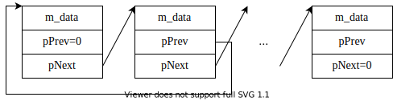

# Тема VI. Встроенные объекты (composition). Отношение между классами «содержит»

## Понятие встроенного объекта

В качестве переменной класса `А` может фигурировать объект другого
класса. `B` этом случае говорят, что объект класса `А` __содержит__ объект
класса `B`. Или объект класса `B` __встроен__ или __внедрен__ в объект класса `А`
Например:

```cpp
class Point
{
    int m_x, m_y;
public:
    Point(int x, int y) { m_x = x; m_y = y; }
    ...
};
class Rect
{
    Point m_LeftTop; //встроенный объект
    Point m_RightBottom; //встроенный объект
public:
    ...
};
```

## Конструирование и уничтожение встроенных объектов

```cpp
int main()
{
    Rect r; //создание объекта типа Rect
}
```

Последовательность создания объекта типа выглядит следующим образом:

-   компилятор, заранее зная, сколько памяти потребуется для объекта
    `Rect` (вместе с внедренными объектами `Point`), сразу же выделяет
    соответствующий объем памяти;

-   если бы класс Rect был производным, компилятор сначала вызвал бы
    конструктор базового класса;

-   вызываются конструкторы (в нашем случае **по умолчанию)**
    внедряемых объектов `Point`. *Замечание:* члены класса
    инициализируются в порядке их объявления в классе;

-   вызывается конструктор `Rect` (в нашем случае по **умолчанию).**

*Замечание:* порядок разрушения объекта прямо противоположен порядку
его создания. То есть в деструкторе `Rect` встроенные объекты `Point`
гарантированно еще существуют!

## Передача параметров конструктора встроенным объектам. Список инициализации конструктора

Так как сначала вызываются конструкторы встроенных объектов, возникает
та же проблема, что и при передаче параметров базовому классу.
Существуют два способа передать параметры конструктора встроенным
объектам:

-   присваивание в теле конструктора;

-   список инициализации конструктора.

Отличие:

+---------------------------------+---------------------------------+
| Присваивание в теле             | Список инициализации            |
| конструктора                    |                                 |
+=================================+=================================+
| 1. Компилятор, заранее зная,    | ⇒                               |
| сколько памяти потребуется      |                                 |
| объекта `Rect` (вместе с        |                                 |
| внедренными объектами `Point`), |                                 |
| сразу же выделяет               |                                 |
| соответствующий объем памяти.   |                                 |
+---------------------------------+---------------------------------+
| 2. Вызываются конструкторы      | 2. Вызываются конструкторы      |
| **по умолчанию** внедряемых     | внедряемых объектов `Point`     |
| объектов `Point`.               | сразу с                         |
|                                 | __указанными параметрами__.     |
+---------------------------------+---------------------------------+
| 3. Вызывается конструктор       | 3. Вызывается конструктор       |
| Rect. В теле конструктора       | `Rect`                          |
| __уже проинициализированные__   |                                 |
| внедренные объекты принимают    |                                 |
| новые значения                  |                                 |
+---------------------------------+---------------------------------+

Чтобы при конструировании объекта типа `Rect` компилятор вызывал
конструкторы встроенных объектов сразу с __требуемыми значениями__, нужно использовать специальную запись, аналогичную записи для передачи параметров конструктору базового класса:

```cpp
class Rect
{
    Point m_LeftTop, m_RightBottom;
public:
```

+---------------------------------+---------------------------------+
| Присваивание в теле             | Список инициализации            |
| конструктора                    |                                 |
+=================================+=================================+
| ```cpp                          | ```cpp                          |
| Rect(const Point& pt1,          | Rect(const Point& pt1,          |
|      const Point& pt2) {        |      const Point& pt2)          |
| //компилятор вызывает default   |     : m_LeftTop(pt1)            |
| //конструкторы для встроенных   |     , m_RightBottom(pt2)        |
| //объектов                      | { //компилятор вызывает для     |
|     m_LeftTop = pt1;            |   //встроенных объектов         |
|     m_RightBottom = pt2;        |   //конструкторы копирования и  |
| //уже проинициализированным пo  |   //сразу же создает их с       |
| //умолчанию объектам            |   //требуемыми значениями       |
| //присваиваются новые значения  | }                               |
| //с помощью оператора           | ```                             |
| //присваивания                  |                                 |
| }                               |                                 |
| ```                             |                                 |
+---------------------------------+---------------------------------+
| ```cpp                          | ```cpp                          |
| Rect(int left, int top,         | Rect(int left, int top,         |
|      int right, int bottom)     |      int right, int bottom)     |
| { //компилятор вызывает default | : m_LeftTop(left, top)          |
|   //конструкторы для встроенных | , m_RightBottom(right, bottom)  |
|   //объектов                    | { //компилятор вызывает для     |
| m_LeftTop = Point(left, top);   |   //встроенных объектов         |
| m_RightBottom =                 |   //конструкторы с требуемыми   |
|     Point(right, bottom);       |   //значениями                  |
| //создаются автоматические      | }                               |
| //неименованные объекты и уже   | ```                             |
| //проинициализированным по      |                                 |
| //умолчанию встроенным объектам |                                 |
| //присваиваются новые значения  |                                 |
| //с помощью оператора           |                                 |
| //присваивания                  |                                 |
| }                               |                                 |
| ```                             |                                 |
+---------------------------------+---------------------------------+

```cpp
    ...
};
```

> Рекомендация: предпочитайте инициализацию присваиванию в
> конструкторах. Это уменьшает накладные расходы на лишний вызов
> функции.

Замечания:

1.  В приведенном примере реализация метода совмещена с объявлением.
    Если объявление и реализация метода разнесены, то (как и в случае
    передачи параметров конструктору базового класса) синтаксическая
    конструкция «`:`» может быть указана только при определении метода:

```cpp
//Файл rect.h
class Rect
{
    ...
    Rect(int left, int top, int right, int bottom);
        //объявление конструктора
};

//Файл rect.cpp
//Реализация конструктора:
Rect::Rect(int left, int top, int right, int bottom)
    : m_LeftTop(left, top), m_RightBottom(right, bottom)
{
    ...
}
```

2.  Если программист явно с помощью списка инициализации не указал
    компилятору как следует создавать встроенные объекты, то они будут
    проинициализированы с помощью конструктора по умолчанию.

3.  Переменные базовых типов можно также инициализировать с помощью
    списка (они тоже являются встроенными низкоуровневыми «объектами»,
    только базового типа):

```cpp
Point::Point() { m_х = m_y = 0; } //так мы поступали с переменными 
                                  //класса базового типа до сих пор
                                  //(присваивание в теле 
                                  //конструктора)
Point::Point(int х, int у) : m_x(x), m_у(у) //а можно и так (список
{ ... }                                     //инициализации)
```

Если для встроенных объектов пользовательского типа использование
списка инициализации дает несомненные преимущества, то для базовых
типов особого выигрыша не получается, так как в обоих случаях
низкоуровневый код генерируется одинаковый.

4.  Если Вы реализовали конструктор по умолчанию класса `Rect`
    следующим образом:

```cpp
Rect::Rect()
{
    //пустое тело
}
```

это означает, что Вас устраивает конструирование встроенных объектов с
помощью `default` конструктора класса `Point`. Но, если Вы хотите
создавать объекты класса `Rect` по умолчанию с другими значениями, то
можно использовать список инициализации, например:

```cpp
Rect::Rect() : m_LeftTop(l, 1), m_RightBottom(100,100)
{
    ...
}
```

5. Если класс, с одной стороны, является производным, а, с другой
стороны, содержит встроенные объекты, то требуется передать параметры
как конструктору базового класса, так и конструкторам встроенных
объектов. Для этого все вызовы указываются в одном списке через
запятую в любом порядке (а выполняться будут в строго определенном -
сначала конструктор базового класса, а потом конструкторы встроенных
объектов в порядке следования их в объявлении класса):

```cpp
class ColoredRect : public Rect
{
    int m_color;
public:
    ColoredRect(int left, int top, int right, int bottom, int color)
        : Rect(left, top, right, bottom), m_color(color)
    {
        ...
    }
};
```

## Когда без списка инициализации не обойтись

Для рассмотренных примеров можно было использовать список
инициализации конструктора или присваивание в теле конструктора. Выбор
влиял только на эффективность. Встречаются случаи, когда программист
просто обязан использовать список инициализации. Если членами класса
являются:

-   константные встроенные объекты,

-   ссылки.

И то, и другое должно быть проинициализировано при создании объекта!

Например:

```cpp
class A
{
    const int m_n;
    int& m_ref;
public:
    A(int n, int& r) : m_n(n), m_ref(r) { }
        //подумайте: можно ли параметр r передавать по значению???
//  А(): m_n(0), m_ref(???) { }; //для default конструктора 
                                 //непонятно, как сформировать 
                                 //адрес, которым должна быть 
};                               //проинициализирована ссылка
int main()
{
    int n = 5;
    A f(5, n);
//  A f1; //ошибка компилятора — все константы и ссылки должны быть
          //проинициализированы при создании!!!
}
```

## Порядок инициализации членов класса

Члены класса инициализируются в том порядке, в котором они указаны в
классе, поэтому порядок их следования в списке инициализации не имеет
ни малейшего значения! Если программист не знает этого правила, могут
возникать нетривиальные ошибки, например:

```cpp
class A
{
    int* m_p;
    int m_n;
public:
    A(int a) : m_n(a), m_p(new int[m_n]) { }
        //сначала компилятором будет вызван operator new будет 
        //вызван со случайным значением m_n, а потом 
        //проинициализирована переменная m_n значением параметра п
};
```

## Пример использования встроенных объектов для построения квадратов посредством прямоугольников

Замечание: этот прием используется в обобщенных классах стандартной
библиотеки при создании классов-адаптеров. Идея заключается в том, что
класс-адаптер содержит защищенный объект подходящего типа. Так как
объект защищен, весь его `public` интерфейс извне недоступен. Поэтому
пользоваться функциональностью такого встроенного объекта можно только
из методов класса-владельца. А владелец реализует свои методы,
пользуясь только теми возможностями встроенного объекта и только таким
образом, как ему удобно. Например, реализуем класс, абстрагирующий
квадрат, посредством встроенного объекта класса прямоугольник:

```cpp
class Rect
{
protected:
    int l, r, t, b;
public:
    Rect(int xl, int y1, int x2, int y2)
    {
        l = xl; r = x2; t = y1; b = y2;
    }
    void Inflate(int dl, int dr, int dt, int db)
    {
        l -= dl; r += dr; t -= dt; b += db;
    }
};
class Square
{
protected:
    Rect m_r;
public:
    void Inflate(int d) { m_r.Inflate(d, d, d, d); }
    Square(int x, int y, int d) : m_r(x, y, x + d, y + d) { }
};
int main()
{
    Square s(1, 1, 10);
    s.Inflate(2);
//  s.m_r.Inflate(1, 2, 3,4); //ошибка доступа
}
```

## Пример использования встроенных объектов «ассоциативный массив»

Ассоциативным массивом называется массив, в котором хранятся пары
ключ/значение. Поиск значения происходит по ключу. В приведенном
примере рассматривается не полноценный ассоциативный массив, а,
пожалуй, первое приближение к его настоящей реализации. Реализуем
«записную книжку», в которой будут храниться пары имя/телефон.

В реализуемом ассоциативном массиве введем ограничение — ключ должен
быть уникальным, то есть двух одинаковых имен быть не может.

Замечание: так как речь пойдет о массиве (не имеет значения его
внутренняя реализация), то очевидно потребуется перегрузка оператора
`[]`. Если для обычных массивов индекс может быть только целым
значением, то перегруженный оператор `[]` может принимать параметр
любого типа.

Пусть ассоциативный массив содержит пары: имя, номер телефона:

```cpp
const size_t KEY = 20;
class Pair
{ //вспомогательный класс для хранения пар ключ/значение
    char name[KEY]; //имя
    int phone; //номер телефона
    Pair()
    {
        name[0] = 0; //пустая строка
        phone = 911;
    }
    Pair(const char* key, int data)
    {
        strncpy(name, key, KEY - 1);
        name[KEY - 1] = 0; //если в строке key символов больше,
                           //чем KEY
        phone = data;
    }
    bool operator==(const char* k)
    {
        return strncmp(name, k, KEY) == 0;
    }
    friend class Book;
};
const int NUM = 10;//пусть в записной книжке не может быть
                   //больше NUM записей
```

`Book` — основной класс, абстрагирующий записную книжку. Это не совсем
обычный массив, для которого справедлив произвольный доступ. Специфика
такого «массива» заключается в том, что чтение и запись в массив
осуществляются по-разному, поэтому реализуются эти две операции
посредством двух разных методов. Добавляются элементы в такой массив
«на свободное место», а при считывании из массива по указанному ключу
ищется значение.

```cpp
class Book
{
    Pair ar[NUM]; //для упрощения введем встроенный массив
    int m_n;//индекс первого свободного в массиве
            //(или количество записей)
public:
    Book() { m_n = 0; }
    ...
    int& operator[](const char* key)
    {
        for (int i = 0; i < m_n; i++)
        {
            if (ar[i] == key) //???
                return ar[i].phone;
        }
        if (m_n < NUM)
        {
            strncpy(ar[m_n].name, key, KEY - 1);
            ar[m_n].name[KEY - 1] = 0;
            return ar[m_n++].phone;
        } else { std::cout << "full!"; }
    }
    ...
};
int main()
{
    Book b; //создаем пустую записную книжку
    b["Marina"] = 1111111;
    b["Аlех"] = 2222222;
    cout << b["Marina"]; //будет выведено 1111111
    cout << b["Boris"]; //будет выведено Not Found
}
```

## Указатели на объекты в качестве членов данных класса

В качестве переменной класса может фигурировать указатель на объект
другого класса.

```cpp
class Y
{
    X* m_pX; //переменная класса Y, которая является указателем на 
             //объект типа X или массив объектов типа X. При 
             //создании экземпляра класса X компилятор выделяет 
             //память под указатель m_рХ, который будет 
             //инициализирован (или не инициализирован) по общим 
             //правилам.
}
```

Замечание 1: как только в классе появляется указатель — скорее всего,
будет динамически выделяться память, поэтому Ваша задача заключается в __обеспечении корректного значения этого указателя!!!__ ⇒ в таком классе должны быть предусмотрены корректно peaлизованные:

-   default constructor — `Y(){ m_pX = 0; }`{.cpp} — вовремя обнуленный указатель
    избавит Вас от мучительных поисков ошибок, возникающих при
    случайном использовании неинициализированного указателя!

-   деструктор — `~Y(){ delete [] m_pX; }`{.cpp} и при необходимости он
    должен быть объявлен `virtual`. (С нулевым указателем `delete` будет
    работать корректно, но трудно сказать, какие неприятности Вас
    ожидают в случае «случайного» значения `m_pХ`)

-   конструктор копирования

-   оператор присваивания

Замечание 2: часто в качестве члена данных класса `X` фигурирует
указатель типа `X*` (на объект того же типа). Это позволяет создавать
сложные структуры данных типа списков и деревьев

## Ссылки на указатели

Это прием часто используется для того, чтобы вместо пары функций -
`Set`/`Get` для получения и присваивания нового значения члену класса — указателю. Особенно этот прием удобен при работе со списками:

```cpp
class A
{
    A* pPrevious; //указатель на предыдущий элемент
    A* pNext; //указатель на следующий элемент
public:
    A*& Next() { return pNext; }
        //возвращаемая ссылка на указатель фактически является 
        //замаскированным двойным указателем => эту функцию можно 
        //использовать как справа, так и слева от «=» (читать/писать)
    A*& Previous() { return pPrevious; }
};
int main()
{
    A a, a1;
    A* p = a.Next(); //в правой части присвоения
    a.Previous() = &a1; //в левой части присваивания иначе ошибка
                        //компилятора «left operand = must be lvalue»
    A a2 = *(a.Next()); //в правой части присваивания
}
```

Иногда объявлению вида `А*& Next();` соответствует объявление — 
`А* Next() const`. Второй вариант позволяет использовать функцию `Next()` (в правой части оператора присвоения) с `const`-указателями на объекты `А`.

Например:

```cpp
const А а2;
А* рА = a2.Next(); //если бы не было второго объявления, здесь
                   //компилятор выдал бы ошибку!
```

## Объектно-ориентированный двухсвязный список (однородный). Вложенные объявления классов

Обычно список реализуется посредством вспомогательного класса-обертки.
Каждый объект такого класса-обертки содержит собственно данное и
дополнительную служебную информацию (связи с соседними элементами).

Замечание: если хранящиеся данные одного и того же типа (список
однородный), то эффективнее хранить эти данные как встроенные объекты.
Если же требуется объединить объекты разных производных классов (с
общим базовым классом), то единственной возможностью является хранение
в «обертке» указателя базового типа (а сами объекты должны быть
созданы динамически).




```cpp
//list.h
class List
{
    class Node //вложенное объявление вспомогательного класса. Так 
               //как класс Node вспомогательный, то все его члены 
    {          //защищены — private
        friend class List; //даю права всем методам класса List 
                           //пользоваться любыми членами класса Node
        Node* pPrev; //указатель на предыдущий элемент
        Node* pNext; //указатель на следующий элемент
        Point m_data; //данные
        ~Node();
        Node(Node* р, Node* n, const Point*); //конструктор
    };
    //Данные класса List. Замечание: списки реализуют по-разному. В 
    //качестве данных можно хранить количество элементов, указатель 
    //на последний элемент в списке...
    Node* pHead; //для примера мы ограничимся одним- единственным 
                 //данным — указателем на начало списка
public:
    List() { pHead = 0; };
    ~List();
    int Size();
    void AddToHead(const Point&); //добавить в начало списка
    bool Remove(const Point&); //исключить из списка первый элемент,
                               //значение которого совпадает с 
};                             //параметром
```

```cpp
#include "list.h"
List::Node::~Node()//класс тоже является областью видимости
{ //Наш деструктор умеет исключать удаляемый элемент из списка
    //Коррекция следующего
    if (pNext != 0) pNext->pPrev = pPrev;
    //Коррекция предыдущего
    if (pPrev != 0) pPrev->pNext = pNext;
}
List::Node::Node(Node* p, Node* n, const Point* d) :
    m_data(*d)//встроенный объект будет копией параметра
{ //Наш конструктор умеет создавать очередной узел и подкачать его в
  //список, а так как создавать объекты сможет только класс List, то 
  //есть гарантия, что указатели р и n указывают на два соседних 
  //узла списка.
    //В текущем элементе установили указатели на его соседей
    pPrev = p;
    pNext = n;
    //Если существует следующий — скорректировали у него
    //указатель на предыдущий
    if (n != 0) n->pPrev = this;
    //Если существует предыдущий — скорректировали у него указатель
    //на следующий
    if (p != 0) p->pNext = this;
}
List::~List() //деструктор списка должен обеспечить освобождение
{             //динамически захваченной памяти
    while (pHead != 0)
    {
        Node* р = pHead; //указатель на уничтожаемый Node
        pHead = pHead->pNext;//устанавливаем на следующий
        delete р; //удаляем предыдущий
    }
}
int List::Size()
{
    Node* p = pHead;
    int n = 0;
    while (p != 0)
    {
        p = p->pNext;
        n++;
    } return n;
}
void List::AddToHead(const Point& o) //добавить в начало списка
{
    pHead = new Node(0, pHead, &o);
}
bool List::Remove(const Point& ref)//если такой был найден и удален
                                   //— true, если такого в списке не 
{                                  //было — false
    Node* р = pHead;
    for (int i = 0; i < Size(); i++)
    {
        if (ref == p->m_data) //в классе Point должен быть
        {                     //перегружен operator==
            if (p == pHead) pHead = pHead->pNext;
            delete p;
            return true;
        }
        p = p->pNext;
    }
    return false;
}
```

Замечание 1: мы реализовали далеко не все операции для работы со
списком. Подумайте, что еще обязательно требуется реализовать для
такого сложного класса.

Замечание 2: реализаций двухсвязных списков много. Полезным приемом
является реализация списка с помощью фиктивных элементов (`Node`) — «стражей». Именно такую реализацию требуется разработать в
лабораторной работе.

## Специфика использования безразмерных массивов

Безразмерные массивы (unsized arrays) — это специфическая особенность
компилятора Microsoft. Используются только как члены данных классов и
структур при соблюдении следующих ограничений:

-   безразмерный массив может быть только последним членом данных.

-   такой класс не может быть базовым для другого класса

-   если объект такого класса встраивается в другой класс, он тоже
    должен быть последним

-   не может иметь виртуального базового класса

-   оператор `sizeof`, примененный к такому классу, возвращает
    количество байт без учета безразмерного массива

-   нельзя создавать массивы объектов такого класса

Например:

```cpp
class A
{
    unsigned m_n; //количество элементов в массиве
    char m_ar[]; //безразмерный массив
public:
    void set(int n, const char* p)
    {
        m_n = n; strcpy(m_ar, p);
    }
};
```

Замечание: при создании объектов такого типа тоже следует помнить, что
компилятор не знает, сколько памяти требуется выделить для такого
массива, поэтому по умолчанию сам ничего не выделяет.

```cpp
int main()
{
    //так нельзя!
    A а; //для массива память не выделена
    int n = sizeof(а); //4
    //по списку инициализаторов компилятор может посчитать, сколько
    //требуется выделить памяти, но для того, чтобы использовать 
    //список инициализаторов, все данные должны быть public
//  A al= { sizeof("ABC"), ABC" }; //ошибка компилятора, так как 
                                   //данные защищены
    //можно явно выделить требуемый объем памяти динамически:
    char ar[80];
    cin >> ar;
    A* pa = reinterpret_cast<A*> (
        new char[sizeof(int) + strlen(ar) + 1]
    );
    pa->set(strlen(ar), ar);
}
```

## Предварительное неполное объявление класса (forward declaration)

На момент использования любого идентификатора компилятор должен знать
его свойства, то есть в том месте текста Вашей программы, где
компилятор встречает Ваш пользовательский тип, он уже должен «видеть»
его объявление. Но иногда встречаются такие ситуации, когда классы
«ссылаются» друг на друга:

```cpp
class A
{ //объявление класса A
    B* рВ; //на этот момент времени компилятор должен знать
           //свойства B
    ...
    B Func(B&); //аналогично
};
class B
{//объявление класса B
    A а; //а на этот момент времени компилятор должен знать
         //свойства A
    ...
};
```

В такой ситуации как бы Вы не переставляли местами объявления,
компилятор будет выдавать ошибки. Для разрешения таких взаимных
зависимостей можно (а иногда и необходимо) указать компилятору, что
используемый идентификатор является именем класса, а его объявление
компилятор встретит чуть позже. Этот прием называется предварительным
неполным объявлением класса. Выручает он не во всех случаях, а только
тогда, когда компилятору достаточно знать, что используемое имя — это
имя класса:

```cpp
class В; //предварительное неполное объявление
class А
{
    В* pB; //ОК — компилятор знает, сколько отвести памяти под 
           //указатель, а все остальное можно отложить до 
           //конкретного обращения к этому указателю
    В Func(B); //ОК
    //В b; //ошибка, так как компилятор должен знать сколько 
           //зарезервировать памяти
};
class В { ... А а; };
```

