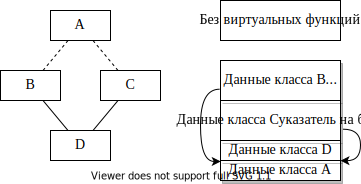

# Тема X. Множественное наследование

Одиночное наследование (каким бы на самом деле сложным оно не было)
предполагает наследование свойств от одного непосредственного предка.
Множественное наследование позволяет производному классу наследовать
свойства не только предков «по одной линии», но и свойства двух
(трех, ...) родителей. Иерархия классов при этом становится сложнее и
вырождается в граф классов.

Отношение к множественному наследованию неоднозначно:

-   с одной стороны, заманчиво, так как позволяет наследовать
    свойства
    нескольких предков (то есть зачастую моделирует реальные жизненные
    ситуации);

-   с другой стороны, работает медленнее, дополнительный расход
    памяти, труднее в реализации (так как подкидывает программисту
    массу «подводных» камней). Поэтому множественное наследование
    часто сравнивают с «ящиком Пандоры», то есть с источником бед,
    которые не актуальны при одиночном наследовании.

Замечание: далеко не все объектно-ориентированные языки поддерживают
множественное наследование.

## Простой пример (без полиморфизма)

Построим простую иерархию классов. Хотим, чтобы производный класс `C`
наСледовал свойства обоих предков — классов `A` и `B`:


```cpp
class A
{
    int m_a;
public:
    A(int а) { m_a = а; }
    void FA() { }
};
class B
{
    int m_b;
public:
    B(int b) { m_b = b; }
    void FB() { };
};
class C : public A, public B //Замечание: если мы хотим открыто
                             //наследовать от обоих предков, public 
                             //В обязательно, так как иначе по 
                             //умолчании компилятор будет считать, 
{                            //что спецификатор наследования private
    int m_c;
public:
    C(int a, int b, int c) : A(a), B(b) { m_c = c; }
        //Замечание: независимо от того порядка, в котором в списке 
        //инициализации программист указывает вызов конструкторов 
        //базовых классов, компилятор их вызывает в том порядке, в 
        //котором они следуют в списке наследования
    void FC() { };
};
```

Специфика:

-   Порядок вызова конструкторов: `А() -> В() -> С()`. Конструкторы
    вызываются в том порядке, в котором они указаны в списке
    наследования!!!

-   Деструкторы — в обратном порядке

-   Компилятор строит объект в порядке объявления базовых классов.
    При этом экземпляр класса С будет в памяти выглядеть: (память
    отводится в порядке указания родительских классов)

    

-   Вызов методов в таком простом случае ничем не отличается от
    простого наследования.

    ```cpp
    int main()
    {
        С с(1, 2, 3);
        c.FA();
    }
    ```

-   При одиночном наследовании преобразование от `derived*` к `base*`
    происходит следующим образом: адрес остается тем же самым, а тип
    объекта, на который указывает указатель, изменяется. При
    множественном:

    ```cpp
    A* a = &c;
    ```

    преобразование от производного к первому базовому классу — адрес не меняется. Здесь та же ситуация, что и при
    простом наследовании потому, что адрес подобъекта `A` совпадает с
    адресом объекта `C`.

    ```cpp
    В* b = &с;
    ```

    тоже получаем правильный результат, но затраты
    компилятора гораздо больше — адрес преобразуется к подобъекту «`B`» — __адрес изменяется__!

## Множественное наследование и полиморфизм

При наличии виртуальных функций ситуация усугубляется:


```cpp
class A
{
    int m_a;
public:
    virtual void f1() { }
};

class B
{
    int mb;
public:
    virtual void f2() { }
};

class C : public A, public B
{
    int m_c;
public:
    virtual void f1() { } //перегруженный виртуальный метод для A
    virtual void f2() { } //для B
};

int main()
{
    C с(4, 5, 6);
    A* pA = &с; //адрес объекта C совпадает с адресом его базовой
                //части A ⇒ указатель на vftab — первое данное с 
                //нулевым смещением
    B* рВ = &с;//адрес объекта C не совпадает с адресом его базовой 
               //части B ⇒ но указатель на vftab — это снова первое 
               //данное с нулевым смещением
    pA->f1(); //посредством C(для A)::vftab
    рВ->f2(); //посредством C(для B)::vftab
    ...
}
```


Таблиц виртуальных функций две. Обе содержат адреса виртуальных
функций производного класса. Поэтому при обращении и по `A*` компилятор
«видит» часть подобъекта `A` и таблицу виртуальных функций `C` (для `A`), а
при обращении по `B`* часть подобъекта `B`, но таблицу виртуальных
функций `C` (для `B`).

## Проблемы, возникающие при множественном наследовании

Множественное наследование предоставляет ряд очевидных преимуществ +
большое количество «подводных камней», поэтому такие библиотеки как
MFC (и такие языки как С#) множественное наследование практически (во
всяком случае явно) не используют. Проблемы: (Прим. редактора: какие проблемы???)

Замечание: в случае множественного наследования базовый класс нельзя
указывать при объявлении производного более одного раза:

```cpp
class А { ... };
class В : public A, public А { ... }; //ошибка
```

Но тем не менее, базовый класс может косвенно передаваться
производному более одного раза, например:

```cpp
class Rect
{
    ...
protected:
    int left, right, top, bottom;
};
class ColoredRect : public Rect { ... };
class RoundRect : public Rect { ... };
class ColoredRoundRect : public ColoredRect, public RoundRect
{
    int GetLeft();
};
```

При такой иерархии классов базовая часть Rect будет входить в объект
производного типа `ColoredRoundRect` дважды:


```cpp
int ColoredRoundRect::GetLeft()
{
    //return left; //ошибка. Так как объект класса ColoredRoundRect
                   //содержит два подобъекта класса Rect, доступ к 
                   //члену данных left неоднозначен!

    return ColoredRect::value; //для устранения неоднозначности 
                               //следует уточнить с помощью 
                               //оператора разрешения области 
}                              //видимости «путь наследования»
```

Наличие в дереве наследования нескольких экземпляров одного и того же
базового класса вредно (не только вносит путаницу, но и приводит к
излишним затратам памяти). Объявление базового класса в списке
наследования виртуальным решает эту проблему. Подобное объявление
предписывает компилятору создавать единственный подобъект базового
класса. При этом виртуальные базовые классы реализуются посредством
указателей ⇒ объект типа `ColoredRoundRect` компилятор формирует
ссовсем уж причудливым образом:




```cpp
class Rect { ... };
class ColoredRect : virtual public Rect { ... };
class RoundRect : virtual public Rect { ... };
class ColoredRoundRect : public ColoredRect, public RoundRect
{
    int GetLeft();
};
```

