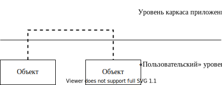

# Тема XI. Механизм RTTI (run-time type identification)

## Оператор `static_cast` и указатели на классы связанные наследованием

Неявное приведение указателя на объект производного типа к указателю
на объект базового типа компилятор прекрасно выполняет сам, так как
производный класс содержит полные определения своих базовых классов.
Такое __повышающее (upcast)__ приведение типа всегда безопасно!

```cpp
B b;
A* pA = &b;
```

Верно и следующее утверждение: если объект на самом деле является
объектом производного типа, а в нашем распоряжении имеется указатель
на базовый класс, то корректным должно являться и преобразование
указателя «вниз» по иерархии классов вплоть до преобразования такого
указателя к указателю на фактический (целевой) тип — __понижающее приведение (downcast)__.

Для приведения указателя на базовый тип к указателю производного типа
можно использовать оператор явного приведения типа `static_cast` — это механизм времени компиляции!

Пример:

<!-- Что за класс D? -->

```cpp
//классы A и В связаны наследованием
class A
{
    ...
};
class B : public A
{
    ...
};
//C — «автономный» класс
class C
{
    ...
};
//Глобальная функция, принимающая указатель базового типа
void F(A* рА) //посредством такого указателя можно: — вызвать 
              //virtual-функцию целевого класса — вызвать обычный 
              //метод базового класса оперировать данными базового 
              //класса
{ //но если нужно вызвать обычный метод производного класса или 
  //обратиться к данным производного класса, то нужен указатель В*:
    B* pB = static_cast<B*>(рА);//с точки зрения компилятора все 
                                //корректно, так как классы связаны 
                                //наследованием!
    pB->fB();
}
int main()
{
    B b;
    F(&b);//компилятор преобразует адрес В* к A* — это всегда 
          //корректно
//Классы A и C не связаны наследованием, поэтому компилятор не 
//допустит такой ситуации
    C c;
    //F(&c); //ошибка компилятора — такого преобразования нет!
    //Но!
    A а;
    F(&а); //ошибки компилятора нет, но результат некорректный, так 
           //как на самом деле объект A, а не В!
}
```

Замечание: компилятор проверяет только тот факт, что

-   оба класса связаны наследованием;
-   наследование открытое (`public`).

Поэтому компилятор считает такое приведение корректным. А на самом
деле такое преобразование небезопасно! Поэтому возникла необходимость
в способе проверки возможности такого преобразования.

> Замечание: static_cast обычно используется для неполиморфных типов (в
> классах нет виртуальных функций).

## Динамическая идентификация типа


RTTI характеризуется тремя понятиями:

-   оператор `dynamic_cast` — для преобразования указателей или ссылок
    полиморфных типов

-   оператор `typeid` — для определения точного (exact) типа объекта
    во время выполнения

-   класс `type_info` — (это то, что возвращает оператор `typeid`)

### Подключение RTTI

Для подключения RTTI (так как механизм дорогой и просто так работать
не будет!):

-   в опциях проекта `Project > Properties > C/C++ > Language` — должен
    быть включен флаг `Enable Run-Time Type info` (тогда в опциях
    командной строки компилятору будет указан ключ `/GR`).

-   `#include <type_info>` — объявлен класс `type_info`

-   механизм работает только для полиморфных классов.

### Оператор `typeid` и класс `type_info`

Идентификация типов позволяет получить информацию об объектах во время
выполнения. Это означает, что кто-то и где-то должен эту информацию
сформировать, а именно

1.  отвести память (где?)

2.  сформировать данные (какие?)

3.  обеспечить механизм использования этой информации (как?).

Логично:

1.  сколько бы объектов класса X мы не создавали, достаточно хранить
    информацию собственно о типе X в единственном экземпляре в каждом
    классе ⇒ для каждого класса компилятор создает объект типа
    `type_info`

2.  должен существовать способ получения этой информации для каждого
    объекта ⇒ 

    1.  явно доступ к объекту `type_info` можно получить при помощи
        оператора `typeid`

    2.  неявно — посредством оператора `dynamic_cast`.

3.  Что существует в единственном экземпляре для всех объектов? —
    статические переменные или таблица виртуальных функций. В
    спецификации языка сказано, что получение этой информации
    гарантируется только для полиморфных типов (то есть если есть хотя
    бы одна виртуальная функция). Данные RTTI выполняют примерно ту же
    задачу, что и таблица виртуальных функций ⇒ для поддержки RTTI
    была использована именно таблицы виртуальных функций класса.
    Например индекс 0 в таблице может содержать указатель на объект
    `type_info`:


При такой реализации память будет тратиться только на добавление еще
одной ячейки в каждую таблицу виртуальных функций + выделение памяти
для хранения объекта `type_info` для каждого класса.

#### 1.1.25. Формат `type_info`

Заголовочный файл `type_info`: 

```cpp
class type_info
{
public:
    virtual ~type_info();
    int operator==(const type_info& rhs) const;
    int operator!=(const type_info& rhs) const;
    int before(const type_info& rhs) const; //не только
        //непосредственного предка, но и любого в иерархии!
    const char* name() const; //имя, которое дал программист
                              //(human-readable)
    const char* raw_name() const; //декорированное имя
private:
    type_info(const type_info&);
    type_info& operator=(const type_info&);
    ...
};
```

Основные возможности:

-   перегружены операторы `==` и `!=`.

-   методы для получения имени класса.

-   программисту запрещено самому создавать, копировать и присваивать
    объекты такого класса, так как все соответствующие методы являются защищенными

> Замечание: единственной возможностью получить доступ к информации явно (и только для чтения) — является оператор typeid.

Оператор присваивания тоже защищен ⇒ присваивать объекты типа type
info компилятор Вам тоже не позволит!

#### 1.1.26. Формы оператора `typeid`

```cpp
const type_info& typeid(тип)
const type_info& typeid(выражение)
```

Так как определение типа имеет смысл только при наследовании, примеры
привожу на простенькой иерархии:

```cpp
class A
{
public:
    virtual void f() { }
};
class B : public A { };
```

В качестве выражения может использоваться:

1.  ссылка на класс

    ```cpp
    B b;
    A& ra = b;
    cout << typeid(ra).name(); //"class B"
    ```

    При этом даже если в качестве выражения фигурирует ссылка на базовый
    класс, результат `typeid`-оператора — `const type_info&` целевого класса.

2.  Использовать в качестве выражения непосредственно объект можно,
    но смысла не имеет

3.  разыменованный указатель (при этом, если значение указателя
    `==0`, вырабатывается исключение `bad_typeid_exception`)

    ```cpp
    A* рA = new B;

    cout << typeid(*pA).name();//"class B"
    ```

4.  Не имеет смысла в качестве выражения использовать указатель, так
    как оператором `typeid` будет возвращено `type_info`
    типа указателя

    ```cpp
    cout << typeid(pA).name();//"class A*"

    cout << typeid(pB).name();//"class B*"
    ```

Замечания:

1.

    +   если используется недействительный указатель

    +   или код не был скомпилирован с ключом `/GR` вырабатывается
        исключение типа `non_rtti_object`

2.  для совместимости с базовыми типами компилятор для каждого
    базового типа создает объект `type_info`, поэтому для базовых типов тоже можно использовать оператор `typeid`:

    ```cpp
    if (typeid(n) == typeid (int)) ...
    ```

3.  оператор `typeid` может быть использован для получения объекта
    `type_info` для параметра шаблона (глава «Обобщенное программирование»)

### Пример использования оператора `typeid`

Дана иерархия классов:


```cpp
class Shape
{
public:
    virtual void F() = 0;
};
class Rect : public Shape
{
public:
    virtual void F() { cout << "I'm Rect" << endl; })
};
class Circle : public Shape
{
public:
    virtual void F() { cout << "l'm Circle" << endl; }
};
```

Функция — фабрика фигур, которая случайным образом генерирует
динамический объект одного из производных типов и возвращает указатель
базового типа:

```cpp
Shape* Make()
{
    switch (rand() % 2)
    {
    case 0: return new Rect; 
    case 1: return new Circle;
    }
}
```

Требуется посчитать, сколько прямоугольников и сколько кружков создала
функция и при создании любого объекта вывести тип созданной фигуры.

```cpp
int main()
{
    const int n = 10;
    Shape* ar[n];
    int nRects = 0, nCircles = 0; //здесь подсчитаем — сколько чего
                                  //«насоздавалось»
    for (int i = 0; i < n; i++)
    {
        ar[i] = Make(); //создание очередного объекта 
        cout << typeid(*ar[i]).name() << endl; //диагностика что
                                               //создали
        if (typeid(*ar[1]) == typeid(Rect)) nRects++; //подсчет
        else nCircles++;
    }
    for (int i = 0; i < n; i++)
    {
        delete ar[i];
    }
}
```

__Использование других возможностей класса `type_info`__ — определение
порядка следования классов в иерархии наследования. Задана иерархия
классов:

```cpp
class A { ... virtual ... };
class B : public A { ... };
class C : public B { ... };
int main()
{
    B* рВ = new C;
    A* рА = рВ;
    if (typeid(A).before(typeid(*рА))) ... //???
    if (typeid(B).before(typeid(*pA))) ... //???
    if (typeid(C).before(typeid(*pA))) ... //???
    if (typeid(B).before(typeid(*pB))) ... //???
    ...
}
```

### Оператор `dynamic_cast`

Необходимость RTTI обусловлена тем, что при компиляции не всегда есть
возможность выяснить: на какой целевой объект указывает указатель
базового типа (или ссылается ссылка базового типа).

Восстановление «потерянного» типа объекта требует, чтобы была
возможность «спросить» объект о его типе, а также должна быть
операция преобразования типа, которая возвращала бы корректный
указатель, если объект действительно имеет целевой тип, или «сообщала»
о невозможности преобразования.

Формат:

```cpp
dynamic_cast<T*>(pointer) //возвращает указатель типа Т*, если
                          //преобразование корректно, или 0
dynamic_cast<T&>(reference) //возвращает ссылку типа Т& если
                            //преобразование корректно, или 
                            //вырабатывает исключение std::bad_cast
```

Модифицируем предыдущий пример:

```cpp
int main()
{
    const int n = 10;
    Shape* ar[n];
    int nRects = 0, nCircles = 0; //здесь подсчитаем — сколько чего 
                                  //«насоздавалось»
    for (int i = 0; i < n; i++)
    {
        ar[i] = Make(); //создание очередного объекта
        cout << typeid(*ar[1]).name() << endl;//диагностика — что
                                              //создали
        if (dynamic_cast<Rect*>(ar[i])) nRects++;//подсчет
        else nCircles++;
    }
    for (int i = 0; i < n; i++)
    {
        delete ar[i];
    }
}
```

Оператор `dynamic_cast` используется для проверки возможности
приведения, поэтому:

```cpp
class А { ... virtual ... };
class B : public А { ... };
class C : public B { ... };
int main()
{
    А* pA = new C;
    B* pB = dynamic_cast<B*>(pA); //!=0
    C* pC = dynamic_cast<C*>(pA); //!=0
    delete pA;
}
```

> Замечание: `dynamic_cast` не работает с `void*`-указателями

### Операторы typeid и `dynamic_cast` и наследование

Продемонстрируем разницу в использовании операторов `typeid` и
`dynamic_cast`. Напоминаю: оператор `typeid` используется для определения
точного типа, а `dynamic_cast` для проверки возможности приведения.

Задана иерархия классов:

```cpp
class A { ... virtual ... };
class B : public A { ... };
class C : public B { ... };
int main()
{
    A* pA = new C;
    C* pC = dynamic_cast<C*>(pA);//!=0
    B* pC = dynamic_cast<B*>(pA); //!=0
    //Но!!!
    bool b = typeid(*pA) == typeid(C);//true
    b = typeid(*pA) == typeid(B);//false
}
```

При множественном наследовании механизм RTTI тоже работает, так как в
объекте `type_info` есть вся информация как о производном типе, так и
обо всех предках:

Задана иерархия классов:

```cpp
class A { ... virtual ... };
class B { ... virtual ... }
class C : public A, public B { ... };
int main ()
{
    A* pA = new C;
    C* pC = dynamic_cast<C*>(pA);//!=0
    B* pB = dynamic_cast<B*>(pA); //!=0
}
```

## Когда возникает необходимость RTTI

Например, при использовании сторонней библиотеки классов Вы наследуете
свои специализированные производные классы от классов, предоставляемых
библиотекой. Работа с библиотечными классами поддерживается каркасом
приложения, НО! Библиотека ничего не знает о Вашей специализированной
производной части. Поэтому может возникнуть следующая ситуация: Вы
создали объект своего (производного) типа, «передали» его для
выполнения базовой работы каркасу приложения (при этом информация о
производной части потеряна), а потом каркас приложения может вызвать
виртуальный метод другого Вашего производного класса, передавая в
качестве параметра ссыпку или указатель базового типа на Ваш объект.
Обратите внимание! — при этом естественным образом теряется информация
о пользовательском специализированном типе ⇒ возникает необходимость
восстановить целевой тип, чтобы пользоваться спецификой производной
части объекта.



