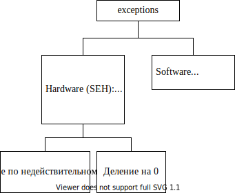
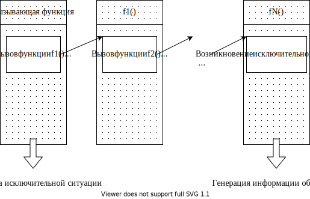
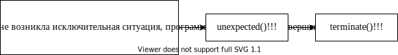
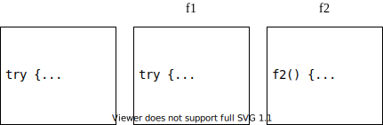

# Тема XII. Исключительные ситуации (exceptions)

## Что такое исключительные ситуации

При написании сколько-нибудь серьезных приложений большую роль играет
обработка всевозможных ошибочных ситуаций, которые могут возникнуть во
время работы приложения. Ошибочные ситуации можно разделить на две
большие категории:


Если Ваше приложение не отреагирует на такую ситуацию, то, скорее
всего Вы увидите сообщение __«Unhandled exception»__, Ваше приложение
будет аварийно завершено,... а Вашу программу вряд ли кто-нибудь
купит.



__Проблема__ возникает тогда, когда __в месте возникновения ошибочной ситуации у Вас «нет контекста» для ее разрешения__. Обычно ситуация
«нелокальных» проблем появляется в случае разработки большого проекта
несколькими программистами или использования независимо разработанных
библиотек. При этом может возникнуть следующая ситуация:


То есть автор вызываемого модуля может обнаружить «неприятности» во
время выполнения, но, как правило, не имеет представления о том. что
делать в этом случае. Автор вызывающего модуля может знать, как
поступить в случае возникновения ошибок, но не в состоянии их
обнаружить.

Если же «вложенность» вызовов функций значительна, то возникновение
исключительной ситуации может возникнуть на нижнем уровне, а обработка
ошибки должна быть произведена на самом верхнем уровне:



Замечание 1: Но! Механизм обработки исключений дорогой ⇒ Следует
отметить, что целью обработки исключений является решение
**«нелокальных»** по своей природе проблем. Поэтому, если проблема
может быть решена локально, почти всегда так ее и следует решать.

Обработку исключений имеет смысл использовать тогда, когда можно
восстановить (починить) программу для продолжения работы.

Замечание 2: существуют два уровня обработки исключений:

-   структурная обработка исключений (SEH) — используется в основном
    для обработки hardware-ных исключительных ситуаций (деление на 0,
    обращение по недействительному адресу...);

-   обработка исключений C++

## Способы отслеживания «аварийных» ситуаций

### Прекращение выполнения программы

Прекращение выполнения всей программы при возникновении нештатной
ситуации — это крайняя мера. Поэтому еще в древние времена (до
развития формальной модели обработки исключений) программисты боролись
с непредвиденными ситуациями множеством неструктурированных способов,
пытаясь, во что бы то ни стало продолжить выполнение своей программы.

### Возвращение функцией значения статуса (кода завершения)

Замечание: этот подход прост и достаточно эффективен ⇒ никто его не
отменяет для решения локальных нештатных ситуаций.

Функция может возвращать некоторое значение в случае успешного
завершения (например, ненулевое значение) и определенное (нулевое)
значение в случае ошибки. При таком подходе вызываемая функция
обнаруживает ошибку, а вызывающая эту ошибку должна обрабатывать. Это
означает, что программист каждый раз после вызова функции должен
осуществлять проверку кода завершения, анализировать тип ошибки,
обрабатывать данный тип ошибки. Если представить себе пример с
N-вложенным вызовом функций, то становится очевидным, что
__программист-зануда__ погрязнет в скрупулёзной обработке всех возможных
ошибок (а его программа разрастется так, что большая часть кода
окажется посвященной обработке неожиданных ситуаций, а не ожидаемых).
В той же ситуации __среднеответственный программист__ пренебрежет
обработкой большей части ошибок, рассчитывая только на штатные
ситуации...

Кроме того если для обработки ошибки не обойтись одним возвращаемым
значением (то есть важен не только сам факт возникновения ошибки, но и
ее тип)? Для запоминания типа ошибки обычно использовалась глобальная
переменная (например, errno содержит код ошибки).

### Статус завершения системных вызовов

В стандартной библиотеке есть глобальная переменная errno, которая
предназначена для формирования кода системных ошибок. В принципе,
любой системный вызов это значение формирует, но так как переменная
глобальная, код ошибки можно получить только непосредственно после
вызова системной функции.

### Выявление ошибок в Debug-версии

Диагностический макрос `assert` — хорош для выявления тех ошибок,
которые зависят от программиста, но не спасает от ошибок времени
выполнения.

### Обработка ошибок с помощью функций обратного вызова

Вызывающая функция (клиент) передает вызываемой (серверу) указатель на
другую клиентскую функцию, которую сервер должен вызвать в случае
возникновения ошибки.

Замечание: этот прием часто используется при использовании системных
сервисов — смысл в том то в качестве одного из параметров функции или
каким-нибудь еще способом (в качестве поля структуры) передается адрес
пользовательской функции — функции обратного вызова (callback).

В C++ эта технология, например, используется для обработки отказов при
динамическом распределении памяти. Функция `set_new_handler()` позволяет
Вашей программе установить Ваш специализированный обработчик ситуации,
который будет вызываться системой в случае нехватки памяти вместо
стандартного. Причем, «подменять» стандартный обработчик своим можно
только на некоторое (потенциально опасное) время. Например:

```cpp
#include <new>
size_t BIG_NUMBER = 0xfffffff;
int* p;
void my_handler(void)
{
    //Ваш обработчик
    BIG_NUMBER /= 2;
}
int main()
{
    void (*old_handler)(void) = std::set_new_handler(my_handler);
        //установили свой обработчик
    p = new int[BIG_NUMBER]; //если памяти не хватает, будет вызван 
                             //Ваш обработчик, где Вы постараетесь 
                             //справиться с ситуацией
    std::set_new_handler(old_handler); //восстановили прежний 
                                       //обработчик
}
```

Замечание: по умолчанию указатель, возвращаемый `set_new_handler`, равен нулю.

### Выполнение глобального перехода при возникновении ошибки

Функция `setjmp()` позволяет программисту запомнить точку возврата и
состояние программы на момент выполнения `setjmp()` в структуре
предопределенного вида. Функция `longjmp()` позволяет вернуть управление
посредством сохраненных данных в структуре `jmp_buf`.

```cpp
//client.срр
#include <csetjmp>
jmp_buf buf;
int main()
{
    int ret = setjmp(buf);
}
```

_При этом она корректно восстанавливает стек_. Неудобство —
буферов может быть много...

Будучи перенесена в C++, функция `longjmp()` приобрела один существенный
недостаток — она не вызывает деструкторы локальных объектов.

### Малоизвестная и малоиспользуемая часть старой стандартной библиотеки С

Функции

`signal()` — для определения — что произошло

`raise()` — для генерации события

Поведение по умолчанию `signal` означает аварийное завершение программы
с кодом 3. Проблема — та же самая + номера ошибок должны быть
уникальными.

## Встроенные средства C++ для обработки исключений (C++ exception handling)

Все перечисленные выше способы обработки представляют собой набор
разнородных средств, предназначенных для решения разных аварийных
ситуаций.

Встроенная поддержка обработки исключений в С++ появилась сравнительно
недавно. Достоинствами механизма обработки исключительных ситуаций
являются:

-   обработку нештатных ситуаций все равно предусмотреть нужно,
    ситуации разные, а способ борьбы с ними __унифицирован__.

-   **структура** текста программы улучшается. Программист может
    отделить написание рабочего кода (основная работа) от написания
    обработки нештатных ситуаций (и отложить это рутинное удовольствие
    «на потом», то есть предполагается, что к этому можно вернуться и
    позже)

Идея — нужно передать управление и информацию об ошибке из того места,
где она возникла, туда, где она может быть обработана (минуя все
промежуточные инстанции)! — Похоже на посылку сообщения

Если обработка исключений не предусмотрена, при возникновении любого
исключения программа будет завершена аварийно!!!



Язык C++ включает встроенные средства для обработки аномальных
ситуаций (exceptions), возникающих во время выполнения программы -
операторы `throw`, `catch`, `try`. Оператор try открывает блок кода, в
котором может произойти ошибка. Если ошибка произошла, то оператор
`throw` вызывает исключение. Обработчик исключения представляет собой
блок кода, который начинается оператором `catch`.

Если предусмотреть обработку исключений:


### Оператор `throw` — сравнение с `return`

Оператор `throw` очень похож на инструкцию `return`, но главные отличия:

-   __куда__ происходит передача управления!!!

-   __где__ вызываются деструкторы для всех промежуточных стековых
    объектов, которые были созданы на момент генерации исключения (в
    частности локальных объектов вызываемой функции)

-   __как__ передается объект-исключение и где вызывается для 
    объекта-исключения деструктор


Способы передачи объекта-исключения:

-   по значению:

    1)  — неэффективно, так как в месте генерации исключения 
        вызывается конструктор копирования

    2)  если генерируем объект В, а принимаем А, то конструктор
        копирования только базовой части ⇒ в обработчике можем
        пользоваться только базовой частью объекта-исключения

    3)  внутри обработчика работа с копией

-   по указателю (объект-исключение автоматически при выполнении
    throw не копируется):

    1)  адрес локального объекта — плохо, так как для него будет 
        вызван деструктор до выполнения тела обработчика

    2)  адрес динамического объекта плохо, так как нет уверенности, что в обработчике программист — delete

    3)  стандартные исключения можно принять только по значению или 
        по ссылке

-   по ссылке — в месте генерации исключения передается адрес
    объекта-исключения, но деструктор для него будет вызван только по закрывающей скобке обработчика

__в обработчике получаем адрес объекта целевого типа, даже если принимаем ссылку на базовый тип ⇒ всегда возможен вызов виртуальных методов!__

### Операторы `try` и `catch`

Функция, которая собирается обрабатывать ошибку, должна:

1.  объявить блок, в котором эта ошибка может возникнуть — блок
    `try`.

    ```cpp
    try
    {
        ...
    }
    ```

2.  сообщить компилятору какие ошибки ожидаются и как она собирается
    обрабатывать — обработчики исключений (`catch`).

Замечание: непосредственно за try должен следовать хотя бы один
обработчик — `catch`

Конструкция

```cpp
catch(тип переменной исключения [имя формального параметра])
{
    ...
}
```

называется обработчиком исключения. Она может и должна использоваться
только сразу после блока `try` или после другого обработчика `catch`.

Пэ синтаксису объявление оператора `catch` похоже на определение
функции, в котором обязательными являются типы аргументов, а имена
аргументов должны присутствовать только если данный аргумент
«задействован» в коде функции.

### Пример

```cpp
class Array
{
    int m_ar[10];
public:
    int& operator[](int i)
    {
        if (i >= 0 && i < 10) return m_ar[i];
        else throw "Index out of range";
            //Синтаксически оператор throw похож на оператор return.
    } 
};
int main()
{
    Array ar;
    try
    {
        ar[10] = 1;
    } catch (const char* error)
    {
        cout << error << endl; //программисту предупреждение
    }
    //выполнение программы продолжается
}
```

Основная идея состоит в том, что `Array::operator[]`, обнаружившая
проблему, которую она не в состоянии решить, генерирует (`throw`)
исключение, чтобы вызывающая функция «не затерла» что-нибудь за
пределами выделенной памяти.

Обычно одной диагностики о произошедшей ситуации недостаточно
Например, в нашем случае неплохо:

-   сообщить в вызывающую функцию значение «некорректного» индекса -
    `throw i`;

-   вырабатывать исключение более сложного типа, чтобы в объекте
    такого типа можно передать гораздо больше информации

```cpp
struct MyArrayError
{
    int m_wrongIndex;
    int m_High;
    MyArrayError(int n, int c) { m_wrongIndex = n; m_High = c; }
};
class Array
{
    int m_ar[10];
public:
    int& operator[](int i)
    {
        if (i >= 0 && i < 10) return m_ar[i];
        else throw MyArrayError(i, 10);
    }
};
int main()
{
    Array ar;
    try
    {
        ar[10] = 1;
    } catch (MyArrayError& error)
    {
        cout << "index out of range" << error.m_wrongIndex
             << "index must be >= 0 or < " << error.m_High << endl;
    }//вызывается деструктор для объекта-исключения
}
```

### Обработка нескольких типов исключений

Обычно в программе в процессе выполнения может возникнуть не одна, а
несколько ошибочных ситуаций разного типа. Хорошей практикой является
для каждой такой ситуации определить свой тип исключения. В общем
случае структура блока программы, в котором могут возникнуть
исключения, выглядит следующим образом:

```cpp
struct Above
{
    int m_wrongIndex;
    int m_High;
    Above(int n, int c) { m_wrongIndex = n; m_High = c; }
};
struct Below
{
    int m_wrongIndex;
    Below(int n) { m_wrongIndex = n; }
};

int& Array::operator[](int i)
{
    if (i <= 0) throw Below(i);
    if (i > 10) throw Above(i, 10);
    return m_ar[i];
}
try
{
    ...
} catch (Above& er)
{
    cout << ...;
} catch (Below& er)
{
    cout << ...;
}
```

Замечания:

-   каждый обработчик соответствует своему конкретному типу ошибки (
    то есть при возникновении ошибки данного типа, управление будет
    передано именно сюда).

-   В скобках любого оператора `catch` указывается тип объекта, 
    который может быть перехвачен данным обработчиком.

-   Если нет соответствующего обработчика, вызывается `unexpected`

-   Обработчики «просматриваются» в том порядке, в котором их привел
    программист, поэтому в том случае, когда типы исключений связаны
    наследованием, обработчик с объектом исключения производного типа
    должен предшествовать обработчику с исключением базового типа.

-   Можно предусмотреть обработку всех явно не указанных в
    обработчиках `catch` типов исключений посредством:

    ```cpp
    catch (...)
    {
        cout << "Something is wrong!";
    }
    ```

Замечание: если существует такой обработчик «по умолчанию», он должен
быть последним в списке обработчиков

### Обработчики исключений могут

1.  вызвать `abort()`, если ситуацию поправить невозможно

2.  повторно сгенерировать то же самое исключение — то есть передать
    его выше

    ```cpp
    catch (...) { throw; } //rethrow
    ```

3.  обработать на своем уровне текущее исключение, а для уровня
    «выше» сгенерировать другое исключение (запаковать другую информацию)

    ```cpp
    catch (My1& х) { ... throw Му2(); ... }
    ```

4.  выполнить любое восстановительное действие и продолжить работу
    программы

    ```cpp
    int I = 0;
    int BIG = 0x7fffffff;
    double** p = 0;
    try
    {
        p = new double* [BIG];
        for (; I < BIG; I++) p[I] = new double[BIG];
    } catch (bad_ailoc& er)
    {
        //Можно использовать только то, для чего удалось выделить
        //память!!!
        BIG = I;
    }
    ```

5.  удалить причину ошибки и повторить вызов функции, вызвавшей
    ошибку

6.  освободить ресурсы (например, память) и продолжить выполнение

    ```cpp
    int I = 0;
    int BIG = 0x7fffffff;
    double** p = 0;
    try
    {
        p = new double* [BIG]; for (; I < BIG; I++) p[I] = new
            double[BIG];
    } catch (bad allocs er)
    {
        //Все, что удалось захватить, нужно освободить!!!
        if (р)
            for (int i = 0; i < I; i++)
                delete[] p[i];
        delete[] p;
    }
    ```

### Function-level `try`-блок

Можно все тело функции заключить в блок `try`. При этом
последовательность выполнения кода отмечена цифрами 1-2-3

```cpp
void MyEr(void) try
{
    throw "error"; //1
} catch (const char* p)
{
    std::cout << p; //2
}
int main()
{
    MyEr();
    //3
}
```

## Последовательность выполнения кода и выбор исключений

-   Если код в `try`-блоке (или код функции, вызываемой из этого
    блока)
    генерирует исключение, будут проверяться обработчики данного блока
    `try`. Остаток блока `try` игнорируется!!!

-   Если сгенерированное исключение имеет тип. указанный в одном из
    обработчиков, будет выполнен этот обработчик.

-   Если исключение не генерируется, то все обработчики игнорируются.

-   Если исключение сгенерировано, и ни один обработчик не перехватил
    его, выполнение программы прекращается специальной функцией
    стандартной библиотеки — `unexpected`

```cpp
try
{
    func();
    //мы попадем сюда только в том случае, если func() не возбудит
    //исключения
    ...
} catch (TYPE1& er)
{
    //обработка исключения типа TYPE1
} catch (TYPE2& er)
{
    //обработка исключения типа TYPE2
}
//сюда мы попадем, если a) func() не сгенерировала исключения,
                       //б) сгенерированы исключения типа TYPE1 или 
                       //TYPE2, а обработчики этих исключений в свою 
                       //очередь не сгенерировали исключения или 
                       //некоторым другим способом не изменили 
                       //последовательность исполняемого кода
//unexpected!!!
```

### Обработка непредусмотренных исключений

1.  Программист может предусмотреть обработчик «по умолчанию»

    ```cpp
    catch (...)
    {
        //здесь можно обработать все остальные исключения
    }
    ```

    При этом такой обработчик должен быть последним!!!

2. Что происходит, если обработка предусмотрена на другом уровне

    Если самый внутренний `catch` исключение не обработал, оно «передается»
    выше на следующий уровень. **Поиск продолжается до самого внешнего блока `try`**

3. Что происходит, **если программист нигде не предусмотрел обработку** какого-то конкретного или всех исключений.

Замечание: если возникает неперехваченное исключение, никакого
clean_up не происходит (деструкторы не вызываются)



### Обработка неперехваченных исключений


Пример:

```cpp
#include <stdexcept>
void my_unexpected()
{
    cout << "I'll be back!!!" << endl;
    exit(1);
}
int main()
{
    void (*рf)() = set_unexpected(my_unexpected);
    //f2();
    for (int i = 1; i <= 3; i++)
    {
        try
        {
            f1(i);
        }
        catch (A) { cout << "A" << endl; }
        catch (B) { cout << "B" << endl; }
        catch (C) { cout << "C" << endl; }
    }
    set_unexpected(pf);
}
```

### Спецификация исключений

Если Вы предполагаете, что Вашей функцией (вырабатывающей исключение)
может пользоваться другой программист, то

-   Вы не обязаны указывать, какого типа исключения функция
    вырабатывает,

-   но цивилизованный подход заключается в спецификации этих
    исключений.

Объявление функций с появлением механизма исключений тоже изменилось
⇒ появилось новое понятие — спецификация исключений. Пока можно
рассматривать спецификацию исключений в качестве одной из возможностей
документирования текста программы.

Замечание 1: спецификация исключений должна быть указана как при
объявлении, так и при определении функции!

Замечание 2: спецификация исключений функцию на самом деле
программиста ни к чему не обязывает, то есть, несмотря на «обещания»
функция может выработать исключение любого вида, а компилятор выдаст
только предупреждение. Исключение будет сгенерировано и по общим
правилам обработано или не обработано!!!

1.  Если спецификация исключений отсутствует, функция может
    инициировать любые исключения

    ```cpp
    void F(); //что угодно
    void F() throw(...); //гораздо «читабельнее» Microsoft specific
    ```

2.  если Вы уверены, что Ваша функция никогда не будет инициировать
    исключения, то лучше сообщить об этом компилятору и 
    пользователю-программисту

    ```cpp
    void F() throw(); //не должна инициировать исключений
    void __declspec(nothrow) F(); //Microsoft specific
    ```

Тогда при попытке выработать в функции исключение компилятор выдаст
_предупреждение_:

```
warning С4297: 'f' : function assumed not to throw an exception but does
    __declspec(nothrow) or throw() was specified on the function
```

Но! исключение будет все равно выработано!!!

Замечание: такая функция сама не генерирует исключения, но может
передавать дальше исключения, получаемые ею от вызываемых функций

3.  функция инициирует исключения нескольких типов

    ```
    void F() throw(int, Error&, char*);
    ```

Замечание: если функция вырабатывает исключения других видов, то они
все равно будут сгенерированы, но компилятор выдаст предупреждение, а
Вы получите __«Unhandled exception»__

Замечание: если Вы объявили две функции, отличающиеся только
спецификацией исключений, то компилятор их различить не сможет:

```cpp
void F() throw();
void F() throw(int); //redefinition
```

## Специфика оператора `new`

В старых версиях C++ требовалось, чтобы оператор `new` в случае нехватки
памяти возвращал 0. Сейчас `new` должен генерировать исключение
`std::bad_alloc`, но существует огромное количество кода, написанного до
изменения спецификации ⇒ поэтому на самом деле существуют
**несколько форм оператора `new`.**

1)
    ```cpp
    void* operator new(size_t n); //если памяти не хватает, 
                                  //вырабатывается исключение
    void operator delete(void*);//соответствующий delete
    ```

2)  array `new` and `delete`

Пример:

```cpp
#include <new>

{
    A* p;
    try
    {
        p = new A; //компилятор интерпретирует как
                   //p = new (sizeof(A)); генерирует std::bad_alloc
        if (p == 0) ... //Это условие не выполнится никогда!!!
    } catch (bad_alloc& a)
    {
        cout << a.what() << endl; //выведет диагностику
        p = 0;//обезопасили себя от использования недействительного 
              //указателя
    }
    delete р;
}
```

3)  

    ```cpp
    void *operator new(size_t n, const notrow t&); //если памяти не
        //хватает, возвращается нулевой указатель, а исключение не 
        //вырабатывается
    ```

4)  

    ```cpp
    void operator delete(notrow_t&, void*); //соответствующий delete
    ```

3 и 4 продолжают существовать для совместимости с предыдущими версиями для одиночного объекта и для массива — возвращает нулевой указатель

```cpp
{
    A* p = new(nothrow) A[2];//nothrow — это глобальный объект типа 
                             //nothrow_t
    if (p == 0) ...
    delete(nothrow, p);
}
```

## Исключения в конструкторах и деструкторах

Объект не считается созданным, пока не завершится выполнение его
конструктора ⇒ для «недоделанных» объектов деструкторы не
вызываются!!!

Проблема: другими способами ситуацию разрешить сложно, так как
конструкторам и деструкторам в C++ не позволено возвращать значений
⇒ если ошибка все-таки возникает именно в конструкторе, то (чтобы не
пользоваться «недоделанным» объектом) нужно как-то об этом сообщить:

-   посредством глобальных переменных

-   с помощью механизма исключений (основное преимущество — будут
    вызваны деструкторы для всех объектов, созданных в конструкторе на
    момент выработки исключения, например, если создавался массив
    объектов, то будут вызваны деструкторы только для тех элементов
    массива, которые уже удалось создать)

1)  встроенные объекты (все корректно, так как для всех промежуточных
    стековых объектов будут вызваны деструкторы)

    ```cpp
    class A
    {
        int m_a;
    public:
        A(int a = 0) { m_a = a; }
        ~A() { std::cout << "~A"; }
    };
    class B
    {
        int m_b;
    public:
        B(int b = 0) { m_b = b; throw 1; }
        ~B() { std::cout << "~B "; }
    };
    class C
    {
        A m_A;
        B m_B;
    public:
        C(int a, int b) :m_A(a), m_B(b) { }
        ~C() { std::cout << "~C "; }
    };
    int main()
    {
        try
        {
            C c(1, 2);
        } catch (int)
        {
            //на момент вызова обработчика гарантировано будут вызваны 
            //деструкторы для всех сконструированных на момент 
            //возникновения исключения стековых объектов. В нашем случае 
            //— только ~A
            ...
        }
    }
    ```

2)  Модифицируем предыдущий пример: «голые» указатели (утечка
    памяти!!!)

    ```cpp
    class C
    {
        A* m_pA;
        B* m_pB;
    public:
        C(int a, int b) : m_pA(new A(a)), m_pB(new B(b)) { }
        ~C()
        {
            delete[] m_pA;
            delete[] m_pB;
            std::cout << "~C ";
        }
    };
    int main()
    {
        try
        {
            C c(1, 2);
        } catch (int)
        {
            //на момент вызова обработчика гарантировано будут
            //вызваны деструкторы для всех сконструированных на
            //момент возникновения исключения стековых объектов.
            //Деструктор для C вызван не будет ⇒ память потекла!!!
        }
    }
    ```

3)  Решение проблемы — все опасное заворачивать в объекты!!!

    ```cpp
    class WrapA
    {
        A* m_pA;
    public:
        WrapA(int n) { m_pA = new A[n]; }
        ~WrapA() { delete[] m_pA; }
    };
    class C
    {
        WrapA wa;//вместо A* m_pA;
        B* m_pB;
    public:
        C(int a, int b) :wa(a), m_pB(new B(b)) { ... }
        ~C() { delete m_pB; std::cout << "~C "; }
    };
    int main()
    {
        try
        {
            C c(3, 2);
        } catch (int)
        {
            //на момент вызова обработчика гарантировано будут 
            //вызваны деструкторы для всех сконструированных на 
            //момент возникновения исключения стековых объектов. В 
            //нашем случае — только для WrapA ⇒ все динамически 
            //созданные А будут уничтожены!
        }
    }
    ```

> Рекомендация — не стоит возбуждать исключения в деструкторе, разве что тут же их и обработать.

## Исключения и наследование

```cpp
class A { ... virtual void f(); ... };
class B : public A { ...virtual void f(); ... };

void f()
{
    throw B();//производного типа!!!
}
int main()
{
    //Тип исключения и наследование
    try
    {
        f();
    } catch (A& a)//Выработано исключение производного типа B, а 
                  //принимается базового типа А, а управление все 
                  //рано будет передано сюда
    {
        a.f();//посредством ссылки на базовый класс вызывается 
              //виртуальный метод целевого класса
    }
}
```

Замечание 1: существенно в случае наследования принимать ссылку, так
как по значению Вы получите только копию базовой части объекта ⇒
`a.f();` — вызов виртуальной функции базового класса.

Замечание 2: обработчики исключений просматриваются в том порядке, в
котором их указал программист ⇒ обработчики производного типа должны
предшествовать обработчикам базового типа, иначе последние никогда не
будут выполняться!

Замечание 3: Это справедливо и для указателей!

## Стандартные исключения

На самом деле для того, чтобы придать типам исключений некоторую
структурность, в стандартной библиотеке определена иерархия классов с
базовым классом `exception`, (все в пространстве имен `std`). В
стандартной библиотеке определены три группы исключений:


```cpp
void F()
{
    try
    {
        throw exception();//будет выведено Unknown exception
//      throw exception("MyException");//будет выведено MyException
    } catch (exception& e)//сюда будет передано управление при 
                          //возникновении любого исключения, 
                          //производного от except
    {
        cout << e.what() << endl;
    } catch (...)//сюда все остальные — пользовательского типа, не 
                 //производные
    {
        ...
    }
}
```

Вы можете:

-   использовать непосредственно эти классы исключений стандартной
    библиотеки

-   наследовать от них свои классы

-   игнорировать классы стандартной библиотеки и создавать свои

+---------------------+-------------------+---------------+
| Имя                 | Чем генерируется  | `.h`          |
+=====================+===================+===============+
| `bad_alloc`         | `new`             | `<new>`       |
+---------------------+-------------------+---------------+
| bad_cast            | `dynamic_cast`    | `<type_info>` |
+---------------------+-------------------+---------------+
| `bad_typeid`        | `typeid`          | `<type_info>` |
+---------------------+-------------------+---------------+
| `ios_base::failure` | функциями потоков | `<ios>`       |
|                     | ввода/вывода      |               |
+---------------------+-------------------+---------------+
| `out_of_range`      | `at()`            | `<stdexcept>` |
+---------------------+-------------------+---------------+
| все остальные       |                   | `<stdexcept>` |
+---------------------+-------------------+---------------+

оператор `new`

```cpp
void main()
{
    int N = 0x7fffffff; //Пробуем исчерпать память
    double** p = new double* [N];
    try
    {
        int i = 0;
        for (; i < N; i++)
        {
            p[i] = new double[N];
        }
    } catch (bad_alloc&)
    {
        //i — итерация цикла, на которой память закончилась
        //освобождаем
    }
}
```

`bad_cast`

```cpp
void f(const Shape& s)//нужно проверить — на какой действительно 
                      //объект ссылается s
{
    try
    {
        const Rect& r = dynamic_cast<const Rect&>(s);
    } catch (std::bad_cast b)
    {
        //не Rect
        ...
    }
    //Rect:
    const Rect& rRect = static_cast<const Rect&>(s);
}
```

